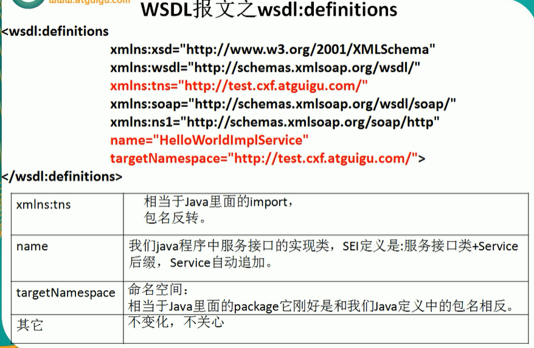
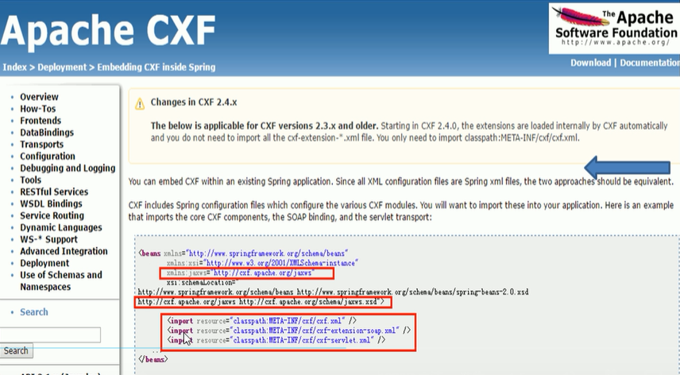

# WebService 概述及实际运用

## 1、webService概述

### webService定义

>  Web服务是一种服务导向架构的技术，通过标准的Web协议提供服务，目的是保证不同平台的应用服务可以互操作。
>
> 表面上看WebService就是一个应用程序，它向外界暴露出一个能够通过Web进行调用的方法API，能用编程的方法通过Web调用来实现某个功能的应用程序。
>
> 深层次上看WebService是一种新的Web应用程序分支，它们是自包含、自描述模块化的应用，可以在网络中被描述、发布、查找以及通过Web来调用。

### webService运行与访问过程


### webService核心组件

> - XML 和 HTTP
> - SOAP：简单对象访问协议
> - WSDL：WebService描述语言
> - UDDI：统一描述、发现和集成协议

# 主流WebService框架介绍


### AXIS

> Axis阿帕奇可扩展交互系统：是一款开源的WebService运行引擎，本质上就是一个SOAP引擎，提供常见服务器端、客户端和网关SOAP操作的基本框架。
>
> Axis分为1.x系列和2系列，两个系列体系结构和使用上有较大的区别，相对而言，Axis.x更加稳定，文档也比较齐全。
>
> 官网：http://axis.apache.org/ 

### XFire

> XFire是下一代的Java SOAP框架。XFire提供了非常方便的API，使用这些API可以开发面向服务(SOA)的程序。它支持各种标准，性能优良（基于低内存的STAX模型）。
>
> 官网：http://xfire.codehaus.org 

### CXF

> Apache CXF = Celtix + XFire
>
> Apache CXF 的前身叫Apache CeltiXfire，现在已经正式更名为Apache CXF了，以下简称为CXF。CXF继承Celtix和XFire两大开源项目的精华，提供了对JAX-WS全面的支持，并且提供了多种Binding、DataBinding、Transport以及各种Format的支持，并且可以根据实际项目的需要，采用代码优先（Code First）或者WSDL优先（WSDL First）来轻松地实现Web Service的发布和使用。Apache CXF已经是一个正式的Apache顶级项目。
>
> 官网：http://cxf.apache.org/ 

# CXF介绍Helloworld

## 步骤

> 1、建工程添Jar包
>
> 2、建Helloworld服务接口(@WebService注解添加)
>
> 3、建HelloworldImpl服务实现类
>
> 4、建MainServer服务启动类(JaxWsServerFactoryBean)
>
> 5、测试访问有两方法：
>
> ​		1)  通过MyEclipse2013工具直接调用，工具调用
>
> ​		2)  建ClientTest调用对外暴露的服务，编码测试(JaxWsProxyFactoryBean)

```Java
import javax.jws.WebService;
@WebService
public interface HelloWorld {
    public String sayHello(String name, int age);
}
```


```Java
public class HelloWorldImpl implements HelloWorld {
	@Override
    public String sayHello(String name, int age){
        return "cxf 1002 hello :" + name + "\t" + age;
    }
}
```


```Java
import org.apache.cxf.jaxws.JaxWsServerFactoryBean;
public class MianServer {
    public static void main(String[] args) {
		JaxWsServerFactoryBean jaxWsServerFactoryBean = new JaxWsServerFactoryBean();
        jaxWsServerFactoryBean.setAddress("http://localhost:9999/cxf1022_server");
        jaxWsServerFactoryBean.setServiceClass(HelloWorldImpl.class);
        
        Server server = jaxWsServerFactoryBean.create();
        server.start();
    }
}
```


```Java
import org.apache.cxf.jaxws.JaxWsProxyFactoryBean;
public class ClientTest {
    public static void main(String[] args) {
		JaxWsProxyFactoryBean jaxWsProxyFactoryBean = new JaxWsProxyFactoryBean();
        jaxWsProxyFactoryBean.setAddress("http://localhost:9999/cxf1022_server");
        jaxWsProxyFactoryBean.setServiceClass(HelloWorld.class);
        
        HelloWorld helloWorld = (HelloWorld)jaxWsProxyFactoryBean.create();
        String result = helloWorld.sayHello("z4", 25);
        
        System.out.println("*****" + resul);
    }
}
```

# Soap协议 + TCP/IPMoniter监控

## Soap协议是什么

> 简单对象访问协议是一种轻量的、简单的、基于XML的协议，它被设计成在Web上交换结构化的和固化的信息.
>
> SOAP是基于XML的简易协议，可使应用程序在HTTP之上进行信息交换。

## SOAP 什么样

> - 一条SOAP消息就是一个普通的XML文档，包含下列元素
> - 必需的Envelope元素，可被此XML文档标识为一条SOAP消息
> - 可选的Header元素，包含头部消息
> - 必需的Body元素，包含所有的调用和响应信息
> - 可选的Fault元素，提供有关在处理次消息所发生错误的信息


### 结论

> SOAP是用于访问网络服务的协议。
>
> 一次WebService的调用，不是方法的调用；而是SOAP消息（xml格式规范的文档片段）之间的输入输出。

### SOAP小总结

> 1、客户端到UDDI上寻找Service目录
>
> 2、客户端获得WSDL文件
>
> 3、客户端按照WSDL文件的约束和规范创建SOAP客户端
>
> 4、客户端通过SOAP访问Service


# WSDL文件解析

## WSDL报文总体概述





```Java
import javax.jws.WebService;
import javax.jws.WebMethod;
import javax.jws.WebResult;
import javax.jws.WebParam;

@WebService
public interface HelloWorld{
    @WebMethod
    @WebResult(name="sayHelloRetValue")
    public String sayHello(@WebParam(name="userName") String name, @WebParam(name="userAge") int age);
}
```


# JAXB

## 定义

> JAXB提供了一个快捷的方式将Java对象与XML进行转换
>
> 在JAX-WS(Java的WebService规范之一)中，JDK1.6自带的版本JAX-WS2.1，其底层支持就是JAXB

## 能干嘛

> JAXB可以实现POJO对象和XML之间相互转换
>
> Unmarshaller类将XML数据反序列化为新创建的Java内容树的进程，并可在解组时有选择的验证XML数据
>
> Marshaller类将Java内容树序列化回XML数据的过程


```Java
import javax.xml.bind.JAXBContext;
import javax.xml.bind.JAXBException;
import javax.xml.bind.Marshaller;

public class JAXBTest {
    public static void myMarshaller() throws JAXBException {
        JAXBContext jAXBContext = JAXBContext.newInstance(Book.class);
        Marshaller marshaller = jAXBContext.createMarshaller();
        
        marshaller.setProperty(Marshaller.JAXB_FORMATTED_OUTPUT, true);
        marshaller.setProperty(Marshaller.JAXB_ENCODING, "utf-8");
        
        marshaller.marshal(new Book(11, "java", 25.8d), System.out);
    }
    
    public static void main(String[] args) throws JAXBException {
        myMarshaller();
    }
    
}
```


```Java
import javax.xml.bind.JAXBContext;
import javax.xml.bind.JAXBException;
import javax.xml.bind.Marshaller;

public class JAXBTest {
    public static void myMarshaller() throws JAXBException {
        JAXBContext jAXBContext = JAXBContext.newInstance(Book.class);
        Marshaller marshaller = jAXBContext.createMarshaller();
        
        marshaller.setProperty(Marshaller.JAXB_FORMATTED_OUTPUT, true);
        marshaller.setProperty(Marshaller.JAXB_ENCODING, "utf-8");
        
        marshaller.marshal(new Book(11, "java", 25.8d), System.out);
    }
    
    public static void myMarshaller() throws JAXBException {
        String xmlString = "<?xml version=\"1.0\"encoding=\"utf-8\" strandalone=\"yes\"?><book><bookName>java</bookName><id>11</id><price>25.8</price></book>";
        JAXBContext JAXBContext = JAXBContext.newInstance(Book.class);
        Unmarshaller unmarshaller = jAXBContext.createUnmarshaller();
        Book book = (Book) Unmarshaller.Unmarshal(new StringReader(xmlString));
        System.out.println(book.toString());
    }
    
    public static void main(String[] args) throws JAXBException {
        myMarshaller();
    }
    
}
```


# JAX-WS

## 定义

> JAX-WS规范是一组XML web service 的JavaAPI，它运行实现会将这些API的调用转换成为对应的SOAP消息，是Sun公司提出的一套关于WebService的开发标准

## 能干嘛

> JAX-WS 可以完成wsdl到java的转换，即wsdl或合同契约优先


# Spring整合CXF

## 整合步骤

> 1、建工程添jar包改配置，用MyEclipse自带的Spring插件完成构建



# Restful Web Service(JAX-RS)


