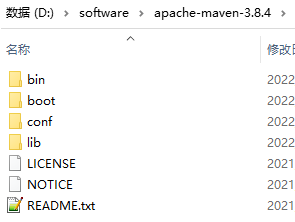

# 

## Chr 1	Maven 概述

### 一、Why? 为什么要学 Maven ?

##### 1、Maven 作为依赖管理工具

###### ①  jar 包的规模

随着我们使用越来越多的框架，或者框架封装程度越来越高，项目中使用的 jar 包也越来越多。项目中，一 项目里面用到上百个 jar 包是非常正常的。

> 比如下面的例子，我们只用到 SpringBoot、SpringCloud 框架中的三个功能：
>
> - Nacos 服务注册发现
> - Web 框架环境
> - 视图模板技术 Thymeleaf

```
org.springframework.security:spring-security-rsa:jar:1.0.9.RELEASE:compile
com.netflix.ribbon: ribbon:jar:2.3.0:compile
org.springframework.boot:spring-boot-starter-thymeleaf:jar:2.3.6.RELEASE:compile
commons-configuration:commons-configuration:jar:1.8:compile
org.apache.logging.log4j:log4j-api:jar:2.13.3:compile
org.springframework:spring-beans:jar:5.2.11.RELEASE:compile
org.springframework.cloud:spring-cloud-starter-netflix-ribbon:jar:2.2.6.RELEASE:compile
org.apache.tomcat.embed:tomcat-embed-websocket:jar:9.0.39:compile
com.alibaba.cloud:spring-cloud-alibaba-commons:jar:2.2.6.RELEASE:compile
org.bouncycastle:bcprov-jdk15on:jar:1.64:compile
org.springframework.security:spring-security-crypto:jar:5.3.5.RELEASE:compile
org.apache.httpcomponents:httpasyncclient:jar:4.1.4:compile
com.google.j2objc:j2objc-annotations:jar:1.3:compile
com.fasterxml.jackson.core:jackson-databind:jar:2.11.3:compile
io.reactivex:rxjava:jar:1.3.8:compile
ch.qos.logback:logback-classic:jar:1.2.3:compile
org.springframework:spring-web:jar:5.2.11.RELEASE:compile
io.reactivex:rxnetty-servo:jar:0.4.9:runtime
org.springframework:spring-core:jar:5.2.11.RELEASE:compile
io.github.openfeign.form:feign-form-spring:jar:3.8.0:compile
io.github.openfeign.form:feign-form:jar:3.8.0:compile
com.netflix.ribbon:ribbon-loadbalancer:jar:2.3.0:compile
org.apache.httpcomponents:httpcore:jar:4.4.13:compile
org.thymeleaf.extras:thymeleaf-extras-java8time:jar:3.0.4.RELEASE:compile
org.slf4j:jul-to-slf4j:jar:1.7.30:compile
com.atguigu.demo:demo09-base-entity:jar:1.0-SNAPSHOT:compile
org.yaml:snakeyaml:jar:1.26:compile
org.springframework.boot:spring-boot-starter-logging:jar:2.3.6.RELEASE:compile
io.reactivex:rxnetty-contexts:jar:0.4.9:runtime
org.apache.httpcomponents:httpclient:jar:4.5.13:compile
io.github.openfeign:feign-core:jar:10.10.1:compile
org.springframework.boot:spring-boot-starter-aop:jar:2.3.6.RELEASE:compile
org.hdrhistogram:HdrHistogram:jar:2.1.9:compile
org.springframework:spring-context:jar:5.2.11.RELEASE:compile
commons-lang:commons-lang:jar:2.6:compile
io.prometheus:simpleclient:jar:0.5.0:compile
ch.qos.logback:logback-core:jar:1.2.3:compile
org.springframework:spring-webmvc:jar:5.2.11.RELEASE:compile
com.sun.jersey:jersey-core:jar:1.19.1:runtime
javax.ws.rs:jsr311-api:jar:1.1.1:runtime
javax.inject:javax.inject:jar:1:runtime
org.springframework.cloud:spring-cloud-openfeign-core:jar:2.2.6.RELEASE:compile
com.netflix.ribbon:ribbon-core:jar:2.3.0:compilecom.netflix.hystrix:hystrix-core:jar:1.5.18:compilecom.netflix.ribbon:ribbon-transport:jar:2.3.0:runtime
org.springframework.boot:spring-boot-starter-json:jar:2.3.6.RELEASE:compile
org.springframework.cloud:spring-cloud-starter-openfeign:jar:2.2.6.RELEASE:compile
com.fasterxml.jackson.module:jackson-module-parameter-names:jar:2.11.3:compile
com.sun.jersey.contribs:jersey-apache-client4:jar:1.19.1:runtime
io.github.openfeign:feign-hystrix:jar:10.10.1:compile
io.github.openfeign:feign-slf4j:jar:10.10.1:compile
com.alibaba.nacos:nacos-client:jar:1.4.2:compile
org.apache.httpcomponents:httpcore-nio:jar:4.4.13:compile
com.sun.jersey:jersey-client:jar:1.19.1:runtime
org.springframework.cloud:spring-cloud-context:jar:2.2.6.RELEASE:compile
org.glassfish:jakarta.el:jar:3.0.3:compile
org.apache.logging.log4j:log4j-to-slf4j:jar:2.13.3:compile
com.fasterxml.jackson.datatype:jackson-datatype-jsr310:jar:2.11.3:compile
org.springframework.cloud:spring-cloud-commons:jar:2.2.6.RELEASE:compile
org.aspectj:aspectjweaver:jar:1.9.6:compile
com.alibaba.cloud:spring-cloud-starter-alibaba-nacos-discovery:jar:2.2.6.RELEASE:compile
com.google.guava:listenablefuture:jar:9999.0-empty-to-avoid-conflict-with-guava:compile
com.alibaba.spring:spring-context-support:jar:1.0.10:compile
jakarta.annotation:jakarta.annotation-api:jar:1.3.5:compile
org.bouncycastle:bcpkix-jdk15on:jar:1.64:compile
com.netflix.netflix-commons:netflix-commons-util:jar:0.3.0:runtime
com.fasterxml.jackson.core:jackson-annotations:jar:2.11.3:compile
com.google.guava:guava:jar:29.0-jre:compile
com.google.guava:failureaccess:jar:1.0.1:compile
org.springframework.boot:spring-boot:jar:2.3.6.RELEASE:compile
com.fasterxml.jackson.datatype:jackson-datatype-jdk8:jar:2.11.3:compile
com.atguigu.demo:demo08-base-api:jar:1.0-SNAPSHOT:compile
org.springframework.cloud:spring-cloud-starter-netflix-archaius:jar:2.2.6.RELEASE:compile
org.springframework.boot:spring-boot-autoconfigure:jar:2.3.6.RELEASE:compile
org.slf4j:slf4j-api:jar:1.7.30:compile
commons-io:commons-io:jar:2.7:compile
org.springframework.cloud:spring-cloud-starter:jar:2.2.6.RELEASE:compile
org.apache.tomcat.embed:tomcat-embed-core:jar:9.0.39:compile
io.reactivex:rxnetty:jar:0.4.9:runtime
com.fasterxml.jackson.core:jackson-core:jar:2.11.3:compile
com.google.code.findbugs:jsr305:jar:3.0.2:compile
com.netflix.archaius:archaius-core:jar:0.7.6:compile
org.springframework.boot:spring-boot-starter-web:jar:2.3.6.RELEASE:compile
commons-codec:commons-codec:jar:1.14:compile
com.netflix.servo:servo-core:jar:0.12.21:runtime
com.google.errorprone:error_prone_annotations:jar:2.3.4:compile
org.attoparser:attoparser:jar:2.0.5.RELEASE:compile
com.atguigu.demo:demo10-base-util:jar:1.0-SNAPSHOT:compile
org.checkerframework:checker-qual:jar:2.11.1:compile
org.thymeleaf:thymeleaf-spring5:jar:3.0.11.RELEASE:compile
commons-fileupload:commons-fileupload:jar:1.4:compile
com.netflix.ribbon:ribbon-httpclient:jar:2.3.0:compile
com.netflix.netflix-commons:netflix-statistics:jar:0.1.1:runtime
org.unbescape:unbescape:jar:1.1.6.RELEASE:compile
org.springframework:spring-jcl:jar:5.2.11.RELEASE:compile
com.alibaba.nacos:nacos-common:jar:1.4.2:compile
commons-collections:commons-collections:jar:3.2.2:runtime
javax.persistence:persistence-api:jar:1.0:compile
com.alibaba.nacos:nacos-api:jar:1.4.2:compileorg.thymeleaf:thymeleaf:jar:3.0.11.RELEASE:compile
org.springframework:spring-aop:jar:5.2.11.RELEASE:compile
org.springframework.boot:spring-boot-starter:jar:2.3.6.RELEASE:compile
org.springframework.boot:spring-boot-starter-tomcat:jar:2.3.6.RELEASE:compile
org.springframework.cloud:spring-cloud-netflix-ribbon:jar:2.2.6.RELEASE:compile
org.springframework:spring-expression:jar:5.2.11.RELEASE:compile
org.springframework.cloud:spring-cloud-netflix-archaius:jar:2.2.6.RELEASE:compile
```

而如果使用 Maven 来引入这些 jar 包只需要配置三个『依赖』：

```xml
    <!-- Nacos 服务注册发现启动器 -->
    <dependency>
        <groupId>com.alibaba.cloud</groupId>
        <artifactId>spring-cloud-starter-alibaba-nacos-discovery</artifactId>
    </dependency>

    <!-- web启动器依赖 -->
    <dependency>
        <groupId>org.springframework.boot</groupId>
        <artifactId>spring-boot-starter-web</artifactId>
    </dependency>

    <!-- 视图模板技术 thymeleaf -->
    <dependency>
        <groupId>org.springframework.boot</groupId>
        <artifactId>spring-boot-starter-thymeleaf</artifactId>
    </dependency>
```

###### ②  jar 包的来源

> - 这个jar包所属技术的官网。官网通常是英文界面，网站的结构又不尽相同，甚至找到下载链接还发现需要通过特殊的工具下载。
> - 第三方网站提供下载。问题是不规范，在使用过程中会出现各种问题。
>     - jar 包的名称
>     - jar 包的版本
>     - jar 包内的具体细节
> - 而使用 Maven 后，依赖对应的 jar 包能够自动下载，方便、快捷又规范。

###### ③jar 包之间的依赖关系

框架中使用的 jar 包，不仅数量庞大，而且彼此之间存在错综复杂的依赖关系。依赖关系的复杂程度，已经上升到了完全不能靠人力手动解决的程度。另外，jar 包之间有可能产生冲突。进一步增加了我们在 jar 包使用过程中的难度。

下面是前面例子中 jar 包之间的依赖关系：


> 而实际上 jar 包之间的依赖关系是普遍存在的，如果要由程序员手动梳理无疑会增加极高的学习成本，而这些工作又对实现业务功能毫无帮助。
>
> 而使用 Maven 则几乎不需要管理这些关系，极个别的地方调整一下即可，极大的减轻了我们的工作量。

##### 2、Maven 作为构建管理工具

###### ①  你没有注意过的构建

你可以不使用 Maven，但是构建必须要做。当我们使用 IDEA 进行开发时，构建是 IDEA 替我们做的。

###### ②  脱离 IDE 环境仍需构建


##### 3、结论

- 管理规模庞大的 jar 包，需要专门工具。
- 脱离 IDE 环境执行构建操作，需要专门工具。

### 二、 What？什么是Maven？

##### 1、构建

> ###### Java项目开发过程中，构建指的是使用【原材料生产产品】的过程
>
> - 原材料
>
>     - Java源代码
>
>     - 基于HTML的Thymeleaf文件
>     - 图片
>     - 配置文件
>     - ……
>
>
> - 产品
>
>     - 一个可以在服务器上运行的项目
>
> 
>
> ###### 构建过程包含的主要的环节：
>
> - 清理：删除上一次构建的结果，为下一次构建做好准备
>
>     
>
> - 编译：Java源程序编译成 *.class 字节码文件
>
> - 报告：针对刚才测试的结果生成一个全面的信息
>
> - 打包
>
>     - Java 工程：jar 包
>     - Web 工程：war 包
>
> - 安装：把一个 Maven 工程经过打包操作生成的jar包或war包存入 Maven 的本地仓库
>
> - 部署
>
>     - 部署 jar 包：把一个 jar 包部署到 Nexus 私服服务器上
>     - 部署 war 包：借助相关 Maven 插件（例如 cargo ），将 war 包部署到 Tomcat 服务器上

##### 2、依赖
> 如果 A 工程里面用到了B工程的类、接口、配置文件等等这样的资源，那么我们就 A 依赖 B。例如：
>
> - junit-4.12 依赖 hamcrest-core-1.3
> - thymeleaf-3.0.12.RELEASE 依赖 ognl-3.1.26
>     - ognl-3.1.26 依赖 javassist-3.20.0-GA
> - thymeleaf-3.0.12.RELEASE 依赖 attoparser-2.0.5.RELEASE
> - thymeleaf-3.0.12.RELEASE 依赖 unbescape-1.1.6.RELEASE
> - thymeleaf-3.0.12.RELEASE 依赖 slf4j-api-1.7.26
>
> 依赖管理中要解决的具体问题：
>
> - jar 包的下载：使用 Maven 之后，jar 包会从规范的远程仓库下载到本地
> - jar 包之间的依赖：通过依赖的传递性自动完成
> - jar 包之间的冲突：通过对依赖的配置进行调整，让某些jar包不会被导入

##### 3、Maven 的工作机制


## Chr 2	Maven核心程序解压和配置

### 一、 Maven 核心程序解压与配置

##### 1、Maven 官网地址

[首页](https://maven.apache.org/)        [下载页面](https://maven.apache.org/download.cgi)


##### 2、解压 Maven 核心程序

核心程序压缩包：apache-maven-3.8.4-bin.zip，解压到<span style="color:#4662d9; font-weight:bold">非中文、没有空格</span>的目录。例如：



在解压目录中，我们需要着重关注 Maven 的核心配置文件：<span style="color:#4662d9; font-weight:bold">conf/settings.xml</span>

##### 3、指定本地仓库

本地仓库默认值：用户家目录/.m2/repository。由于本地仓库的默认位置是在用户的家目录下，而家目录往往是在 C 盘，也就是系统盘。将来 Maven 仓库中 jar 包越来越多，仓库体积越来越大，可能会拖慢 C 盘运行速度，影响系统性能。所以建议将 Maven 的本地仓库放在其他盘符下。配置方式如下：

```xml
<!-- localRepository
  The path to the local repository maven will use to store artifacts.
 
  Default: ${user.home}/.m2/repository
<localRepository>/path/to/local/repo</localRepository>
-->
<!-- 配置 Maven 本地仓库 -->
<!-- 这个目录可以登执行构建命令时由 Maven 自己创建-->
<localRepository>D:\maven-repository</localRepository>
```

本地仓库这个目录，我们手动创建一个空的目录即可。

<span style="color:#4662d9; font-weight:bold">记住：一定要把 localRepository 标签从注释中拿出来。</span>

<span style="color:red; font-weight:bold">注意：本地仓库本身也需要使用一个非中文、没有空格的目录。</span>

##### 4、配置阿里云提供的镜像仓库

Maven 下载 jar 包默认访问境外的中央仓库，而国外网站速度很慢。改成阿里云提供的镜像仓库，<span style="color:#4662d9; font-weight:bold">访问国内网站</span>，可以让 Maven 下载 jar 包的时候速度更快。配置的方式是：

①	将原有的例子配置注释掉

②	加入自己的配置

将下面<span style="color:#4662d9; font-weight:bold"> mirror 标签</span>整体复制到 setting.xml 文件的<span style="color:#4662d9; font-weight:bold"> mirrors 标签</span>的内部。

```xml
  <mirror>
    <id>nexus-aliyun</id>
    <mirrorOf>central</mirrorOf>
    <name>Nexus aliyun</name>
    <url>http://maven.aliyun.com/nexus/content/groups/public</url>
  </mirror>
```

##### 5、配置 Maven 工程的基础 JDK 版本

如果按照默认配置运行，Java 工程使用的默认 JDK 版本是 1.5，而我们熟悉和常用的是<span style="color:#4662d9; font-weight:bold"> JDK 1.8 版本</span>。修改配置的方式是：将<span style="color:#4662d9; font-weight:bold"> profile 标签</span>整个复制到 settings.xml 文件的<span style="color:#4662d9; font-weight:bold"> profiles 标签</span>内。

```xml
  <profile>
    <id>jdk-1.8</id>
    <activation>
    <activeByDefault>true</activeByDefault>
    <jdk>1.8</jdk>
    </activation>
    <properties>
    <maven.compiler.source>1.8</maven.compiler.source>
    <maven.compiler.target>1.8</maven.compiler.target>
    <maven.compiler.compilerVersion>1.8</maven.compiler.compilerVersion>
    </properties>
  </profile>
```

### 二、配置环境变量

##### 1、检查 JAVA_HOME 配置是否正确

Maven 是一个用 Java 语言开发的程序，它必须基于 JDK 来运行，需要通过 JAVA_HOME 来找到 JDK 的安装位置。


可以使用下面的命令验证：

```bash
C:\Users\Administrator>echo %JAVA_HOME%
D:\software\Java

C:\Users\Administrator>java -version
java version "1.8.0_141"
Java(TM) SE Runtime Environment (build 1.8.0_141-b15)
Java HotSpot(TM) 64-Bit Server VM (build 25.141-b15, mixed mode)
```

##### 2、配置 MAVEN_HOME


##### 3、配置PATH


##### 4、验证

```bash
C:\Users\Administrator>mvn -v
Apache Maven 3.8.4 (9b656c72d54e5bacbed989b64718c159fe39b537)
Maven home: D:\software\apache-maven-3.8.4
Java version: 1.8.0_141, vendor: Oracle Corporation, runtime: D:\software\Java\jre
Default locale: zh_CN, platform encoding: GBK
OS name: "windows 10", version: "10.0", arch: "amd64", family: "windows"
```

## Chr 3	使用 Maven：命令行

### Test  ①	根据坐标创建 Maven 工程

##### 1、Maven 核心概念：坐标

###### ①	数学中的坐标


使用 x、y、z 三个『向量』作为空间的坐标系，可以在『空间』中唯一的定位到一个『点』。

###### ②	Maven中的坐标

> 向量说明
>
> 使用三个『向量』在『Maven的仓库』中唯一的定位到一个『jar』包。
>
> - groupId：公司或组织的 id
> - artifactId：一个项目或者是项目中的一个模块的 id
> - version：版本号

> 三个向量的取值方式
>
> - groupId：公司或组织域名的倒序，通常也会加上项目名称
>     - 例如：com.atguigu.maven
> - artifactId：模块的名称，将来作为 Maven 工程的工程名
> - version：模块的版本号，根据自己的需要设定
>     - 例如：SNAPSHOT 表示快照版本，正在迭代过程中，不稳定的版本
>     - 例如：RELEASE 表示正式版本
>
> 举例：
>
> - groupId：com.atguigu.maven
> - artifactId：pro01-atguigu-maven
> - version：1.0-SNAPSHOT

###### ③	坐标和仓库中 jar 包的存储路径之间的对应关系

坐标：

```xml
  <groupId>javax.servlet</groupId>
  <artifactId>servlet-api</artifactId>
  <version>2.5</version>
```

上面坐标对应的 jar 包在 Maven 本地仓库中的位置：

```xml
Maven本地仓库根目录\javax\servlet\servlet-api\2.5\servlet-api-2.5.jar
```

一定要学会根据坐标到本地仓库中找到对应的 jar 包。

##### 2、实验操作

###### ①	创建目录作为后面操作的工作空间

其实就是一个普通的目录，在这个目录下我们要去写代码、开发应用程序

例如：D:\maven-workspace\space201026

> 此时我们已经有了三个目录，分别是： 
>
> ★Maven 核心程序：中军大帐
>
> ★Maven 本地仓库：兵营
>
> ★本地工作空间：战场

###### ②	在工作空间目录下打开命令行窗口


###### ③	使用命令生成Maven工程


运行 mvn archetype:generate 命令

下面根据提示操作

```bash
Choose a number or apply filter (format: [groupId:]artifactId, case sensitive contains): 7:【直接回车，使用默认值】

Define value for property 'groupId': com.atguigu.maven

Define value for property 'artifactId': pro01-maven-java

Define value for property 'version' 1.0-SNAPSHOT: :(直接回车，使用默认值)

Define value for property 'package' com.atguigu.maven: :(直接回车，使用默认值)

Confirm properties configuration: groupId: com.atguigu.maven artifactId: pro01-maven-java version: 1.0-SNAPSHOT package: com.atguigu.maven Y: :(直接回车，表示确认。如果前面有输入错误，想要重新输入，则输入 N 再回车。)
```

###### ④	调整

Maven 默认生成的工程，对 junit 依赖的是较低的 3.8.1 版本，我们可以改成较适合的 4.12 版本。

自动生成的 App.java 和 AppTest.java 可以删除。

```xml 
<!-- 依赖信息配置 -->
<!-- dependencies复数标签：里面包含dependency单数标签 -->
<dependencies>
  <!-- dependency单数标签：配置一个具体的依赖 -->
  <dependency>
    <!-- 通过坐标来依赖其他jar包 -->
    <groupId>junit</groupId>
    <artifactId>junit</artifactId>
    <version>4.12</version>
    
    <!-- 依赖的范围 -->
    <scope>test</scope>
  </dependency>
</dependencies>
```

###### ⑤	自动生成的 pom.xml 解读

```xml
  <!-- 当前Maven工程的坐标 -->
  <groupId>com.atguigu.maven</groupId>
  <artifactId>pro01-maven-java</artifactId>
  <version>1.0-SNAPSHOT</version>
  
  <!-- 当前Maven工程的打包方式，可选值有下面三种： -->
  <!-- jar：表示这个工程是一个Java工程  -->
  <!-- war：表示这个工程是一个Web工程 -->
  <!-- pom：表示这个工程是“管理其他工程”的工程 -->
  <packaging>jar</packaging>

  <name>pro01-maven-java</name>
  <url>http://maven.apache.org</url>

  <properties>
  <!-- 工程构建过程中读取源码时使用的字符集 -->
    <project.build.sourceEncoding>UTF-8</project.build.sourceEncoding>
  </properties>

  <!-- 当前工程所依赖的jar包 -->
  <dependencies>
  <!-- 使用dependency配置一个具体的依赖 -->
    <dependency>
  
    <!-- 在dependency标签内使用具体的坐标依赖我们需要的一个jar包 -->
      <groupId>junit</groupId>
      <artifactId>junit</artifactId>
      <version>4.12</version>
    
    <!-- scope标签配置依赖的范围 -->
      <scope>test</scope>
    </dependency>
  </dependencies>
```

##### 3、Maven核心概念：POM

###### ①	含义

POM：Project Object Model，项目对象模型。和 POM 类似的是：DOM（Document Object Model），文档对象模型。它们都是模型化思想的具体体现。

###### ②	模型化思想

POM 表示将工程抽象为一个模型，再用程序中的对象来描述这个模型。这样我们就可以用程序来管理项目了。我们在开发过程中，最基本的做法就是将现实生活中的事物抽象为模型，然后封装模型相关的数据作为一个对象，这样就可以在程序中计算与现实事物相关的数据。

###### ③	对应的配置文件

POM 理念集中体现在 Maven 工程根目录下 pom.xml 这个配置文件中。所以这个 pom.xml 配置文件就是 Maven 工程的核心配置文件。其实学习 Maven 就是学这个文件怎么配置，各个配置有什么用。

##### 4、Maven核心概念：约定的目录结构

###### ①	各个目录的作用


另外还有一个 target 目录专门存放构建操作输出的结果。

###### ②	约定目录结构的意义

Maven 为了让构建过程能够尽可能自动化完成，所以必须约定目录结构的作用。例如：Maven 执行编译操作，必须先去 Java 源程序目录读取 Java 源代码，然后执行编译，最后把编译结果存放在 target 目录。

###### ③	约定大于配置

Maven 对于目录结构这个问题，没有采用配置的方式，而是基于约定。这样会让我们在开发过程中非常方便。如果每次创建 Maven 工程后，还需要针对各个目录的位置进行详细的配置，那肯定非常麻烦。

目前开发领域的技术发展趋势就是：约定大于配置，配置大于编码。

### Test ②	在 Maven 工程中编写代码

