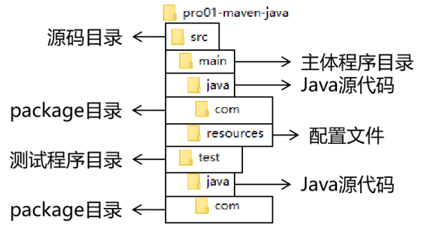
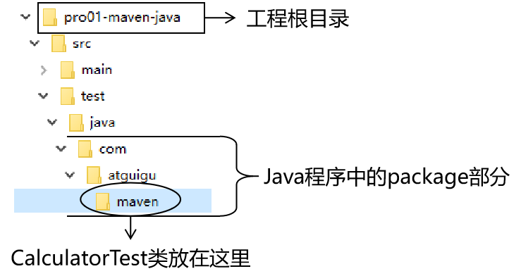
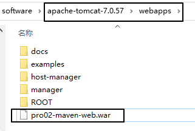
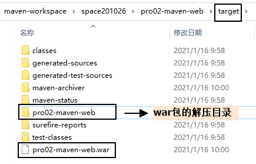

# 

## Chr 1	Maven 概述

### 一、Why? 为什么要学 Maven ?

##### 1、Maven 作为依赖管理工具

###### ①  jar 包的规模

随着我们使用越来越多的框架，或者框架封装程度越来越高，项目中使用的 jar 包也越来越多。项目中，一 项目里面用到上百个 jar 包是非常正常的。

> 比如下面的例子，我们只用到 SpringBoot、SpringCloud 框架中的三个功能：
>
> - Nacos 服务注册发现
> - Web 框架环境
> - 视图模板技术 Thymeleaf

```
org.springframework.security:spring-security-rsa:jar:1.0.9.RELEASE:compile
com.netflix.ribbon: ribbon:jar:2.3.0:compile
org.springframework.boot:spring-boot-starter-thymeleaf:jar:2.3.6.RELEASE:compile
commons-configuration:commons-configuration:jar:1.8:compile
org.apache.logging.log4j:log4j-api:jar:2.13.3:compile
org.springframework:spring-beans:jar:5.2.11.RELEASE:compile
org.springframework.cloud:spring-cloud-starter-netflix-ribbon:jar:2.2.6.RELEASE:compile
org.apache.tomcat.embed:tomcat-embed-websocket:jar:9.0.39:compile
com.alibaba.cloud:spring-cloud-alibaba-commons:jar:2.2.6.RELEASE:compile
org.bouncycastle:bcprov-jdk15on:jar:1.64:compile
org.springframework.security:spring-security-crypto:jar:5.3.5.RELEASE:compile
org.apache.httpcomponents:httpasyncclient:jar:4.1.4:compile
com.google.j2objc:j2objc-annotations:jar:1.3:compile
com.fasterxml.jackson.core:jackson-databind:jar:2.11.3:compile
io.reactivex:rxjava:jar:1.3.8:compile
ch.qos.logback:logback-classic:jar:1.2.3:compile
org.springframework:spring-web:jar:5.2.11.RELEASE:compile
io.reactivex:rxnetty-servo:jar:0.4.9:runtime
org.springframework:spring-core:jar:5.2.11.RELEASE:compile
io.github.openfeign.form:feign-form-spring:jar:3.8.0:compile
io.github.openfeign.form:feign-form:jar:3.8.0:compile
com.netflix.ribbon:ribbon-loadbalancer:jar:2.3.0:compile
org.apache.httpcomponents:httpcore:jar:4.4.13:compile
org.thymeleaf.extras:thymeleaf-extras-java8time:jar:3.0.4.RELEASE:compile
org.slf4j:jul-to-slf4j:jar:1.7.30:compile
com.atguigu.demo:demo09-base-entity:jar:1.0-SNAPSHOT:compile
org.yaml:snakeyaml:jar:1.26:compile
org.springframework.boot:spring-boot-starter-logging:jar:2.3.6.RELEASE:compile
io.reactivex:rxnetty-contexts:jar:0.4.9:runtime
org.apache.httpcomponents:httpclient:jar:4.5.13:compile
io.github.openfeign:feign-core:jar:10.10.1:compile
org.springframework.boot:spring-boot-starter-aop:jar:2.3.6.RELEASE:compile
org.hdrhistogram:HdrHistogram:jar:2.1.9:compile
org.springframework:spring-context:jar:5.2.11.RELEASE:compile
commons-lang:commons-lang:jar:2.6:compile
io.prometheus:simpleclient:jar:0.5.0:compile
ch.qos.logback:logback-core:jar:1.2.3:compile
org.springframework:spring-webmvc:jar:5.2.11.RELEASE:compile
com.sun.jersey:jersey-core:jar:1.19.1:runtime
javax.ws.rs:jsr311-api:jar:1.1.1:runtime
javax.inject:javax.inject:jar:1:runtime
org.springframework.cloud:spring-cloud-openfeign-core:jar:2.2.6.RELEASE:compile
com.netflix.ribbon:ribbon-core:jar:2.3.0:compilecom.netflix.hystrix:hystrix-core:jar:1.5.18:compilecom.netflix.ribbon:ribbon-transport:jar:2.3.0:runtime
org.springframework.boot:spring-boot-starter-json:jar:2.3.6.RELEASE:compile
org.springframework.cloud:spring-cloud-starter-openfeign:jar:2.2.6.RELEASE:compile
com.fasterxml.jackson.module:jackson-module-parameter-names:jar:2.11.3:compile
com.sun.jersey.contribs:jersey-apache-client4:jar:1.19.1:runtime
io.github.openfeign:feign-hystrix:jar:10.10.1:compile
io.github.openfeign:feign-slf4j:jar:10.10.1:compile
com.alibaba.nacos:nacos-client:jar:1.4.2:compile
org.apache.httpcomponents:httpcore-nio:jar:4.4.13:compile
com.sun.jersey:jersey-client:jar:1.19.1:runtime
org.springframework.cloud:spring-cloud-context:jar:2.2.6.RELEASE:compile
org.glassfish:jakarta.el:jar:3.0.3:compile
org.apache.logging.log4j:log4j-to-slf4j:jar:2.13.3:compile
com.fasterxml.jackson.datatype:jackson-datatype-jsr310:jar:2.11.3:compile
org.springframework.cloud:spring-cloud-commons:jar:2.2.6.RELEASE:compile
org.aspectj:aspectjweaver:jar:1.9.6:compile
com.alibaba.cloud:spring-cloud-starter-alibaba-nacos-discovery:jar:2.2.6.RELEASE:compile
com.google.guava:listenablefuture:jar:9999.0-empty-to-avoid-conflict-with-guava:compile
com.alibaba.spring:spring-context-support:jar:1.0.10:compile
jakarta.annotation:jakarta.annotation-api:jar:1.3.5:compile
org.bouncycastle:bcpkix-jdk15on:jar:1.64:compile
com.netflix.netflix-commons:netflix-commons-util:jar:0.3.0:runtime
com.fasterxml.jackson.core:jackson-annotations:jar:2.11.3:compile
com.google.guava:guava:jar:29.0-jre:compile
com.google.guava:failureaccess:jar:1.0.1:compile
org.springframework.boot:spring-boot:jar:2.3.6.RELEASE:compile
com.fasterxml.jackson.datatype:jackson-datatype-jdk8:jar:2.11.3:compile
com.atguigu.demo:demo08-base-api:jar:1.0-SNAPSHOT:compile
org.springframework.cloud:spring-cloud-starter-netflix-archaius:jar:2.2.6.RELEASE:compile
org.springframework.boot:spring-boot-autoconfigure:jar:2.3.6.RELEASE:compile
org.slf4j:slf4j-api:jar:1.7.30:compile
commons-io:commons-io:jar:2.7:compile
org.springframework.cloud:spring-cloud-starter:jar:2.2.6.RELEASE:compile
org.apache.tomcat.embed:tomcat-embed-core:jar:9.0.39:compile
io.reactivex:rxnetty:jar:0.4.9:runtime
com.fasterxml.jackson.core:jackson-core:jar:2.11.3:compile
com.google.code.findbugs:jsr305:jar:3.0.2:compile
com.netflix.archaius:archaius-core:jar:0.7.6:compile
org.springframework.boot:spring-boot-starter-web:jar:2.3.6.RELEASE:compile
commons-codec:commons-codec:jar:1.14:compile
com.netflix.servo:servo-core:jar:0.12.21:runtime
com.google.errorprone:error_prone_annotations:jar:2.3.4:compile
org.attoparser:attoparser:jar:2.0.5.RELEASE:compile
com.atguigu.demo:demo10-base-util:jar:1.0-SNAPSHOT:compile
org.checkerframework:checker-qual:jar:2.11.1:compile
org.thymeleaf:thymeleaf-spring5:jar:3.0.11.RELEASE:compile
commons-fileupload:commons-fileupload:jar:1.4:compile
com.netflix.ribbon:ribbon-httpclient:jar:2.3.0:compile
com.netflix.netflix-commons:netflix-statistics:jar:0.1.1:runtime
org.unbescape:unbescape:jar:1.1.6.RELEASE:compile
org.springframework:spring-jcl:jar:5.2.11.RELEASE:compile
com.alibaba.nacos:nacos-common:jar:1.4.2:compile
commons-collections:commons-collections:jar:3.2.2:runtime
javax.persistence:persistence-api:jar:1.0:compile
com.alibaba.nacos:nacos-api:jar:1.4.2:compileorg.thymeleaf:thymeleaf:jar:3.0.11.RELEASE:compile
org.springframework:spring-aop:jar:5.2.11.RELEASE:compile
org.springframework.boot:spring-boot-starter:jar:2.3.6.RELEASE:compile
org.springframework.boot:spring-boot-starter-tomcat:jar:2.3.6.RELEASE:compile
org.springframework.cloud:spring-cloud-netflix-ribbon:jar:2.2.6.RELEASE:compile
org.springframework:spring-expression:jar:5.2.11.RELEASE:compile
org.springframework.cloud:spring-cloud-netflix-archaius:jar:2.2.6.RELEASE:compile
```

而如果使用 Maven 来引入这些 jar 包只需要配置三个『依赖』：

```xml
    <!-- Nacos 服务注册发现启动器 -->
    <dependency>
        <groupId>com.alibaba.cloud</groupId>
        <artifactId>spring-cloud-starter-alibaba-nacos-discovery</artifactId>
    </dependency>

    <!-- web启动器依赖 -->
    <dependency>
        <groupId>org.springframework.boot</groupId>
        <artifactId>spring-boot-starter-web</artifactId>
    </dependency>

    <!-- 视图模板技术 thymeleaf -->
    <dependency>
        <groupId>org.springframework.boot</groupId>
        <artifactId>spring-boot-starter-thymeleaf</artifactId>
    </dependency>
```

###### ②  jar 包的来源

> - 这个jar包所属技术的官网。官网通常是英文界面，网站的结构又不尽相同，甚至找到下载链接还发现需要通过特殊的工具下载。
> - 第三方网站提供下载。问题是不规范，在使用过程中会出现各种问题。
>     - jar 包的名称
>     - jar 包的版本
>     - jar 包内的具体细节
> - 而使用 Maven 后，依赖对应的 jar 包能够自动下载，方便、快捷又规范。

###### ③jar 包之间的依赖关系

框架中使用的 jar 包，不仅数量庞大，而且彼此之间存在错综复杂的依赖关系。依赖关系的复杂程度，已经上升到了完全不能靠人力手动解决的程度。另外，jar 包之间有可能产生冲突。进一步增加了我们在 jar 包使用过程中的难度。

下面是前面例子中 jar 包之间的依赖关系：


> 而实际上 jar 包之间的依赖关系是普遍存在的，如果要由程序员手动梳理无疑会增加极高的学习成本，而这些工作又对实现业务功能毫无帮助。
>
> 而使用 Maven 则几乎不需要管理这些关系，极个别的地方调整一下即可，极大的减轻了我们的工作量。

##### 2、Maven 作为构建管理工具

###### ①  你没有注意过的构建

你可以不使用 Maven，但是构建必须要做。当我们使用 IDEA 进行开发时，构建是 IDEA 替我们做的。

###### ②  脱离 IDE 环境仍需构建


##### 3、结论

- 管理规模庞大的 jar 包，需要专门工具。
- 脱离 IDE 环境执行构建操作，需要专门工具。

### 二、 What？什么是Maven？

##### 1、构建

> ###### Java项目开发过程中，构建指的是使用【原材料生产产品】的过程
>
> - 原材料
>
>     - Java源代码
>
>     - 基于HTML的Thymeleaf文件
>     - 图片
>     - 配置文件
>     - ……
>
>
> - 产品
>
>     - 一个可以在服务器上运行的项目
>
> 
>
> ###### 构建过程包含的主要的环节：
>
> - 清理：删除上一次构建的结果，为下一次构建做好准备
>
>     
>
> - 编译：Java源程序编译成 *.class 字节码文件
>
> - 报告：针对刚才测试的结果生成一个全面的信息
>
> - 打包
>
>     - Java 工程：jar 包
>     - Web 工程：war 包
>
> - 安装：把一个 Maven 工程经过打包操作生成的jar包或war包存入 Maven 的本地仓库
>
> - 部署
>
>     - 部署 jar 包：把一个 jar 包部署到 Nexus 私服服务器上
>     - 部署 war 包：借助相关 Maven 插件（例如 cargo ），将 war 包部署到 Tomcat 服务器上

##### 2、依赖
> 如果 A 工程里面用到了B工程的类、接口、配置文件等等这样的资源，那么我们就 A 依赖 B。例如：
>
> - junit-4.12 依赖 hamcrest-core-1.3
> - thymeleaf-3.0.12.RELEASE 依赖 ognl-3.1.26
>     - ognl-3.1.26 依赖 javassist-3.20.0-GA
> - thymeleaf-3.0.12.RELEASE 依赖 attoparser-2.0.5.RELEASE
> - thymeleaf-3.0.12.RELEASE 依赖 unbescape-1.1.6.RELEASE
> - thymeleaf-3.0.12.RELEASE 依赖 slf4j-api-1.7.26
>
> 依赖管理中要解决的具体问题：
>
> - jar 包的下载：使用 Maven 之后，jar 包会从规范的远程仓库下载到本地
> - jar 包之间的依赖：通过依赖的传递性自动完成
> - jar 包之间的冲突：通过对依赖的配置进行调整，让某些jar包不会被导入

##### 3、Maven 的工作机制


## Chr 2	Maven核心程序解压和配置

### 一、 Maven 核心程序解压与配置

##### 1、Maven 官网地址

[首页](https://maven.apache.org/)        [下载页面](https://maven.apache.org/download.cgi)


##### 2、解压 Maven 核心程序

核心程序压缩包：apache-maven-3.8.4-bin.zip，解压到<span style="color:#4662d9; font-weight:bold">非中文、没有空格</span>的目录。例如：


在解压目录中，我们需要着重关注 Maven 的核心配置文件：<span style="color:#4662d9; font-weight:bold">conf/settings.xml</span>

##### 3、指定本地仓库

本地仓库默认值：用户家目录/.m2/repository。由于本地仓库的默认位置是在用户的家目录下，而家目录往往是在 C 盘，也就是系统盘。将来 Maven 仓库中 jar 包越来越多，仓库体积越来越大，可能会拖慢 C 盘运行速度，影响系统性能。所以建议将 Maven 的本地仓库放在其他盘符下。配置方式如下：

```xml
<!-- localRepository
  The path to the local repository maven will use to store artifacts.
 
  Default: ${user.home}/.m2/repository
<localRepository>/path/to/local/repo</localRepository>
-->
<!-- 配置 Maven 本地仓库 -->
<!-- 这个目录可以登执行构建命令时由 Maven 自己创建-->
<localRepository>D:\maven-repository</localRepository>
```

本地仓库这个目录，我们手动创建一个空的目录即可。

<span style="color:#4662d9; font-weight:bold">记住：一定要把 localRepository 标签从注释中拿出来。</span>

<span style="color:red; font-weight:bold">注意：本地仓库本身也需要使用一个非中文、没有空格的目录。</span>

##### 4、配置阿里云提供的镜像仓库

Maven 下载 jar 包默认访问境外的中央仓库，而国外网站速度很慢。改成阿里云提供的镜像仓库，<span style="color:#4662d9; font-weight:bold">访问国内网站</span>，可以让 Maven 下载 jar 包的时候速度更快。配置的方式是：

①	将原有的例子配置注释掉

②	加入自己的配置

将下面<span style="color:#4662d9; font-weight:bold"> mirror 标签</span>整体复制到 setting.xml 文件的<span style="color:#4662d9; font-weight:bold"> mirrors 标签</span>的内部。

```xml
  <mirror>
    <id>nexus-aliyun</id>
    <mirrorOf>central</mirrorOf>
    <name>Nexus aliyun</name>
    <url>http://maven.aliyun.com/nexus/content/groups/public</url>
  </mirror>
```

##### 5、配置 Maven 工程的基础 JDK 版本

如果按照默认配置运行，Java 工程使用的默认 JDK 版本是 1.5，而我们熟悉和常用的是<span style="color:#4662d9; font-weight:bold"> JDK 1.8 版本</span>。修改配置的方式是：将<span style="color:#4662d9; font-weight:bold"> profile 标签</span>整个复制到 settings.xml 文件的<span style="color:#4662d9; font-weight:bold"> profiles 标签</span>内。

```xml
  <profile>
    <id>jdk-1.8</id>
    <activation>
    <activeByDefault>true</activeByDefault>
    <jdk>1.8</jdk>
    </activation>
    <properties>
    <maven.compiler.source>1.8</maven.compiler.source>
    <maven.compiler.target>1.8</maven.compiler.target>
    <maven.compiler.compilerVersion>1.8</maven.compiler.compilerVersion>
    </properties>
  </profile>
```

### 二、配置环境变量

##### 1、检查 JAVA_HOME 配置是否正确

Maven 是一个用 Java 语言开发的程序，它必须基于 JDK 来运行，需要通过 JAVA_HOME 来找到 JDK 的安装位置。


可以使用下面的命令验证：

```bash
C:\Users\Administrator>echo %JAVA_HOME%
D:\software\Java

C:\Users\Administrator>java -version
java version "1.8.0_141"
Java(TM) SE Runtime Environment (build 1.8.0_141-b15)
Java HotSpot(TM) 64-Bit Server VM (build 25.141-b15, mixed mode)
```

##### 2、配置 MAVEN_HOME


##### 3、配置PATH


##### 4、验证

```bash
C:\Users\Administrator>mvn -v
Apache Maven 3.8.4 (9b656c72d54e5bacbed989b64718c159fe39b537)
Maven home: D:\software\apache-maven-3.8.4
Java version: 1.8.0_141, vendor: Oracle Corporation, runtime: D:\software\Java\jre
Default locale: zh_CN, platform encoding: GBK
OS name: "windows 10", version: "10.0", arch: "amd64", family: "windows"
```

## Chr 3	使用 Maven：命令行

### Test  ①	根据坐标创建 Maven 工程

##### 1、Maven 核心概念：坐标

###### ①	数学中的坐标


使用 x、y、z 三个『向量』作为空间的坐标系，可以在『空间』中唯一的定位到一个『点』。

###### ②	Maven中的坐标

> 向量说明
>
> 使用三个『向量』在『Maven的仓库』中唯一的定位到一个『jar』包。
>
> - groupId：公司或组织的 id
> - artifactId：一个项目或者是项目中的一个模块的 id
> - version：版本号

> 三个向量的取值方式
>
> - groupId：公司或组织域名的倒序，通常也会加上项目名称
>     - 例如：com.atguigu.maven
> - artifactId：模块的名称，将来作为 Maven 工程的工程名
> - version：模块的版本号，根据自己的需要设定
>     - 例如：SNAPSHOT 表示快照版本，正在迭代过程中，不稳定的版本
>     - 例如：RELEASE 表示正式版本
>
> 举例：
>
> - groupId：com.atguigu.maven
> - artifactId：pro01-atguigu-maven
> - version：1.0-SNAPSHOT

###### ③	坐标和仓库中 jar 包的存储路径之间的对应关系

坐标：

```xml
  <groupId>javax.servlet</groupId>
  <artifactId>servlet-api</artifactId>
  <version>2.5</version>
```

上面坐标对应的 jar 包在 Maven 本地仓库中的位置：

```xml
Maven本地仓库根目录\javax\servlet\servlet-api\2.5\servlet-api-2.5.jar
```

一定要学会根据坐标到本地仓库中找到对应的 jar 包。

##### 2、实验操作

###### ①	创建目录作为后面操作的工作空间

其实就是一个普通的目录，在这个目录下我们要去写代码、开发应用程序

例如：D:\maven-workspace\space201026

> 此时我们已经有了三个目录，分别是： 
>
> ★Maven 核心程序：中军大帐
>
> ★Maven 本地仓库：兵营
>
> ★本地工作空间：战场

###### ②	在工作空间目录下打开命令行窗口


###### ③	使用命令生成Maven工程


运行 mvn archetype:generate 命令

下面根据提示操作

```bash
Choose a number or apply filter (format: [groupId:]artifactId, case sensitive contains): 7:【直接回车，使用默认值】

Define value for property 'groupId': com.atguigu.maven

Define value for property 'artifactId': pro01-maven-java

Define value for property 'version' 1.0-SNAPSHOT: :(直接回车，使用默认值)

Define value for property 'package' com.atguigu.maven: :(直接回车，使用默认值)

Confirm properties configuration: groupId: com.atguigu.maven artifactId: pro01-maven-java version: 1.0-SNAPSHOT package: com.atguigu.maven Y: :(直接回车，表示确认。如果前面有输入错误，想要重新输入，则输入 N 再回车。)
```

###### ④	调整

Maven 默认生成的工程，对 junit 依赖的是较低的 3.8.1 版本，我们可以改成较适合的 4.12 版本。

自动生成的 App.java 和 AppTest.java 可以删除。

```xml 
<!-- 依赖信息配置 -->
<!-- dependencies复数标签：里面包含dependency单数标签 -->
<dependencies>
  <!-- dependency单数标签：配置一个具体的依赖 -->
  <dependency>
    <!-- 通过坐标来依赖其他jar包 -->
    <groupId>junit</groupId>
    <artifactId>junit</artifactId>
    <version>4.12</version>
    
    <!-- 依赖的范围 -->
    <scope>test</scope>
  </dependency>
</dependencies>
```

###### ⑤	自动生成的 pom.xml 解读

```xml
  <!-- 当前Maven工程的坐标 -->
  <groupId>com.atguigu.maven</groupId>
  <artifactId>pro01-maven-java</artifactId>
  <version>1.0-SNAPSHOT</version>
  
  <!-- 当前Maven工程的打包方式，可选值有下面三种： -->
  <!-- jar：表示这个工程是一个Java工程  -->
  <!-- war：表示这个工程是一个Web工程 -->
  <!-- pom：表示这个工程是“管理其他工程”的工程 -->
  <packaging>jar</packaging>

  <name>pro01-maven-java</name>
  <url>http://maven.apache.org</url>

  <properties>
  <!-- 工程构建过程中读取源码时使用的字符集 -->
    <project.build.sourceEncoding>UTF-8</project.build.sourceEncoding>
  </properties>

  <!-- 当前工程所依赖的jar包 -->
  <dependencies>
  <!-- 使用dependency配置一个具体的依赖 -->
    <dependency>
  
    <!-- 在dependency标签内使用具体的坐标依赖我们需要的一个jar包 -->
      <groupId>junit</groupId>
      <artifactId>junit</artifactId>
      <version>4.12</version>
    
    <!-- scope标签配置依赖的范围 -->
      <scope>test</scope>
    </dependency>
  </dependencies>
```

##### 3、Maven核心概念：POM

###### ①	含义

POM：Project Object Model，项目对象模型。和 POM 类似的是：DOM（Document Object Model），文档对象模型。它们都是模型化思想的具体体现。

###### ②	模型化思想

POM 表示将工程抽象为一个模型，再用程序中的对象来描述这个模型。这样我们就可以用程序来管理项目了。我们在开发过程中，最基本的做法就是将现实生活中的事物抽象为模型，然后封装模型相关的数据作为一个对象，这样就可以在程序中计算与现实事物相关的数据。

###### ③	对应的配置文件

POM 理念集中体现在 Maven 工程根目录下 pom.xml 这个配置文件中。所以这个 pom.xml 配置文件就是 Maven 工程的核心配置文件。其实学习 Maven 就是学这个文件怎么配置，各个配置有什么用。

##### 4、Maven核心概念：约定的目录结构

###### ①	各个目录的作用



另外还有一个 target 目录专门存放构建操作输出的结果。

###### ②	约定目录结构的意义

Maven 为了让构建过程能够尽可能自动化完成，所以必须约定目录结构的作用。例如：Maven 执行编译操作，必须先去 Java 源程序目录读取 Java 源代码，然后执行编译，最后把编译结果存放在 target 目录。

###### ③	约定大于配置

Maven 对于目录结构这个问题，没有采用配置的方式，而是基于约定。这样会让我们在开发过程中非常方便。如果每次创建 Maven 工程后，还需要针对各个目录的位置进行详细的配置，那肯定非常麻烦。

目前开发领域的技术发展趋势就是：约定大于配置，配置大于编码。

### Test ②	在 Maven 工程中编写代码

##### 1、主体程序


主体程序指的是被测试的程序，同时也是将来在项目中真正要使用的程序。

```Java
package com.atguigu.maven;

public class Calculator {
  public int sum(int i, int j){
    return i + j;
  }
}
```

##### 2、测试程序



```Java
package com.atguigu.maven;
  
import org.junit.Test;
import com.atguigu.maven.Calculator;

// 静态导入的效果是将Assert类中的静态资源导入当前类
// 这样一来，在当前类中就可以直接使用Assert类中的静态资源，不需要写类名
import static org.junit.Assert.*;

public class CalculatorTest{

  @Test
  public void testSum(){
    
    // 1.创建Calculator对象
    Calculator calculator = new Calculator();
    
    // 2.调用Calculator对象的方法，获取到程序运行实际的结果
    int actualResult = calculator.sum(5, 3);
    
    // 3.声明一个变量，表示程序运行期待的结果
    int expectedResult = 8;
    
    // 4.使用断言来判断实际结果和期待结果是否一致
    // 如果一致：测试通过，不会抛出异常
    // 如果不一致：抛出异常，测试失败
    assertEquals(expectedResult, actualResult);
    
  }
  
}
```

### Test ③ 执行 Maven 的构建命令

##### 1、要求

运行 Maven 中的构建相关的命令时，必须进入到 pom.xml 所在的目录。如果没有在 pom.xml 所在的目录运行 Maven 的构建命令，那么会看到的<span style="color:#4662d9; font-weight:bold">错误信息</span>：

<span style="color:#ff6060; font-weight:bold">The goal you specified requires a project to execute but there is no POM in this directory .</span>

> mvn -v 命令和构建操作无关，只要正确配置了 PATH，在任何目录下执行都可以。而构建相关的命令要在 pom.xml 所在目录下运行——操作哪个工程，就进入这个工程的 pom.xml 目录。

##### 2、清理操作

> mvn clean
>
> 效果：删除 target 目录

##### 3、编译操作

> 主程序编译：mvn compile
>
> 测试程序编译：mvn test-compile
>
> 主体程序编译结果存放的目录：target/classes
>
> 测试程序编译结果存放的目录：target/test-classes

##### 4、测试操作

> mvn test
>
> 测试的报告存放的目录：target/surefire-reports

##### 5、打包操作

> mvn package
>
> 打包的结果——jar 包，存放的目录：target

##### 6、安装操作

> mvn install
>
> ```bash
> [INFO] Installing D:\maven-workspace\space201026\pro01-maven-java\target\pro01-maven-java-1.0-SNAPSHOT.jar to D:\maven-rep1026\com\atguigu\maven\pro01-maven-java\1.0-SNAPSHOT\pro01-maven-java-1.0-SNAPSHOT.jar
> [INFO] Installing D:\maven-workspace\space201026\pro01-maven-java\pom.xml to D:\maven-rep1026\com\atguigu\maven\pro01-maven-java\1.0-SNAPSHOT\pro01-maven-java-1.0-SNAPSHOT.pom
> ```

安装的效果是将本地构建过程中生成的 jar 包存入 Maven 本地仓库。这个 jar 包在 Maven 仓库中的路径是根据它的坐标生成的。

坐标信息如下：

```xml
  <groupId>com.atguigu.maven</groupId>
  <artifactId>pro01-maven-java</artifactId>
  <version>1.0-SNAPSHOT</version>
```

在 Maven 仓库中生成的路径如下：

```bash
D:\maven-rep1026\com\atguigu\maven\pro01-maven-java\1.0-SNAPSHOT\pro01-maven-java-1.0-SNAPSHOT.jar
```

另外，安装操作还会将 pom.xml 文件转换为 XXX.pom 文件一起存入本地仓库。所以我们在 Maven 的本地仓库中想看一个 jar 包原始的 pom.xml 文件时，查看对应 XXX.pom 文件即可，它们是名字发生了改变，本质上是同一个文件。

### Test ④ 创建 Maven 版的 Web 工程

##### 1、说明

使用 mvn archetype:generate 命令生成 Web 工程时，需要使用一个专门的 archetype。这个专门生成 Web 工程骨架的 archetype 可以参照官网看到它的用法：


参数 archetypeGroupId、archetypeArtifactId、archetypeVersion 用来指定现在使用的 maven-archetype-webapp 的坐标。

##### 2、操作

注意：如果在上一个工程的目录下执行 mvn archetype:generate 命令，那么 Maven 会报错：不能在一个非 pom 的工程下再创建其他工程。所以不要再刚才创建的工程里再创建新的工程，请回到工作空间根目录来操作。

然后运行生成工程的命令：

```bash
mvn archetype:generate -DarchetypeGroupId=org.apache.maven.archetypes -DarchetypeArtifactId=maven-archetype-webapp -DarchetypeVersion=1.4
```

下面的操作按照提示执行：

```bash
Define value for property 'groupId': com.atguigu.maven Define value for property 'artifactId': pro02-maven-web Define value for property 'version' 1.0-SNAPSHOT: :【直接回车，使用默认值】
Define value for property 'package' com.atguigu.maven: :【直接回车，使用默认值】 Confirm properties configuration: groupId: com.atguigu.maven artifactId: pro02-maven-web version: 1.0-SNAPSHOT package: com.atguigu.maven Y: :【直接回车，表示确认】
```

##### 3、生成的pom.xml

确认打包的方式是 war 包形式

```xml
<packaging>war</packaging>
```

##### 4、生成的 Web 工程的目录结构

webapp 目录下有 index.jsp

WEB-INF 目录下有 web.xml

##### 5、创建 Servlet

###### ① 在 main 目录下创建 java 目录


###### ②  在 java 目录下创建 Servlet 类所在的包的目录


###### ③  在包下创建 Servlet 类

```java
package com.atguigu.maven;

import javax.servlet.http.HttpServlet;
import javax.servlet.http.HttpServletRequest;
import javax.servlet.http.HttpServletResponse;
import javax.servlet.ServletException;
import java.io.IOException;

public class HelloServlet extends HttpServlet{
  
  protected void doGet(HttpServletRequest request, HttpServletResponse response) throws ServletException, IOException {
    
    response.getWriter().write("hello maven web");
    
  }
  
}
```

###### ④  在 web.xml 中注册 Servlet

```xml
  <servlet>
    <servlet-name>helloServlet</servlet-name>
    <servlet-class>com.atguigu.maven.HelloServlet</servlet-class>
  </servlet>
  <servlet-mapping>
    <servlet-name>helloServlet</servlet-name>
    <url-pattern>/helloServlet</url-pattern>
  </servlet-mapping>
```

##### 6、在 index.jsp 页面编写超链接

```html
<html>
<body>
<h2>Hello World!</h2>
<a href="helloServlet">Access Servlet</a>
</body>
</html>
```

##### 7、编译

此时直接执行 mvn compile 命令出错：

```
程序包 javax.servlet.http 不存在

程序包 javax.servlet 不存在

找不到符号

符号: 类 HttpServlet

……
```

上面的错误信息说明：我们的 Web 工程用到了 HttpServlet 这个类，而 HttpServlet 这个类属于 servlet-api.jar 这个 jar 包。此时我们说，Web 工程需要依赖 servlet-api.jar 包。


##### 8、配置对 servlet-api.jar 包的依赖

对于不知道详细信息的依赖可以到https://mvnrepository.com/网站查询。使用关键词搜索，然后在搜索结果列表中选择适合的使用。


比如，我们找到的 servlet-api 的依赖信息：

```xml
<!-- https://mvnrepository.com/artifact/javax.servlet/javax.servlet-api -->
<dependency>
    <groupId>javax.servlet</groupId>
    <artifactId>javax.servlet-api</artifactId>
    <version>3.1.0</version>
    <scope>provided</scope>
</dependency>
```

这样就可以把上面的信息加入 pom.xml。重新执行 mvn compile 命令。

##### 9、将 Web 工程打包为 war 包

运行 mvn package 命令，生成 war 包的位置如下图所示：


##### 10、将 war 包部署到 Tomcat 上运行

将 war 包复制到 Tomcat/webapps 目录下



启动 Tomcat：


通过浏览器尝试访问：http://localhost:8080/pro02-maven-web/index.jsp

### Test ⑤ 让 Web 工程依赖 Java 工程

##### 1、观念

明确一个意识：从来只有 Web 工程依赖 Java 工程，没有反过来 Java 工程依赖 Web 工程。本质上来说，Web 工程依赖的 Java 工程其实就是 Web 工程里导入的 jar 包。最终 Java 工程会变成 jar 包，放在 Web 工程的 WEB-INF/lib 目录下。

##### 2、操作

在 pro02-maven-web 工程的 pom.xml 中，找到 dependencies 标签，在 dependencies 标签中做如下配置：

```xml
<!-- 配置对Java工程pro01-maven-java的依赖 -->
<!-- 具体的配置方式：在dependency标签内使用坐标实现依赖 -->
<dependency>
  <groupId>com.atguigu.maven</groupId>
  <artifactId>pro01-maven-java</artifactId>
  <version>1.0-SNAPSHOT</version>
</dependency>
```

##### 3、在 Web 工程中，编写测试代码

证明在Web工程中可以使用Java工程中创建的那个类：Calculator

###### ①  补充创建目录

> pro02-maven-web\src\test\java\com\atguigu\maven

> 可以使用mkdir命令：
>
> mkdir src\test\java\com\atguigu\maven

###### ②  确认 Web 工程依赖了 junit

```xml
<dependency>
  <groupId>junit</groupId>
  <artifactId>junit</artifactId>
  <version>4.12</version>
  <scope>test</scope>
</dependency>
```
###### ③  创建测试类

> 把 Java 工程的 CalculatorTest.java 类复制到 pro02-maven-wb\src\test\java\com\atguigu\maven 目录下

##### 4、执行Maven命令

###### ①  测试命令

> mvn test
>
> 说明：测试操作中会提前自动执行编译操作，测试成功就说明编译也是成功的。

###### ②  打包命令

> mvn package



通过查看 war 包内的结构，我们看到被 Web 工程依赖的 Java 工程确实是会变成 Web 工程的 WEB-INF/lib 目录下的 jar 包。


###### ③  查看当前 Web 工程所依赖的 jar 包的列表

mvn dependency:list

```bash
[INFO] The following files have been resolved:
[INFO] org.hamcrest:hamcrest-core:jar:1.3:test
[INFO] javax.servlet:javax.servlet-api:jar:3.1.0:provided
[INFO] com.atguigu.maven:pro01-maven-java:jar:1.0-SNAPSHOT:compile
[INFO] junit:junit:jar:4.12:test
```

说明：javax.servlet:javax.servlet-api:jar:3.1.0:provided 格式显示的是一个 jar 包的坐标信息。格式是：

groupId:artifactId:打包方式: version:依赖的范围

这样的格式虽然和我们 XML 配置文件中坐标的格式不同，但是本质上还是坐标信息，大家需要能够认识这样的格式，将来从 Maven 命令的日志或错误信息中看到这样格式的信息，就能够识别出来这是坐标。进而根据坐标到Maven 仓库找到对应的jar包，用这样的方式解决我们遇到的报错的情况。

###### ④以树形结构查看当前 Web 工程的依赖信息

mvn dependency:tree

```bash
[INFO] com.atguigu.maven:pro02-maven-web:war:1.0-SNAPSHOT
[INFO] +- junit:junit:jar:4.12:test
[INFO] | \- org.hamcrest:hamcrest-core:jar:1.3:test
[INFO] +- javax.servlet:javax.servlet-api:jar:3.1.0:provided
[INFO] \- com.atguigu.maven:pro01-maven-java:jar:1.0-SNAPSHOT:compile
```

我们在 pom.xml 中并没有依赖 hamcrest-core，但是它却被加入了我们依赖的列表。原因是：junit 依赖了hamcrest-core，然后基于依赖的传递性，hamcrest-core 被传递到我们的工程了。

### Test ⑥  测试依赖范围

##### 1、依赖范围

标签的位置：dependencies/dependency/scope

标签的可选值：compile/test/provided/system/runtime/import

###### ①  compile 和 test 对比

|         | main目录（空间） | test目录（空间） | 开发过程（时间） | 部署到服务器（时间） |
| :-----: | :--------------: | :--------------: | :--------------: | :------------------: |
| compile |       有效       |       有效       |       有效       |         有效         |
|  test   |       无效       |       有效       |       有效       |         无效         |

###### ②  compile 和 provided 对比

|          | main目录（空间） | test目录（空间） | 开发过程（时间） | 部署到服务器（时间） |
| :------: | :--------------: | :--------------: | :--------------: | :------------------: |
| compile  |       有效       |       有效       |       有效       |         有效         |
| provided |       有效       |       有效       |       有效       |         无效         |

###### ③  结论

> compile：通常使用的第三方框架的 jar 包这样在项目实际运行时真正要用到的 jar 包都是以 compile 范围进行依赖的。比如 SSM 框架所需 jar 包。
>
> test：测试过程中使用的 jar 包，以 test 范围依赖进来。比如 junit。
>
> provided：在开发过程中需要用到的“服务器上的 jar 包”通常以 provided 范围依赖进来。比如 servlet-api、jsp-api。而这个范围的 jar 包之所以不参与部署、不放进 war 包，就是避免和服务器上已有的同类 jar 包产生冲突，同时减轻服务器的负担。说白了就是：“服务器上已经有了，你就别带啦！” 

##### 2、测试

###### ①  验证 compile 范围对 main 目录有效

> main 目录下的类：HelloServlet 使用 compile 范围导入的依赖：pro01-atguigu-maven
>
> 验证：使用 compile 范围导入的依赖对 main 目录下的类来说是有效的
>
> 有效：HelloServlet 能够使用 pro01-atguigu-maven 工程中的 Calculator 类
>
> 验证方式：在 HelloServlet 类中导入 Calculator 类，然后编译就说明有效

###### ②  验证 test 范围对 main 目录无效

> 测试方式：在主体程序中导入 org.junit.Test 这个注解，然后执行编译。
>
> 具体操作：在 pro01-maven-java\src\main\java\com\atguigu\maven目录下修改Calculator.java

```Java
package com.atguigu.maven;

import org.junit.Test;

public class Calculator {
  
  public int sum(int i, int j){
    return i + j;
  }
  
}
```

执行 Maven 编译命令：

```bash
[ERROR] /D:/maven-workspace/space201026/pro01-maven-java/src/main/java/com/atguigu/maven/Calculator.java:[3,17] 程序包org.junit不存在
```

###### ③  验证 test 和 provided 范围不参与服务器部署

其实就是验证：通过 compile 范围依赖的 jar 包会放入 war 包，通过 test 范围依赖的 jar 包不会放入 war 包。


###### ④  验证 provided 范围对测试程序有效

测试方式是在 pro02-maven-web 的测试程序中加入 servlet-api.jar 包中的类。

修改：pro02-maven-web\src\test\java\com\atguigu\maven\CalculatorTest.java

```java
package com.atguigu.maven;

import javax.servlet.http.HttpServlet;
import javax.servlet.http.HttpServletRequest;
import javax.servlet.http.HttpServletResponse;
import javax.servlet.ServletException;

import org.junit.Test;
import com.atguigu.maven.Calculator;

// 静态导入的效果是将Assert类中的静态资源导入当前类
// 这样一来，在当前类中就可以直接使用Assert类中的静态资源，不需要写类名
import static org.junit.Assert.*;

public class CalculatorTest{
  
  @Test
  public void testSum(){
    
    // 1.创建Calculator对象
    Calculator calculator = new Calculator();
    
    // 2.调用Calculator对象的方法，获取到程序运行实际的结果
    int actualResult = calculator.sum(5, 3);
    
    // 3.声明一个变量，表示程序运行期待的结果
    int expectedResult = 8;
    
    // 4.使用断言来判断实际结果和期待结果是否一致
    // 如果一致：测试通过，不会抛出异常
    // 如果不一致：抛出异常，测试失败
    assertEquals(expectedResult, actualResult);
    
  }
  
}
```

然后运行 Maven 的编译命令：mvn compile

然后看到编译成功。

### Test ⑦ 测试依赖的传递性

##### 1、依赖的传递性

###### ①  依赖

A 依赖 B，B 依赖 C，那么在 A 没有配置对 C 的依赖的情况下，A 里面能不能直接使用 C？

###### ②  传递的原则

在 A 依赖 B，B 依赖 C 的前提下，C 是否能够传递到 A，取决于 B 依赖 C 时使用的依赖范围。

- B 依赖 C 时使用 compile 范围：可以传递
- B 依赖 C 时使用 test 或 provided 范围：不能传递，所以需要这样的 jar 包时，就必须在需要的地方明确配置依赖才可以。

##### 2、使用 compile 范围依赖 spring-core

测试方式：让 pro01-maven-java 工程依赖 spring-core

具体操作：编辑 pro01-maven-java 工程根目录下 pom.xml

```xml
<!-- https://mvnrepository.com/artifact/org.springframework/spring-core -->
<dependency>
  <groupId>org.springframework</groupId>
  <artifactId>spring-core</artifactId>
  <version>4.0.0.RELEASE</version>
</dependency>
```

使用 mvn dependency:tree 命令查看效果：

```bash
[INFO] com.atguigu.maven:pro01-maven-java:jar:1.0-SNAPSHOT
[INFO] +- junit:junit:jar:4.12:test
[INFO] | \- org.hamcrest:hamcrest-core:jar:1.3:test
[INFO] \- org.springframework:spring-core:jar:4.0.0.RELEASE:compile
[INFO] \- commons-logging:commons-logging:jar:1.1.1:compile
```

还可以在 Web 工程中，使用 mvn dependency:tree 命令查看效果（需要重新将 pro01-maven-java 安装到仓库）：

```bash
[INFO] com.atguigu.maven:pro02-maven-web:war:1.0-SNAPSHOT
[INFO] +- junit:junit:jar:4.12:test
[INFO] | \- org.hamcrest:hamcrest-core:jar:1.3:test
[INFO] +- javax.servlet:javax.servlet-api:jar:3.1.0:provided
[INFO] \- com.atguigu.maven:pro01-maven-java:jar:1.0-SNAPSHOT:compile
[INFO] \- org.springframework:spring-core:jar:4.0.0.RELEASE:compile
[INFO] \- commons-logging:commons-logging:jar:1.1.1:compile
```

##### 3、验证 test 和 provided 范围不能传递

从上面的例子已经能够看到，pro01-maven-java 依赖了 junit，但是在 pro02-maven-web 工程中查看依赖树的时候并没有看到 junit。

要验证 provided 范围不能传递，可以在 pro01-maven-java 工程中加入 servlet-api 的依赖。

```xml
<dependency>
  <groupId>javax.servlet</groupId>
  <artifactId>javax.servlet-api</artifactId>
  <version>3.1.0</version>
  <scope>provided</scope>
</dependency>
```

效果还是和之前一样：

```bash
[INFO] com.atguigu.maven:pro02-maven-web:war:1.0-SNAPSHOT
[INFO] +- junit:junit:jar:4.12:test
[INFO] | \- org.hamcrest:hamcrest-core:jar:1.3:test
[INFO] +- javax.servlet:javax.servlet-api:jar:3.1.0:provided
[INFO] \- com.atguigu.maven:pro01-maven-java:jar:1.0-SNAPSHOT:compile
[INFO] \- org.springframework:spring-core:jar:4.0.0.RELEASE:compile
[INFO] \- commons-logging:commons-logging:jar:1.1.1:compile
```

### Test ⑧ 测试依赖的排除

##### 1、概念

> A 依赖 B，B 依赖 C 而且 C 可以传递到 A 的时候，A 不想要 C，需要在 A 里面把 C 排除掉。而往往这种情况都是为了避免 jar 包之间的冲突。
>
> 所以配置依赖的排除其实就是阻止某些 jar 包的传递。因为这样的 jar 包传递过来会和其他 jar 包冲突。


##### 2、配置方式

```xml
<dependency>
  <groupId>com.atguigu.maven</groupId>
  <artifactId>pro01-maven-java</artifactId>
  <version>1.0-SNAPSHOT</version>
  <scope>compile</scope>
  <!-- 使用excludes标签配置依赖的排除  -->
  <exclusions>
    <!-- 在exclude标签中配置一个具体的排除 -->
    <exclusion>
      <!-- 指定要排除的依赖的坐标（不需要写version） -->
      <groupId>commons-logging</groupId>
      <artifactId>commons-logging</artifactId>
    </exclusion>
  </exclusions>
</dependency>
```

##### 3、测试

测试的方式：在 pro02-maven-web 工程中配置对 commons-logging 的排除

```xml
<dependency>
  <groupId>com.atguigu.maven</groupId>
  <artifactId>pro01-maven-java</artifactId>
  <version>1.0-SNAPSHOT</version>
  <scope>compile</scope>
  <!-- 使用excludes标签配置依赖的排除  -->
  <exclusions>
    <!-- 在exclude标签中配置一个具体的排除 -->
    <exclusion>
      <!-- 指定要排除的依赖的坐标（不需要写version） -->
      <groupId>commons-logging</groupId>
      <artifactId>commons-logging</artifactId>
    </exclusion>
  </exclusions>
</dependency>
```

运行 mvn dependency:tree 命令查看效果：

```xml
[INFO] com.atguigu.maven:pro02-maven-web:war:1.0-SNAPSHOT
[INFO] +- junit:junit:jar:4.12:test
[INFO] | \- org.hamcrest:hamcrest-core:jar:1.3:test
[INFO] +- javax.servlet:javax.servlet-api:jar:3.1.0:provided
[INFO] \- com.atguigu.maven:pro01-maven-java:jar:1.0-SNAPSHOT:compile
[INFO] \- org.springframework:spring-core:jar:4.0.0.RELEASE:compile
```

发现在 spring-core 下面就没有 commons-logging 了。

### Test ⑨ 继承

##### 1、概念

> Maven工程之间，A 工程继承 B 工程
>
> - B 工程：父工程
> - A 工程：子工程
>
> 本质上是 A 工程的 pom.xml 中的配置继承了 B 工程中 pom.xml 的配置。

##### 2、作用

> 在父工程中统一管理项目中的依赖信息，具体来说是管理依赖信息的版本。
>
> 它的背景是：
>
> - 对一个比较大型的项目进行了模块拆分。
> - 一个 project 下面，创建了很多个 module。
> - 每一个 module 都需要配置自己的依赖信息。
>
> 它背后的需求是：
>
> - 在每一个 module 中各自维护各自的依赖信息很容易发生出入，不易统一管理。
> - 使用同一个框架内的不同 jar 包，它们应该是同一个版本，所以整个项目中使用的框架版本需要统一。
> - 使用框架时所需要的 jar 包组合（或者说依赖信息组合）需要经过长期摸索和反复调试，最终确定一个可用组合。这个耗费很大精力总结出来的方案不应该在新的项目中重新摸索。
>
> 通过在父工程中为整个项目维护依赖信息的组合既保证了整个项目使用规范、准确的 jar 包；又能够将以往的经验沉淀下来，节约时间和精力。

##### 3、举例

在一个工程中依赖多个 Spring 的 jar 包

```bash
[INFO] +- org.springframework:spring-core:jar:4.0.0.RELEASE:compile
[INFO] | \- commons-logging:commons-logging:jar:1.1.1:compile
[INFO] +- org.springframework:spring-beans:jar:4.0.0.RELEASE:compile
[INFO] +- org.springframework:spring-context:jar:4.0.0.RELEASE:compile
[INFO] +- org.springframework:spring-expression:jar:4.0.0.RELEASE:compile
[INFO] +- org.springframework:spring-aop:jar:4.0.0.RELEASE:compile
[INFO] | \- aopalliance:aopalliance:jar:1.0:compile
```

使用 Spring 时要求所有 Spring 自己的 jar 包版本必须一致。为了能够对这些 jar 包的版本进行统一管理，我们使用继承这个机制，将所有版本信息统一在父工程中进行管理。

##### 4、操作

###### ①  创建父工程

创建的过程和前面创建 pro01-maven-java 一样。

工程名称：pro03-maven-parent

工程创建好之后，要修改它的打包方式：

```xml
  <groupId>com.atguigu.maven</groupId>
  <artifactId>pro03-maven-parent</artifactId>
  <version>1.0-SNAPSHOT</version>

  <!-- 当前工程作为父工程，它要去管理子工程，所以打包方式必须是 pom -->
  <packaging>pom</packaging>
```

只有打包方式为 pom 的 Maven 工程能够管理其他 Maven 工程。打包方式为 pom 的 Maven 工程中不写业务代码，它是专门管理其他 Maven 工程的工程。

###### ②  创建模块工程

模块工程类似于 IDEA 中的 module，所以需要进入 pro03-maven-parent 工程的根目录，然后运行 mvn archetype:generate 命令来创建模块工程。

假设，我们创建三个模块工程：


###### ③  查看被添加新内容的父工程 pom.xml

下面 modules 和 module 标签是聚合功能的配置

```xml
<modules>  
  <module>pro04-maven-module</module>
  <module>pro05-maven-module</module>
  <module>pro06-maven-module</module>
</modules>
```

###### ④  解读子工程的 pom.xml

```xml
<!-- 使用parent标签指定当前工程的父工程 -->
<parent>
  <!-- 父工程的坐标 -->
  <groupId>com.atguigu.maven</groupId>
  <artifactId>pro03-maven-parent</artifactId>
  <version>1.0-SNAPSHOT</version>
</parent>

<!-- 子工程的坐标 -->
<!-- 如果子工程坐标中的groupId和version与父工程一致，那么可以省略 -->
<!-- <groupId>com.atguigu.maven</groupId> -->
<artifactId>pro04-maven-module</artifactId>
<!-- <version>1.0-SNAPSHOT</version> -->
```

###### ⑤  在父工程中配置依赖的统一管理

```xml
<!-- 使用dependencyManagement标签配置对依赖的管理 -->
<!-- 被管理的依赖并没有真正被引入到工程 -->
<dependencyManagement>
  <dependencies>
    <dependency>
      <groupId>org.springframework</groupId>
      <artifactId>spring-core</artifactId>
      <version>4.0.0.RELEASE</version>
    </dependency>
    <dependency>
      <groupId>org.springframework</groupId>
      <artifactId>spring-beans</artifactId>
      <version>4.0.0.RELEASE</version>
    </dependency>
    <dependency>
      <groupId>org.springframework</groupId>
      <artifactId>spring-context</artifactId>
      <version>4.0.0.RELEASE</version>
    </dependency>
    <dependency>
      <groupId>org.springframework</groupId>
      <artifactId>spring-expression</artifactId>
      <version>4.0.0.RELEASE</version>
    </dependency>
    <dependency>
      <groupId>org.springframework</groupId>
      <artifactId>spring-aop</artifactId>
      <version>4.0.0.RELEASE</version>
    </dependency>
  </dependencies>
</dependencyManagement>
```

###### ⑥  子工程中引用那些被父工程管理的依赖

关键点：省略版本号

```xml
<!-- 子工程引用父工程中的依赖信息时，可以把版本号去掉。  -->
<!-- 把版本号去掉就表示子工程中这个依赖的版本由父工程决定。 -->
<!-- 具体来说是由父工程的dependencyManagement来决定。 -->
<dependencies>
  <dependency>
    <groupId>org.springframework</groupId>
    <artifactId>spring-core</artifactId>
  </dependency>
  <dependency>
    <groupId>org.springframework</groupId>
    <artifactId>spring-beans</artifactId>
  </dependency>
  <dependency>
    <groupId>org.springframework</groupId>
    <artifactId>spring-context</artifactId>
  </dependency>
  <dependency>
    <groupId>org.springframework</groupId>
    <artifactId>spring-expression</artifactId>
  </dependency>
  <dependency>
    <groupId>org.springframework</groupId>
    <artifactId>spring-aop</artifactId>
  </dependency>
</dependencies>
```

###### ⑦  在父工程中升级依赖信息的版本

```xml
……
      <dependency>
        <groupId>org.springframework</groupId>
        <artifactId>spring-beans</artifactId>
        <version>4.1.4.RELEASE</version>
      </dependency>
……
```

然后在子工程中运行mvn dependency:list，效果如下：

```bash
[INFO] org.springframework:spring-aop:jar:4.1.4.RELEASE:compile  
[INFO] org.springframework:spring-core:jar:4.1.4.RELEASE:compile  
[INFO] org.springframework:spring-context:jar:4.1.4.RELEASE:compile  
[INFO] org.springframework:spring-beans:jar:4.1.4.RELEASE:compile  
[INFO] org.springframework:spring-expression:jar:4.1.4.RELEASE:compile
```

###### ⑧  在父工程中声明自定义属性

```xml
<!-- 通过自定义属性，统一指定Spring的版本 -->
<properties>
  <project.build.sourceEncoding>UTF-8</project.build.sourceEncoding>
  
  <!-- 自定义标签，维护Spring版本数据 -->
  <atguigu.spring.version>4.3.6.RELEASE</atguigu.spring.version>
</properties>
```

在需要的地方使用${}的形式来引用自定义的属性名：

```xml
      <dependency>
        <groupId>org.springframework</groupId>
        <artifactId>spring-core</artifactId>
        <version>${atguigu.spring.version}</version>
      </dependency>
```

真正实现“一处修改，处处生效”。

##### 5、实际意义


编写一套符合要求、开发各种功能都能正常工作的依赖组合并不容易。如果公司里已经有人总结了成熟的组合方案，那么再开发新项目时，如果不使用原有的积累，而是重新摸索，会浪费大量的时间。为了提高效率，我们可以使用工程继承的机制，让成熟的依赖组合方案能够保留下来。

如上图所示，公司级的父工程中管理的就是成熟的依赖组合方案，各个新项目、子系统各取所需即可。

### Test ⑩ 聚合

##### 1、聚合本身的含义

部分组成整体

动画片《战神金刚》中的经典台词：“我来组成头部！我来组成手臂！”就是聚合关系最生动的体现。

##### 2、Maven 中的聚合

使用一个“总工程”将各个“模块工程”汇集起来，作为一个整体对应完整的项目。

- 项目：整体
- 模块：部分

概念的对应关系：

从继承关系角度来看：

- 父工程
- 子工程

从聚合关系角度来看：

- 总工程
- 模块工程

##### 3、好处

一键执行 Maven 命令：很多构建命令都可以在“总工程”中一键执行。

以 mvn install 命令为例：Maven 要求有父工程时先安装父工程；有依赖的工程时，先安装被依赖的工程。我们自己考虑这些规则会很麻烦。但是工程聚合之后，在总工程执行 mvn install 可以一键完成安装，而且会自动按照正确的顺序执行。

配置聚合之后，各个模块工程会在总工程中展示一个列表，让项目中的各个模块一目了然。

##### 4、聚合的配置

在总工程中配置 modules 即可：

```xml
  <modules>  
    <module>pro04-maven-module</module>
    <module>pro05-maven-module</module>
    <module>pro06-maven-module</module>
  </modules>
```

##### 5、依赖循环问题

如果 A 工程依赖 B 工程，B 工程依赖 C 工程，C 工程又反过来依赖 A 工程，那么在执行构建操作时会报下面的错误：

> [ERROR] [ERROR] The projects in the reactor contain a cyclic reference:

这个错误的含义是：循环引用。

