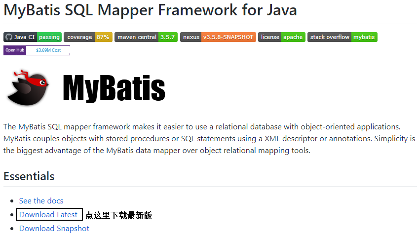
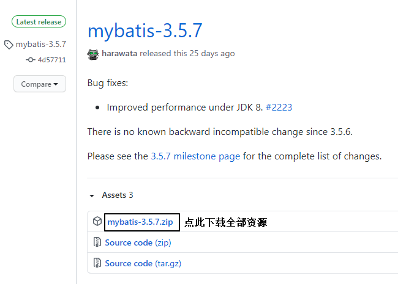
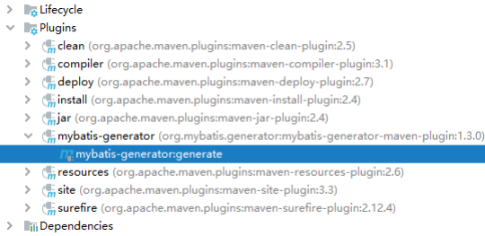
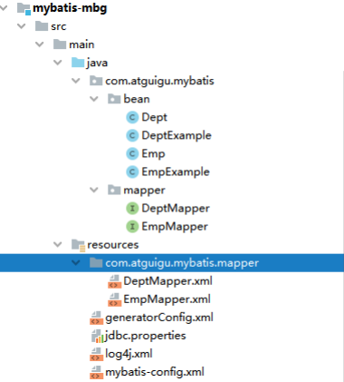

# 一、MyBatis

## 1、MyBatis简介

### 1.1、MyBatis历史

MyBatis最初是Apache的一个开源项目**iBatis**, 2010年6月这个项目由Apache Software Foundation迁移到了Google Code。随着开发团队转投Google Code旗下， iBatis3.x正式更名为MyBatis。代码于2013年11月迁移到Github。

iBatis一词来源于“internet”和“abatis”的组合，是一个基于Java的持久层框架。 iBatis提供的持久层框架包括SQL Maps和Data Access Objects（DAO）。

### 1.2、MyBatis特性

1） MyBatis 是支持定制化 SQL、存储过程以及高级映射的优秀的持久层框架

2） MyBatis 避免了几乎所有的 JDBC 代码和手动设置参数以及获取结果集

3） MyBatis可以使用简单的XML或注解用于配置和原始映射，将接口和Java的POJO（Plain Old Java

Objects，普通的Java对象）映射成数据库中的记录

4） MyBatis 是一个 半自动的ORM（Object Relation Mapping）框架

### 1.3、MyBatis下载

MyBatis下载地址：https://github.com/mybatis/mybatis-3





### 1.4、和其它持久化层技术对比

- JDBC
  - SQL 夹杂在Java代码中耦合度高，导致硬编码内伤
  - 维护不易且实际开发需求中 SQL 有变化，频繁修改的情况多见
  - 代码冗长，开发效率低
- Hibernate 和 JPA
  - 操作简便，开发效率高
  - 程序中的长难复杂 SQL 需要绕过框架
  - 内部自动生产的 SQL，不容易做特殊优化
  - 基于全映射的全自动框架，大量字段的 POJO 进行部分映射时比较困难。
  - 反射操作太多，导致数据库性能下降
- MyBatis
  - 轻量级，性能出色
  - SQL 和 Java 编码分开，功能边界清晰。Java代码专注业务、SQL语句专注数据
  - 开发效率稍逊于HIbernate，但是完全能够接受

# 2、搭建MyBatis

## 2.1、开发环境

IDE：idea 2019.2

构建工具：maven 3.5.4

MySQL版本：MySQL 8

MyBatis版本：MyBatis 3.5.7

> MySQL不同版本的注意事项
>
> 1、驱动类driver-class-name
>
> MySQL 5版本使用jdbc5驱动，驱动类使用：com.mysql.jdbc.Driver
>
> MySQL 8版本使用jdbc8驱动，驱动类使用：com.mysql.cj.jdbc.Driver
>
> 2、连接地址url
>
> MySQL 5版本的url：
>
> jdbc:mysql://localhost:3306/ssm
>
> MySQL 8版本的url：
>
> jdbc:mysql://localhost:3306/ssm?serverTimezone=UTC
>
> 否则运行测试用例报告如下错误：
>
> java.sql.SQLException: The server time zone value 'Öйú±ê׼ʱ¼ä' is unrecognized or
>
> represents more

## 2.2、创建maven工程

**①打包方式：jar**

**②引入依赖**

```xml
<dependencies>
   <!-- Mybatis核心 -->
   <dependency>
       <groupId>org.mybatis</groupId>
       <artifactId>mybatis</artifactId>
       <version>3.5.7</version>
   </dependency>
    
<!-- junit测试 -->
   <dependency>
       <groupId>junit</groupId>
       <artifactId>junit</artifactId>
       <version>4.12</version>
       <scope>test</scope>
   </dependency>
    
<!-- MySQL驱动 -->
   <dependency>
       <groupId>mysql</groupId>
       <artifactId>mysql-connector-java</artifactId>
       <version>8.0.16</version>
   </dependency>
</dependencies>
```

## 2.3、创建MyBatis的核心配置文件

> 习惯上命名为mybatis-config.xml，这个文件名仅仅只是建议，并非强制要求。将来整合Spring
>
> 之后，这个配置文件可以省略，所以大家操作时可以直接复制、粘贴。
>
> 核心配置文件主要用于配置连接数据库的环境以及MyBatis的全局配置信息
>
> 核心配置文件存放的位置是src/main/resources目录下

```xml
<?xml version="1.0" encoding="UTF-8" ?>
<!DOCTYPE configuration
        PUBLIC "-//mybatis.org//DTD Config 3.0//EN"
        "http://mybatis.org/dtd/mybatis-3-config.dtd">
<configuration>
    
	<!--设置连接数据库的环境-->
	<environments default="development">
		<environment id="development">
			<transactionManager type="JDBC"/>
			<dataSource type="POOLED">
				<property name="driver" value="com.mysql.cj.jdbc.Driver"/>
				<property name="url" value="jdbc:mysql://localhost:3306/ssm?serverTimezone=UTC"/>
				<property name="username" value="root"/>
				<property name="password" value="123456"/>
			</dataSource>
		</environment>
	</environments>
<!--引入映射文件-->
<mappers>
	<package name="mappers/UserMapper.xml"/>
</mappers>
</configuration>
```

## 2.4、创建mapper接口

> MyBatis中的mapper接口相当于以前的dao。但是区别在于，mapper仅仅是接口，我们不需要
>
> 提供实现类。

```java
public interface UserMapper {
    
    /**
    * 添加用户信息
    */
    int insertUser();
}
```

## 2.5、创建MyBatis的映射文件

相关概念：**ORM**（**O**bject **R**elationship **M**apping）对象关系映射。

- 对象：Java的实体类对象
- 关系：关系型数据库
- 映射：二者之间的对应关系

| **Java概念** | **数据库概念** |
| ------------ | -------------- |
| 类           | 表             |
| 属性         | 字段/列        |
| 对象         | 记录/行        |

> 1、映射文件的命名规则：
>
> 表所对应的实体类的类名+Mapper.xml
>
> 例如：表t_user，映射的实体类为User，所对应的映射文件为UserMapper.xml
>
> 因此一个映射文件对应一个实体类，对应一张表的操作
>
> MyBatis映射文件用于编写SQL，访问以及操作表中的数据
>
> MyBatis映射文件存放的位置是src/main/resources/mappers目录下
>
> 2、 MyBatis中可以面向接口操作数据，要保证两个一致：
>
> a>mapper接口的全类名和映射文件的命名空间（namespace）保持一致
>
> b>mapper接口中方法的方法名和映射文件中编写SQL的标签的id属性保持一致

```xml
<?xml version="1.0" encoding="UTF-8" ?>
<!DOCTYPE mapper
        PUBLIC "-//mybatis.org//DTD Mapper 3.0//EN"
		"http://mybatis.org/dtd/mybatis-3-mapper.dtd">
<mapper namespace="com.atguigu.mybatis.mapper.UserMapper">
	<!--int insertUser();-->
	<insert id="insertUser">
		insert into t_user values(null,'admin','123456',23,'男','12345@qq.com')
	</insert>
</mapper>
```

## 2.6、通过junit测试功能

```java
//读取MyBatis的核心配置文件
InputStream is = Resources.getResourceAsStream("mybatis-config.xml");
//创建SqlSessionFactoryBuilder对象
SqlSessionFactoryBuilder sqlSessionFactoryBuilder = new SqlSessionFactoryBuilder();
//通过核心配置文件所对应的字节输入流创建工厂类SqlSessionFactory，生产SqlSession对象
SqlSessionFactory sqlSessionFactory = sqlSessionFactoryBuilder.build(is);
//创建SqlSession对象，此时通过SqlSession对象所操作的sql都必须手动提交或回滚事务
//SqlSession sqlSession = sqlSessionFactory.openSession();
//创建SqlSession对象，此时通过SqlSession对象所操作的sql都会自动提交
SqlSession sqlSession = sqlSessionFactory.openSession(true);
//通过代理模式创建UserMapper接口的代理实现类对象
UserMapper userMapper = sqlSession.getMapper(UserMapper.class);
//调用UserMapper接口中的方法，就可以根据UserMapper的全类名匹配元素文件，通过调用的方法名匹配
映射文件中的SQL标签，并执行标签中的SQL语句
int result = userMapper.insertUser();
//sqlSession.commit();
System.out.println("结果："+result);
```

> - SqlSession：代表Java程序和**数据库**之间的**会话**。（HttpSession是Java程序和浏览器之间的会话）
>
> - SqlSessionFactory：是“生产”SqlSession的“工厂”。
>- 工厂模式：如果创建某一个对象，使用的过程基本固定，那么我们就可以把创建这个对象的
> 
> 相关代码封装到一个“工厂类”中，以后都使用这个工厂类来“生产”我们需要的对象。

## 2.7、加入log4j日志功能

### ①加入依赖

```xml
<!-- log4j日志 -->
<dependency>
    <groupId>log4j</groupId>
    <artifactId>log4j</artifactId>
    <version>1.2.17</version>
</dependency>
```

### ②加入log4j的配置文件

> log4j的配置文件名为log4j.xml，存放的位置是src/main/resources目录下

```xml
<?xml version="1.0" encoding="UTF-8" ?>
<!DOCTYPE log4j:configuration SYSTEM "log4j.dtd">
<log4j:configuration xmlns:log4j="http://jakarta.apache.org/log4j/">
	<appender name="STDOUT" class="org.apache.log4j.ConsoleAppender">
		<param name="Encoding" value="UTF-8" />
		<layout class="org.apache.log4j.PatternLayout">
			<param name="ConversionPattern" value="%-5p %d{MM-dd HH:mm:ss,SSS}%m (%F:%L) \n" />
		</layout>
	</appender>
	<logger name="java.sql">
		<level value="debug" />
	</logger>
	<logger name="org.apache.ibatis">
		<level value="info" />
	</logger>
	<root>
		<level value="debug" />
		<appender-ref ref="STDOUT" />
	</root>
</log4j:configuration>
```

> **日志的级别**
>
> FATAL(致命)>ERROR(错误)>WARN(警告)>INFO(信息)>DEBUG(调试)
>
> 从左到右打印的内容越来越详细

# 3、核心配置文件详解

> 核心配置文件中的标签必须按照固定的顺序：
>
> properties?,settings?,typeAliases?,typeHandlers?,objectFactory?,objectWrapperFactory?,reflectorFactory?,plugins?,environments?,databaseIdProvider?,mappers?
>
> ```xml
><?xml version="1.0" encoding="UTF-8" ?>
> <!DOCTYPE configuration
>      PUBLIC "-//mybatis.org//DTD Config 3.0//EN"
>      "http://mybatis.org/dtd/mybatis-3-config.dtd">
>    <configuration>
>    	<!--
>          MyBatis核心配置文件中，标签的顺序：
>          properties?,settings?,typeAliases?,typeHandlers?,
>             objectFactory?,objectWrapperFactory?,reflectorFactory?,
>             plugins?,environments?,databaseIdProvider?,mappers?
>    	-->
>    	<!--引入properties文件-->
> 	<properties resource="jdbc.properties" />
> 	<!--设置类型别名-->
> 	<typeAliases>
> 	<!--
> 		typeAlias：设置某个类型的别名
> 		属性：
> 			type：设置需要设置别名的类型
> 			alias：设置某个类型的别名，若不设置该属性，那么该类型拥有默认的别名，即类名且不区分大小写
> 	-->
> 		<!--<typeAlias type="com.atguigu.mybatis.pojo.User"></typeAlias>-->
> 		<!--以包为单位，将包下所有的类型设置默认的类型别名，即类名且不区分大小写-->
> 		<package name="com.atguigu.mybatis.pojo"/>
> 	</typeAliases>
> 	<!--
> 		environments：配置多个连接数据库的环境
> 		属性：
> 			default：设置默认使用的环境的id
> 	-->
> 	<environments default="development">
>  <!--
> 		environment：配置某个具体的环境
>    		属性：
>    			id：表示连接数据库的环境的唯一标识，不能重复
> 	-->
> 	<environment id="development">
> 		<!--
> 			transactionManager：设置事务管理方式
> 			属性：
> 				type="JDBC|MANAGED"
> 				JDBC：表示当前环境中，执行SQL时，使用的是JDBC中原生的事务管理方式，事务的提交或回滚需要手动处理
> 				MANAGED：被管理，例如Spring
> 		-->
> 			<transactionManager type="JDBC"/>
> 			<!--
> 				dataSource：配置数据源
> 				属性：
>               type：设置数据源的类型
>               type="POOLED|UNPOOLED|JNDI"
>                     POOLED：表示使用数据库连接池缓存数据库连接
>                     UNPOOLED：表示不使用数据库连接池
>                     JNDI：表示使用上下文中的数据源
>    			-->
>    				<dataSource type="POOLED">
>                  <!--设置连接数据库的驱动-->
>                  <property name="driver" value="${jdbc.driver}"/>
>                     <!--设置连接数据库的连接地址-->
>                     <property name="url" value="${jdbc.url}"/>
>                     <!--设置连接数据库的用户名-->
>                     <property name="username" value="${jdbc.username}"/>
>                     <!--设置连接数据库的密码-->
>                     <property name="password" value="${jdbc.password}"/>
>    				</dataSource>
>    			</environment>
>    			<environment id="test">
>              <transactionManager type="JDBC"/>
>           <dataSource type="POOLED">
>                 <property name="driver" value="com.mysql.cj.jdbc.Driver"/>
>                 <property name="url"value="jdbc:mysql://localhost:3306/ssmserverTimezone=UTC"/>
>                 <property name="username" value="root"/>
>                 <property name="password" value="123456"/>
>    			</dataSource>
>    		</environment>
> 	</environments>
>    	<!--引入映射文件-->
>    	<mappers>
> 	<!--<mapper resource="mappers/UserMapper.xml"/>-->
> 	<!--
>        以包为单位引入映射文件
>           要求：
>             1、mapper接口所在的包要和映射文件所在的包一致
>             2、mapper接口要和映射文件的名字一致
>    	-->
>    		<package name="com.atguigu.mybatis.mapper"/>
>    	</mappers>
>    </configuration>
>    ```

# 4、MyBatis的增删改查

## 4.1、新增

```xml
<!--int insertUser();-->
<insert id="insertUser">
	insert into t_user values(null,'admin','123456',23,'男')
</insert>
```

## 4.2、删除

```xml
<!--int deleteUser();-->
<delete id="deleteUser">
	delete from t_user where id = 7
</delete>
```

## 4.3、修改

```xml
<!--int updateUser();-->
<update id="updateUser">
	update t_user set username='ybc',password='123' where id = 6
</update>
```

## 4.4、查询一个实体类对象

```xml
<!--User getUserById();-->
<select id="getUserById" resultType="com.atguigu.mybatis.bean.User">
	select * from t_user where id = 2
</select>
```

## 4.5、查询list集合

```xml
<!--List<User> getUserList();-->
<select id="getUserList" resultType="com.atguigu.mybatis.bean.User">
	select * from t_user
</select>
```

> 注意：
>
> 1、查询的标签select必须设置属性resultType或resultMap，用于设置实体类和数据库表的映射关系
>
> resultType：自动映射，用于属性名和表中字段名一致的情况
>
> resultMap：自定义映射，用于一对多或多对一或字段名和属性名不一致的情况

# 5、MyBatis获取参数值的两种方式

> MyBatis获取参数值的两种方式：`${}`和`#{}` 
>
> `${}`的本质就是字符串拼接，`#{}`的本质就是占位符赋值
>
> `${}`使用字符串拼接的方式拼接sql，若为字符串类型或日期类型的字段进行赋值时，需要手动加单引号；
>
> 但是`#{}`使用占位符赋值的方式拼接sql，此时为字符串类型或日期类型的字段进行赋值时，可以自动添加单引号；

## 5.1、单个字面量类型的参数

> 若mapper接口中的方法参数为单个的字面量类型，此时可以使用`${}`和`#{}`以任意的名称获取参数的值，注意`${}`需要手动加单引号
>

## 5.2、多个字面量类型的参数

> 若mapper接口中的方法参数为多个时，此时MyBatis会自动将这些参数放在一个map集合中，以arg0,arg1...为键，以参数为值；以param1,param2...为键，以参数为值；因此只需要通过`${}`和`#{}`访问map集合的键就可以获取相对应的值，注意${}需要手动加单引号
>

## 5.3、map集合类型的参数

> 若mapper接口中的方法需要的参数为多个时，此时可以手动创建map集合，将这些数据放在map中只需要通过`${}`和`#{}`访问map集合的键就可以获取相对应的值，注意${}需要手动加单引号
>

## 5.4、实体类类型的参数

> 若mapper接口中的方法参数为实体类对象时，此时可以使用`${}`和`#{}`，通过访问实体类对象中的属性名获取属性值，注意`${}`需要手动加单引号
>

## 5.5、使用@Param标识参数

> 可以通过@Param注解标识mapper接口中的方法参数，此时，会将这些参数放在map集合中，以@Param注解的value属性值为键，以参数为值；以 param1,param2... 为键，以参数为值；只需要通过`${}`和`#{}`访问map集合的键就可以获取相对应的值，注意${}需要手动加单引号
>

# 6、MyBatis的各种查询功能

## 6.1、查询一个实体类对象

```java
/**
 * 根据用户id查询用户信息
 * @param id
 * @return
 */
User getUserById(@Param("id") int id);
```

```xml
<!--User getUserById(@Param("id") int id);-->
<select id="getUserById" resultType="User">
	select * from t_user where id = #{id}
</select>
```

## 6.2、查询一个list集合

```java
/**
 * 查询所有用户信息
 * @return
 */
List<User> getUserList();
```

```xml
<!--List<User> getUserList();-->
<select id="getUserList" resultType="User">
	select * from t_user
</select>
```

> 当查询的数据为多条时，不能使用实体类作为返回值，否则会抛出异常
>
> TooManyResultsException；但是若查询的数据只有一条，可以使用实体类或集合作为返回值

## 6.3、查询单个数据

```java
/**
 * 查询用户的总记录数
 * @return
 * 在MyBatis中，对于Java中常用的类型都设置了类型别名
 * 例如： java.lang.Integer-->int|integer
 * 例如： int-->_int|_integer
 * 例如： Map-->map,List-->list
 */
int getCount();
```

```xml
<!--int getCount();-->
<select id="getCount" resultType="_integer">
	select count(id) from t_user
</select>
```

## 6.4、查询一条数据为map集合

```java
/**
 * 根据用户id查询用户信息为map集合
 * @param id
 * @return
 */
Map<String, Object> getUserToMap(@Param("id") int id);
```

```xml
<!--Map<String, Object> getUserToMap(@Param("id") int id);-->
<!--结果： {password=123456, sex=男 , id=1, age=23, username=admin}-->
<select id="getUserToMap" resultType="map">
	select * from t_user where id = #{id}
</select>
```

## 6.5、查询多条数据为map集合

### ①方式一

```java
/**
 * 查询所有用户信息为map集合
 * @return
 * 将表中的数据以map集合的方式查询，一条数据对应一个map；若有多条数据，就会产生多个map集合，此时可以将这些map放在一个list集合中获取
 */
List<Map<String, Object>> getAllUserToMap();
```

```xml
<!--Map<String, Object> getAllUserToMap();-->
<select id="getAllUserToMap" resultType="map">
	select * from t_user
</select>
```

### ②方式二

```java
/**
 * 查询所有用户信息为map集合
 * @return
 * 将表中的数据以map集合的方式查询，一条数据对应一个map；若有多条数据，就会产生多个map集合，并且最终要以一个map的方式返回数据，此时需要通过@MapKey注解设置map集合的键，值是每条数据所对应的map集合
 */
@MapKey("id")
Map<String, Object> getAllUserToMap();
```

```xml
<!--Map<String, Object> getAllUserToMap();-->
<!--
{
    1={password=123456, sex=男, id=1, age=23, username=admin},
    2={password=123456, sex=男, id=2, age=23, username=张三},
    3={password=123456, sex=男, id=3, age=23, username=张三}
}
-->
<select id="getAllUserToMap" resultType="map">
	select * from t_user
</select>
```

# 7、特殊SQL的执行

## 7.1、模糊查询

```java
/**
 * 测试模糊查询
 * @param mohu
 * @return
 */
List<User> testMohu(@Param("mohu") String mohu);
```

```xml
<!--List<User> testMohu(@Param("mohu") String mohu);-->
<select id="testMohu" resultType="User">
    <!--select * from t_user where username like '%${mohu}%'-->
    <!--select * from t_user where username like concat('%',#{mohu},'%')-->
	select * from t_user where username like "%"#{mohu}"%"
</select>
```

## 7.2、批量删除

```java
/**
 * 批量删除
 * @param ids
 * @return
 */
int deleteMore(@Param("ids") String ids);
```

```xml
<!--int deleteMore(@Param("ids") String ids);-->
<delete id="deleteMore">
	delete from t_user where id in (${ids})
</delete>
```

## 7.3、动态设置表名

```java
/**
 * 动态设置表名，查询所有的用户信息
 * @param tableName
 * @return
 */
List<User> getAllUser(@Param("tableName") String tableName);
```

```xml
<!--List<User> getAllUser(@Param("tableName") String tableName);-->
<select id="getAllUser" resultType="User">
	select * from ${tableName}
</select>
```

## 7.4、添加功能获取自增的主键

> 场景模拟：
>
> t_clazz(clazz_id,clazz_name)
>
> t_student(student_id,student_name,clazz_id)
>
> 1、添加班级信息
>
> 2、获取新添加的班级的id
>
> 3、为班级分配学生，即将某学的班级id修改为新添加的班级的id

```java
/**
 * 添加用户信息
 * @param user
 * @return
 * useGeneratedKeys：设置使用自增的主键
 * keyProperty：因为增删改有统一的返回值是受影响的行数，因此只能将获取的自增的主键放在传输的参数user对象的某个属性中
 */
int insertUser(User user);
```

```xml
<!--int insertUser(User user);-->
<insert id="insertUser" useGeneratedKeys="true" keyProperty="id">
	insert into t_user values(null,#{username},#{password},#{age},#{sex})
</insert>
```

# 8、自定义映射resultMap

## 8.1、resultMap处理字段和属性的映射关系

> 若字段名和实体类中的属性名不一致，则可以通过resultMap设置自定义映射

```xml
<!--
    resultMap：设置自定义映射
    属性：
    id：表示自定义映射的唯一标识
    type：查询的数据要映射的实体类的类型
    子标签：
    id：设置主键的映射关系
    result：设置普通字段的映射关系
    association：设置多对一的映射关系
    collection：设置一对多的映射关系
    属性：
    property：设置映射关系中实体类中的属性名
    column：设置映射关系中表中的字段名
-->
<resultMap id="userMap" type="User">
    <id property="id" column="id"></id>
    <result property="userName" column="user_name"></result>
    <result property="password" column="password"></result>
    <result property="age" column="age"></result>
    <result property="sex" column="sex"></result>
</resultMap>
<!--List<User> testMohu(@Param("mohu") String mohu);-->
<select id="testMohu" resultMap="userMap">
	<!--select * from t_user where username like '%${mohu}%'-->
	select id,user_name,password,age,sex from t_user where user_name likeconcat('%',#{mohu},'%')
</select>
```

> 若字段名和实体类中的属性名不一致，但是字段名符合数据库的规则（使用_），实体类中的属性名符合Java的规则（使用驼峰），此时也可通过以下两种方式处理字段名和实体类中的属性的映射关系
>
> a）可以通过为字段起别名的方式，保证和实体类中的属性名保持一致
>
> b）可以在MyBatis的核心配置文件中设置一个全局配置信 mapUnderscoreToCamelCase，可以在查询表中数据时，自动将_类型的字段名转换为驼峰
>
> 例如：字段名user_name，设置了mapUnderscoreToCamelCase，此时字段名就会转换为 userName
>

## 8.2、多对一映射处理

> 场景模拟：查询员工信息以及员工所对应的部门信息
>

### 8.2.1、级联方式处理映射关系

```xml
<resultMap id="empDeptMap" type="Emp">
    <id column="eid" property="eid"></id>
    <result column="ename" property="ename"></result>
    <result column="age" property="age"></result>
    <result column="sex" property="sex"></result>
    <result column="did" property="dept.did"></result>
    <result column="dname" property="dept.dname"></result>
</resultMap>
<!--Emp getEmpAndDeptByEid(@Param("eid") int eid);-->
<select id="getEmpAndDeptByEid" resultMap="empDeptMap">
	select emp.*,dept.* from t_emp emp left join t_dept dept on emp.did =dept.did where emp.eid = #{eid}
</select>
```

### 8.2.2、使用association处理映射关系

```xml
<resultMap id="empDeptMap" type="Emp">
    <id column="eid" property="eid"></id>
    <result column="ename" property="ename"></result>
    <result column="age" property="age"></result>
    <result column="sex" property="sex"></result>
    <association property="dept" javaType="Dept">
        <id column="did" property="did"></id>
        <result column="dname" property="dname"></result>
	</association>
</resultMap>
<!--Emp getEmpAndDeptByEid(@Param("eid") int eid);-->
<select id="getEmpAndDeptByEid" resultMap="empDeptMap">
	select emp.*,dept.* from t_emp emp left join t_dept dept on emp.did =dept.did where emp.eid = #{eid}
</select>
```

### 8.2.3、分步查询

#### ①  查询员工信息

```java
/**
* 通过分步查询查询员工信息
* @param eid
* @return
*/
Emp getEmpByStep(@Param("eid") int eid);
```

```xml
<resultMap id="empDeptStepMap" type="Emp">
    <id column="eid" property="eid"></id>
    <result column="ename" property="ename"></result>
    <result column="age" property="age"></result>
    <result column="sex" property="sex"></result>
	<!--
        select：设置分步查询，查询某个属性的值的sql的标识（namespace.sqlId）
        column：将sql以及查询结果中的某个字段设置为分步查询的条件
	-->
	<association property="dept"select="com.atguigu.MyBatis.mapper.DeptMapper.getEmpDeptByStep" column="did">
</association>
</resultMap>
<!--Emp getEmpByStep(@Param("eid") int eid);-->
<select id="getEmpByStep" resultMap="empDeptStepMap">
	select * from t_emp where eid = #{eid}
</select>
```

#### ②  根据员工所对应的部门id查询部门信息

```java
/**
 * 分步查询的第二步： 根据员工所对应的did查询部门信息
 * @param did
 * @return
 */
Dept getEmpDeptByStep(@Param("did") int did);
```

```xml
<!--Dept getEmpDeptByStep(@Param("did") int did);-->
<select id="getEmpDeptByStep" resultType="Dept">
	select * from t_dept where did = #{did}
</select>
```

## 8.3、一对多映射处理

### 8.3.1、collection

```java
/**
 * 根据部门id查新部门以及部门中的员工信息
 * @param did
 * @return
 */
Dept getDeptEmpByDid(@Param("did") int did);
```

```xml
<resultMap id="deptEmpMap" type="Dept">
    <id property="did" column="did"></id>
    <result property="dname" column="dname"></result>
    <!--
		ofType：设置collection标签所处理的集合属性中存储数据的类型
	-->
	<collection property="emps" ofType="Emp">
        <id property="eid" column="eid"></id>
        <result property="ename" column="ename"></result>
        <result property="age" column="age"></result>
        <result property="sex" column="sex"></result>
	</collection>
</resultMap>
<!--Dept getDeptEmpByDid(@Param("did") int did);-->
<select id="getDeptEmpByDid" resultMap="deptEmpMap">
	select dept.*,emp.* from t_dept dept left join t_emp emp on dept.did =emp.did where dept.did = #{did}
</select>
```

### 8.3.2、分步查询

#### ①  查询部门信息

```java
/**
 * 分步查询部门和部门中的员工
 * @param did
 * @return
 */
Dept getDeptByStep(@Param("did") int did);
```

```xml
<resultMap id="deptEmpStep" type="Dept">
    <id property="did" column="did"></id>
    <result property="dname" column="dname"></result>
    <collection property="emps" fetchType="eager"select="com.atguigu.MyBatis.mapper.EmpMapper.getEmpListByDid" column="did">
	</collection>
</resultMap>
<!--Dept getDeptByStep(@Param("did") int did);-->
<select id="getDeptByStep" resultMap="deptEmpStep">
	select * from t_dept where did = #{did}
</select>
```

#### ②  根据部门id查询部门中的所有员工

```java
/**
 * 根据部门id查询员工信息
 * @param did
 * @return
 */
List<Emp> getEmpListByDid(@Param("did") int did);
```

```xml
<!--List<Emp> getEmpListByDid(@Param("did") int did);-->
<select id="getEmpListByDid" resultType="Emp">
	select * from t_emp where did = #{did}
</select>
```

> 分步查询的优点：可以实现延迟加载，但是必须在核心配置文件中设置全局配置信息：
>
> lazyLoadingEnabled：延迟加载的全局开关。当开启时，所有关联对象都会延迟加载
>
> aggressiveLazyLoading：当开启时，任何方法的调用都会加载该对象的所有属性。否则，每个属性会按需加载
>
> 此时就可以实现按需加载，获取的数据是什么，就只会执行相应的sql。此时可通过 association 和 collection 中的 fetchType 属性设置当前的分步查询是否使用延迟加载， fetchType="lazy(延迟加载)|eager(立即加载)"
>

# 9、动态SQL

> Mybatis框架的动态SQL技术是一种根据特定条件动态拼装SQL语句的功能，它存在的意义是为了解决 拼接SQL语句字符串时的痛点问题。
>

## 9.1、if

> if标签可通过test属性的表达式进行判断，若表达式的结果为true，则标签中的内容会执行；反之标签中的内容不会执行
>

```xml
<!--List<Emp> getEmpListByCondition(Emp emp);-->
<select id="getEmpListByMoreTJ" resultType="Emp">
    select * from t_emp where 1=1
    <if test="ename != '' and ename != null">
		and ename = #{ename}
	</if>
	<if test="age != '' and age != null">
		and age = #{age}
	</if>
	<if test="sex != '' and sex != null">
		and sex = #{sex}
	</if>
</select>
```

## 9.2、where

> where和if一般结合使用：
>
> a）若 where 标签中的 if 条件都不满足，则 where 标签没有任何功能，即不会添加 where 关键字
>
> b）若 where 标签中的 if 条件满足，则 where 标签会自动添加 where 关键字，并将条件最前方多余的 and 去掉
>
> 注意：where标签不能去掉条件最后多余的and

```xml
<select id="getEmpListByMoreTJ2" resultType="Emp">
	select * from t_emp
	<where>
		<if test="ename != '' and ename != null">
			ename = #{ename}
		</if>
		<if test="age != '' and age != null">
			and age = #{age}
		</if>
		<if test="sex != '' and sex != null">
			and sex = #{sex}
		</if>
	</where>
</select>
```

## 9.3、trim

> trim用于去掉或添加标签中的内容常用属性：
>
> `prefix`：在trim标签中的内容的前面添加某些内容
>
> `prefixOverrides`：在trim标签中的内容的前面去掉某些内容
>
> `suffix`：在trim标签中的内容的后面添加某些内容
>
> `suffixOverrides`：在trim标签中的内容的后面去掉某些内容

```xml
<select id="getEmpListByMoreTJ" resultType="Emp">
	select * from t_emp
	<trim prefix="where" suffixOverrides="and">
		<if test="ename != '' and ename != null">
			ename = #{ename} and
		</if>
		<if test="age != '' and age != null">
			age = #{age} and
		</if>
		<if test="sex != '' and sex != null">
			sex = #{sex}
		</if>
	</trim>
</select>
```

## 9.4、choose、when、otherwise

> choose、when、 otherwise 相当于 if...else if..else

```xml
<!--List<Emp> getEmpListByChoose(Emp emp);-->
<select id="getEmpListByChoose" resultType="Emp">
	select <include refid="empColumns"></include> from t_emp
	<where>
		<choose>
			<when test="ename != '' and ename != null">
				ename = #{ename}
			</when>
			<when test="age != '' and age != null">
				age = #{age}
			</when>
			<when test="sex != '' and sex != null">
				sex = #{sex}
			</when>
			<when test="email != '' and email != null">
				email = #{email}
			</when>
		</choose>
	</where>
</select>
```

## 9.5、foreach

```xml
<!--int insertMoreEmp(List<Emp> emps);-->
<insert id="insertMoreEmp">
	insert into t_emp values
	<foreach collection="emps" item="emp" separator=",">
		(null,#{emp.ename},#{emp.age},#{emp.sex},#{emp.email},null)
	</foreach>
</insert>
<!--int deleteMoreByArray(int[] eids);-->
<delete id="deleteMoreByArray">
	delete from t_emp where
	<foreach collection="eids" item="eid" separator="or">
		eid = #{eid}
	</foreach>
</delete>
<!--int deleteMoreByArray(int[] eids);-->
<delete id="deleteMoreByArray">
	delete from t_emp where eid in
	<foreach collection="eids" item="eid" separator="," open="(" close=")">
		#{eid}
	</foreach>
</delete>
```

## 9.6、SQL片段

> sql片段，可以记录一段公共sql片段，在使用的地方通过include标签进行引入

```xml
<sql id="empColumns">
	eid,ename,age,sex,did
</sql>
select <include refid="empColumns"></include> from t_emp
```

# 10、MyBatis的缓存

## 10.1、MyBatis的一级缓存

> 一级缓存是SqlSession级别的，通过同一个SqlSession查询的数据会被缓存，下次查询相同的数据，就会从缓存中直接获取，不会从数据库重新访问
>
> 使一级缓存失效的四种情况：
>
> 1) 不同的SqlSession对应不同的一级缓存
>
> 2) 同一个SqlSession但是查询条件不同
>
> 3) 同一个SqlSession两次查询期间执行了任何一次增删改操作
>
> 4) 同一个SqlSession两次查询期间手动清空了缓存

## 10.2、MyBatis的二级缓存

> 二级缓存是SqlSessionFactory级别，通过同一个SqlSessionFactory创建的SqlSession查询的结果会被缓存；此后若再次执行相同的查询语句，结果就会从缓存中获取二级缓存开启的条件：
>
> a）在核心配置文件中，设置全局配置属性cacheEnabled="true"，默认为true，不需要设置
>
> b）在映射文件中设置标签 <cache/> 
>
> c）二级缓存必须在SqlSession关闭或提交之后有效
>
> d）查询的数据所转换的实体类类型必须实现序列化的接口使二级缓存失效的情况：两次查询之间执行了任意的增删改，会使一级和二级缓存同时失效
>

## 10.3、二级缓存的相关配置

在mapper配置文件中添加的cache标签可以设置一些属性：

#### ①  eviction属性：缓存回收策略，默认的是 LRU。

> LRU（Least Recently Used） – 最近最少使用的：移除最长时间不被使用的对象。
>
> FIFO（First in First out） – 先进先出：按对象进入缓存的顺序来移除它们。
>
> SOFT – 软引用：移除基于垃圾回收器状态和软引用规则的对象。
>
> WEAK – 弱引用：更积极地移除基于垃圾收集器状态和弱引用规则的对象。
>

#### ②  flushInterval属性：刷新间隔，单位毫秒

> 默认情况是不设置，也就是没有刷新间隔，缓存仅仅调用语句时刷新
>

#### ③  size属性：引用数目，正整数

> 代表缓存最多可以存储多少个对象，太大容易导致内存溢出
>

#### ④  readOnly属性：只读， true/false

> true：只读缓存；会给所有调用者返回缓存对象的相同实例。因此这些对象不能被修改。这提供了 很重要的性能优势；
>
> false：读写缓存；会返回缓存对象的拷贝（通过序列化）。这会慢一些，但是安全，因此默认是 false。
>

## 10.4、MyBatis缓存查询的顺序

> 先查询二级缓存，因为二级缓存中可能会有其他程序已经查出来的数据，可以拿来直接使用。
>
> 如果二级缓存没有命中，再查询一级缓存；
>
> 如果一级缓存也没有命中，则查询数据库
>
> SqlSession关闭之后，一级缓存中的数据会写入二级缓存
>

## 10.5、整合第三方缓存EHCache

### 10.5.1、添加依赖

```xml
<!-- Mybatis EHCache整合包 -->
<dependency>
    <groupId>org.mybatis.caches</groupId>
    <artifactId>mybatis-ehcache</artifactId>
    <version>1.2.1</version>
</dependency>
<!-- slf4j日志门面的一个具体实现 -->
<dependency>
    <groupId>ch.qos.logback</groupId>
    <artifactId>logback-classic</artifactId>
    <version>1.2.3</version>
</dependency>
```

### 10.5.2、各jar包功能

| **jar包名称**   | **作用**                        |
| --------------- | ------------------------------- |
| mybatis-ehcache | Mybatis和EHCache的整合包        |
| ehcache         | EHCache核心包                   |
| slf4j-api       | SLF4J日志门面包                 |
| logback-classic | 支持SLF4J门面接口的一个具体实现 |

### 10.5.3、创建EHCache的配置文件ehcache.xml

```xml
<?xml version="1.0" encoding="utf-8" ?>
<ehcache xmlns:xsi="http://www.w3.org/2001/XMLSchema-instance"
xsi:noNamespaceSchemaLocation="../config/ehcache.xsd">
	<!-- 磁盘保存路径 -->
	<diskStore path="D:\atguigu\ehcache"/>
	<defaultCache
        maxElementsInMemory="1000"
        maxElementsOnDisk="10000000"
        eternal="false"
        overflowToDisk="true"
        timeToIdleSeconds="120"
        timeToLiveSeconds="120"
        diskExpiryThreadIntervalSeconds="120"
        memoryStoreEvictionPolicy="LRU">
	</defaultCache>
</ehcache>
```

### 10.5.4、设置二级缓存的类型

```xml
<cache type="org.mybatis.caches.ehcache.EhcacheCache"/>
```

### 10.5.5、加入logback日志

> 存在SLF4J时，作为简易日志的log4j将失效，此时我们需要借助SLF4J的具体实现logback来打印日志。 创建logback的配置文件logback.xml

```xml
<?xml version="1.0" encoding="UTF-8"?>
<configuration debug="true">
	<!-- 指定日志输出的位置 -->
	<appender name="STDOUT" class="ch.qos.logback.core.ConsoleAppender">
		<encoder>
            <!-- 日志输出的格式 -->
            <!-- 按照顺序分别是： 时间、日志级别、线程名称、打印日志的类、日志主体内容、换行-->
			<pattern>[%d{HH:mm:ss.SSS}] [%-5level] [%thread] [%logger][%msg]%n</pattern>
		</encoder>
	</appender>
    <!-- 设置全局日志级别。日志级别按顺序分别是： DEBUG、INFO、WARN、ERROR -->
    <!-- 指定任何一个日志级别都只打印当前级别和后面级别的日志。 -->
    <root level="DEBUG">
		<!-- 指定打印日志的appender，这里通过“STDOUT”引用了前面配置的appender -->
		<appender-ref ref="STDOUT" />
	</root>
	<!-- 根据特殊需求指定局部日志级别 -->
	<logger name="com.atguigu.crowd.mapper" level="DEBUG"/>
</configuration>
```

### 10.5.6、EHCache配置文件说明

| **属性名**                      | **是否必须** | **作用**                                                     |
| ------------------------------- | ------------ | ------------------------------------------------------------ |
| maxElementsInMemory             | 是           | 在内存中缓存的element的最大数目                              |
| maxElementsOnDisk               | 是           | 在磁盘上缓存的element的最大数目，若是0表示无穷大             |
| eternal                         | 是           | 设定缓存的elements是否永远不过期。 如果为true，则缓存的数据始终有效， 如果为false那么还要根据timeToIdleSeconds、timeToLiveSeconds判断 |
| overflowToDisk                  | 是           | 设定当内存缓存溢出的时候是否将过期的element缓存到磁盘上      |
| timeToIdleSeconds               | 否           | 当缓存在EhCache中的数据前后两次访问的时间超过timeToIdleSeconds的属性取值时， 这些数据便会删除，默认值是0,也就是可闲置时间无穷大 |
| timeToLiveSeconds               | 否           | 缓存element的有效生命期，默认是0.,也就是element存活时间无穷大 |
| diskSpoolBufferSizeMB           | 否           | DiskStore(磁盘缓存)的缓存区大小。默认是30MB。每个Cache都应该有自己的一个缓冲区 |
| diskPersistent                  | 否           | 在VM重启的时候是否启用磁盘保存EhCache中的数据，默认是false。 |
| diskExpiryThreadIntervalSeconds | 否           | 磁盘缓存的清理线程运行间隔，默认是120秒。每个120s， 相应的线程会进行一次EhCache中数据的清理工作 |
| memoryStoreEvictionPolicy       | 否           | 当内存缓存达到最大，有新的element加入的时候， 移除缓存中element的策略。 默认是LRU （最近最少使用），可选的有LFU （最不常使用）和FIFO （先进先出） |

# 11、MyBatis的逆向工程

> 正向工程：先创建Java实体类，由框架负责根据实体类生成数据库表。 Hibernate是支持正向工程的。
>
> 逆向工程：先创建数据库表，由框架负责根据数据库表，反向生成如下资源：
>
> - Java实体类
>- Mapper接口
> - Mapper映射文件

## 11.1、创建逆向工程的步骤

### ①  添加依赖和插件

```xml
<!-- 依赖MyBatis核心包 -->
<dependencies>
	<dependency>
        <groupId>org.mybatis</groupId>
        <artifactId>mybatis</artifactId>
        <version>3.5.7</version>
	</dependency>
	<!-- junit测试 -->
	<dependency>
	<groupId>junit</groupId>
        <artifactId>junit</artifactId>
        <version>4.12</version>
        <scope>test</scope>
	</dependency>
	<!-- log4j日志 -->
	<dependency>
        <groupId>log4j</groupId>
        <artifactId>log4j</artifactId>
        <version>1.2.17</version>
	</dependency>
	<dependency>
        <groupId>mysql</groupId>
        <artifactId>mysql-connector-java</artifactId>
        <version>8.0.16</version>
	</dependency>
</dependencies>
<!-- 控制Maven在构建过程中相关配置 -->
<build>
	<!-- 构建过程中用到的插件 -->
	<plugins>
		<!-- 具体插件，逆向工程的操作是以构建过程中插件形式出现的 -->
		<plugin>
            <groupId>org.mybatis.generator</groupId>
            <artifactId>mybatis-generator-maven-plugin</artifactId>
            <version>1.3.0</version>
			<!-- 插件的依赖 -->
			<dependencies>
				<!-- 逆向工程的核心依赖 -->
				<dependency>
                    <groupId>org.mybatis.generator</groupId>
                    <artifactId>mybatis-generator-core</artifactId>
                    <version>1.3.2</version>
				</dependency>
				<!-- MySQL驱动 -->
				<dependency>
                    <groupId>mysql</groupId>
                    <artifactId>mysql-connector-java</artifactId>
                    <version>8.0.16</version>
				</dependency>
			</dependencies>
		</plugin>
	</plugins>
</build>
```

### ②  创建MyBatis的核心配置文件

### ③  创建逆向工程的配置文件

> 文件名必须是：generatorConfig.xml

```xml
<?xml version="1.0" encoding="UTF-8"?>
<!DOCTYPE generatorConfiguration
        PUBLIC "-//mybatis.org//DTD MyBatis Generator Configuration 1.0//EN"
        "http://mybatis.org/dtd/mybatis-generator-config_1_0.dtd">
<generatorConfiguration>
	<!--
			targetRuntime: 执行生成的逆向工程的版本
                MyBatis3Simple: 生成基本的CRUD（清新简洁版）
                MyBatis3: 生成带条件的CRUD（奢华尊享版）
	-->
	<context id="DB2Tables" targetRuntime="MyBatis3">
		<!-- 数据库的连接信息 -->
		<jdbcConnection driverClass="com.mysql.cj.jdbc.Driver"
						connectionURL="jdbc:mysql://localhost:3306/mybatis?serverTimezone=UTC"
						userId="root"
						password="123456">
		</jdbcConnection>
		<!-- javaBean的生成策略-->
		<javaModelGenerator targetPackage="com.atguigu.mybatis.pojo"targetProject=".\src\main\java">
            <property name="enableSubPackages" value="true" />
            <property name="trimStrings" value="true" />
		</javaModelGenerator>
		<!-- SQL映射文件的生成策略 -->
		<sqlMapGenerator targetPackage="com.atguigu.mybatis.mapper"targetProject=".\src\main\resources">
			<property name="enableSubPackages" value="true" />
		</sqlMapGenerator>
		<!-- Mapper接口的生成策略 -->
		<javaClientGenerator type="XMLMAPPER"targetPackage="com.atguigu.mybatis.mapper" targetProject=".\src\main\java">
			<property name="enableSubPackages" value="true" />
		</javaClientGenerator>
        <!-- 逆向分析的表 -->
        <!-- tableName设置为*号，可以对应所有表，此时不写domainObjectName -->
        <!-- domainObjectName属性指定生成出来的实体类的类名 -->
        <table tableName="t_emp" domainObjectName="Emp"/>
        <table tableName="t_dept" domainObjectName="Dept"/>
	</context>
</generatorConfiguration>
```

### ④  执行MBG插件的generate目标



### ⑤  效果



## 11.2、QBC查询

```java
@Test
public void testMBG(){
    try {
		InputStream is = Resources.getResourceAsStream("mybatis-config.xml");
		SqlSessionFactory sqlSessionFactory = new
		SqlSessionFactoryBuilder().build(is);
		SqlSession sqlSession = sqlSessionFactory.openSession(true);
		EmpMapper mapper = sqlSession.getMapper(EmpMapper.class);
        //查询所有数据
        /*List<Emp> list = mapper.selectByExample(null);
        list.forEach(emp -> System.out.println(emp));*/
        //根据条件查询
        /*EmpExample example = new EmpExample();
        example.createCriteria().andEmpNameEqualTo("张三").andAgeGreaterThanOrEqualTo(20);
        example.or().andDidIsNotNull();
		List<Emp> list = mapper.selectByExample(example);
        list.forEach(emp -> System.out.println(emp));*/
        mapper.updateByPrimaryKeySelective(newEmp(1,"admin",22,null,"456@qq.com",3));
	} catch (IOException e) {
		e.printStackTrace();
	}
}
```

# 12、分页插件

limit index,pageSize

pageSize：每页显示的条数

pageNum：当前页的页码

index：当前页的起始索引，index=(pageNum-1)*pageSize

count：总记录数

totalPage：总页数

totalPage = count / pageSize;

if(count % pageSize != 0){

totalPage += 1;

}

pageSize=4，pageNum=1，index=0 limit 0,4

pageSize=4，pageNum=3，index=8 limit 8,4

pageSize=4，pageNum=6，index=20 limit 8,4


首页 上一页 2 3 4 5 6 下一页 末页

## 12.1、分页插件的使用步骤

### ①  添加依赖

```xml
<dependency>
    <groupId>com.github.pagehelper</groupId>
    <artifactId>pagehelper</artifactId>
    <version>5.2.0</version>
</dependency>
```

### ②  配置分页插件

在 MyBatis 的核心配置文件中配置插件 

```xml
<plugins>
    <!--设置分页插件-->
    <plugin interceptor="com.github.pagehelper.PageInterceptor"></plugin>
</plugins>	
```

## 12.2、分页插件的使用

a）在查询功能之前使用PageHelper.startPage(int pageNum, int pageSize)开启分页功能

> pageNum：当前页的页码
>
> pageSize：每页显示的条数

b）在查询获取list集合之后，使用PageInfo<T> pageInfo = new PageInfo<>(List<T> list, int

navigatePages)获取分页相关数据

> list：分页之后的数据
>
> navigatePages：导航分页的页码数

c）分页相关数据

> PageInfo{
>
> pageNum=8, pageSize=4, size=2, startRow=29, endRow=30, total=30, pages=8,
>
> list=Page{count=true, pageNum=8, pageSize=4, startRow=28, endRow=32, total=30,
>
> pages=8, reasonable=false, pageSizeZero=false},
>
> prePage=7, nextPage=0, isFirstPage=false, isLastPage=true, hasPreviousPage=true,
>
> hasNextPage=false, navigatePages=5, navigateFirstPage4, navigateLastPage8,
>
> navigatepageNums=[4, 5, 6, 7, 8]
>
> }
>
> pageNum：当前页的页码
>
> pageSize：每页显示的条数
>
> size：当前页显示的真实条数
>
> total：总记录数
>
> pages：总页数
>
> prePage：上一页的页码
>
> nextPage：下一页的页码
>
> isFirstPage/isLastPage：是否为第一页/最后一页
>
> hasPreviousPage/hasNextPage：是否存在上一页/下一页
>
> navigatePages：导航分页的页码数
>
> navigatepageNums：导航分页的页码，[1,2,3,4,5]