# 

# Chr 1 SpringBoot 基础

# 1. 系统要求

- Java 8 & 兼容java14
- Maven 3.3+
- idea 2019.1.2

## 1.1 maven设置

```xml
<mirrors>
      <mirror>
        <id>nexus-aliyun</id>
        <mirrorOf>central</mirrorOf>
        <name>Nexus aliyun</name>
        <url>http://maven.aliyun.com/nexus/content/groups/public</url>
      </mirror>
  </mirrors>
 
  <profiles>
         <profile>
              <id>jdk-1.8</id>
              <activation>
                <activeByDefault>true</activeByDefault>
                <jdk>1.8</jdk>
              </activation>
              <properties>
                <maven.compiler.source>1.8</maven.compiler.source>
                <maven.compiler.target>1.8</maven.compiler.target>
                <maven.compiler.compilerVersion>1.8</maven.compiler.compilerVersion>
              </properties>
         </profile>
  </profiles>
```

# 2、HelloWorld

> 需求：浏览发送/hello请求，响应 Hello，Spring Boot 2 

## 2.1、创建maven工程

## 2.2、引入依赖

```xml
<parent>
        <groupId>org.springframework.boot</groupId>
        <artifactId>spring-boot-starter-parent</artifactId>
        <version>2.3.4.RELEASE</version>
    </parent>


    <dependencies>
        <dependency>
            <groupId>org.springframework.boot</groupId>
            <artifactId>spring-boot-starter-web</artifactId>
        </dependency>

    </dependencies>
```

## 2.3、创建主程序

```java
/**
 * 主程序类
 * @SpringBootApplication：这是一个SpringBoot应用
 */
@SpringBootApplication
public class MainApplication {

    public static void main(String[] args) {
        SpringApplication.run(MainApplication.class,args);
    }
}
```

## 2.4、编写业务

```java
@RestController
public class HelloController {


    @RequestMapping("/hello")
    public String handle01(){
        return "Hello, Spring Boot 2!";
    }


}
```

## 2.5、测试

> 直接运行main方法

## 2.6、简化配置

> application.properties

```xml
server.port=888
```

## 2.7、简化部署

```xml
 <build>
        <plugins>
            <plugin>
                <groupId>org.springframework.boot</groupId>
                <artifactId>spring-boot-maven-plugin</artifactId>
            </plugin>
        </plugins>
    </build>
```

把项目打成jar包，直接在目标服务器执行即可。

注意点：

- 取消掉cmd的快速编辑模式

## 2.8、SpringBoot特点

### （1）依赖管理

- 父项目做依赖管理

```xml
依赖管理    
<parent>
        <groupId>org.springframework.boot</groupId>
        <artifactId>spring-boot-starter-parent</artifactId>
        <version>2.3.4.RELEASE</version>
</parent>

他的父项目
 <parent>
    <groupId>org.springframework.boot</groupId>
    <artifactId>spring-boot-dependencies</artifactId>
    <version>2.3.4.RELEASE</version>
  </parent>

几乎声明了所有开发中常用的依赖的版本号,自动版本仲裁机制
```

- 开发导入starter场景启动器

```xml
1、见到很多 spring-boot-starter-* ： *就某种场景
2、只要引入starter，这个场景的所有常规需要的依赖我们都自动引入
3、SpringBoot所有支持的场景
https://docs.spring.io/spring-boot/docs/current/reference/html/using-spring-boot.html#using-boot-starter
4、见到的  *-spring-boot-starter： 第三方为我们提供的简化开发的场景启动器。
5、所有场景启动器最底层的依赖
<dependency>
  <groupId>org.springframework.boot</groupId>
  <artifactId>spring-boot-starter</artifactId>
  <version>2.3.4.RELEASE</version>
  <scope>compile</scope>
</dependency>
```

- 无需关注版本号，自动版本仲裁

```xml
1、引入依赖默认都可以不写版本
2、引入非版本仲裁的jar，要写版本号。
```

- 可以修改默认版本号

```xml
1、查看spring-boot-dependencies里面规定当前依赖的版本 用的 key。
2、在当前项目里面重写配置
    <properties>
        <mysql.version>5.1.43</mysql.version>
    </properties>1、查看spring-boot-dependencies里面规定当前依赖的版本 用的 key。
2、在当前项目里面重写配置
    <properties>
        <mysql.version>5.1.43</mysql.version>
    </properties>
```

### （2）自动配置

- 自动配好Tomcat

- - 引入Tomcat依赖
    - 配置Tomcat

```xml
<dependency>
      <groupId>org.springframework.boot</groupId>
      <artifactId>spring-boot-starter-tomcat</artifactId>
      <version>2.3.4.RELEASE</version>
      <scope>compile</scope>
    </dependency>
```

- 自动配好SpringMVC

- - 引入SpringMVC全套组件
    - 自动配好SpringMVC常用组件（功能）

- 自动配好Web常见功能，如：字符编码问题

- - SpringBoot帮我们配置好了所有web开发的常见场景

- 默认的包结构

- - 主程序所在包及其下面的所有子包里面的组件都会被默认扫描进来
    - 无需以前的包扫描配置
    - 想要改变扫描路径，@SpringBootApplication(scanBasePackages=**"com.atguigu"**)

- - - 或者@ComponentScan 指定扫描路径

```java
@SpringBootApplication
等同于
@SpringBootConfiguration
@EnableAutoConfiguration
@ComponentScan("com.atguigu.boot")
```

- 各种配置拥有默认值

- - 默认配置最终都是映射到某个类上，如：MultipartProperties
    - 配置文件的值最终会绑定每个类上，这个类会在容器中创建对象

- 按需加载所有自动配置项

- - 非常多的starter
    - 引入了哪些场景这个场景的自动配置才会开启
    - SpringBoot所有的自动配置功能都在 spring-boot-autoconfigure 包里面
    - 

- ......

# 3、 容器功能

## 3.1 组件添加

### （1）@Configuration

> - 基本使用
> - **Full模式与Lite模式**
> - - 示例
>     - 最佳实战
> - - - 配置 类组件之间无依赖关系用Lite模式加速容器启动过程，减少判断
>     - 配置类组件之间有依赖关系，方法会被调用得到之前单实例组件，用Full模式

```Java
################################### Configuration使用示例 #####################################
/**
 * 1、配置类里面使用@Bean标注在方法上给容器注册组件，默认也是单实例的
 * 2、配置类本身也是组件
 * 3、proxyBeanMethods：代理bean的方法
 *      Full(proxyBeanMethods = true)【保证每个@Bean方法被调用多少次返回的组件都是单实例的】
 *      Lite(proxyBeanMethods = false)【每个@Bean方法被调用多少次返回的组件都是新创建的】
 *      组件依赖必须使用Full模式默认。其他默认是否Lite模式
 */
@Configuration(proxyBeanMethods = false) // 告诉SpringBoot这是一个配置类 == 配置文件
public class MyConfig {

    /**
     * Full:外部无论对配置类中的这个组件注册方法调用多少次获取的都是之前注册容器中的单实例对象
     * @return
     */
    @Bean // 给容器中添加组件。以方法名作为组件的id。返回类型就是组件类型。返回的值，就是组件在容器中的实例
    public User user01(){
        User zhangsan = new User("zhangsan", 18);
        //user组件依赖了Pet组件
        zhangsan.setPet(tomcatPet());
        return zhangsan;
    }

    @Bean("tom")
    public Pet tomcatPet(){
        return new Pet("tomcat");
    }
}

##################################@Configuration测试代码如下#####################################
@SpringBootConfiguration
@EnableAutoConfiguration
@ComponentScan("com.atguigu.boot")
public class MainApplication {

    public static void main(String[] args) {
        //1、返回我们IOC容器
        ConfigurableApplicationContext run = SpringApplication.run(MainApplication.class, args);

        //2、查看容器里面的组件
        String[] names = run.getBeanDefinitionNames();
        for (String name : names) {
            System.out.println(name);
        }

        //3、从容器中获取组件

        Pet tom01 = run.getBean("tom", Pet.class);

        Pet tom02 = run.getBean("tom", Pet.class);

        System.out.println("组件："+(tom01 == tom02));

        //4、com.atguigu.boot.config.MyConfig$$EnhancerBySpringCGLIB$$51f1e1ca@1654a892
        MyConfig bean = run.getBean(MyConfig.class);
        System.out.println(bean);

        //如果@Configuration(proxyBeanMethods = true)代理对象调用方法。SpringBoot总会检查这个组件是否在容器中有。
        //保持组件单实例
        User user = bean.user01();
        User user1 = bean.user01();
        System.out.println(user == user1);

        User user01 = run.getBean("user01", User.class);
        Pet tom = run.getBean("tom", Pet.class);

        System.out.println("用户的宠物："+(user01.getPet() == tom));

    }
}
```

### （2）@Bean、@Component、@Controller、@Service、@Repository

> @Bean: 给容器中添加组件。
> 以方法名为组件的id；返回类型为组件的类型；返回值为组件在容器中的实例
>
> @Component: 添加组件(没有明确的角色)
> @Service: 在业务逻辑层使用（service层）
> @Repository: 在数据访问层使用（dao层）
> @Controller: 在展现层使用，控制器的声明（Controller层）

### （3）@ComponentScan、@Import

> @ComponentScan: 根据定义的扫描路径，把符合扫描规则的类装配到spring容器中，注解定义如下。

> @Import
>
> ①  一个普通类 spring会将该类加载到spring容器中
>
> ②  一个类，该类实现了ImportBeanDefinitionRegistrar接口，在重写的registerBeanDefinitions方法里面，能拿到BeanDefinitionRegistry bd的注册器，能手工往beanDefinitionMap中注册 beanDefinition
>
> ③  一个类 该类实现了ImportSelector 重写selectImports方法该方法返回了String[]数组的对象，数组里面的类都会注入到spring容器当中

```Java
 /**
  * 4、@Import({User.class, Matcher.class})
  * 给容器中自动创建出这两个类型的组件、默认组件的名字就是全类名
  */

@Import({User.class, Matcher.class})
@Configuration(proxyBeanMethods = false) // 告诉SpringBoot这是一个配置类 == 配置文件
public class MyConfig {}
```

### （4）@Conditional

> 条件装配：满足Conditional指定的条件，则进行组件注入

```java
============================测试条件装配============================
@Configuration(proxyBeanMethods = false) // 告诉SpringBoot这是一个配置类 == 配置文件
//@ConditionalOnBean(name = "tom")
@ConditionalOnMissingBean(name = "tom")
public class MyConfig {

    /**
     * Full:外部无论对配置类中的这个组件注册方法调用多少次获取的都是之前注册容器中的单实例对象
     * @return
     */

    @Bean //给容器中添加组件。以方法名作为组件的id。返回类型就是组件类型。返回的值，就是组件在容器中的实例
    public User user01(){
        User zhangsan = new User("zhangsan", 18);
        //user组件依赖了Pet组件
        zhangsan.setPet(tomcatPet());
        return zhangsan;
    }

    @Bean("tom22")
    public Pet tomcatPet(){
        return new Pet("tomcat");
    }
}

public static void main(String[] args) {
        //1、返回我们IOC容器
        ConfigurableApplicationContext run = SpringApplication.run(MainApplication.class, args);

        //2、查看容器里面的组件
        String[] names = run.getBeanDefinitionNames();
        for (String name : names) {
            System.out.println(name);
        }

        boolean tom = run.containsBean("tom");
        System.out.println("容器中Tom组件："+tom);

        boolean user01 = run.containsBean("user01");
        System.out.println("容器中user01组件："+user01);

        boolean tom22 = run.containsBean("tom22");
        System.out.println("容器中tom22组件："+tom22);

    }
```

### （5）@RestController

> @RestController 是@controller和@ResponseBody 的结合
>
> @Controller 将当前修饰的类注入SpringBoot IOC容器，使得从该类所在的项目跑起来的过程中，这个类就被实例化。
> @ResponseBody 它的作用简短截说就是指该类中所有的API接口返回的数据，甭管你对应的方法返回Map或是其他Object，它会以Json字符串的形式返回给客户端

## 3.2 原生配置文件引入

### @ImportResource

> @ImportResource: 导入资源(将bean.xml中bean导入到配置类中)

```xml
======================beans.xml=========================
<?xml version="1.0" encoding="UTF-8"?>
<beans xmlns="http://www.springframework.org/schema/beans"
       xmlns:xsi="http://www.w3.org/2001/XMLSchema-instance"
       xmlns:context="http://www.springframework.org/schema/context"
       xsi:schemaLocation="http://www.springframework.org/schema/beans http://www.springframework.org/schema/beans/spring-beans.xsd http://www.springframework.org/schema/context https://www.springframework.org/schema/context/spring-context.xsd">

    <bean id="haha" class="com.atguigu.boot.bean.User">
        <property name="name" value="zhangsan"></property>
        <property name="age" value="18"></property>
    </bean>

    <bean id="hehe" class="com.atguigu.boot.bean.Pet">
        <property name="name" value="tomcat"></property>
    </bean>
</beans>
```

```Java
@ImportResource("classpath:beans.xml")
public class MyConfig {}

======================测试=================
        boolean haha = run.containsBean("haha");
        boolean hehe = run.containsBean("hehe");
        System.out.println("haha："+haha);//true
        System.out.println("hehe："+hehe);//true
```

## 3.3、配置绑定 （@ConfigurationProperties）

如何使用Java读取到properties文件中的内容，并且把它封装到JavaBean中，以供随时使用；

```Java
public class getProperties {
     public static void main(String[] args) throws FileNotFoundException, IOException {
         Properties pps = new Properties();
         pps.load(new FileInputStream("a.properties"));
         Enumeration enum1 = pps.propertyNames();//得到配置文件的名字
         while(enum1.hasMoreElements()) {
             String strKey = (String) enum1.nextElement();
             String strValue = pps.getProperty(strKey);
             System.out.println(strKey + "=" + strValue);
             //封装到JavaBean。
         }
     }
 }
```

### 1、@ConfigurationProperties

> @ConfigurationProperties: 绑定配置文件的属性，可以使用该属性的属性值
>
> 我们为每个要捕获的外部属性提供一个带有字段的类
>
> 请注意以下几点:
>
> - 前缀定义了哪些外部属性将绑定到类的字段上
> - 根据 Spring Boot 宽松的绑定规则，类的属性名称必须与外部属性的名称匹配
> - 我们可以简单地用一个值初始化一个字段来定义一个默认值
> - 类本身可以是包私有的
> - 类的字段必须有公共 setter 方法

```java
/**
 * 只有在容器中的组件，才会拥有SpringBoot提供的强大功能
 */
@Component
@ConfigurationProperties(prefix = "mycar")
public class Car {

    private String brand;
    private Integer price;

    public String getBrand() {
        return brand;
    }

    public void setBrand(String brand) {
        this.brand = brand;
    }

    public Integer getPrice() {
        return price;
    }

    public void setPrice(Integer price) {
        this.price = price;
    }

    @Override
    public String toString() {
        return "Car{" +
                "brand='" + brand + '\'' +
                ", price=" + price +
                '}';
    }
}
```
### 2、@Component + @ConfigurationProperties

> 在类中获取配置文件(application.properties)中的属性的属性值
```application.properties
mycar.brand=BYD
mycar.price=100000
```

```java
@RestController
public class HelloController {

    @Autowired
    Car car;

    @RequestMapping("/car")
    public Car car(){
        return car;
    }
    
}
```

### 3、@EnableConfigurationProperties + @ConfigurationProperties
> @EnableConfigurationProperties
>
> 1、开启Car配置绑定功能
> 2、把这个Car组件自动注册到容器中

> 在类中获取配置文件中的属性的属性值
>
> 在配置类中使用@EnableConfigurationProperties注解 @ConfigurationProperties将自动生效

```Java
@EnableConfigurationProperties(Car.class)
public class MyConfig {
}
```

# 4、自动配置原理

## 4.1、引导加载自动配置类

```Java
@SpringBootConfiguration
@EnableAutoConfiguration
@ComponentScan(excludeFilters = { @Filter(type = FilterType.CUSTOM, classes = TypeExcludeFilter.class),
		@Filter(type = FilterType.CUSTOM, classes = AutoConfigurationExcludeFilter.class) })
public @interface SpringBootApplication{}
```

> 1、@SpringBootConfiguration
> @Configuration。代表当前是一个配置类
>
> 2、@ComponentScan: 指定扫描哪些，Spring注解；
>
> 3、@EnableAutoConfiguration: 以下两个合成
> @AutoConfigurationPackage: 指定了默认的包规则
>
> @Import(AutoConfigurationImportSelector.class)
> - public @interface AutoConfigurationPackage {}
>
>     - 利用Registrar给容器中导入一系列组件
>
>     - 将指定的一个包下的所有组件导入进来？MainApplication 所在包下。
>
> ①  利用getAutoConfigurationEntry(annotationMetadata); 给容器中批量导入一些组件
> ②  调用List<String> configurations = getCandidateConfigurations(annotationMetadata, attributes)获取到所有需要导入到容器中的配置类
> ③  利用工厂加载 Map<String, List<String>> loadSpringFactories(@Nullable ClassLoader classLoader)；得到所有的组件
> ④  从META-INF/spring.factories位置来加载一个文件。默认扫描我们当前系统里面所有META-INF/spring.factories位置的文件，spring-boot-autoconfigure-2.3.4.RELEASE.jar包里面也有META-INF/spring.factories
>      文件里面写死了  spring-boot一启动就要给容器中加载的所有配置类，虽然我们127个场景的所有自动配置启动的时候默认全部加载。xxxAutoConfiguration，按照条件装配规则（@Conditional），最终会按需配置。

## 4.2 修改默认配置

```Java
        @Bean
		@ConditionalOnBean(MultipartResolver.class)  //容器中有这个类型组件
		@ConditionalOnMissingBean(name = DispatcherServlet.MULTIPART_RESOLVER_BEAN_NAME) //容器中没有这个名字 multipartResolver 的组件
		public MultipartResolver multipartResolver(MultipartResolver resolver) {
            //给@Bean标注的方法传入了对象参数，这个参数的值就会从容器中找。
            //SpringMVC multipartResolver。防止有些用户配置的文件上传解析器不符合规范
			// Detect if the user has created a MultipartResolver but named it incorrectly
			return resolver;
		}
给容器中加入了文件上传解析器；
```

SpringBoot默认会在底层配好所有的组件。但是如果用户自己配置了以用户的优先

```Java
@Bean
@ConditionalOnMissingBean
public CharacterEncodingFilter characterEncodingFilter() {
}
```

> 总结：
>
> - SpringBoot先加载所有的自动配置类  xxxxxAutoConfiguration
> - 每个自动配置类按照条件进行生效，默认都会绑定配置文件指定的值。xxxxProperties里面拿。xxxProperties和配置文件进行了绑定
> - 生效的配置类就会给容器中装配很多组件
> - 只要容器中有这些组件，相当于这些功能就有了
> - 定制化配置
>
> - - 用户直接自己@Bean替换底层的组件
>     - 用户去看这个组件是获取的配置文件什么值就去修改。

> **xxxxxAutoConfiguration ---> 组件  ---> xxxxProperties里面拿值  ----> application.properties**

## 4.3、最佳实践

> - 引入场景依赖
>
> - - https://docs.spring.io/spring-boot/docs/current/reference/html/using-spring-boot.html#using-boot-starter
>
> - 查看自动配置了哪些（选做）
>
> - - 自己分析，引入场景对应的自动配置一般都生效了
>     - 配置文件中debug=true开启自动配置报告。Negative（不生效）\Positive（生效）
>
> - 是否需要修改
>
> - - 参照文档修改配置项
>
> - - - https://docs.spring.io/spring-boot/docs/current/reference/html/appendix-application-properties.html#common-application-properties
>         - 自己分析。xxxxProperties绑定了配置文件的哪些。
>
> - - 自定义加入或者替换组件
>
> - - - @Bean、@Component。。。
>
> - - 自定义器  **XXXXXCustomizer**；
>     - ......

# 5、开发小技巧

## 5.1 Lombok

> 简化JavaBean开发

```Java
        <dependency>
            <groupId>org.projectlombok</groupId>
            <artifactId>lombok</artifactId>
        </dependency>

idea中搜索安装lombok插件
```

> @ToString: 生成toString方法
> @Data: 生成get/set方法
> @NoArgsConstructor: 生成无参构造器
> @AllArgsConstructor: 生成全参构造器
> @EqualsAndHashCode: 生成equals和hashCode方法
> @Slf4j: 生成日志  log.info("xxx")

```Java
===============================简化JavaBean开发===================================
@NoArgsConstructor
//@AllArgsConstructor
@Data
@ToString
@EqualsAndHashCode
public class User {

    private String name;
    private Integer age;

    private Pet pet;

    public User(String name,Integer age){
        this.name = name;
        this.age = age;
    }


}

================================简化日志开发===================================
@Slf4j
@RestController
public class HelloController {
    @RequestMapping("/hello")
    public String handle01(@RequestParam("name") String name){
        
        log.info("请求进来了....");
        
        return "Hello, Spring Boot 2!"+"你好："+name;
    }
}
```

## 5.2、dev-tools

```xml
        <dependency>
            <groupId>org.springframework.boot</groupId>
            <artifactId>spring-boot-devtools</artifactId>
            <optional>true</optional>
        </dependency>
```

> 自动重启；
>
> 项目或者页面修改以后：Ctrl+F9；

## 5.3、Spring Initailizr（项目初始化向导）

# 6、配置文件

## 6.1、文件类型

### （1）properties

> 同以前的properties用法

### （2）yaml

#### ① 简介

YAML 是 "YAML Ain't Markup Language"（YAML 不是一种标记语言）的递归缩写。在开发的这种语言时，YAML 的意思其实是："Yet Another Markup Language"（仍是一种标记语言）。 

非常适合用来做以数据为中心的配置文件

#### ② 基本语法

> - key: value；kv之间有空格
> - 大小写敏感
> - 使用缩进表示层级关系
> - 缩进不允许使用tab，只允许空格
> - 缩进的空格数不重要，只要相同层级的元素左对齐即可
> - '#'表示注释
> - 字符串无需加引号，如果要加，''与""表示字符串内容 会被 转义/不转义

#### ③ 数据类型

> 字面量：单个的、不可再分的值。date、boolean、string、number、null

```YAML
k: v
```

> 对象：键值对的集合。map、hash、set、object 

```YAML
行内写法：  k: {k1:v1,k2:v2,k3:v3}
#或
k: 
  k1: v1
  k2: v2
  k3: v3
```

> 数组：一组按次序排列的值。array、list、queue

```YAML
行内写法：  k: [v1,v2,v3]
#或者
k:
 - v1
 - v2
 - v3
```

#### ④ 示例

```Java
@Data
public class Person {
	
	private String userName;
	private Boolean boss;
	private Date birth;
	private Integer age;
	private Pet pet;
	private String[] interests;
	private List<String> animal;
	private Map<String, Object> score;
	private Set<Double> salarys;
	private Map<String, List<Pet>> allPets;
}

@Data
public class Pet {
	private String name;
	private Double weight;
}
```

```YAML
# yaml表示以上对象
person:
  userName: zhangsan
  boss: false
  birth: 2019/12/12 20:12:33
  age: 18
  pet: 
    name: tomcat
    weight: 23.4
  interests: [篮球,游泳]
  animal: 
    - jerry
    - mario
  score:
    english: 
      first: 30
      second: 40
      third: 50
    math: [131,140,148]
    chinese: {first: 128,second: 136}
  salarys: [3999,4999.98,5999.99]
  allPets:
    sick:
      - {name: tom}
      - {name: jerry,weight: 47}
    health: [{name: mario,weight: 47}]
```

> userName: 'zhangsan \n 张三'
>
> 在控制台输出时：单引号会转义，双引号不会转义就直接换行

## 6.2、配置提示

> 自定义的类和配置文件绑定一般没有提示。

```XML
<dependency>
	<groupId>org.springframework.boot</groupId>
	<artifactId>spring-boot-configuration-processor</artifactId>
	<optional>true</optional>
</dependency>

 <build>
	<plugins>
		<plugin> 
			<groupId>org.springframework.boot</groupId>
			<artifactId>spring-boot-maven-plugin</artifactId>
			<configuration>
				<excludes>
					<exclude>
						<groupId>org.springframework.boot</groupId>
						<artifactId>spring-boot-configuration-processor</artifactId>
					</exclude>
				</excludes>
			</configuration>
		</plugin>
	</plugins>
</build>
```

# 7、Web开发

## 7.1. SpringMVC自动配置概览

Spring Boot provides auto-configuration for Spring MVC that **works well with most applications.(大多场景我们都无需自定义配置)**

The auto-configuration adds the following features on top of Spring’s defaults:

- Inclusion of `ContentNegotiatingViewResolver` and `BeanNameViewResolver` beans.

- - 内容协商视图解析器和BeanName视图解析器

- Support for serving static resources, including support for WebJars (covered [later in this document](https://docs.spring.io/spring-boot/docs/current/reference/html/spring-boot-features.html#boot-features-spring-mvc-static-content))).

- - 静态资源（包括webjars）

- Automatic registration of `Converter`, `GenericConverter`, and `Formatter` beans.

- - 自动注册 `Converter，GenericConverter，Formatter `

- Support for `HttpMessageConverters` (covered [later in this document](https://docs.spring.io/spring-boot/docs/current/reference/html/spring-boot-features.html#boot-features-spring-mvc-message-converters)).

- - 支持 `HttpMessageConverters` （后来我们配合内容协商理解原理）

- Automatic registration of `MessageCodesResolver` (covered [later in this document](https://docs.spring.io/spring-boot/docs/current/reference/html/spring-boot-features.html#boot-features-spring-message-codes)).

- - 自动注册 `MessageCodesResolver` （国际化用）

- Static `index.html` support.

- - 静态index.html 页支持

- Custom `Favicon` support (covered [later in this document](https://docs.spring.io/spring-boot/docs/current/reference/html/spring-boot-features.html#boot-features-spring-mvc-favicon)).

- - 自定义 `Favicon`  

- Automatic use of a `ConfigurableWebBindingInitializer` bean (covered [later in this document](https://docs.spring.io/spring-boot/docs/current/reference/html/spring-boot-features.html#boot-features-spring-mvc-web-binding-initializer)).

- - 自动使用 `ConfigurableWebBindingInitializer` ，（DataBinder负责将请求数据绑定到JavaBean上）

> If you want to keep those Spring Boot MVC customizations and make more [MVC customizations](https://docs.spring.io/spring/docs/5.2.9.RELEASE/spring-framework-reference/web.html#mvc) (interceptors, formatters, view controllers, and other features), you can add your own `@Configuration` class of type `WebMvcConfigurer` but **without** `@EnableWebMvc`.
>
> **不用@EnableWebMvc注解。使用** `**@Configuration**` **+** `**WebMvcConfigurer**` **自定义规则**

> If you want to provide custom instances of `RequestMappingHandlerMapping`, `RequestMappingHandlerAdapter`, or `ExceptionHandlerExceptionResolver`, and still keep the Spring Boot MVC customizations, you can declare a bean of type `WebMvcRegistrations` and use it to provide custom instances of those components.
>
> **声明** `**WebMvcRegistrations**` **改变默认底层组件**

> If you want to take complete control of Spring MVC, you can add your own `@Configuration` annotated with `@EnableWebMvc`, or alternatively add your own `@Configuration`-annotated `DelegatingWebMvcConfiguration` as described in the Javadoc of `@EnableWebMvc`.
>
> **使用** `**@EnableWebMvc+@Configuration+DelegatingWebMvcConfiguration 全面接管SpringMVC**`

## 7.2、简单功能分析

### 2.1、静态资源访问

#### （1）静态资源目录

> 只要静态资源放在类路径下： called `/static` (or `/public` or `/resources` or `/META-INF/resources` )
> 访问 ： 当前项目根路径/ + 静态资源名 
> 原理： 静态映射/**。
> 请求进来，先去找Controller看能不能处理。不能处理的所有请求又都交给静态资源处理器。静态资源也找不到则响应404页面
> 改变默认的静态资源路径

```YAML
spring:
  mvc:
    static-path-pattern: /res/**
  resources:
    static-locations: [classpath:/haha/]
```

#### （2）静态资源访问前缀

默认无前缀

```YAML
spring:
  mvc:
    static-path-pattern: /res/**
```

当前项目 + static-path-pattern + 静态资源名 = 静态资源文件夹下找

#### （3）webjar

自动映射 /[webjars](http://localhost:8080/webjars/jquery/3.5.1/jquery.js)/**

https://www.webjars.org/

```xml
        <dependency>
            <groupId>org.webjars</groupId>
            <artifactId>jquery</artifactId>
            <version>3.5.1</version>
        </dependency>
```

> 访问地址：[http://localhost:8080/webjars/**jquery/3.5.1/jquery.js**](http://localhost:8080/webjars/jquery/3.5.1/jquery.js)   后面地址要按照依赖里面的包路径

### 2.2、欢迎页支持

> - 静态资源路径下  index.html
>
> - - 可以配置静态资源路径
>     - 但是不可以配置静态资源的访问前缀。否则导致 index.html不能被默认访问

```YAML
spring:
#  mvc:
#    static-path-pattern: /res/**   这个会导致welcome page功能失效

  resources:
    static-locations: [classpath:/haha/]
```

> controller能处理/index

### 2.3、自定义 `Favicon`

> favicon.ico 放在静态资源目录下即可。

```YAML
spring:
#  mvc:
#    static-path-pattern: /res/**   这个会导致 Favicon 功能失效
```

### 2.4、静态资源配置原理

> - SpringBoot启动默认加载  xxxAutoConfiguration 类（自动配置类）
> - SpringMVC功能的自动配置类 WebMvcAutoConfiguration，生效

```Java
@Configuration(proxyBeanMethods = false)
@ConditionalOnWebApplication(type = Type.SERVLET)
@ConditionalOnClass({ Servlet.class, DispatcherServlet.class, WebMvcConfigurer.class })
@ConditionalOnMissingBean(WebMvcConfigurationSupport.class)
@AutoConfigureOrder(Ordered.HIGHEST_PRECEDENCE + 10)
@AutoConfigureAfter({ DispatcherServletAutoConfiguration.class, TaskExecutionAutoConfiguration.class,
		ValidationAutoConfiguration.class })
public class WebMvcAutoConfiguration {}
```

> - 给容器中配了什么。
> - 配置文件的相关属性和xxx进行了绑定。WebMvcProperties==**spring.mvc**、ResourceProperties==**spring.resources**

```Java
	@Configuration(proxyBeanMethods = false)
	@Import(EnableWebMvcConfiguration.class)
	@EnableConfigurationProperties({ WebMvcProperties.class, ResourceProperties.class })
	@Order(0)
	public static class WebMvcAutoConfigurationAdapter implements WebMvcConfigurer {}
```

#### 1、配置类只有一个有参构造器

```Java
	//有参构造器所有参数的值都会从容器中确定
//ResourceProperties resourceProperties；获取和spring.resources绑定的所有的值的对象
//WebMvcProperties mvcProperties 获取和spring.mvc绑定的所有的值的对象
//ListableBeanFactory beanFactory Spring的beanFactory
//HttpMessageConverters 找到所有的HttpMessageConverters
//ResourceHandlerRegistrationCustomizer 找到 资源处理器的自定义器。=========
//DispatcherServletPath  
//ServletRegistrationBean   给应用注册Servlet、Filter....
	public WebMvcAutoConfigurationAdapter(ResourceProperties resourceProperties, WebMvcProperties mvcProperties,
				ListableBeanFactory beanFactory, ObjectProvider<HttpMessageConverters> messageConvertersProvider,
				ObjectProvider<ResourceHandlerRegistrationCustomizer> resourceHandlerRegistrationCustomizerProvider,
				ObjectProvider<DispatcherServletPath> dispatcherServletPath,
				ObjectProvider<ServletRegistrationBean<?>> servletRegistrations) {
			this.resourceProperties = resourceProperties;
			this.mvcProperties = mvcProperties;
			this.beanFactory = beanFactory;
			this.messageConvertersProvider = messageConvertersProvider;
			this.resourceHandlerRegistrationCustomizer = resourceHandlerRegistrationCustomizerProvider.getIfAvailable();
			this.dispatcherServletPath = dispatcherServletPath;
			this.servletRegistrations = servletRegistrations;
		}
```

#### 2、资源处理的默认规则

```Java
@Override
		public void addResourceHandlers(ResourceHandlerRegistry registry) {
			if (!this.resourceProperties.isAddMappings()) {
				logger.debug("Default resource handling disabled");
				return;
			}
			Duration cachePeriod = this.resourceProperties.getCache().getPeriod();
			CacheControl cacheControl = this.resourceProperties.getCache().getCachecontrol().toHttpCacheControl();
			//webjars的规则
            if (!registry.hasMappingForPattern("/webjars/**")) {
				customizeResourceHandlerRegistration(registry.addResourceHandler("/webjars/**")
						.addResourceLocations("classpath:/META-INF/resources/webjars/")
						.setCachePeriod(getSeconds(cachePeriod)).setCacheControl(cacheControl));
			}
            
            //
			String staticPathPattern = this.mvcProperties.getStaticPathPattern();
			if (!registry.hasMappingForPattern(staticPathPattern)) {
				customizeResourceHandlerRegistration(registry.addResourceHandler(staticPathPattern)
						.addResourceLocations(getResourceLocations(this.resourceProperties.getStaticLocations()))
						.setCachePeriod(getSeconds(cachePeriod)).setCacheControl(cacheControl));
			}
		}
```

```YAML
spring:
#  mvc:
#    static-path-pattern: /res/**

  resources:
    add-mappings: false   禁用所有静态资源规则
```

```Java
@ConfigurationProperties(prefix = "spring.resources", ignoreUnknownFields = false)
public class ResourceProperties {

	private static final String[] CLASSPATH_RESOURCE_LOCATIONS = { "classpath:/META-INF/resources/",
			"classpath:/resources/", "classpath:/static/", "classpath:/public/" };

	/**
	 * Locations of static resources. Defaults to classpath:[/META-INF/resources/,
	 * /resources/, /static/, /public/].
	 */
	private String[] staticLocations = CLASSPATH_RESOURCE_LOCATIONS;
```

#### 3、欢迎页的处理规则

```Java
	HandlerMapping：处理器映射。保存了每一个Handler能处理哪些请求。	

	@Bean
		public WelcomePageHandlerMapping welcomePageHandlerMapping(ApplicationContext applicationContext,
				FormattingConversionService mvcConversionService, ResourceUrlProvider mvcResourceUrlProvider) {
			WelcomePageHandlerMapping welcomePageHandlerMapping = new WelcomePageHandlerMapping(
					new TemplateAvailabilityProviders(applicationContext), applicationContext, getWelcomePage(),
					this.mvcProperties.getStaticPathPattern());
			welcomePageHandlerMapping.setInterceptors(getInterceptors(mvcConversionService, mvcResourceUrlProvider));
			welcomePageHandlerMapping.setCorsConfigurations(getCorsConfigurations());
			return welcomePageHandlerMapping;
		}

	WelcomePageHandlerMapping(TemplateAvailabilityProviders templateAvailabilityProviders,
			ApplicationContext applicationContext, Optional<Resource> welcomePage, String staticPathPattern) {
		if (welcomePage.isPresent() && "/**".equals(staticPathPattern)) {
            //要用欢迎页功能，必须是/**
			logger.info("Adding welcome page: " + welcomePage.get());
			setRootViewName("forward:index.html");
		}
		else if (welcomeTemplateExists(templateAvailabilityProviders, applicationContext)) {
            // 调用Controller  /index
			logger.info("Adding welcome page template: index");
			setRootViewName("index");
		}
	}

```

#### 4、favicon

> 浏览器会发送 /favicon.ico 请求获取到图标，整个 session 期间不再获取

## 7.3、请求参数处理

### 1、请求映射

#### 1.1、rest使用与原理

- @xxxMapping；
- Rest风格支持（*使用**HTTP**请求方式动词来表示对资源的操作*）

- - *以前：**/getUser*  *获取用户*    */deleteUser* *删除用户*   */editUser*  *修改用户*      */saveUser* *保存用户*
    - *现在： /user*    *GET-**获取用户*    *DELETE-**删除用户*     *PUT-**修改用户*      *POST-**保存用户*
    - 核心Filter；HiddenHttpMethodFilter

- - - 用法： 表单method=post，隐藏域 _method=put
        - SpringBoot中手动开启

- - 扩展：如何把_method 这个名字换成我们自己喜欢的。

```Java
    @RequestMapping(value = "/user",method = RequestMethod.GET)
    public String getUser(){
        return "GET-张三";
    }

    @RequestMapping(value = "/user",method = RequestMethod.POST)
    public String saveUser(){
        return "POST-张三";
    }

    @RequestMapping(value = "/user",method = RequestMethod.PUT)
    public String putUser(){
        return "PUT-张三";
    }

    @RequestMapping(value = "/user",method = RequestMethod.DELETE)
    public String deleteUser(){
        return "DELETE-张三";
    }

	@Bean
	@ConditionalOnMissingBean(HiddenHttpMethodFilter.class)
	@ConditionalOnProperty(prefix = "spring.mvc.hiddenmethod.filter", name = "enabled", matchIfMissing = false)
	public OrderedHiddenHttpMethodFilter hiddenHttpMethodFilter() {
		return new OrderedHiddenHttpMethodFilter();
	}


	//自定义filter
    @Bean
    public HiddenHttpMethodFilter hiddenHttpMethodFilter(){
        HiddenHttpMethodFilter methodFilter = new HiddenHttpMethodFilter();
        methodFilter.setMethodParam("_m");
        return methodFilter;
    }
```

> Rest原理（表单提交要使用 REST 的时候）
>
> - 表单提交会带上**_method=PUT**
> - **请求过来被**HiddenHttpMethodFilter 拦截
>
> - - 请求是否正常，并且是 POST
>
> - - - 获取到**_method**的值
>         - 兼容以下请求: **PUT**.**DELETE**.**PATCH**
>         - **原生 request（post），包装模式requesWrapper重写了 getMethod 方法，返回的是传入的值。**
>         - **过滤器链放行的时候用wrapper。以后的方法调用 getMethod 是调用 requesWrapper 的。**
>
> **Rest使用客户端工具: **
>
> - 如 PostMan 直接发送 Put、Delete 等方式请求，无需 Filter
>

```Java
spring:
  mvc:
    hiddenmethod:
      filter:
        enabled: true   # 开启页面表单的Rest功能
```

#### 1.2、请求映射原理

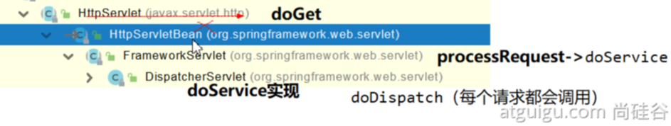

> SpringMVC功能分析都从 org.springframework.web.servlet.DispatcherServlet --> doDispatch()

```Java
protected void doDispatch(HttpServletRequest request, HttpServletResponse response) throws Exception {
		HttpServletRequest processedRequest = request;
		HandlerExecutionChain mappedHandler = null;
		boolean multipartRequestParsed = false;

		WebAsyncManager asyncManager = WebAsyncUtils.getAsyncManager(request);

		try {
			ModelAndView mv = null;
			Exception dispatchException = null;

			try {
				processedRequest = checkMultipart(request);
				multipartRequestParsed = (processedRequest != request);

				// 找到当前请求使用哪个Handler（Controller的方法）处理
				mappedHandler = getHandler(processedRequest);
                
                // HandlerMapping：处理器映射。/xxx -> xxxx
```

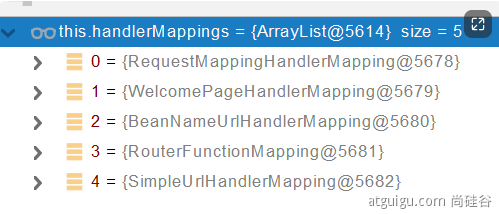

> **RequestMappingHandlerMapping**：保存了所有@RequestMapping 和handler的映射规则。

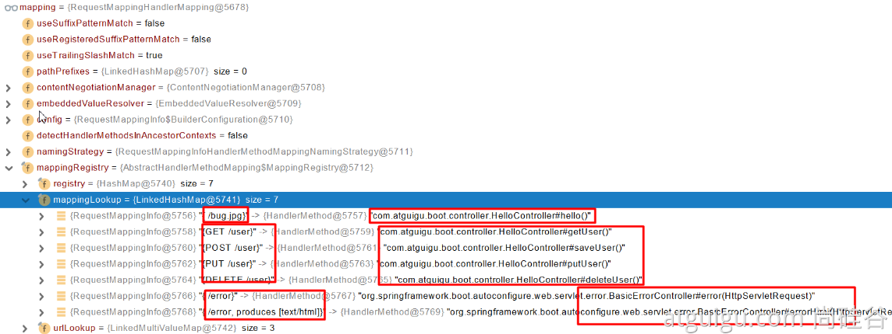

> 所有的请求映射都在HandlerMapping中。

> - SpringBoot自动配置欢迎页的 WelcomePageHandlerMapping 。访问 /能访问到index.html；
> - SpringBoot自动配置了默认的 RequestMappingHandlerMapping
> - 请求进来，挨个尝试所有的HandlerMapping看是否有请求信息。
>
> - - 如果有就找到这个请求对应的handler
>   - 如果没有就是下一个 HandlerMapping
>
> - 我们需要一些自定义的映射处理，我们也可以自己给容器中放**HandlerMapping**。自定义 **HandlerMapping**

```Java
	protected HandlerExecutionChain getHandler(HttpServletRequest request) throws Exception {
		if (this.handlerMappings != null) {
			for (HandlerMapping mapping : this.handlerMappings) {
				HandlerExecutionChain handler = mapping.getHandler(request);
				if (handler != null) {
					return handler;
				}
			}
		}
		return null;
	}
```

### 2、普通参数与基本注解

**Map**、**Model（map、model里面的数据会被放在request的请求域  request.setAttribute）、**Errors/BindingResult、**RedirectAttributes（ 重定向携带数据）**、**ServletResponse（response）**、SessionStatus、UriComponentsBuilder、ServletUriComponentsBuilder

#### 2.1 注解

`@PathVariable`、`@RequestHeader`、`@ModelAttribute`、`@RequestParam`、`@MatrixVariable`、`@CookieValue`、`@RequestBody` 
**若括号带值则用获取指定参数的值** 

> `@PathVariable`: 获取通过 `/car/{id}/owner/{username}` 方式传递变量的值
>
> `@RequestParam`: 获取通过 `car?id=1&username=zhangsan` 方式传递参数的值
>
> `@RequestHeader`: 获取请求头信息
>
> `@CookieValue`: 获取 Cookie 的值
>
> `@ModelAttribute`: 获取 request 域属性
>
> `@RequestBody`: 获取请求体的值
>
> `@MatrixVariable`: 获取矩阵变量的属性值
> 1、语法： 请求路径：/cars/sell;low=34;brand=byd,audi,yd
> 2、SpringBoot默认是禁用了矩阵变量的功能
>    		手动开启：原理：对于路径的处理。UrlPathHelper进行解析。
>    			removeSemicolonContent（移除分号内容）支持矩阵变量的
> 3、矩阵变量必须有url路径变量才能被解析

```Java
@RestController
public class ParameterTestController {

    // car/2/owner/zhangsan
    @GetMapping("/car/{id}/owner/{username}")
    public Map<String,Object> getCar(@PathVariable("id") Integer id,
                                     @PathVariable("username") String name,
                                     @PathVariable Map<String,String> pv,
                                     @RequestHeader("User-Agent") String userAgent,
                                     @RequestHeader Map<String,String> header,
                                     @RequestParam("age") Integer age,
                                     @RequestParam("inters") List<String> inters,
                                     @RequestParam Map<String,String> params,
                                     @CookieValue("_ga") String _ga,
                                     @CookieValue("_ga") Cookie cookie){

        Map<String,Object> map = new HashMap<>();
//        map.put("id",id);
//        map.put("name",name);
//        map.put("pv",pv);
//        map.put("userAgent",userAgent);
//        map.put("headers",header);
        map.put("age",age);
        map.put("inters",inters);
        map.put("params",params);
        map.put("_ga",_ga);
        System.out.println(cookie.getName()+"===>"+cookie.getValue());
        return map;
    }

    @PostMapping("/save")
    public Map postMethod(@RequestBody String content){
        Map<String,Object> map = new HashMap<>();
        map.put("content",content);
        return map;
    }

    /**
     * 1、语法： 请求路径：/cars/sell;low=34;brand=byd,audi,yd
     * 2、SpringBoot默认是禁用了矩阵变量的功能
     *      手动开启：原理：对于路径的处理。UrlPathHelper进行解析。
     *          removeSemicolonContent（移除分号内容）支持矩阵变量的
     * 3、矩阵变量必须有url路径变量才能被解析
     */
    @GetMapping("/cars/{path}")
    public Map carsSell(@MatrixVariable("low") Integer low,
                        @MatrixVariable("brand") List<String> brand,
                        @PathVariable("path") String path){
        Map<String,Object> map = new HashMap<>();
        map.put("low",low);
        map.put("brand",brand);
        map.put("path",path);
        return map;
    }

    // /boss/1;age=20/2;age=10
    @GetMapping("/boss/{bossId}/{empId}")
    public Map boss(@MatrixVariable(value = "age",pathVar = "bossId") Integer bossAge,
                    @MatrixVariable(value = "age",pathVar = "empId") Integer empAge){
        Map<String,Object> map = new HashMap<>();
        map.put("bossAge",bossAge);
        map.put("empAge",empAge);
        return map;
    }
    
}
```

#### 2.2 Servlet API

`WebRequest`、`ServletRequest`、`MultipartRequest`、 `HttpSession`、`javax.servlet.http.PushBuilder`、`Principal`、`InputStream`、`Reader`、`HttpMethod`、`Locale`、`TimeZone`、`ZoneId`

**ServletRequestMethodArgumentResolver -> 可以解析以上的部分参数**

```Java
	@Override
	public boolean supportsParameter(MethodParameter parameter) {
		Class<?> paramType = parameter.getParameterType();
		return (WebRequest.class.isAssignableFrom(paramType) ||
				ServletRequest.class.isAssignableFrom(paramType) ||
				MultipartRequest.class.isAssignableFrom(paramType) ||
				HttpSession.class.isAssignableFrom(paramType) ||
				(pushBuilder != null && pushBuilder.isAssignableFrom(paramType)) ||
				Principal.class.isAssignableFrom(paramType) ||
				InputStream.class.isAssignableFrom(paramType) ||
				Reader.class.isAssignableFrom(paramType) ||
				HttpMethod.class == paramType ||
				Locale.class == paramType ||
				TimeZone.class == paramType ||
				ZoneId.class == paramType);
	}
```

#### 2.3、复杂参数

**Map**、**Model、**Errors/BindingResult、**RedirectAttributes**、**ServletResponse**、SessionStatus、UriComponentsBuilder、ServletUriComponentsBuilder

> **Model（map、model里面的数据会被放在request的请求域  request.setAttribute）** 
>
> **RedirectAttributes（ 重定向携带数据）** 
>
> **ServletResponse（response响应）** 
>
> Map<String,Object> map,  Model model, HttpServletRequest request 都是可以给request域中放数据，相当于request.getAttribute();

**Map、Model类型的参数**，会返回 mavContainer.getModel（）；--> BindingAwareModelMap 是Model 也是Map

**mavContainer**.getModel(); 获取到值的

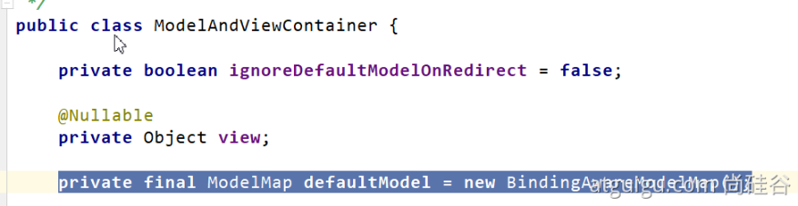

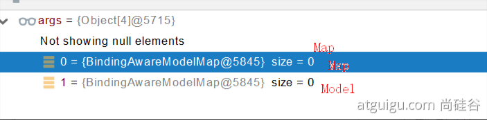

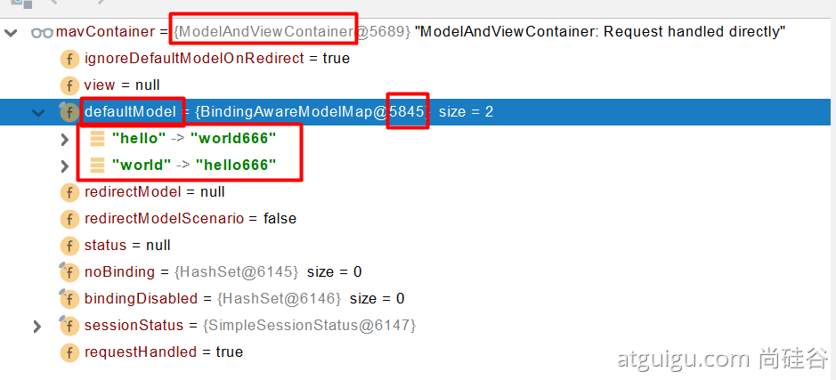

#### 2.4、自定义对象参数

可以自动类型转换与格式化，可以级联封装。

```Java
/**
 *     姓名： <input name="userName"/> <br/>
 *     年龄： <input name="age"/> <br/>
 *     生日： <input name="birth"/> <br/>
 *     宠物姓名：<input name="pet.name"/><br/>
 *     宠物年龄：<input name="pet.age"/>
 */
@Data
public class Person {
    private String userName;
    private Integer age;
    private Date birth;
    private Pet pet;
}

@Data
public class Pet {
    private String name;
    private String age;
}
result
```

### 3、POJO封装过程

- **ServletModelAttributeMethodProcessor**

### 4、参数处理原理

- HandlerMapping中找到能处理请求的Handler（Controller.method()）
- 为当前Handler 找一个适配器 HandlerAdapter； **RequestMappingHandlerAdapter**
- 适配器执行目标方法并确定方法参数的每一个值

#### 1、HandlerAdapter

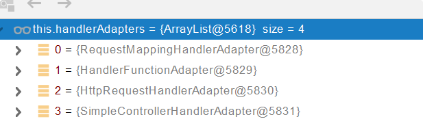

> 0 - 支持方法上标注@RequestMapping 
> 1 - 支持函数式编程的
> xxxxxx

#### 2、执行目标方法

```Java
// Actually invoke the handler.
//DispatcherServlet -- doDispatch
mv = ha.handle(processedRequest, response, mappedHandler.getHandler());
```

```Java
mav = invokeHandlerMethod(request, response, handlerMethod); //执行目标方法


//ServletInvocableHandlerMethod
Object returnValue = invokeForRequest(webRequest, mavContainer, providedArgs);
//获取方法的参数值
Object[] args = getMethodArgumentValues(request, mavContainer, providedArgs);
```

#### 3、参数解析器-HandlerMethodArgumentResolver

> 确定将要执行的目标方法的每一个参数的值是什么;
>
> SpringMVC目标方法能写多少种参数类型。取决于参数解析器。

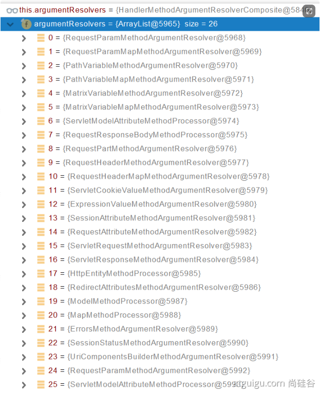

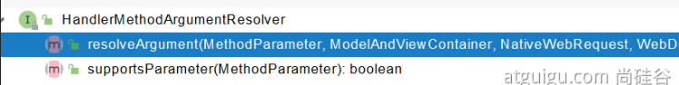

> - 当前解析器是否支持解析这种参数
> - 支持就调用 resolveArgument

#### 4、返回值处理器


#### 5、如何确定目标方法每一个参数的值

```Java
===========================InvocableHandlerMethod==========================
protected Object[] getMethodArgumentValues(NativeWebRequest request, @Nullable ModelAndViewContainer mavContainer,
			Object... providedArgs) throws Exception {

		MethodParameter[] parameters = getMethodParameters();
		if (ObjectUtils.isEmpty(parameters)) {
			return EMPTY_ARGS;
		}

		Object[] args = new Object[parameters.length];
		for (int i = 0; i < parameters.length; i++) {
			MethodParameter parameter = parameters[i];
			parameter.initParameterNameDiscovery(this.parameterNameDiscoverer);
			args[i] = findProvidedArgument(parameter, providedArgs);
			if (args[i] != null) {
				continue;
			}
			if (!this.resolvers.supportsParameter(parameter)) {
				throw new IllegalStateException(formatArgumentError(parameter, "No suitable resolver"));
			}
			try {
				args[i] = this.resolvers.resolveArgument(parameter, mavContainer, request, this.dataBinderFactory);
			}
			catch (Exception ex) {
				// Leave stack trace for later, exception may actually be resolved and handled...
				if (logger.isDebugEnabled()) {
					String exMsg = ex.getMessage();
					if (exMsg != null && !exMsg.contains(parameter.getExecutable().toGenericString())) {
						logger.debug(formatArgumentError(parameter, exMsg));
					}
				}
				throw ex;
			}
		}
		return args;
	}
```

##### 5.1、挨个判断所有参数解析器那个支持解析这个参数

```Java
	@Nullable
	private HandlerMethodArgumentResolver getArgumentResolver(MethodParameter parameter) {
		HandlerMethodArgumentResolver result = this.argumentResolverCache.get(parameter);
		if (result == null) {
			for (HandlerMethodArgumentResolver resolver : this.argumentResolvers) {
				if (resolver.supportsParameter(parameter)) {
					result = resolver;
					this.argumentResolverCache.put(parameter, result);
					break;
				}
			}
		}
		return result;
	}
```

##### 5.2、解析这个参数的值

> 调用各自 HandlerMethodArgumentResolver 的 resolveArgument 方法即可

##### 5.3、自定义类型参数 封装POJO

> **ServletModelAttributeMethodProcessor  这个参数处理器支持**
>  **是否为简单类型。**

```Java
public static boolean isSimpleValueType(Class<?> type) {
		return (Void.class != type && void.class != type &&
				(ClassUtils.isPrimitiveOrWrapper(type) ||
				Enum.class.isAssignableFrom(type) ||
				CharSequence.class.isAssignableFrom(type) ||
				Number.class.isAssignableFrom(type) ||
				Date.class.isAssignableFrom(type) ||
				Temporal.class.isAssignableFrom(type) ||
				URI.class == type ||
				URL.class == type ||
				Locale.class == type ||
				Class.class == type));
	}
```

```Java
@Override
	@Nullable
	public final Object resolveArgument(MethodParameter parameter, @Nullable ModelAndViewContainer mavContainer,
			NativeWebRequest webRequest, @Nullable WebDataBinderFactory binderFactory) throws Exception {

		Assert.state(mavContainer != null, "ModelAttributeMethodProcessor requires ModelAndViewContainer");
		Assert.state(binderFactory != null, "ModelAttributeMethodProcessor requires WebDataBinderFactory");

		String name = ModelFactory.getNameForParameter(parameter);
		ModelAttribute ann = parameter.getParameterAnnotation(ModelAttribute.class);
		if (ann != null) {
			mavContainer.setBinding(name, ann.binding());
		}

		Object attribute = null;
		BindingResult bindingResult = null;

		if (mavContainer.containsAttribute(name)) {
			attribute = mavContainer.getModel().get(name);
		}
		else {
			// Create attribute instance
			try {
				attribute = createAttribute(name, parameter, binderFactory, webRequest);
			}
			catch (BindException ex) {
				if (isBindExceptionRequired(parameter)) {
					// No BindingResult parameter -> fail with BindException
					throw ex;
				}
				// Otherwise, expose null/empty value and associated BindingResult
				if (parameter.getParameterType() == Optional.class) {
					attribute = Optional.empty();
				}
				bindingResult = ex.getBindingResult();
			}
		}

		if (bindingResult == null) {
			// Bean property binding and validation;
			// skipped in case of binding failure on construction.
			WebDataBinder binder = binderFactory.createBinder(webRequest, attribute, name);
			if (binder.getTarget() != null) {
				if (!mavContainer.isBindingDisabled(name)) {
					bindRequestParameters(binder, webRequest);
				}
				validateIfApplicable(binder, parameter);
				if (binder.getBindingResult().hasErrors() && isBindExceptionRequired(binder, parameter)) {
					throw new BindException(binder.getBindingResult());
				}
			}
			// Value type adaptation, also covering java.util.Optional
			if (!parameter.getParameterType().isInstance(attribute)) {
				attribute = binder.convertIfNecessary(binder.getTarget(), parameter.getParameterType(), parameter);
			}
			bindingResult = binder.getBindingResult();
		}

		// Add resolved attribute and BindingResult at the end of the model
		Map<String, Object> bindingResultModel = bindingResult.getModel();
		mavContainer.removeAttributes(bindingResultModel);
		mavContainer.addAllAttributes(bindingResultModel);

		return attribute;
	}
```

> **WebDataBinder binder = binderFactory.createBinder(webRequest, attribute, name);** 
> **WebDataBinder :web数据绑定器，将请求参数的值绑定到指定的JavaBean里面** 
> **WebDataBinder 利用它里面的 Converters 将请求数据转成指定的数据类型。再次封装到JavaBean中** 
>
> **GenericConversionService：在设置每一个值的时候，找它里面的所有converter那个可以将这个数据类型（request带来参数的字符串）转换到指定的类型（JavaBean -- Integer）** 
> **byte -- > file** 
>
> @FunctionalInterface**public interface** Converter<S, T>
>

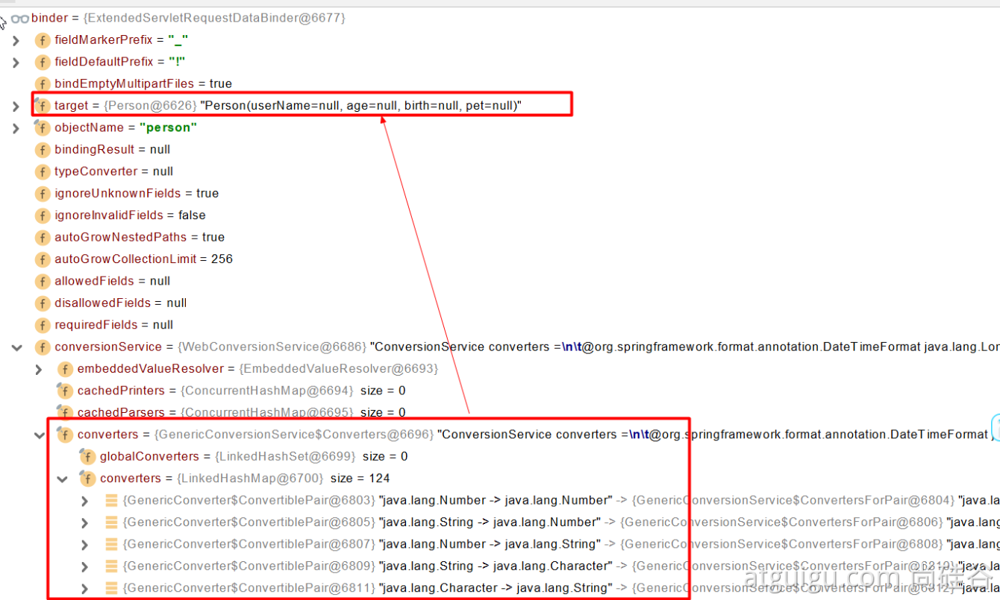

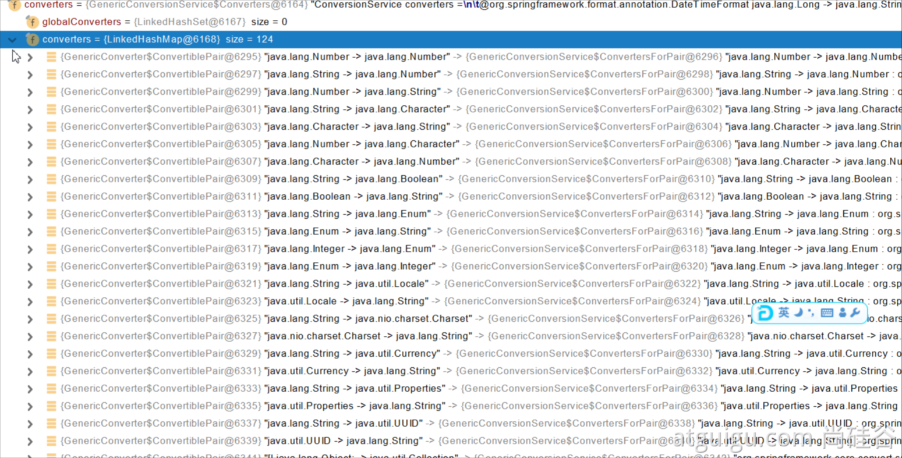

> 未来我们可以给WebDataBinder里面放自己的Converter；
>
> **private static final class** StringToNumber<T **extends** Number> **implements** Converter<String, T>

自定义 Converter

```Java
    //1、WebMvcConfigurer定制化SpringMVC的功能
    @Bean
    public WebMvcConfigurer webMvcConfigurer(){
        return new WebMvcConfigurer() {
            /**
             * /cars/sell;low=34;brand=byd,audi,yd
             * 不移除矩阵变量中的 ';' 后面的内容
             * @param configurer
             */
            @Override
            public void configurePathMatch(PathMatchConfigurer configurer) {
                UrlPathHelper urlPathHelper = new UrlPathHelper();
                // 不移除；后面的内容。矩阵变量功能就可以生效
                urlPathHelper.setRemoveSemicolonContent(false);
                configurer.setUrlPathHelper(urlPathHelper);
            }

            /**
             * 若前端传过来的参数是一个类类型的属性值，用','来分隔传递参数值
             * 例如：<input name="pet" value="阿猫,3" />
             * @param registry
             */
            @Override
            public void addFormatters(FormatterRegistry registry) {
                registry.addConverter(new Converter<String, Pet>() {

                    @Override
                    public Pet convert(String source) {
                        // 啊猫,3
                        if(!StringUtils.isEmpty(source)){
                            Pet pet = new Pet();
                            String[] split = source.split(",");
                            pet.setName(split[0]);
                            pet.setAge(Integer.parseInt(split[1]));
                            return pet;
                        }
                        return null;
                    }
                });
            }
        };
    }
```

#### 6、目标方法执行完成

将所有的数据都放在 **ModelAndViewContainer**；包含要去的页面地址View。还包含Model数据。

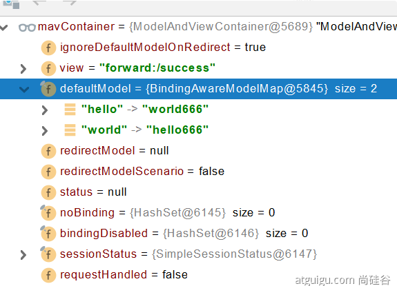

#### 7、处理派发结果

> **processDispatchResult**(processedRequest, response, mappedHandler, mv, dispatchException);
>
> renderMergedOutputModel(mergedModel, getRequestToExpose(request), response);

```Java
InternalResourceView：
@Override
	protected void renderMergedOutputModel(
			Map<String, Object> model, HttpServletRequest request, HttpServletResponse response) throws Exception {

		// Expose the model object as request attributes.
		exposeModelAsRequestAttributes(model, request);

		// Expose helpers as request attributes, if any.
		exposeHelpers(request);

		// Determine the path for the request dispatcher.
		String dispatcherPath = prepareForRendering(request, response);

		// Obtain a RequestDispatcher for the target resource (typically a JSP).
		RequestDispatcher rd = getRequestDispatcher(request, dispatcherPath);
		if (rd == null) {
			throw new ServletException("Could not get RequestDispatcher for [" + getUrl() +
					"]: Check that the corresponding file exists within your web application archive!");
		}

		// If already included or response already committed, perform include, else forward.
		if (useInclude(request, response)) {
			response.setContentType(getContentType());
			if (logger.isDebugEnabled()) {
				logger.debug("Including [" + getUrl() + "]");
			}
			rd.include(request, response);
		}

		else {
			// Note: The forwarded resource is supposed to determine the content type itself.
			if (logger.isDebugEnabled()) {
				logger.debug("Forwarding to [" + getUrl() + "]");
			}
			rd.forward(request, response);
		}
	}
```

```Java4
暴露模型作为请求域属性
// Expose the model object as request attributes.
		exposeModelAsRequestAttributes(model, request);
```

```Java
protected void exposeModelAsRequestAttributes(Map<String, Object> model,
			HttpServletRequest request) throws Exception {

    //model中的所有数据遍历挨个放在请求域中
		model.forEach((name, value) -> {
			if (value != null) {
				request.setAttribute(name, value);
			}
			else {
				request.removeAttribute(name);
			}
		});
	}
```

## 7.4、数据响应与内容协商

### 1、响应JSON

#### （1）、jackson.jar+@ResponseBody

```XML
        <dependency>
            <groupId>org.springframework.boot</groupId>
            <artifactId>spring-boot-starter-web</artifactId>
        </dependency>
web场景自动引入了json场景;给前端自动返回json数据;
    <dependency>
      <groupId>org.springframework.boot</groupId>
      <artifactId>spring-boot-starter-json</artifactId>
      <version>2.3.4.RELEASE</version>
      <scope>compile</scope>
    </dependency>
```

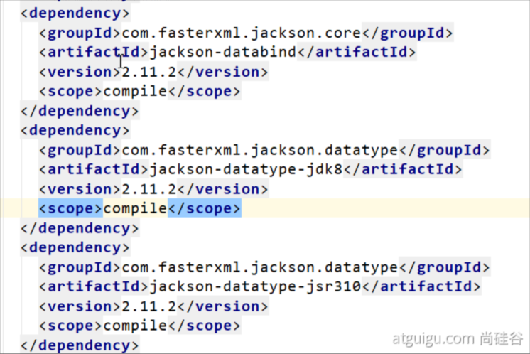

##### ①  返回值解析器

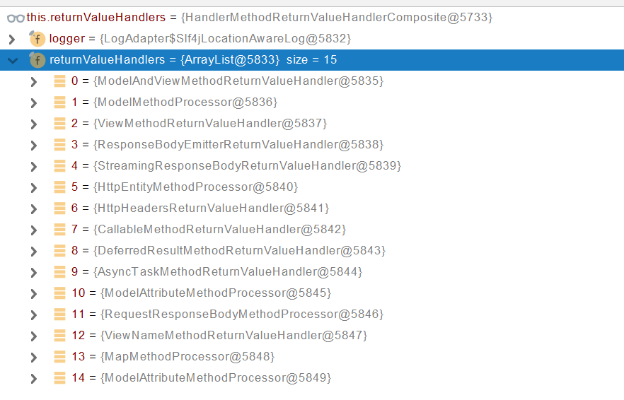

##### ②  返回值解析器原理

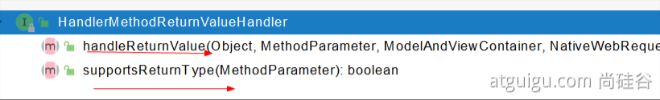

> - 1、返回值处理器判断是否支持这种类型返回值 supportsReturnType
> - 2、返回值处理器调用 handleReturnValue 进行处理
> - 3、RequestResponseBodyMethodProcessor 可以处理返回值标了@ResponseBody 注解的。
>
> - - 1、利用 MessageConverters 进行处理 将数据写为json
>
> - - - 1、内容协商（浏览器默认会以请求头的方式告诉服务器他能接受什么样的内容类型）
>         - 2、服务器最终根据自己自身的能力，决定服务器能生产出什么样内容类型的数据，
>         - 3、SpringMVC会挨个遍历所有容器底层的 HttpMessageConverter ，看谁能处理？
>
> - - - - 1、得到MappingJackson2HttpMessageConverter可以将对象写为json
>             - 2、利用MappingJackson2HttpMessageConverter将对象转为json再写出去。

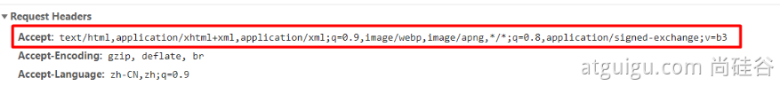

#### （2）SpringMVC到底支持哪些返回值

```Java
ModelAndView
Model
View
ResponseEntity 
ResponseBodyEmitter
StreamingResponseBody
HttpEntity
HttpHeaders
Callable
DeferredResult
ListenableFuture
CompletionStage
WebAsyncTask
有 @ModelAttribute 且为对象类型的
@ResponseBody 注解 ---> RequestResponseBodyMethodProcessor；
```

#### （3）HTTPMessageConverter原理

##### ①  MessageConverter 规范

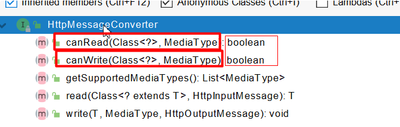

> HttpMessageConverter: 看是否支持将 此 Class类型的对象，转为MediaType类型的数据。
>
> 例子：Person对象转为JSON。或者 JSON转为Person

②  默认的MessageConverter

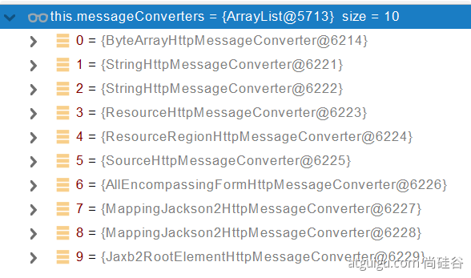

> 0 - 只支持Byte类型的
>
> 1 - String
>
> 2 - String
>
> 3 - Resource
>
> 4 - ResourceRegion
>
> 5 - DOMSource.**class \** SAXSource.**class**) \ StAXSource.**class \**StreamSource.**class \**Source.**class**
>
> **6 -** MultiValueMap
>
> 7 - **true** 
>
> **8 - true**
>
> **9 - 支持注解方式xml处理的** 

> 最终 MappingJackson2HttpMessageConverter  把对象转为JSON（利用底层的jackson的objectMapper转换的）

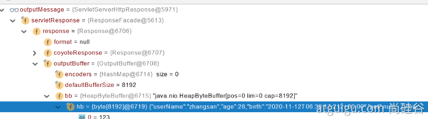

### 2、内容协商

> 根据客户端接收能力不同，返回不同媒体类型的数据。

#### （1）引入xml依赖

```XML
 <dependency>
            <groupId>com.fasterxml.jackson.dataformat</groupId>
            <artifactId>jackson-dataformat-xml</artifactId>
</dependency>
```

#### （2）postman分别测试返回json和xml

只需要改变请求头中Accept字段。Http协议中规定的，告诉服务器本客户端可以接收的数据类型。

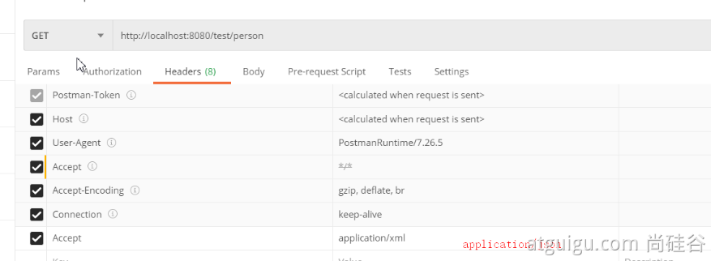

#### （3）开启浏览器参数方式内容协商功能

> 为了方便内容协商，开启基于请求参数的内容协商功能。

```YAML
spring:
    contentnegotiation:
      favor-parameter: true  #开启请求参数内容协商模式
```

> 发请求： http://localhost:8080/test/person?format=json
>
> [http://localhost:8080/test/person?format=](http://localhost:8080/test/person?format=json)xml

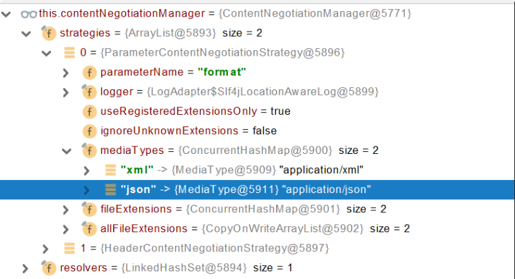


# 8、数据访问


# 9、单元测试


# 10、指标监控


# 11、原理解析

