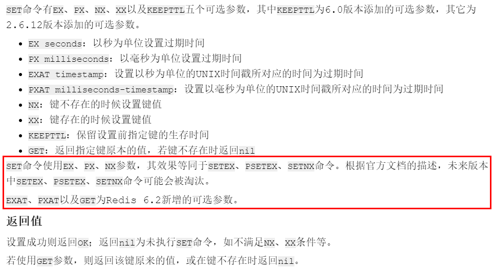
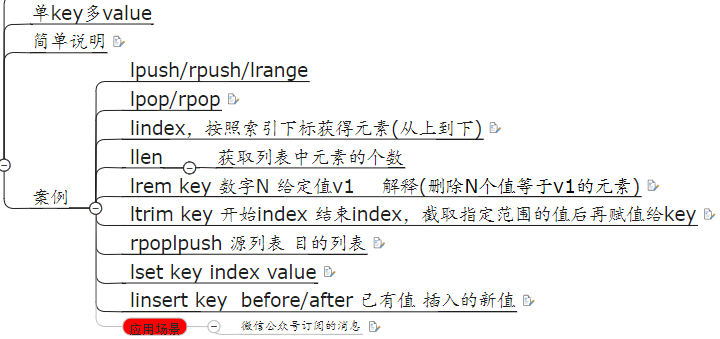
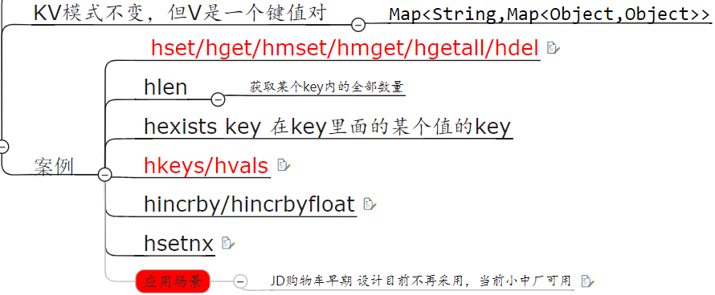
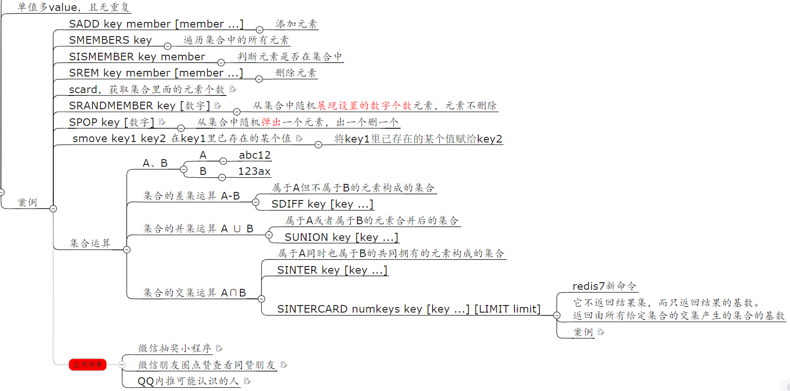

# redis 学前准备


## 1、在Linux上安装gcc

> 查看gcc版本：gcc -v
>
> 安装gcc：yum -y install gcc- c++

## 2、安装Redis

> ①  在 /opt 目录下解压Redis安装包：tar -zxcf redis-7.0.12.tar.gz
>
> ②  进入目录：cd redis-7.0.12
>
> ③  执行：make & make install
>
> ④  进入默认安装目录：/usr/local/bin
>
> ​		redis-benchmark: 性能测试工具，服务启动后运行该命令，看看自己本子性能如何
>
> ​		redis-check-aof: 修复有问题的AOF文件，rdb和aof后面讲
>
> ​		redis-check-dump: 修复有问题的dump.rdb文件
>
> ​		redis-cli: 客户端，操作入口
>
> ​		redis-sentinel: redis集群使用
>
> ​		redis-server: Redis服务器启动命令
>
> ⑤  将默认的`redis.conf`拷贝到自己定义的一个路径下，比如`/myredis`
>
> ​		mkdir /myredis
>
> ​		cp redis.conf /myredis/
>
> ⑥  修改`/myredis`目录下`redis.conf`配置文件做初始化设置
>
> ​		redis.conf配置文件，改完后确保生效，记得重启，记得重启
>
> ​			1 默认daemonize no              改为  daemonize yes
>
> ​			2 默认protected-mode  yes    改为  protected-mode no
>
> ​			3 默认bind 127.0.0.1              改为  直接注释掉(默认bind 127.0.0.1只能本机访问)或改成本机IP地址，否则影响远程IP连接
>
> ​			4 添加redis密码                      改为 requirepass 你自己设置的密码
>
> ⑦  启动服务：/usr/local/bin目录下运行redis-server，启用/myredis目录下的redis.conf文件
>
> ⑧  连接服务：redis-cli -a 111111 -p 6379 		Redis端口为6379
>
> ⑨  关闭服务：单实例关闭：redis-cli -a 111111 shutdown
> ​						  多实例关闭，指定端口关闭：redis-cli -p 6379 shutdown
>
> ⑩  卸载Redis：
>
> ​		停止服务：redis-server /myredis/redis7.conf
>
> ​		删除`/usr/local/lib`目录下与redis相关的文件

# redis数据类型

## 1、redis键（key）

> keys *：查看当前库所有的key
>
> exists key：判断某个key是否类型
>
> type key：查看你的key是什么类型
>
> del key：删除指定的key数据
>
> unlink key：非阻塞删除，仅仅将keys从keyspace元数据中删除，真正的删除会在后续异步中操作
>
> ttl key：查看还有多少秒过期，-1表示永不过期，-2表示已过期
>
> expire key 秒钟：为给定的key设置过期时间
>
> move key dbindex【0-15】：将当前数据库的key移动到给定的数据库db当中
>
> select dbindex：切换数据库key的数量
>
> <span style="color:#4662d9; font-weight:bold">flushdb：清空当前库</span> 
>
> <span style="color:red; font-weight:bold">flushall：通杀全部库</span> 

## 2、数据类型命令及落地运用

### （1）命令大全网址

> 英文：https://redis.io/commands/ 
>
> 中文：http://www.redis.cn/commands/ 

### （2）String

> SET key value [NX | XX] [GET] [EX seconds | PX milliseconds | EXAT unix-time-seconds | PXAT unix-time-milliseconds | KEEPTTL]
>
> 
>
> 


```
> set k1 v1 nx
OK
> set k1 v1 nx
(nil)
> set k1 v1 xx
OK
> set k1 v1 xx
OK
> get k1    {返回k1的值}
"v1"
> set k1 v2 get    {键k1的返回v1,并将v2赋值给k1}
"v1"
> get k1
"v2"

> set k1 v1 ex 10    {10秒后失效}
OK
> ttl k1    {5秒后}
(integer) 5
> ttl k1    {10秒后}
(integer) -2    {-2表示已过期}
> get k1
(nil)

> set k1 v1 px 10000    {10秒后失效}
OK
> ttl k1    {5秒后}
(integer) 5
> ttl k1    {10秒后}
(integer) -2    {-2表示已过期}
> get k1
(nil)

> set k1 v3 ex 50    {50秒后失效}
OK
> ttl k1
(integer) 45
> set k1 v4 keepttl    {保留上面的设置的失效时间}
OK
> ttl k1
(integer) 25
> get k1
"v4"
> ttl k1
(integer) -2    {-2表示已过期}
> get k1
(nil)

> mset k1 v1 k2 v2 k3 v3    {一次性设置多个参数}
OK
> mget k1 k2 k3    {一次性返回多个值}
1) "v1"
2) "v2"
3) "v3"
> msetnx k1 v2 k4 v4
(integer) 0    {设置失败}
> get k1    {k1有值}
"v1"
> get k4    {k4未设置}
(nil)
{说明 msetnx 要么全部成功，要么全部失败}

> set k1 abcd1234
OK
> GETRANGE k1 0 -1    {截取String}
"abcd1234"
> GETRANGE k1 0 3
"abcd"
> SETRANGE k1 2 xing    {替换String中部分字符}
(integer) 8
> get k1
"abxing34"

> set k1 100
OK
> get k1
"100"
> INCR k1    {加1}
"101"
> INCR k1 3    {加3}
"104"
> DECR k1
"103"
> DECR k1 3
"100"
> set k1 abcd
OK
> get k1
"abcd"
> STRLEN k1
(integer) 4
> APPEND k1 xing
(integer) 8
> get k1
"abcdxing"

> getset k1 wangxing
"abcdxing"
> get k1
"wangxing"
```

### （3）list（单key多value）



```
> LPUSH list1 1 2 3 4 5		{从左边插入数据 -> 5,4,3,2,1}
(integer) 5
> LRANGE list1 0 -1		{从左边开始遍历}
1) "5"
2) "4"
3) "3"
4) "2"
5) "1"
> RPUSH list2 11 22 33 44 55	{从右边插入数据 -> 11,22,33,44,55}
(integer) 5
> LRANGE list2 0 -1		{从左边开始遍历}
1) "11"
2) "22"
3) "33"
4) "44"
5) "55"
> type list1	{返回key的类型}
list

> LPOP list1	{从左边弹出}
"5"		{将5弹出}
> LRANGE list1 0 -1
1) "4"
2) "3"
3) "2"
4) "1"
> RPOP list1	{从右边弹出}
"1"		{将1弹出}
> LRANGE list1 0 -1
1) "4"
2) "3"
3) "2"
> LINDEX list1 1	{从左边按下标取值}
"3"
> LLEN list1	{key的元素个数}
(integer) 3

> LPUSH list1 1 2 1 2 1 3 1 4
(integer) 8
> LRANGE list1 0 -1
1) "4"
2) "1"
3) "3"
4) "1"
5) "2"
6) "1"
7) "2"
8) "1"
> LREM list1 2 1	{从左边删除2个元素为1}
(integer) 
> LRANGE list1 0 -1
1) "4"
2) "3"
3) "2"
4) "1"
5) "2"
6) "1"
> LTRIM list1 2 4	{从左边起截取下标为2-4的元素给key为list1}
OK
> LRANGE list1 0 -1
1) "2"
2) "1"
3) "2"
> LRANGE list2 0 -1
1) "11"
2) "22"
3) "33"
4) "44"
5) "55"
> RPOPLPUSH list1 list2		{将list1的最后一个元素push到list2的第一个元素}
"2"
> LRANGE list1 0 -1
1) "2"
2) "1"
> LRANGE list2 0 -1
1) "2"
2) "11"
3) "22"
4) "33"
5) "44"
6) "55"
> LSET list2 0 redis	{将值redis设置给list2中下标为0的元素}
OK
> LRANGE list2 0 -1
1) "redis"
2) "11"
3) "22"
4) "33"
5) "44"
6) "55"
> LINSERT list2 before redis Linux	{在元素redis前插入元素Linux}
(integer) 7
> LRANGE list2 0 -1
1) "Linux"
2) "redis"
3) "11"
4) "22"
5) "33"
6) "44"
7) "55"
```

### （4）Hash（KV模式不变，但V是一个键值对 [Map<String,Map<Object,Object>>]）



```
> HSET user:001 id 11 name 张三 age 23
(integer) 3
> hget user:001 id
"11"
> hget user:001 name
"\xe5\xbc\xa0\xe4\xb8\x89"
> HMSET user:001 id 12 name lisi age 23		{}
OK
> HMGET user:001 id name age
1) "12"
2) "lisi"
3) "23"
> HGETALL user:001	{遍历user:001}
1) "id"
2) "12"
3) "name"
4) "lisi"
5) "age"
6) "23"
> HDEL user:001 age		{删除user:001的age属性}
(integer) 1
> HGETALL user:001
1) "id"
2) "12"
3) "name"
4) "lisi"

> HEXISTS user:001 name		{判断user:001里是否存在name属性}
(integer) 1
> HEXISTS user:001 sorce
(integer) 0

> HKEYS user:001	{列出user:001中的所有key}
1) "id"
2) "name"
> HVALS user:001	{列出user:001中的所有value}
1) "12"
2) "lisi"

> HSET user:001 id 1001 name lisi age 20 score 97.5
(integer) 2
> HGETALL user:001
1) "id"
2) "1001"
3) "name"
4) "lisi"
5) "age"
6) "20"
7) "score"
8) "97.5"
> HINCRBY user:001 age 2	{将user:001的age属性 加2}
(integer) 22
> HGETALL user:001
1) "id"
2) "1001"
3) "name"
4) "lisi"
5) "age"
6) "22"
7) "score"
8) "97.5"
> HINCRBYFLOAT user:001 score 1.5
"99"
127.0.0.1:6379> HGETALL user:001
 1) "id"
 2) "1001"
 3) "name"
 4) "lisi"
 5) "age"
 6) "22"
 7) "score"
 8) "99"
 
> HSETNX user:001 email lisi@163.com	{不存在赋值}
(integer) 1
> HSETNX user:001 email lisi@163.com	{存在了无效}
(integer) 0
```

### （5）Set（单值多value，且无重复）



```
> SADD set1 1 1 1 2 2 3 4	{向set1集合中添加元素}
(integer) 4
> SMEMBERS set1		{遍历set1集合，没有重复元素}
1) "1"
2) "2"
3) "3"
4) "4"
> SISMEMBER set1 5	{判断该元素是否存在}
(integer) 0		{不存在返回0}
> SISMEMBER set1 3
(integer) 1		{存在返回1}

> SREM set1 5		{删除某个元素}
(integer) 0		{不存在返回0}
> SREM set1 4
(integer) 1		{存在返回1}
> SMEMBERS set1
1) "1"
2) "2"
3) "3"
> SCARD set1	{统计set1有多少元素}
(integer) 3

> SRANDMEMBER set1 2	{随机选出一个数字，但不删除源set集合}
1) "5"
2) "3"

> SMEMBERS set1
1) "1"
2) "2"
3) "3"
4) "4"
5) "5"
6) "6"
7) "7"
8) "8"
> SPOP set1 3
1) "2"
2) "4"
3) "3"
> SMEMBERS set1
1) "1"
2) "5"
3) "6"
4) "7"
5) "8"

> SMEMBERS set1
1) "1"
2) "5"
3) "6"
4) "7"
5) "8"
127.0.0.1:6379> SADD set2 a b c d
(integer) 4
127.0.0.1:6379> SMEMBERS set2
1) "d"
2) "b"
3) "c"
4) "a"
127.0.0.1:6379> SMOVE set1 set2 6	{将set1中的元素6 push到set2}
(integer) 1
127.0.0.1:6379> SMEMBERS set1
1) "1"
2) "5"
3) "7"
4) "8"
127.0.0.1:6379> SMEMBERS set2
1) "d"
2) "b"
3) "c"
4) "a"
5) "6"		{将随机存储在set2中}

> SADD A 1 2 a b c
(integer) 5
> SADD B a x 1 2 3
(integer) 5

=== 集合差集运算 A-B ===
> SDIFF A B		{属于A但不属于B的元素够成的集合}
1) "b"
2) "c"
> SDIFF B A		{属于B但不属于A的元素够成的集合}
1) "x"
2) "3"

=== 集合并集运算 A ∪ B ===
> SUNION A B
1) "2"
2) "b"
3) "3"
4) "1"
5) "x"
6) "a"
7) "c"

=== 集合并集运算 A ∩ B ===
> SINTER A B
1) "2"
2) "1"
3) "a"
```

### （6）

```
> ZADD zset1 60 v1 70 v2 80 v3 90 v4 100 v5
(integer) 5
> ZRANGE zset1 0 -1		{输出键}
1) "v1"
2) "v2"
3) "v3"
4) "v4"
5) "v5"
> ZRANGE zset1 0 -1 withscores		{输出键、值}
 1) "v1"
 2) "60"
 3) "v2"
 4) "70"
 5) "v3"
 6) "80"
 7) "v4"
 8) "90"
 9) "v5"
10) "100"
> ZRANGEBYSCORE zset1 70 90 withscores		{输出 70≤value≤90 }
1) "v2"
2) "70"
3) "v3"
4) "80"
5) "v4"
6) "90"
> ZRANGEBYSCORE zset1 (70 90 withscores		{输出 70<value≤90 }
1) "v3"
2) "80"
3) "v4"
4) "90"
> ZRANGEBYSCORE zset1 70 (90 withscores		{输出 70≤value<90 }
1) "v2"
2) "70"
3) "v3"
4) "80"
> ZRANGEBYSCORE zset1 60 90 withscores limit 1 2	{在 60≤value≤90 下标为1输出2个}
1) "v2"
2) "70"
3) "v3"
4) "80"

> ZSCORE zset1 v5	{获取元素的分数}
"100"
> ZCARD zset1		{获取集合中元素的数量}
(integer) 5
> ZREM zset1 v5		{删除v5元素}
(integer) 1
> ZRANGE zset1 0 -1 withscores
1) "v1"
2) "60"
3) "v2"
4) "70"
5) "v3"
6) "80"
7) "v4"
8) "90"

> ZINCRBY zset1 7 v1	{给v1加7}
"67"
127.0.0.1:6379> ZRANGE zset1 0 -1 withscores
1) "v1"
2) "67"
3) "v2"
4) "70"
5) "v3"
6) "80"
7) "v4"
8) "90"

> ZCOUNT zset1 65 70	{统计 65≤value≤70 有几个值}
(integer) 2
> ZMPOP 1 zset1 min count 2
1) "zset1"
2) 1) 1) "v1"
      2) "67"
   2) 1) "v2"
      2) "70"


```

