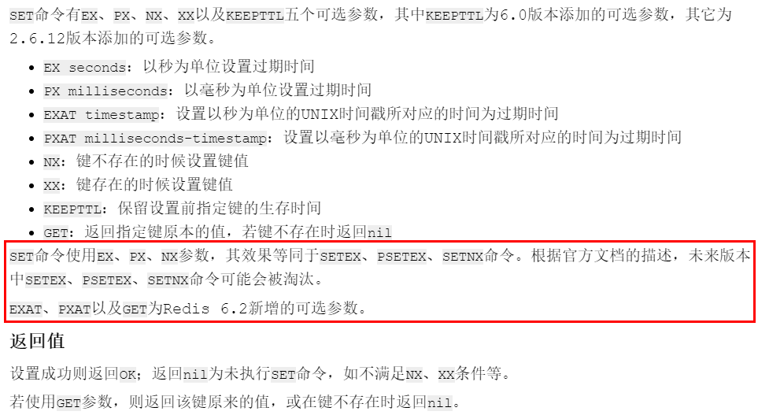

# 

# redis 学前准备


## 1、启动服务

> /usr/local/bin目录下运行redis-server，启用/myredis目录下的redis.conf文件

## 2、连接服务

> redis-cli -a 111111 -p 6379

# redis数据类型

## 1、redis键（key）

> keys *：查看当前库所有的key
>
> exists key：判断某个key是否类型
>
> type key：查看你的key是什么类型
>
> del key：删除指定的key数据
>
> unlink key：非阻塞删除，仅仅将keys从keyspace元数据中删除，真正的删除会在后续异步中操作
>
> ttl key：查看还有多少秒过期，-1表示永不过期，-2表示已过期
>
> expire key 秒钟：为给定的key设置过期时间
>
> move key dbindex【0-15】：将当前数据库的key移动到给定的数据库db当中
>
> select dbindex：切换数据库key的数量
>
> <span style="color:#4662d9; font-weight:bold">flushdb：清空当前库</span> 
>
> <span style="color:red; font-weight:bold">flushall：通杀全部库</span> 

## 2、数据类型命令及落地运用

### （1）命令大全网址

> 英文：https://redis.io/commands/ 
>
> 中文：http://www.redis.cn/commands/ 

### （2）String

> SET key value [NX | XX] [GET] [EX seconds | PX milliseconds | EXAT unix-time-seconds | PXAT unix-time-milliseconds | KEEPTTL]
>
> 
>
> 


```
> set k1 v1 nx
OK
> set k1 v1 nx
(nil)
> set k1 v1 xx
OK
> set k1 v1 xx
OK
> get k1    {返回k1的值}
"v1"
> set k1 v2 get    {键k1的返回v1,并将v2赋值给k1}
"v1"
> get k1
"v2"

> set k1 v1 ex 10    {10秒后失效}
OK
> ttl k1    {5秒后}
(integer) 5
> ttl k1    {10秒后}
(integer) -2    {-2表示已过期}
> get k1
(nil)

> set k1 v1 px 10000    {10秒后失效}
OK
> ttl k1    {5秒后}
(integer) 5
> ttl k1    {10秒后}
(integer) -2    {-2表示已过期}
> get k1
(nil)

> set k1 v3 ex 50    {50秒后失效}
OK
> ttl k1
(integer) 45
> set k1 v4 keepttl    {保留上面的设置的失效时间}
OK
> ttl k1
(integer) 25
> get k1
"v4"
> ttl k1
(integer) -2    {-2表示已过期}
> get k1
(nil)

> mset k1 v1 k2 v2 k3 v3    {一次性设置多个参数}
OK
> mget k1 k2 k3    {一次性返回多个值}
1) "v1"
2) "v2"
3) "v3"
> msetnx k1 v2 k4 v4
(integer) 0    {设置失败}
> get k1    {k1有值}
"v1"
> get k4    {k4未设置}
(nil)
{说明 msetnx 要么全部成功，要么全部失败}

> set k1 abcd1234
OK
> GETRANGE k1 0 -1    {截取String}
"abcd1234"
> GETRANGE k1 0 3
"abcd"
> SETRANGE k1 2 xing    {替换String中部分字符}
(integer) 8
> get k1
"abxing34"

> set k1 100
OK
> get k1
"100"
> INCR k1    {加1}
"101"
> INCR k1 3    {加3}
"104"
> DECR k1
"103"
> DECR k1 3
"100"
> set k1 abcd
OK
> get k1
"abcd"
> STRLEN k1
(integer) 4
> APPEND k1 xing
(integer) 8
> get k1
"abcdxing"


```

