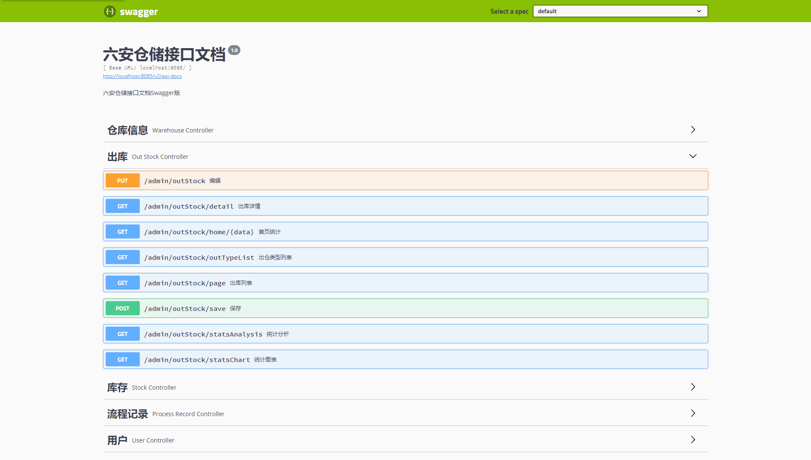

# Swagger 简介

## 前言

​		接口文档对于前后端开发人员都十分重要。尤其近几年流行前后端分离后接口文档又变成重中之重。接口文档固然重要，但是由于项目周期等原因后端人员经常出现无法及时更新，导致前端人员抱怨接口文档和实际情况不一致。

​		很多人员会抱怨别人写的接口文档不规范，不及时更新。但是当自己写的时候确实最烦去写接口文档。这种痛苦只有亲身经历才会牢记于心。

​		如果接口文档可以实时动态生成就不会出现上面问题。Swagger可以完美的解决上面的问题。

## Open API

`Open API`规范(OpenAPI Specification)以前叫做`Swagger`规范，是`REST API`的`API`描述格式。

> `Open API`文件允许描述整个API，包括：
>
> - 每个访问地址的类型。POST或GET。
>
> - 每个操作的参数。包括输入输出参数。
>
> - 认证方法。
>
> - 连接信息，声明，使用团队和其他信息。

`Open API`规范可以使用`YAML`或`JSON`格式进行编写。这样更利于我们和机器进行阅读。

`OpenAPI`规范（OAS）为`REST API`定义了一个与语言无关的标准接口，允许人和计算机发现和理解服务的功能，而无需访问源代码，文档或通过网络流量检查。正确定义后，消费者可以使用最少量的实现逻辑来理解远程服务并与之交互。然后，文档生成工具可以使用OpenAPI定义来显示API，使用各种编程语言生成服务器和客户端的代码生成工具，测试工具以及许多其他用例。

### 源码和说明参照：

> https://github.com/OAI/OpenAPI-Specification/blob/master/versions/3.0.0.md#oasDocument

## Swagger 简介

> `Swagger`是一套围绕`Open API`规范构建的开源工具，可以帮助设计，构建，记录和使用`REST API`。

> `Swagger`工具包括的组件：
>
> - `Swagger Editor `：基于浏览器编辑器，可以在里面编写Open API规范。类似Markdown具有实时预览描述文件的功能。
>- `Swagger UI`：将Open API规范呈现为交互式API文档。用可视化UI展示描述文件。
> - `Swagger Codegen`：将OpenAPI规范生成为服务器存根和客户端库。通过Swagger Codegen可以将描述文件生成html格式和cwiki形式的接口文档，同时也可以生成多种言语的客户端和服务端代码。
>- `Swagger Inspector`：和Swagger UI有点类似，但是可以返回更多信息，也会保存请求的实际参数数据。
> - `Swagger Hub`：集成了上面所有项目的各个功能，你可以以项目和版本为单位，将你的描述文件上传到Swagger Hub中。在Swagger Hub中可以完成上面项目的所有工作，需要注册账号，分免费版和收费版。

使用Swagger，就是把相关的信息存储在它定义的描述文件里面（`Yml`或`Json`格式），再通过维护这个描述文件可以去更新接口文档，以及生成各端代码。

# Springfox

> 使用`Swagger`时如果碰见版本更新或迭代时，只需要更改`Swagger`的描述文件即可。但是在频繁的更新项目版本时很多开发人员认为即使修改描述文件（`Yml`或`Json`）也是一定的工作负担，久而久之就直接修改代码，而不去修改描述文件了，这样基于描述文件生成接口文档也失去了意义。
>
> `Marty Pitt`编写了一个基于`Spring`的组件`swagger-springmvc`。`Spring-fox`就是根据这个组件发展而来的全新项目。
>
> `Spring-fox`是根据代码生成接口文档，所以正常的进行更新项目版本，修改代码即可，而不需要跟随修改描述文件。
>
> `Spring-fox`利用自身`AOP`特性，把`Swagger`集成进来，底层还是`Swagger`。但是使用起来确方便很多。所以在实际开发中，都是直接使用`spring-fox`。

# Swagger 极值用法

## 导入Spring-fox依赖

> ```xml
> <dependency>
>     <groupId>io.springfox</groupId>
>     <artifactId>springfox-swagger2</artifactId>
>     <version>2.9.2</version>
> </dependency>
> <dependency>
>     <groupId>io.springfox</groupId>
>     <artifactId>springfox-swagger-ui</artifactId>
>     <version>2.9.2</version>
> </dependency>
> ```

## 添加注解

> 在SpringBoot的启动类中添加`@EnableSwagger2`注解。添加此注解后表示对当前项目中全部控制器进行扫描。应用`Swagger2`。

## 访问swagger-ui

> http://`ip`:`port`/swagger-ui.html
>
> 例如: http://`localhost`:`8085`/swagger-ui.html 



# Swagger配置

## 配置基本信息

> Docket：摘要对象，通过对象配置描述文件的信息。
>
> apiInfo:设置描述文件中info。参数类型ApiInfo
>
> select():返回ApiSelectorBuilder对象，通过对象调用build()可以创建Docket对象
>
> ApiInfoBuilder：ApiInfo构建器。

```Java
import com.bjsxt.anno.MyAnnotation4Swagger;
import org.springframework.context.annotation.Bean;
import org.springframework.context.annotation.Configuration;
import springfox.documentation.builders.ApiInfoBuilder;
import springfox.documentation.builders.PathSelectors;
import springfox.documentation.builders.RequestHandlerSelectors;
import springfox.documentation.service.ApiInfo;
import springfox.documentation.service.Contact;
import springfox.documentation.spi.DocumentationType;
import springfox.documentation.spring.web.plugins.Docket;

import com.google.common.base.Predicates;
import springfox.documentation.builders.RequestHandlerSelectors;

@Configuration
public class SwaggerConfiguration {
    /**
     * 创建Docket类型的对象。并使用spring容器管理。
     * Docket是Swagger中的全局配置对象。
     * @return
     */
    @Bean
    public Docket docket(){
        Docket docket = new Docket(DocumentationType.SWAGGER_2);

        // API帮助文档的描述信息。 information
        ApiInfo apiInfo =
                new ApiInfoBuilder()
                        .contact( // 配置swagger文档主体内容。
                                new Contact(
                                        "北京尚学堂 - Old Jin", // 是文档的发布者名称
                                        "http://www.bjsxt.com", // 是文档发布者的网站地址。企业网站
                                        "admin@bjsxt.com") // 文档发布者的电子邮箱
                        )
                        .title("Swagger框架学习帮助文档")
                        .description("Swagger框架学习帮助文档详细描述-Swagger框架是一个用于开发RestAPI帮助文档的框架")
                        .version("1.1")
                        .build();

        // 给docket上下文配置api描述信息。
        docket.apiInfo(apiInfo);

        docket = docket
                .select() // 获取Docket中的选择器。 返回ApiSelectorBuilder。构建选择器的。如：扫描什么包的注解。
                .apis(
                        Predicates.not(  // 取反。false -> true   true -> false
                            RequestHandlerSelectors.withMethodAnnotation( // 当方法上有注解的时候返回true
                                    MyAnnotation4Swagger.class) // 方法上有什么注解的时候返回true
                        )
                )
                //.apis(RequestHandlerSelectors.basePackage("com.bjsxt")) // 设定扫描哪个包(包含子包)中的注解。
                .paths(
                        Predicates.or( // 多个规则符合任意一个即可通过。
                            PathSelectors.regex("/swagger/.*"), // 使用正则表达式，约束生成API文档的路径地址。
                            PathSelectors.regex("/swagger2/.*"),
                            PathSelectors.regex("/.*")
                        )
                )
                .build(); // 重新构建Docket对象。
        return docket;
    }
}
```

## 自定义注解

```Java
import java.lang.annotation.ElementType;
import java.lang.annotation.Retention;
import java.lang.annotation.RetentionPolicy;
import java.lang.annotation.Target;

/**
 * @Target - 描述当前的注解可以定义在什么资源上。
 *  属性 value
 *   - 定义具体的资源。 包括：
 *     - ElementType.METHOD 可以定义在方法上
 *     - ElementType.TYPE 可以定义在类型上
 *     - ElementType.FIELD 可以定义在属性上
 *     - ElementType.PARAMETER 可以定义在方法参数上
 * @Retention - 当前注解在什么时候有效
 *  属性 value
 *    - 定义具体的生效标记
 *      - RetentionPolicy.RUNTIME - 运行时有效
 *      - RetentionPolicy.SOURCE  - 源码中有效
 *      - RetentionPolicy.CLASS   - 字节码有效
 */
@Target(value={ElementType.METHOD, ElementType.TYPE})
@Retention(RetentionPolicy.RUNTIME)
public @interface MyAnnotation4Swagger {
    // 自定义注解中的属性。相当于 @MyAnnotation4Swagger(value="")
    String value() default "";
}
```

