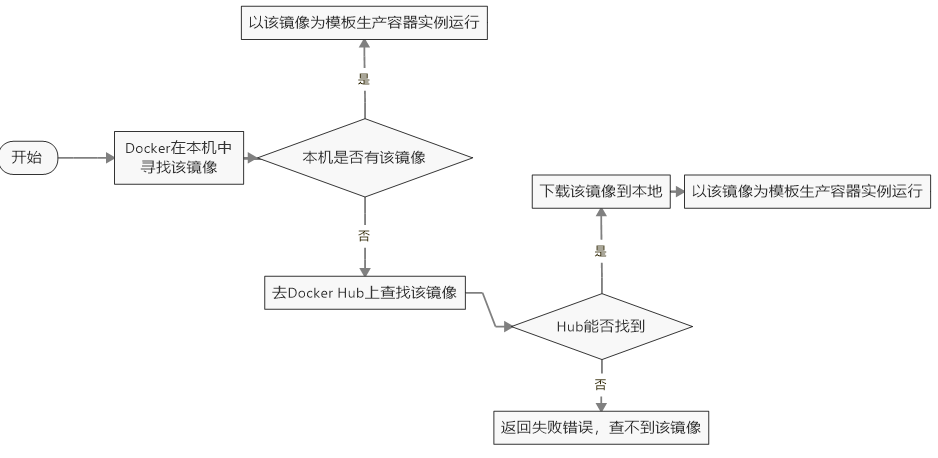
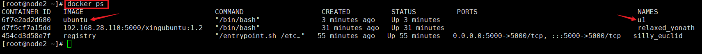

# Docker 安装步骤

## 安装

> yum安装gcc相关:       yum -y install gcc         yum -y install gcc-c++
>
> 安装需要的软件包:    yum install -y yum-utils
>
> 设置stable镜像仓库:  yum-config-manager --add-repo http://mirrors.aliyun.com/docker-ce/linux/centos/docker-ce.repo 
>
> 更新yum软件包索引: yum makecache fast
>
> 安装Docker CE:         yum -y install docker-ce docker-ce-cli containerd.io
>
> 启动Docker:              systemctl start docker
>
> 查看版本:                  docker version
>
> 试用运行:                  docker run hello-world
>
> 卸载:       ①  systemctl stop docker
>
> ​               ②  yum remove docker-ce docker-ce-cli containerd.io
>
> ​               ③  rm -rf /var/lib/docker
>
> ​               ④  rm -rf /var/lib/containerd

## run干了什么



## 为什么Docker会比VM虚拟机快

> (1) ` docker`有着比虚拟机更少的抽象层
>    由于docker不需要Hypervisor(虚拟机)实现硬件资源虚拟化,运行在docker容器上的程序直接使用的都是实际物理机的硬件资源。因此在CPU、内存利用率上docker将会在效率上有明显优势。
>
> (2)  `docker`利用的是宿主机的内核,而不需要加载操作系统OS内核
>    当新建一个容器时,docker不需要和虚拟机一样重新加载一个操作系统内核。进而避免引寻、加载操作系统内核返回等比较费时费资源的过程,当新建一个虚拟机时,虚拟机软件需要加载OS,返回新建过程是分钟级别的。而docker由于直接利用宿主机的操作系统,则省略了返回过程,因此新建一个docker容器只需要几秒钟。


# Docker 常用命令

## 帮助启动

> 启动docker： systemctl start docker
>
> 停止docker： systemctl stop docker
>
> 重启docker： systemctl restart docker
>
> 查看docker状态： systemctl status docker
>
> 开机启动： systemctl enable docker
>
> 查看docker概要信息： docker info
>
> 查看docker总体帮助文档： docker --help
>
> 查看docker命令帮助文档： docker 具体命令 --help

## 镜像命令

### 1、docker images: 列出本地的镜像


|    REPOSITORY    |       TAG        | IMAGE ID |   CREATED    |   SIZE   |
| :--------------: | :--------------: | :------: | :----------: | :------: |
| 表示镜像的仓库源 | 镜像的标签版本号 |  镜像ID  | 镜像创建时间 | 镜像大小 |

> **option** 
>
> -a: 列出本地所有的镜像（含历史映像层）
>
> -q: 只显示镜像ID

### 2、docker search [OPTIONS] : 列出本地的镜像


|   NAME   | DESCRIPTION |  STARS   |   OFFICIAL   |    AUTOMATED     |
| :------: | :---------: | :------: | :----------: | :--------------: |
| 镜像名称 |  镜像说明   | 点赞数量 | 是否是官方的 | 是否是自动构建的 |

> **option** 
>
> --limit: 只列出N个镜像，默认25个
>
> docker search --limit 5 redis

### 3、docker pull 镜像名字[:TAG]: 将该镜像拉取到本地

> 没有TAG就是拉取最新版(latest)
>
> docker pull redis 

### 4、docker system df: 查看镜像/容器/数据卷所有占的空间


### 5、docker rmi 镜像名字ID[:TAG]: 删除该镜像

> 删除单个：docker rmi -f 镜像ID
>
> 删除多个：docker rmi -f 镜像名1:TAG 镜像名2:TAG
>
> 删除全部：docker rmi -f$(docker images -qa)

## 容器命令

### 1、docker run [OPTIONS] IMGE [COMMAND] [ARG...]

> **option**说明（常用）：有些是一个减号，有些是两个减号
>
> --name="容器新名字": 为容器指定一个名称；
>
> -d: 后台运行容器并返回容器ID，也即启动守护式容器(后台运行)；
>
> -i：以交互模式运行容器，通常与 -t 同时使用；
>
> -t：为容器重新分配一个伪输入终端，通常与 -i 同时使用；
>
> 也即启动交互式容器(前台有伪终端，等待交互)；
>
> -P: 随机端口映射，大写P
>
> -p: 指定端口映射，小写p

> \#使用镜像centos:latest以交互模式启动一个容器,在容器内执行/bin/bash命令。
>
> docker run -it ubuntu /bin/bash : 启动交互式容器（前台命令行）
>
> 参数说明：
>
> -i: 交互式操作。
>
> -t: 终端。
>
> centos : centos 镜像。
>
> /bin/bash：放在镜像名后的是命令，这里我们希望有个交互式 Shell，因此用的是 /bin/bash。
>
> 要退出终端，直接输入 exit:

### 2、docker ps [options]

> **option**说明（常用）：
>
> -a :列出当前所有正在运行的容器+历史上运行过的
>
> -l :显示最近创建的容器。
>
> -n：显示最近n个创建的容器。
>
> -q :静默模式，只显示容器编号。

### 3、退出容器

> ①  exit：run进去容器，exit退出，容器停止
>
> ②  Ctrl+p+q：run进去容器，Ctrl+p+q退出，容器不停止

### 4、启动已停止运行的容器

> docker start 容器ID或者容器名

### 5、重启容器

> docker restart 容器ID或者容器名

### 6、停止容器

> docker stop 容器ID或者容器名

### 7、强制停止容器

> docker kill 容器ID或者容器名

### 8、删除已停止容器

> docker rm 容器ID或者容器名
>
> <span style="color:red; font-weight:bold">一次性删除多个容器实例</span> 
>
> docker rm -f $(docker ps -a -q)
>
> docker ps -a -q | xargs docker rm

## 容器命令（重要）

### 1、启动守护式容器（后台服务器）

> docker run -d 容器名
>
> \#使用镜像centos:latest以后台模式启动一个容器
>
> docker run -d ubuntu
>
> 问题：然后docker ps -a 进行查看, 会发现容器已经退出
> 很重要的要说明的一点: Docker容器后台运行,就必须有一个前台进程.
> 容器运行的命令如果不是那些一直挂起的命令（比如运行top，tail），就是会自动退出的。
>
> 这个是docker的机制问题,比如你的web容器,我们以nginx为例，正常情况下，
>我们配置启动服务只需要启动响应的service即可。例如service nginx start
> 但是，这样做，nginx为后台进程模式运行,就导致docker前台没有运行的应用，
> 这样的容器后台启动后,会立即自杀因为他觉得他没事可做了。
> 所以，最佳的解决方案是,将你要运行的程序以前台进程的形式运行，
> 常见就是命令行模式，表示我还有交互操作，别中断，O(∩_∩)O哈哈~

### 2、查看容器日志

> docker logs 容器ID

### 3、查看容器内运行的进程

> docker top 容器ID

### 4、查看容器内部细节

> docker inspect 容器ID

### 5、进入正在运行的容器并以命令行交互

> docker exec -it 容器ID /bin/bash  { `exec是在容器中打开新的终端，并且可以启动新的进程，用exit退出，不会导致容器的终止` }
>
> docker attach 容器ID  { `attach直接进入容器启动命令的终端，不会启动新的进程，用exit退出，会导致容器的停止` }
>
> 进入`redis`服务：(一般使用-d后台启动的程序，再用exec进入对应容器实例)
> docker exec -it 容器ID /bin/bash
> docker exec -it 容器ID redis-cli -p 6379

### 6、从容器内拷贝文件到主机上

> docker cp 容器ID:容器内路径 目的主机路径


### 7、导入和导出容器

> export: 导出容器的内容留作为一个tar归档文件[对应import命令]
>
> import: 从tar包中的内容创建一个新的文件系统再导入为镜像[对应export命令]

## 总结

|  命令   |                           英文意思                           |                           中文意思                           |
| :-----: | :----------------------------------------------------------: | :----------------------------------------------------------: |
| attach  |                Attach to a running container                 |            当前 shell 下 attach 连接指定运行镜像             |
|  build  |               Build an image from a Dockerfile               |                   通过 Dockerfile 定制镜像                   |
| commit  |         Create a new image from a container changes          |                    提交当前容器为新的镜像                    |
|   cp    | Copy files/folders from the containers filesystem to the host path |            从容器中拷贝指定文件或者目录到宿主机中            |
| create  |                    Create a new container                    |            创建一个新的容器，同 run，但不启动容器            |
|  diff   |         Inspect changes on a container's filesystem          |                     查看 docker 容器变化                     |
| events  |             Get real time events from the server             |      从 docker 服务获取容器实时事件查看 docker 容器变化      |
|  exec   |            Run a command in an existing container            |                   在已存在的容器上运行命令                   |
| export  |     Stream the contents of a container as a tar archive      |     导出容器的内容流作为一个 tar 归档文件[对应 import ]      |
| history |                 Show the history of an image                 |                     展示一个镜像形成历史                     |
| images  |                         List images                          |                       列出系统当前镜像                       |
| import  | Create a new filesystem image from the contents of a tarball |     从tar包中的内容创建一个新的文件系统映像[对应export]      |
|  info   |               Display system-wide information                |                       显示系统相关信息                       |
| inspect |         Return low-level information on a container          |                       查看容器详细信息                       |
|  kill   |                   Kill a running container                   |                    kill 指定 docker 容器                     |
|  load   |               Load an image from a tar archive               |            从一个 tar 包中加载一个镜像[对应 save]            |
|  login  |       Register or Login to the docker registry server        |               注册或者登陆一个 docker 源服务器               |
| logout  |            Log out from a Docker registry server             |                 从当前 Docker registry 退出                  |
|  logs   |                Fetch the logs of a container                 |                     输出当前容器日志信息                     |
|  port   | Lookup the public-facing port which is NAT-ed to PRIVATE_PORT |               查看映射端口对应的容器内部源端口               |
|  pause  |            Pause all processes within a container            |                           暂停容器                           |
|   ps    |                       List containers                        |                         列出容器列表                         |
|  pull   | Pull an image or a repository from the docker registry server |          从docker镜像源服务器拉取指定镜像或者库镜像          |
|  push   | Push an image or a repository to the docker registry server  |            推送指定镜像或者库镜像至docker源服务器            |
| restart |                 Restart a running container                  |                        重启运行的容器                        |
|   rm    |                Remove one or more containers                 |                     移除一个或者多个容器                     |
|   rmi   |                  Remove one or more images                   | 移除一个或多个镜像[无容器使用该镜像才可删除，否则需删除相关容器才可继续或 -f 强制删除] |
|   run   |               Run a command in a new container               |                创建一个新的容器并运行一个命令                |
|  save   |                Save an image to a tar archive                |             保存一个镜像为一个 tar 包[对应 load]             |
| search  |            Search for an image on the Docker Hub             |                   在 docker hub 中搜索镜像                   |
|  start  |                  Start a stopped containers                  |                           启动容器                           |
|  stop   |                  Stop a running containers                   |                           停止容器                           |
|   tag   |                Tag an image into a repository                |                       给源中镜像打标签                       |
|   top   |         Lookup the running processes of a container          |                   查看容器中运行的进程信息                   |
| unpause |                  Unpause a paused container                  |                         取消暂停容器                         |
| version |             Show the docker version information              |                      查看 docker 版本号                      |
|  wait   |   Block until a container stops, then print its exit code    |                  截取容器停止时的退出状态值                  |

# 本地镜像发布到私有库

## 本地镜像发布到私有库流程


## 是什么

> 1、官方Docker Hub地址：https://hub.docker.com/，中国大陆访问太慢了且准备被阿里云取代的趋势，不太主流。
>
> 2、Dockerhub、阿里云这样的公共镜像仓库可能不太方便，涉及机密的公司不可能提供镜像给公网，所以需要创建一个本地私人仓库供给团队使用，基于公司内部项目构建镜像。
>
> Docker Registry是官方提供的工具，可以用于构建私有镜像仓库

## 将本地镜像推送到私有库

### 1、下载镜像Docker Registry


### 2、运行私有库Registry，相当于本地有个私有Docker hub

> docker run -d -p 5000:5000 -v /xing/myregistry/:/tmp/registry --privileged=true registry
>
> 默认情况，仓库被创建在容器的/var/lib/registry目录下，建议自行用容器卷映射，方便于宿主机联调


### 3、案例演示创建一个新镜像，Ubuntu安装ifconfig命令

#### 在原始的Ubuntu镜像上安装`ifconfig` 

> apt-get update
>
> apt-get install net-tools


#### 安装完成后，`commit`我们自己的新镜像

> docker commit -m="提交的描述信息" -a="作者" 容器ID 要创建的目标镜像名:[标签名]
>
> 命令：<span style="color:red; font-weight:bold">在容器外执行，记得</span> 
>
> docker commit -m="ifconfig cmd add" -a="xing" a69d7c825c4f xingubuntu:1.2


#### 启动自己的新镜像并和原来的对比


### 4、curl验证私服库上有什么镜像

> curl -XGET http://192.168.28.110:5000/v2/_catalog 


### 5、将新镜像xingubuntu:1.2修改符合私服规范的Tag

>docker tag xingubuntu:1.2 192.168.28.110:5000/xingubuntu:1.2


### 6、修改配置文件使之支持http

> vim命令新增如下红色内容：vim /etc/docker/daemon.json
>
> ```json
> {
> "registry-mirrors": ["https://aa25jngu.mirror.aliyuncs.com"],
> "insecure-registries": ["192.168.28.110:5000"]
> }
> ```
> 上述理由：docker默认不允许http方式推送镜像，通过配置选项来取消这个限制。====> 修改完后如果不生效，建议重启docker
>
> 重启docker： systemctl restart docker
>
> 运行私有库：docker run -d -p 5000:5000 -v /xing/myregistry/:/tmp/registry --privileged=true registry

### 7、push推送到私服库

> docker push 192.168.28.110:5000/xingubuntu:1.2


### 8、curl验证私服库 上有什么镜像2

> curl -XGET http://192.168.28.110:5000/v2/_catalog 


### 9、pull到本地并运行


### 10、运行`192.168.28.110:5000/xingubuntu`镜像


# Docker 容器数据卷

## 是什么

> 将docker容器内的数据保存进宿主机的磁盘中
>
> 运行一个带有容器卷存储功能的容器实例：docker run -it --privileged=true -v/宿主机绝对路径目录:/容器内目录 镜像名

## 能干什么

> \* 将运用与运行的环境打包镜像，run后形成容器实例运行 ，但是我们对数据的要求希望是持久化的
>
> Docker容器产生的数据，如果不备份，那么当容器实例删除后，容器内的数据自然也就没有了。
> 为了能保存数据在docker中我们使用卷。
>
> **特点**：
> 1、数据卷可在容器之间共享或重用数据
> 2、卷中的更改可以直接实时生效，爽
> 3、数据卷中的更改不会包含在镜像的更新中
> 4、数据卷的生命周期一直持续到没有容器使用它为止

## 案例

> docker run -it --privileged=true -v/tmp/host_data:/tmp/docker_data --name=u1 ubuntu





### 查看数据卷是否挂载成功

> docker inspect 容器ID


> 1、docker修改，主机同步获得 
>
> 2、主机修改，docker同步获得
>
> 3、docker容器stop，主机修改，docker容器重启看数据是否同步。
>
> <span style="color:red; font-weight:bold">若Ubuntu挂了，在宿主机上新增或修改文件，当Ubuntu再次启动时新增或修改的文件会被同步操作</span> 

### 读写规则映射添加说明（读写【默认】、只读）

> 读写：默认就是`rw` 
>
> `docker run -it --privileged=true -v/tmp/host_data:/tmp/docker_data --name=u1 ubuntu` 
>
> 只读：容器实例内部被限制，只能读取不能写
>
> `docker run -it --privileged=true -v/mydocker/u:/tmp/u:ro --name=u2 ubuntu` 


### 卷的继承和共享

#### 容器1完成和宿主机的映射

> docker run -it --privileged=true -v/宿主机绝对路径目录:/容器内目录 镜像名
>
> docker run -it --privileged=true -v /mydocker/u:/tmp --name u1 ubuntu

#### 容器2继承容器1的卷规则

> docker run -it --privileged=true -volumes-from 父类 --name u2 ubuntu
>
> docker run -it --privileged=true -volumes-from u1 --name u2 ubuntu

> <span style="color:red; font-weight:bold">当u1挂了u2与宿主机还是可以相互映射</span> 

# 常规安装

> 运行Tomcat（无忧版）：docker run -d -p 8080:8080 --name tomcat8 billygoo/tomcat8-jdk8
>
> 运行MySQL（实战版）：docker run -d -p 3306:3306 --privileged=true -v /xinguse/mysql/log:/var/log/mysql -v /xinguse/mysql/data:/var/lib/mysql -v /xinguse/mysql/conf:/etc/mysql/conf.d -e MYSQL_ROOT_PASSWORD=5555 --name mysql mysql:5.7 
>
> 运行Redis（实用版）：docker run -p 6379:6379 --name redis7 --privileged=true -v /app/redis/redis.conf:/etc/redis/redis.conf -v /app/redis/data:/data -d redis:7.0.11 redis-server /etc/redis/redis.conf


# Docker 复杂安装详说

## 安装MySQL主从复制搭建步骤

### 1、新建主服务器容器实例3307

> docker run -p 3307:3306 --name mysql-master -v /mydata/mysql-master/log:/var/log/mysql -v /mydata/mysql-master/data:/var/lib/mysql -v /mydata/mysql-master/conf:/etc/mysql -e MYSQL_ROOT_PASSWORD=root -d mysql:5.7

### 2、进入/mydata/mysql-master/conf 目录下新建my.cnf

> vim my.cnf
>
> [mysqld]
> \## 设置server_id，同一局域网中需要唯一
> server_id=101 
> \## 指定不需要同步的数据库名称
> binlog-ignore-db=mysql 
> \## 开启二进制日志功能
> log-bin=mall-mysql-bin 
> \## 设置二进制日志使用内存大小（事务）
> binlog_cache_size=1M 
> \## 设置使用的二进制日志格式（mixed,statement,row）
> binlog_format=mixed 
> \## 二进制日志过期清理时间。默认值为0，表示不自动清理。
> expire_logs_days=7 
> \## 跳过主从复制中遇到的所有错误或指定类型的错误，避免slave端复制中断。
> \## 如：1062错误是指一些主键重复，1032错误是因为主从数据库数据不一致
> slave_skip_errors=1062

### 3、修改完配置后重启master实例

> docker restart mysql-master

### 4、进入mysql-master容器

> docker exec -it mysql-master /bin/bash
>
> mysql -uroot -proot

### 5、master容器实例内创建数据同步用户

> create USER 'slave'@'%' IDENTIFIED BY '123456';
>
> GRANT REPLICATION SLAVE, REPLICATION CLIENT ON * . * TO 'slave'@'%';


### 6、新建从服务器容器实例3308

> docker run -p 3308:3306 --name mysql-slave -v /mydata/mysql-slave/log:/var/log/mysql -v /mydata/mysql-slave/data:/var/lib/mysql -v /mydata/mysql-slave/conf:/etc/mysql -e MYSQL_ROOT_PASSWORD=root -d mysql:5.7

### 7、进入/mydata/mysql-slave/conf目录下新建my.cnf

> vim my.cnf
>
> [mysqld]
> \## 设置server_id，同一局域网中需要唯一
> server_id=102
> \## 指定不需要同步的数据库名称
> binlog-ignore-db=mysql 
> \## 开启二进制日志功能，以备Slave作为其它数据库实例的Master时使用
> log-bin=mall-mysql-slave1-bin 
> \## 设置二进制日志使用内存大小（事务）
> binlog_cache_size=1M 
> \## 设置使用的二进制日志格式（mixed,statement,row）
> binlog_format=mixed 
> \## 二进制日志过期清理时间。默认值为0，表示不自动清理。
> expire_logs_days=7 
> \## 跳过主从复制中遇到的所有错误或指定类型的错误，避免slave端复制中断。
> \## 如：1062错误是指一些主键重复，1032错误是因为主从数据库数据不一致
> slave_skip_errors=1062 
> \## relay_log配置中继日志
> relay_log=mall-mysql-relay-bin 
> \## log_slave_updates表示slave将复制事件写进自己的二进制日志
> log_slave_updates=1 
> \## slave设置为只读（具有super权限的用户除外）
> read_only=1

### 8、修改完配置后重启slave实例

> docker restart mysql-slave

### 9、在主数据库中查看主从同步状态

> show master status;

### 10、进入mysql-slave容器

> docker exec -it mysql-slave /bin/bash
>
> mysql -uroot -proot

### 11、在从数据库中配置主从复制

> change master to master_host='192.168.28.110', master_user='slave', master_password='123456', master_port=3307, master_log_file='mall-mysql-bin.000001', master_log_pos=617, master_connect_retry=30;
>
> master_host：主数据库的IP地址；
>
> master_port：主数据库的运行端口；
>
> master_user：在主数据库创建的用于同步数据的用户账号；
>
> master_password：在主数据库创建的用于同步数据的用户密码；
>
> master_log_file：指定从数据库要复制数据的日志文件，通过查看主数据的状态，获取File参数；
>
> master_log_pos：指定从数据库从哪个位置开始复制数据，通过查看主数据的状态，获取Position参数；
>
> master_connect_retry：连接失败重试的时间间隔，单位为秒。

### 12、在从数据库中查看主从同步状态

> show slave status \G;


### 13、在从数据库中开启主从同步

> start slave;

### 14、查看从数据库状态发现已经同步


## 安装redis集群

### 1、哈希取余分区


> 2亿条记录就是2亿个k,v，我们单机不行必须要分布式多机，假设有3台机器构成一个集群，用户每次读写操作都是根据公式：
> hash(key) % N个机器台数，计算出哈希值，用来决定数据映射到哪一个节点上。
>
> **优点**：
> 简单粗暴，直接有效，只需要预估好数据规划好节点，例如3台、8台、10台，就能保证一段时间的数据支撑。使用Hash算法让固定的一部分请求落到同一台服务器上，这样每台服务器固定处理一部分请求（并维护这些请求的信息），起到负载均衡+分而治之的作用。
>
> **缺点**：
> 原来规划好的节点，进行扩容或者缩容就比较麻烦了额，不管扩缩，每次数据变动导致节点有变动，映射关系需要重新进行计算，在服务器个数固定不变时没有问题，如果需要弹性扩容或故障停机的情况下，原来的取模公式就会发生变化：Hash(key)/3会变成Hash(key) /?。此时地址经过取余运算的结果将发生很大变化，根据公式获取的服务器也会变得不可控。
> 某个redis机器宕机了，由于台数数量变化，会导致hash取余全部数据重新洗牌。

### 2、一致性哈希算法分区

#### 是什么

> 一致性Hash算法背景
>
> 　　一致性哈希算法在1997年由麻省理工学院中提出的，设计目标是为了解决分布式缓存数据变动和映射问题，某个机器宕机了，分母数量改变了，自然取余数不OK了。

#### 能干什么

> 提出一致性Hash解决方案。目的是当服务器个数发生变动时，尽量减少影响客户端到服务器的映射关系

#### 3大步骤

##### 1、算法构建一致性哈希环

> 一致性哈希环
> 		一致性哈希算法必然有个hash函数并按照算法产生hash值，这个算法的所有可能哈希值会构成一个全量集，这个集合可以成为一个hash空间[0, 2^32^ - 1]，这个是一个线性空间，但是在算法中，我们通过适当的逻辑控制将它首尾相连(0 = 2^32^)，这样让它逻辑上形成了一个环形空间。
>
> ​		它也是按照使用取模的方法，前面笔记介绍的节点取模法是对节点（服务器）的数量进行取模。而一致性Hash算法是对2^32^取模，简单来说，一致性Hash算法将整个哈希值空间组织成一个虚拟的圆环，如假设某哈希函数H的值空间为0-2^32-1^（即哈希值是一个32位无符号整形），整个哈希环如下图：整个空间按顺时针方向组织，圆环的正上方的点代表0，0点右侧的第一个点代表1，以此类推，2、3、4、……直到2^32^ - 1，也就是说0点左侧的第一个点代表2^32^ - 1，0和2^32^ - 1在零点中方向重合，我们把这个由2^32^个点组成的圆环称为Hash环。


##### 2、服务器IP节点映射

> 节点映射
> 		将集群中各个IP节点映射到环上的某一个位置。
> 		将各个服务器使用Hash进行一个哈希，具体可以选择服务器的IP或主机名作为关键字进行哈希，这样每台机器就能确定其在哈希环上的位置。假如4个节点NodeA、B、C、D，经过IP地址的哈希函数计算(hash(ip))，使用IP地址哈希后在环空间的位置如下:


##### 3、key落到服务器的落键规则

> 当我们需要存储一个kv键值对时，首先计算key的hash值，hash(key)，将这个key使用相同的函数Hash计算出哈希值并确定此数据在环上的位置，从此位置沿环顺时针“行走”，第一台遇到的服务器就是其应该定位到的服务器，并将该键值对存储在该节点上。
> 如我们有Object A、Object B、Object C、Object D四个数据对象，经过哈希计算后，在环空间上的位置如下：根据一致性Hash算法，数据A会被定为到Node A上，B被定为到Node B上，C被定为到Node C上，D被定为到Node D上。


#### 优点

##### 1、容错性

> 容错性
> 		假设Node C宕机，可以看到此时对象A、B、D不会受到影响，只有C对象被重定位到Node D。一般的，在一致性Hash算法中，如果一台服务器不可用，则受影响的数据仅仅是此服务器到其环空间中前一台服务器（即沿着逆时针方向行走遇到的第一台服务器）之间数据，其它不会受到影响。简单说，就是C挂了，受到影响的只是B、C之间的数据，并且这些数据会转移到D进行存储。


##### 2、扩展性

> 扩展性
> 		数据量增加了，需要增加一台节点NodeX，X的位置在A和B之间，那收到影响的也就是A到X之间的数据，重新把A到X的数据录入到X上即可，不会导致hash取余全部数据重新洗牌。


#### 缺点

##### 数据倾斜问题

> Hash环的数据倾斜问题
> 		一致性Hash算法在服务节点太少时，容易因为节点分布不均匀而造成数据倾斜（被缓存的对象大部分集中缓存在某一台服务器上）问题，例如系统中只有两台服务器：


#### 总结

> 为了在节点数目发生改变时尽可能少的迁移数据
>
> 将所有的存储节点排列在收尾相接的Hash环上，每个key在计算Hash后会顺时针找到临近的存储节点存放。而当有节点加入或退出时仅影响该节点在Hash环上顺时针相邻的后续节点。  
>
> 优点：加入和删除节点只影响哈希环中顺时针方向的相邻的节点，对其他节点无影响。
>
> 缺点：数据的分布和节点的位置有关，因为这些节点不是均匀的分布在哈希环上的，所以数据在进行存储时达不到均匀分布的效果。

### 3、哈希槽分区

#### 为什么出现

是为解决一致性哈希算法的数据倾斜问题

哈希槽实质就是一个数组，数组`[0,2^14^ - 1]`形成`hash slot`空间。

#### 能干什么

> 解决均匀分配的问题，在数据和节点之间又加入了一层，把这层称为哈希槽（slot），用于管理数据和节点之间的关系，现在就相当于节点上放的是槽，槽里放的是数据。


> 槽解决的是粒度问题，相当于把粒度变大了，这样便于数据移动。
> 哈希解决的是映射问题，使用key的哈希值来计算所在的槽，便于数据分配。

#### 多少个hash槽

> ​		一个集群只能有16384个槽，编号0-16383（0-2^14^ - 1）。这些槽会分配给集群中的所有主节点，分配策略没有要求。可以指定哪些编号的槽分配给哪个主节点。集群会记录节点和槽的对应关系。解决了节点和槽的关系后，接下来就需要对key求哈希值，然后对16384取余，余数是几key就落入对应的槽里。`slot = CRC16(key) % 16384`。以槽为单位移动数据，因为槽的数目是固定的，处理起来比较容易，这样数据移动问题就解决了。

#### 哈希槽计算

> ​		Redis 集群中内置了 16384 个哈希槽，redis 会根据节点数量大致均等的将哈希槽映射到不同的节点。当需要在 Redis 集群中放置一个 key-value时，redis 先对 key 使用 crc16 算法算出一个结果，然后把结果对 16384 求余数，这样每个 key 都会对应一个编号在 0-16383 之间的哈希槽，也就是映射到某个节点上。如下代码，key之A 、B在Node2， key之C落在Node3上


### 开打步骤

#### 1、3主3从redis集群配置

> docker run -d --name redis-node-1 --net host --privileged=true -v /data/redis/share/redis-node-1:/data redis:7.0.11 --cluster-enabled yes --appendonly yes --port 6381
>
> docker run -d --name redis-node-2 --net host --privileged=true -v /data/redis/share/redis-node-2:/data redis:7.0.11 --cluster-enabled yes --appendonly yes --port 6382
>
> docker run -d --name redis-node-3 --net host --privileged=true -v /data/redis/share/redis-node-3:/data redis:7.0.11 --cluster-enabled yes --appendonly yes --port 6383
>
> docker run -d --name redis-node-4 --net host --privileged=true -v /data/redis/share/redis-node-4:/data redis:7.0.11 --cluster-enabled yes --appendonly yes --port 6384
>
> docker run -d --name redis-node-5 --net host --privileged=true -v /data/redis/share/redis-node-5:/data redis:7.0.11 --cluster-enabled yes --appendonly yes --port 6385
>
> docker run -d --name redis-node-6 --net host --privileged=true -v /data/redis/share/redis-node-6:/data redis:7.0.11 --cluster-enabled yes --appendonly yes --port 6386

> docker run: 创建并运行`docker`容器实例
>
> --name redis-node-6: 容器名字
>
> --net host: 使用宿主机的IP和端口，默认
>
> --privileged=true: 获取宿主机root用户权限
>
> -v /data/redis/share/redis-node-6:/data: 容器卷，宿主机地址:docker内部 地址
>
> redis:7.0.11: redis镜像和版本号
>
> --cluster-enabled yes: 开启redis集群
>
> --appendonly yes: 开启持久化
>
> --port 6381: redis端口号


> 进入容器redis-node-1并为6台机器构建集群关系
>
> - docker exec -it redis-node-1 /bin/bash
>
> 执行：redis-cli --cluster create 192.168.28.110:6381 192.168.28.110:6382 192.168.28.110:6383 192.168.28.110:6384 192.168.28.110:6385 192.168.28.110:6386 --cluster-replicas 1
>
> --cluster-replicas 1 表示为每个master创建一个slave节点


> cluster info：查看集群信息
>
> cluster nodes：查看节点信息


#### 2、主从容错切换迁移案例

##### （1）数据读写存储

###### ①  启动6机构成的集群并通过exec进入

###### ②  对6381新增两个key

###### ③  防止路由失效加参数`-c`并新增两个key


###### ④  查看集群信息

>redis-cli --cluster check 192.168.28.110:6381


##### （2）容错切换迁移

###### ①  主6381和从机切换，先停止主机6381

> 6381主机停了，对应的真实从机上位
>
> 6381作为1号主机分配的从机以实际情况为准，具体是几号机器就是几号

###### ②  再次查看集群信息


> `6381`宕机了，`6385`上位成为了新的`master`。
>
> 备注：本次脑图笔记`6381`为主下面挂从`6385`。
>
> 每次案例下面挂的从机以际情况为准，具体是几号机器就是几号

##### （3）先还原之前的3主3从

###### ①  先启动`6381` 

> docker start redis-node-1
>
> <span style="color:#4662d9; font-weight:bold">6381挂在6385下面</span> 

###### ②  再停`6385` 

> docker stop redis-node-5

###### ③  再启动`6385` 

> docker start redis-node-5
>
> <span style="color:#4662d9; font-weight:bold">6385挂在6381下面</span> 

##### （4）查看集群状态

> redis-cli --cluster check 192.168.28.110:6381

#### 3、主从扩容案例

##### （1）新建`6387`、`6388`两个节点 + 新建后启动 + 查看是否8节点

> docker run -d --name redis-node-7 --net host --privileged=true -v /data/redis/share/redis-node-7:/data redis:7.0.11 --cluster-enabled yes --appendonly yes --port 6387
>
> docker run -d --name redis-node-8 --net host --privileged=true -v /data/redis/share/redis-node-8:/data redis:7.0.11 --cluster-enabled yes --appendonly yes --port 6388

##### （2）进入`6387`容器实例内部

> docker exec -it redis-node-7 /bin/bash

##### （3）新增的`6387`节点（空槽号）作为`master`节点加入源集群

> 将新增的6387作为master节点加入集群
>
> redis-cli --cluster add-node 192.168.28.110:6387 192.168.28.110:6381
>
> 6387 就是将要作为master新增节点
>
> 6381 就是原来集群节点里面的领路人，相当于6387拜拜6381的码头从而找到组织加入集群


##### （4）检查集群情况第1次

> **redis-cli --cluster check 真实ip地址:端口号**(随便一台机器) 
>
> redis-cli --cluster check 192.168.28.110:6381


##### （5）重新分配槽号

> 命令: **redis-cli --cluster reshard IP地址:端口号** 
>
> redis-cli --cluster reshard 192.168.28.110:6381


##### （6）检查集群情况第2次

> redis-cli --cluster check 192.168.28.110:6381


##### （7）为主节点6387分配从节点6388

>  命令: **redis-cli --cluster add-node ip:新slave端口 ip:新master端口 --cluster-slave --cluster-master-id 新主机节点ID** 
>
> redis-cli --cluster add-node 192.168.28.110:6388 192.168.28.110:6387 --cluster-slave --cluster-master-id e4781f644d4a4e4d4b4d107157b9ba8144631451-------这个是6387的编号，按照自己实际情况


##### （8）检查集群情况第3次

> redis-cli --cluster check 192.168.28.110:6382


#### 4、主从缩容案例

> 目的：`6387`和`6388`下线

##### （1）将6388删除

> 命令：**redis-cli --cluster del-node ip:从机端口 从机6388节点ID** 
>
> redis-cli --cluster del-node 192.168.28.110:6388 5d149074b7e57b802287d1797a874ed7a1a284a8
>
> 检查集群情况
>
> redis-cli --cluster check 192.168.28.110:6382

##### （2）将6387的槽号清空，重新分配，本例将清出来的槽号都给6381

> **redis-cli --cluster reshard 192.168.28.110:6381** 


##### （3）检查集群情况

> redis-cli --cluster check 192.168.28.110:6381
>
> 4096个槽位都指给6381，它变成了8192个槽位，相当于全部都给6381了，不然要输入3次，一锅端


##### （4）删除6387

> 命令：**redis-cli --cluster del-node ip:端口 6387节点ID** 
>
> redis-cli --cluster del-node 192.168.28.110:6387 e4781f644d4a4e4d4b4d107157b9ba8144631451


> redis-cli --cluster check 192.168.28.110:6381


# DockerDile 解析


## 常用保留字指令

#### FROM: 基础镜像，当前新镜像是基于哪个镜像的，指定一个已经存在的镜像作为模板，第一条必须是from

#### MAINTAINER: 镜像维护者的姓名和邮箱地址

#### RUN: 容器构建时需要运行的命令

##### ①  RUN < 命令行命令 >

> < 命令行命令 > 等同于，在终端操作的shell命令 
>
> 例如：RUN yum -y install vim

##### ②  RUN ["可执行文件","参数1","参数2"]

> 例如：RUN ["./test.php","dev", "offline"] 等价于 RUN ./test.php dev offline
>
> RUN是在`docker build`时运行

#### EXPOSE: 当前容器对外暴露出的端口

#### WORKDIR: 指定在创建容器后，终端默认登陆的进来**工作目录**，一个落脚点

#### USER: 指定该镜像以什么样的用户去执行，如果都不指定，默认是root

#### ENV: 用来在构建镜像过程中设置**环境变量** 

> ENV MY_PATH /usr/mytest
> 这个环境变量可以在后续的任何RUN指令中使用，这就如同在命令前面指定了环境变量前缀一样；也可以在其它指令中直接使用这些环境变量，例如：WORKDIR $MY_PATH

#### ADD: 将宿主机目录下的文件拷贝进镜像且会自动处理URL和解压tar压缩包

#### COPY: 类似ADD，拷贝文件和目录到镜像中。

> 将从构建上下文目录中 <源路径> 的文件/目录复制到新的一层的镜像内的 <目标路径> 位置

#### VOLUME: 容器数据卷，用于数据保存和持久化工作

#### CMD: 指定容器启动后的要干的事情


##### <span style="color:red; font-weight:bold">注意</span> 

①  Dockerfile 中可以有多个 CMD 指令，<span style="color:red; font-weight:bold">但只有最后一个生效，CMD 会被 docker run 之后的参数替换</span> 

②  参考官网Tomcat的dockerfile演示讲解


##### <span style="color:#4662d9; font-weight:bold">CMD 与 RUN 区别</span> 

> **CMD**是在`docker run`时运行。
>
> **RUN**是在`docker build`时运行。

#### ENTRYPOINT: 也是用来指定一个容器启动时要运行的命令

> 类似于 CMD 指令，但是ENTRYPOINT不会被docker run后面的命令覆盖，而且这些命令行参数会被当作参数送给 ENTRYPOINT 指令指定的程序

##### <span style="color:#4662d9; font-weight:bold">优点</span> 

> 在执行docker run的时候可以指定 ENTRYPOINT 运行所需的参数。

##### <span style="color:red; font-weight:bold">注意</span> 

> 如果 Dockerfile 中如果存在多个 ENTRYPOINT 指令，仅最后一个生效。

### 总结


## 案例

### 自定义镜像 Centos7-java8

#### 要求

> 在Centos7镜像具备`vim + ifconfig + jdk8` 
>
> JDK官网地址：https://www.oracle.com/java/technologies/downloads/#java8 
>
> 小柒博客|开源软件镜像站：https://mirrors.yangxingzhen.com/jdk/

#### 编写

```
FROM centos:7
MAINTAINER xing<187********@163.com>
 
ENV MYPATH /usr/local
WORKDIR $MYPATH
 
#安装vim编辑器
RUN yum -y install vim
#安装ifconfig命令查看网络IP
RUN yum -y install net-tools
#安装java8及lib库
RUN yum -y install glibc.i686
RUN mkdir /usr/local/java
#ADD 是相对路径jar,把jdk-8u171-linux-x64.tar.gz添加到容器中,安装包必须要和Dockerfile文件在同一位置
ADD jdk-8u171-linux-x64.tar.gz /usr/local/java/
#配置java环境变量
ENV JAVA_HOME /usr/local/java/jdk1.8.0_171
ENV JRE_HOME $JAVA_HOME/jre
ENV CLASSPATH $JAVA_HOME/lib/dt.jar:$JAVA_HOME/lib/tools.jar:$JRE_HOME/lib:$CLASSPATH
ENV PATH $JAVA_HOME/bin:$PATH
 
EXPOSE 80
 
CMD echo $MYPATH
CMD echo "success--------------ok"
CMD /bin/bash
```


### 虚悬镜像

> 仓库名、标签都是`<none>`的镜像，俗称dangling image

> 查看：docker images ls -f dangling=true


> 删除：docker image prune


# Docker 微服务实战

## 通过IDEA新建一个普通微服务模块

## 通过dockerfile发布微服务部署到docker容器

### IDEA工具里面搞定微服务jar包


### 编写Dockerfile

> 将微服务jar包和Dockerfile文件上传到同一个目录下`/mydocker` 

```
# 基础镜像使用java
FROM java:8
# 作者
MAINTAINER xing
# VOLUME 指定临时文件目录为/tmp，在主机/var/lib/docker目录下创建了一个临时文件并链接到容器的/tmp
VOLUME /tmp
# 将jar包添加到容器中并更名为zzyy_docker.jar
ADD parkingSystem-0.0.1-SNAPSHOT.jar parkingSystem_docker.jar
# 运行jar包
RUN bash -c 'touch /parkingSystem_docker.jar'
ENTRYPOINT ["java","-jar","/parkingSystem_docker.jar"]
#暴露8080端口作为微服务
EXPOSE 8080
```

### 构建镜像


### 运行容器

> docker run -d -p 8080:8080 parkingsystem:1.1


# Docker 网络

## 是什么

### docker不启动，默认网络情况


> 在CentOS7的安装过程中如果有<span style="color:red; font-weight:bold">选择相关虚拟化的的服务安装系统后</span>，启动网卡时会发现有一个以网桥连接的私网地址的virbr0网卡(virbr0网卡：它还有一个固定的默认IP地址192.168.122.1)，是做虚拟机网桥的使用的，其作用是为连接其上的虚机网卡提供 NAT访问外网的功能。
>
> 我们之前学习Linux安装，勾选安装系统的时候附带了libvirt服务才会生成的一个东西，如果不需要可以直接将libvirtd服务卸载，yum remove libvirt-libs.x86_64

### docker启动后，网络情况


## 常用基本命令


> 查看网络：docker network ls
>
> 查看网络源数据：docker network inspect xxx(网络名字)
>
> 删除网络：docker network rm xxx(网络名字)

## 能干嘛

> 容器间的互联和通信以及端口映射
>
> 容器IP变动时候可以通过服务名直接 网络通信而不受到影响

## 网络模式

### 总体介绍

> bridge模式：使用`--network bridge`指定，默认使用`docker0` 
>
> host模式：使用`--network host`指定
>
> none模式：使用`--network none`指定
>
> container模式：使用`--network container:NAME`或者`容器ID`指定

### 容器实例内默认网络IP生产规则

> <span style="color:#4662d9; font-weight:bold">结论</span>：doker容器内部的ip是有可能会发生改变的

### 案例说明

#### （1）bridge

> Docker 服务默认会创建一个 docker0 网桥（其上有一个 docker0 内部接口），该桥接网络的名称为docker0，它在内核层连通了其他的物理或虚拟网卡，这就将所有容器和本地主机都放到同一个物理网络。Docker 默认指定了 docker0 接口 的 IP 地址和子网掩码，让主机和容器之间可以通过网桥相互通信。
>
> \# 查看 bridge 网络的详细信息，并通过 grep 获取名称项
> docker network inspect bridge | grep name
>
> ifconfig
>
> 

##### 案例

> 1、Docker使用Linux桥接，在宿主机虚拟一个Docker容器网桥(docker0)，Docker启动一个容器时会根据Docker网桥的网段分配给容器一个IP地址，称为Container-IP，同时Docker网桥是每个容器的默认网关。因为在同一宿主机内的容器都接入同一个网桥，这样容器之间就能够通过容器的Container-IP直接通信。
>
> 2、docker run 的时候，没有指定network的话默认使用的网桥模式就是bridge，使用的就是docker0。在宿主机ifconfig,就可以看到docker0和自己create的network（后面讲）eth0，eth1，eth2……代表网卡一，网卡二，网卡三……，lo代表127.0.0.1，即localhost，inet addr用来表示网卡的IP地址
>
> 3、网桥docker0创建一对对等虚拟设备接口一个叫veth，另一个叫eth0，成对匹配。
>
>   3.1、整个宿主机的网桥模式都是docker0，类似一个交换机有一堆接口，每个接口叫veth，在本地主机和容器内分别创建一个虚拟接口，并让他们彼此联通（这样一对接口叫veth pair）；
>
>   3.2、每个容器实例内部也有一块网卡，每个接口叫eth0；
>
>   3.3、docker0上面的每个veth匹配某个容器实例内部的eth0，两两配对，一一匹配。
>
>  通过上述，将宿主机上的所有容器都连接到这个内部网络上，两个容器在同一个网络下,会从这个网关下各自拿到分配的ip，此时两个容器的网络是互通的。
>
> 

##### 代码

> docker run -d -p 8081:8080 --name tomcat81 billygoo/tomcat-jdk8
>
> docker run -d -p 8082:8080 --name tomcat82 billygoo/tomcat-jdk8


#### （2）host

> 直接使用宿主机的 IP 地址与外界进行通信，不再需要额外进行NAT 转换。

##### 案例

> 容器将<span style="color:red; font-weight:bold">不会获得</span>一个独立的`Network Namespace`， 而是和宿主机共用一个`Network Namespace`。<span style="color:red; font-weight:bold">容器将不会虚拟出自己的网卡而是使用宿主机的IP和端口</span>。


##### 代码

###### ①  警告


> <span style="color:#4662d9; font-weight:bold">问题</span>：docke启动时总是遇见标题中的警告
>
> <span style="color:#4662d9; font-weight:bold">原因</span>：docker启动时指定--network=host或-net=host，如果还指定了-p映射端口，那这个时候就会有此警告，并且通过-p设置的参数将不会起到任何作用，端口号会以主机端口号为主，重复时则递增。
>
> <span style="color:#4662d9; font-weight:bold">解决</span>：解决的办法就是使用docker的其他网络模式，例如<span style="color:#4662d9; font-weight:bold">--network=bridge</span>，这样就可以解决问题，或者直接无视。。。。O(∩_∩)O哈哈~

###### ②  正确

> docker run -d <span style="color:#4662d9; font-weight:bold">--network host</span> --name tomcat83 billygoo/tomcat8-jdk8


> <span style="color:red; font-weight:bold">没有设置`-p`的端口映射了，如何访问启动的tomcat83？</span> 
>
> http://宿主机IP:8080/
>
> 在CentOS里面用默认的火狐浏览器访问容器内的tomcat83看到访问成功，因为此时容器的IP借用主机的，所以容器共享宿主机网络IP，这样的好处是外部主机与容器可以直接通信。

#### （3）none

> 在none模式下，并不为Docker容器进行任何网络配置。 
>
> 也就是说，这个Docker容器没有网卡、IP、路由等信息，只有一个lo需要我们自己为Docker容器添加网卡、配置IP等。


#### （4）container

> 新建的容器和已经存在的一个容器共享一个网络ip配置而不是和宿主机共享。新创建的容器不会创建自己的网卡，配置自己的IP，而是和一个指定的容器共享IP、端口范围等。同样，两个容器除了网络方面，其他的如文件系统、进程列表等还是隔离的。


##### 案例

> Alpine Linux 是一款独立的、非商业的通用 Linux 发行版，专为追求安全性、简单性和资源效率的用户而设计。 可能很多人没听说过这个 Linux 发行版本，但是经常用 Docker 的朋友可能都用过，因为他小，简单，安全而著称，所以作为基础镜像是非常好的一个选择，可谓是麻雀虽小但五脏俱全，镜像非常小巧，不到 6M的大小，所以特别适合容器打包。

> docker run -it --name alpine1 alpine /bin/sh
>
> docker run -it **--network container:alpine1** --name alpine2 alpine /bin/sh


#### （5）自定义网络

##### 案例

###### before

> docker run -d -p 8081:8080 --name tomcat81 billygoo/tomcat8-jdk8
>
> docker run -d -p 8082:8080 --name tomcat82 billygoo/tomcat8-jdk8
>
> 上述成功启动并用`docker exec`进入各自容器实例内部

> 按照IP地址ping是OK的
>
> 
>
> 按照服务名ping结果？？？
>
> 

###### after

> ①	新建自定义网络
>
> 
>
> ②	新建容器加入上一步新建的自定义网络
>
> docker run -d -p 8081:8080 --network xing_network --name tomcat81 billygoo/tomcat8-jdk8
>
> docker run -d -p 8082:8080 --network xing_network --name tomcat82 billygoo/tomcat8-jdk8
>
> ③	互相ping测试
>
> 

## Docker平台架构图解

> 整体说明：
>
> 从其架构和运行流程来看，Docker 是一个 C/S 模式的架构，后端是一个松耦合架构，众多模块各司其职。 
>
> Docker 运行的基本流程为：
>
> 1、用户是使用 Docker Client 与 Docker Daemon 建立通信，并发送请求给后者。
>
> 2、Docker Daemon 作为 Docker 架构中的主体部分，首先提供 Docker Server 的功能使其可以接受 Docker Client 的请求。
>
> 3、Docker Engine 执行 Docker 内部的一系列工作，每一项工作都是以一个 Job 的形式的存在。
>
> 4、Job 的运行过程中，当需要容器镜像时，则从 Docker Registry 中下载镜像，并通过镜像管理驱动 Graph driver将下载镜像以Graph的形式存储。
>
> 5、当需要为 Docker 创建网络环境时，通过网络管理驱动 Network driver 创建并配置 Docker 容器网络环境。
>
> 6、当需要限制 Docker 容器运行资源或执行用户指令等操作时，则通过 Execdriver 来完成。
>
> 7、Libcontainer是一项独立的容器管理包，Network driver以及Exec driver都是通过Libcontainer来实现具体对容器进行的操作。


# Docker-compose容器编排

## What

> Compose 是 Docker 公司推出的一个工具软件，可以管理多个 Docker 容器组成一个应用。你需要定义一个 YAML 格式的配置文件docker-compose.yml，<span style="color:#4662d9; font-weight:bold">写好多个容器之间的调用关系</span>。然后，只要一个命令，就能同时启动/关闭这些容器。
>
> Docker-Compose是Docker官方的开源项目，负责实现对Docker容器集群的快速编排。

## Can

> docker建议我们每一个容器中只运行一个服务,因为docker容器本身占用资源极少,所以最好是将每个服务单独的分割开来但是这样我们又面临了一个问题？
>
> 如果我需要同时部署好多个服务,难道要每个服务单独写Dockerfile然后在构建镜像,构建容器,这样累都累死了,所以docker官方给我们提供了docker-compose多服务部署的工具
>
> 例如要实现一个Web微服务项目，除了Web服务容器本身，往往还需要再加上后端的数据库mysql服务容器，redis服务器，注册中心eureka，甚至还包括负载均衡容器等等
>
> Compose允许用户通过一个单独的<span style="color:#4662d9; font-weight:bold">docker-compose.yml模板文件</span>（YAML 格式）来定义<span style="color:red; font-weight:bold">一组相关联的应用容器为一个项目（project）</span>。
>
> 可以很容易地用一个配置文件定义一个多容器的应用，然后使用一条指令安装这个应用的所有依赖，完成构建。Docker-Compose 解决了容器与容器之间如何管理编排的问题。

## Where

> 官网：https://docs.docker.com/compose/compose-file/compose-file-v3/ 
>
> 官网下载：https://docs.docker.com/compose/install/ 

> 安装步骤：
>
> ①	curl -SL https://github.com/docker/compose/releases/download/v2.19.0/docker-compose-linux-x86_64 -o /usr/local/bin/docker-compose
>
> ②	chmod +x /usr/local/bin/docker-compose
>
> ③	ln -s /usr/local/bin/docker-compose /usr/bin/docker-compose
>
> ④	docker-compose --version
>
> 卸载：rm /usr/local/bin/docker-compose

## Compose核心概念

> 一文件：docker-compose.yml
>
> 两要素：
>
> ​	服务（service）：一个个应用容器实例，比如订单微服务、库存微服务、mysql容器、nginx容器或者redis容器
>
> ​	工程（project）：由一组关联的应用容器组成的一个<span style="color:red; font-weight:bold">完整业务单元</span>，在 docker-compose.yml 文件中定义。

## Compose使用的三个步骤

> 1、编写Dockerfile定义各个微服务应用并构建出对应的镜像文件
>
> 2、使用 docker-compose.yml 定义一个完整业务单元，安排好整体应用中的各个容器服务。
>
> 3、最后，执行docker-compose up命令 来启动并运行整个应用程序，完成一键部署上线

## Compose常用命令

> Compose常用命令
> docker-compose -h                           # 查看帮助
> docker-compose up                           # 启动所有docker-compose服务
> docker-compose up -d                        # 启动所有docker-compose服务并后台运行
> docker-compose down                         # 停止并删除容器、网络、卷、镜像。
> docker-compose exec  yml里面的服务id                 # 进入容器实例内部  docker-compose exec docker-compose.yml文件中写的服务id /bin/bash
> docker-compose ps                      # 展示当前docker-compose编排过的运行的所有容器
> docker-compose top                     # 展示当前docker-compose编排过的容器进程
>
> docker-compose logs  yml里面的服务id     # 查看容器输出日志
> docker-compose config     # 检查配置
> docker-compose config -q  # 检查配置，有问题才有输出
> docker-compose restart   # 重启服务
> docker-compose start     # 启动服务
> docker-compose stop      # 停止服务

## Compose编排微服务（使用Compose）

### （1）编写docker-compose.yml文件

```yml
version: "3"	# 版本号
services:		# 有哪些服务
  microService:
    image: parking:1.2
    container_name: parking01
    ports:
      - "8081:8080"
    volumes:
      - /app/microService:/data
    networks: 
      - xing_net 
    depends_on: 
      - redis
      - mysql
  redis:
    image: redis:6.0.8
    ports:
      - "6379:6379"
    volumes:
      - /app/redis/redis.conf:/etc/redis/redis.conf
      - /app/redis/data:/data
    networks: 
      - xing_net
    command: redis-server /etc/redis/redis.conf
  mysql:
    image: mysql:8.0.32
    environment:
      MYSQL_ROOT_PASSWORD: '5555'
      MYSQL_ALLOW_EMPTY_PASSWORD: 'no'
      MYSQL_DATABASE: 'parking'
      MYSQL_USER: 'xing'
      MYSQL_PASSWORD: 'xing123'
    ports:
       - "3306:3306"
    volumes:
       - /app/mysql/db:/var/lib/mysql
       - /app/mysql/conf/my.cnf:/etc/my.cnf
       - /app/mysql/init:/docker-entrypoint-initdb.d
    networks:
      - xing_net
    command: --default-authentication-plugin=mysql_native_password # 解决外部无法访问
networks: 
   xing_net: 
```

### （2）修改微服务工程

#### ①	写YML（通过服务名访问，IP无关）

> spring.datasource.url=jdbc:mysql://<span style="color:#4662d9; font-weight:bold">mysql</span>:3306/db2021useUnicode=true&characterEncoding=utf-8&useSSL=false

#### ②	mvn package命令将服务形成新的jar包，并上传到Linux服务器/mydocker目录下

#### ③	编写Dockerfile

```
# 基础镜像使用java
FROM java:8
# 作者
MAINTAINER xing
# VOLUME 指定临时文件目录为/tmp，在主机/var/lib/docker目录下创建了一个临时文件并链接到容器的/tmp
VOLUME /tmp
# 将jar包添加到容器中并更名为parkingsystem.jar
ADD parkingSystem-0.0.2-SNAPSHOT.jar parkingsystem.jar
# 运行jar包
RUN bash -c 'touch /parkingsystem_docker.jar'
ENTRYPOINT ["java","-jar","/parkingsystem.jar"]
# 暴露8081端口作为微服务
EXPOSE 8081
```

#### ④	构建镜像

> docker build -t parkingsystem:1.2 .

### （3）运行

> docker-compose up                           # 启动所有docker-compose服务
> docker-compose up -d                        # 启动所有docker-compose服务并后台运行

### （4）进入mysql容器实例并新建库`parking` + 新建表

> docker exec -it 容器实例id bash

### （5）测试通过

### （6）关停

> docker-compose stop

# Docker 轻量级可视化工具Portainer

## 是什么

> Portainer 是一款轻量级的应用，它提供了图形化界面，用于方便地管理Docker环境，包括单机环境和集群环境。

## 安装

### 官网

> https://www.portainer.io/ 
>
> https://docs.portainer.io/v/ce-2.9/start/install/server/docker/linux 

### 步骤

> docker run -d -p 8000:8000 -p 9000:9000 --name portainer --restart=always -v /var/run/docker.sock:/var/run/docker.sock -v portainer_data:/data portainer/portainer
>
> 192.168.28.110:9000/#/home


# Docker容器监控之 CAdvisor+InfluxDB+Granfana
## 容器监控3剑客

> CAdvisor监控收集+InfluxDB存储数据+Granfana展示图表


```yml
version: '3.1'
volumes:
  grafana_data: {}
services:
 influxdb:
  image: tutum/influxdb:0.9
  restart: always
  environment:
    - PRE_CREATE_DB=cadvisor
  ports:
    - "8083:8083"
    - "8086:8086"
  volumes:
    - ./data/influxdb:/data
 cadvisor:
  image: google/cadvisor
  links:
    - influxdb:influxsrv
  command: -storage_driver=influxdb -storage_driver_db=cadvisor -storage_driver_host=influxsrv:8086
  restart: always
  ports:
    - "8080:8080"
  volumes:
    - /:/rootfs:ro
    - /var/run:/var/run:rw
    - /sys:/sys:ro
    - /var/lib/docker/:/var/lib/docker:ro
 grafana:
  user: "104"
  image: grafana/grafana
  restart: always
  links:
    - influxdb:influxsrv
  ports:
    - "3000:3000"
  volumes:
    - grafana_data:/var/lib/grafana
  environment:
    - HTTP_USER=admin
    - HTTP_PASS=admin
    - INFLUXDB_HOST=influxsrv
    - INFLUXDB_PORT=8086
    - INFLUXDB_NAME=cadvisor
    - INFLUXDB_USER=root
    - INFLUXDB_PASS=root
```

> 192.168.28.110:8080/
>
> 192.168.28.110:8083/
>
> 192.168.28.110:3000/
>
> 192.168.28.110:9000/