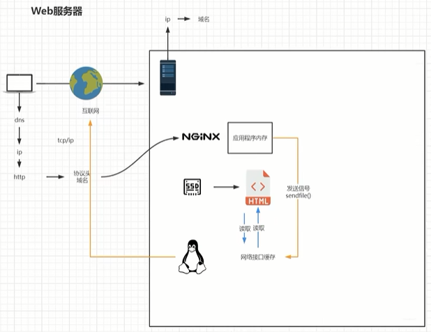

# Nginx安装

## 安装

> 1、yum install -y gcc
>
> 2、yum install -y pcre pcre-devel
>
> 3、yum install -y zlib zlib-devel
>
> 4、将`nginx-1.21.6.tar.gz`包放在`/opt/`，然后解压 tar zxvf nginx-1.21.6.tar.gz 
>
> 5、进入nginx-1.21.6目录，编译安装 ./configure --prefix=/usr/local/nginx 
>
> 6、make
>
> 7、make install
>
> 8、关闭防火墙：systemctl stop firewalld.service
>
> 9、禁止防火墙开机启动：systemctl disable firewalld.service
>
> 10、在`/usr/local/nginx`下，启动`./nginx` 

### 启动Nginx
> 进入安装好的目录`/usr/local/nginx/sbin` 
>
> ./nginx 启动
> ./nginx -s stop 快速停止
> ./nginx -s quit 优雅关闭，在退出前完成已经接受的连接请求
> ./nginx -s reload 重新加载配置

### 安装成系统服务

> 创建服务脚本
>
> vi /usr/lib/systemd/system/nginx.service

> 服务脚本内容(<span style="color:red; font-weight:bold">下面的路径要跟上面**编译安装**的一致</span>)
>
> ```
> [Unit]
> Description=nginx - web server
> After=network.target remote-fs.target nss-lookup.target
> [Service]
> Type=forking
> PIDFile=/usr/local/nginx/logs/nginx.pid
> ExecStartPre=/usr/local/nginx/sbin/nginx -t -c /usr/local/nginx/conf/nginx.conf
> ExecStart=/usr/local/nginx/sbin/nginx -c /usr/local/nginx/conf/nginx.conf
> ExecReload=/usr/local/nginx/sbin/nginx -s reload
> ExecStop=/usr/local/nginx/sbin/nginx -s stop
> ExecQuit=/usr/local/nginx/sbin/nginx -s quit
> PrivateTmp=true
> [Install]
> WantedBy=multi-user.target
> ```

> 重新加载系统服务
>
> systemctl daemon-reload

> 查看Nginx状态
>
> ps -ef | grep nginx

> 启动服务
>
> systemctl start nginx.service

> 开机启动
>
> systemctl enable nginx.service

## Docker 安装 Nginx

> #将容器nginx.conf文件复制到宿主机
> docker cp nginx:/etc/nginx/nginx.conf /app/nginx/conf/nginx.conf
> #将容器conf.d文件夹下内容复制到宿主机
> docker cp nginx:/etc/nginx/conf.d /app/nginx/conf/conf.d
> #将容器中的html文件夹复制到宿主机
> docker cp nginx:/usr/share/nginx/html /app/nginx/

> docker run -p 80:80 \
> -v /app/nginx/conf/nginx.conf:/etc/nginx/nginx.conf \
> -v /app/nginx/log:/var/log/nginx \
> -v /app/nginx/html:/usr/share/nginx/html \
> -v /app/nginx/conf:/etc/nginx/conf.d \
> -v /etc/localtime:/etc/localtime \
> --network=bridge --name nginx --restart=always \
> -d nginx:1.22.0
>
> 
>
> docker run \
> -p 9001:80 \
> --network=bridge --name nginx --restart=always \
> -v /app/nginx/conf/nginx.conf:/etc/nginx/nginx.conf \
> -v /app/nginx/conf/conf.d:/etc/nginx/conf.d \
> -v /app/nginx/log:/var/log/nginx \
> -v /app/nginx/html:/usr/share/nginx/html \
> -d nginx:1.22.0


# 目录结构

### 进入Nginx的主目录我们可以看到这些文件夹

> client_body_temp conf fastcgi_temp html logs proxy_temp sbin scgi_temp uwsgi_temp

### 其中这几个文件夹在刚安装后是没有的，主要用来存放运行过程中的临时文件

> client_body_temp fastcgi_temp proxy_temp scgi_temp

> conf：用来存放相关配置文件
>
> html：用来存放静态文件的默认目录html、css等
>
> sbin：Nginx的主程序

> sendfile off
>
> 
>
> sendfile on
>
> 
>
> 


