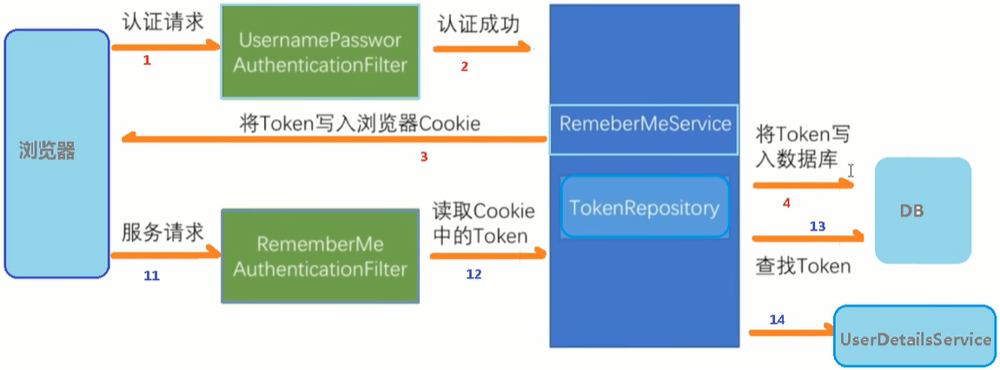

# SpringSecurity

## 1、MyUserDetailsService

```Java
package com.xing.springsecurity.service;

import com.baomidou.mybatisplus.core.conditions.query.LambdaQueryWrapper;
import com.xing.springsecurity.mapper.UserMapper;
import com.xing.springsecurity.model.Users;
import org.springframework.beans.factory.annotation.Autowired;
import org.springframework.security.core.GrantedAuthority;
import org.springframework.security.core.authority.AuthorityUtils;
import org.springframework.security.core.userdetails.User;
import org.springframework.security.core.userdetails.UserDetails;
import org.springframework.security.core.userdetails.UserDetailsService;
import org.springframework.security.core.userdetails.UsernameNotFoundException;
import org.springframework.security.crypto.bcrypt.BCryptPasswordEncoder;
import org.springframework.stereotype.Service;

import java.util.List;

@Service("UserDetailsService")
public class MyUserDetailsService implements UserDetailsService {

    @Autowired
    private UserMapper userMapper;

    @Override
    public UserDetails loadUserByUsername(String username) throws UsernameNotFoundException {
        LambdaQueryWrapper<Users> queryWrapper = new LambdaQueryWrapper<>();
        queryWrapper.eq(Users::getUsername, username);
        Users users = userMapper.selectOne(queryWrapper);
        if (users == null) {
            throw new UsernameNotFoundException("用户名不存在！");
        }
        List<GrantedAuthority> auths = AuthorityUtils.commaSeparatedStringToAuthorityList("admin, ROLE_sale");
        return new User(users.getUsername(), new BCryptPasswordEncoder().encode(users.getPassword()), auths);
    }
}

```


## 2、SecurityConfig

```Java
package com.xing.springsecurity.config;

import org.springframework.beans.factory.annotation.Autowired;
import org.springframework.context.annotation.Bean;
import org.springframework.context.annotation.Configuration;
import org.springframework.security.config.annotation.authentication.builders.AuthenticationManagerBuilder;
import org.springframework.security.config.annotation.web.builders.HttpSecurity;
import org.springframework.security.config.annotation.web.configuration.WebSecurityConfigurerAdapter;
import org.springframework.security.core.userdetails.UserDetailsService;
import org.springframework.security.crypto.bcrypt.BCryptPasswordEncoder;
import org.springframework.security.crypto.password.PasswordEncoder;

/**
 * @Description: Security 配置类
 */
@Configuration
public class SecurityConfig extends WebSecurityConfigurerAdapter {

    @Autowired
    private UserDetailsService userDetailsService;

    @Override
    protected void configure(AuthenticationManagerBuilder auth) throws Exception {
        // BCryptPasswordEncoder passwordEncoder = new BCryptPasswordEncoder();
        // String password = passwordEncoder.encode("123");
        // auth.inMemoryAuthentication().withUser("xing").password(password).roles("admin");
        auth.userDetailsService(userDetailsService).passwordEncoder(password());
    }

    @Bean
    PasswordEncoder password() {
        return new BCryptPasswordEncoder();
    }

    @Override
    protected void configure(HttpSecurity httpSecurity) throws Exception {
        httpSecurity.exceptionHandling().accessDeniedPage("/unauth.html");
        httpSecurity.formLogin()    // 自定义自己编写的登录页面
                    .loginPage("/login.html")        // 登录页面设置
                    .loginProcessingUrl("/user/login")  // 登录访问路径
                    .defaultSuccessUrl("/text/index").permitAll()   // 登录成功之后，跳转路径
                    .and().authorizeRequests()      // 哪些URL方法需要被认证，哪些不需要认证
                    .antMatchers("/", "/text/hello", "/user/login").permitAll()    // 设置哪些路径可以直接访问，不需要认证
                    // 当前登录用户，只有具有admin权限才可以访问这个路径
                    // .antMatchers("/text/index").hasAuthority("admin")
                    // .antMatchers("/text/index").hasAnyAuthority("admin, manage")
                    // 当前登录用户，只有具有sale角色才可以访问这个路径
                    .antMatchers("/text/index").hasRole("sale")
                    .anyRequest().authenticated()   // 所有请求都可访问
                    .and().csrf().disable();    // 关闭csrf防护
    }
}
```

## 3、注释使用

### 3.1 @Secured

> 判断是否具有角色，另外需要注意的是这里匹配的字符串需要添加前缀`"ROLE_"` 

> 步骤：
>
> 1、启动类（配置类）开启注解
>
> ```Java
> @SpringBootApplication
> @EnableGlobalMethodSecurity(securedEnabled = true)
> public class SpringSecurityApplication {
>     public static void main(String[] args) {
>         SpringApplication.run(SpringSecurityApplication.class, args);
>     }
> }
> ```
>
> 2、在Controller的方法上面使用注解，设置角色
>
> ```Java
> @GetMapping("/update")
> @Secured({"ROLE_sales", "ROLE_manager"})
> public String update() {
> 	return "Hello Security update !";
> }
> ```
>
> 3、UserDetailsService设置用户角色
>
> ```Java
> @Service("UserDetailsService")
> public class MyUserDetailsService implements UserDetailsService {
> 
>     @Autowired
>     private UserMapper userMapper;
> 
>     @Override
>     public UserDetails loadUserByUsername(String username) throws UsernameNotFoundException {
>         LambdaQueryWrapper<Users> queryWrapper = new LambdaQueryWrapper<>();
>         queryWrapper.eq(Users::getUsername, username);
>         Users users = userMapper.selectOne(queryWrapper);
>         if (users == null) {
>             throw new UsernameNotFoundException("用户名不存在！");
>         }
>         List<GrantedAuthority> auths = AuthorityUtils.commaSeparatedStringToAuthorityList("admin, ROLE_sale"); // <--这里
>         return new User(users.getUsername(), new BCryptPasswordEncoder().encode(users.getPassword()), auths);
>     }
> }
> ```
>
> 

### 3.2 @PreAuthorize

> @PreAuthorize：注解适合进入`方法前`的权限验证，@PreAuthorize可以将登录用户的roles/permissions参数传到方法中。

>步骤：
>
>1、启动类（配置类）开启注解
>
>```Java
>@SpringBootApplication
>@EnableGlobalMethodSecurity(prePostEnabled = true)
>public class SpringSecurityApplication {
>    public static void main(String[] args) {
>        SpringApplication.run(SpringSecurityApplication.class, args);
>    }
>}
>```
>
>2、在Controller的方法上面使用注解，设置角色
>
>```Java
>@GetMapping("/update")
>@PreAuthorize("hasAnyAuthority('admin')")
>public String update() {
>	return "Hello Security update !";
>}
>```
>
>3、UserDetailsService设置用户角色
>
>......

### 3.3 @PostAuthorize

> 在方法执行后再进行权限验证，适合`验证带有返回值`的权限

> 步骤：
>
> 1、启动类（配置类）开启注解
>
> ```Java
> @SpringBootApplication
> @EnableGlobalMethodSecurity(prePostEnabled = true)
> public class SpringSecurityApplication {
>     public static void main(String[] args) {
>         SpringApplication.run(SpringSecurityApplication.class, args);
>     }
> }
> ```
>
> 2、在Controller的方法上面使用注解，设置角色
>
> ```Java
> @GetMapping("/update")
> @PostAuthorize("hasAnyAuthority('admin')")
> public String update() {
> 	return "Hello Security update !";
> }
> ```
>
> 3、UserDetailsService设置用户角色
>
> ......

### 3.4 @PostFilter

> 权限验证之后对数据进行过滤，留下用户名是admin的数据，表达式中的filterObject引用的是方法返回值List中的某一个元素

```Java
@GetMapping("/getAll")
@PostAuthorize("hasAnyAuthority('admin')")
@PostFilter("filterObject.username == 'admin1'")
public List<Users> getAllUsers() {
    ArrayList<Users> list = new ArrayList<>();
    list.add(new Users("8", "admin2", "123", 12));
    list.add(new Users("9", "admin1", "123", 12));
    list.forEach(System.out::println);
    System.out.println("list: " + list);
    return list;
}
```

### 3.5 @PreFilter

> 对传入的数据过滤

```Java
@GetMapping("/getPreFilter")
@PreAuthorize("hasAnyAuthority('admin')")
@PreFilter(value = "filterObject.id%2 == 0")
public List<Users> getPreFilter(@RequestBody List<Users> list) {
    list.forEach(item -> {
    	System.out.println(item.getId() + "\t" + item.getUsername());
    });
    return list;
}
```

## 4、退出

### 4.1 SecurityConfig类 -> configure 方法中添加

```Java
// 退出
httpSecurity.logout().logoutUrl("/logout").logoutSuccessUrl("/text/hello").permitAll();
```

> logoutUrl: 从哪退出的
>
> logoutSuccessUrl: 退出后去那个页面

### 4.2 HTML

```html
<body>
  登录成功！
  <a href="/logout">退出</a>
</body>
```

## 5、认证 



### 5.1 SecurityConfig类

```Java
// 配置类，注入数据源，配置操作数据库对象
// 注入数据源
@Autowired
private DataSource dataSource;

// 配置对象
@Bean
public PersistentTokenRepository persistentTokenRepository() {
    JdbcTokenRepositoryImpl jdbcTokenRepository = new JdbcTokenRepositoryImpl();
    jdbcTokenRepository.setDataSource(dataSource);
    // jdbcTokenRepository.setCreateTableOnStartup(true);  // 创建token表
    return jdbcTokenRepository;
}
```

### 5.2 SecurityConfig类 -> configure 方法中添加

```Java
.and().rememberMe().tokenRepository(persistentTokenRepository())    // 操作数据库对象
.tokenValiditySeconds(60)   // 设置有效时长，单位秒
.userDetailsService(userDetailsService)
```

### 5.3 前端代码

```HTML
<input type="checkbox" name="remember-me" />自动登录
```

## 6、CSRF