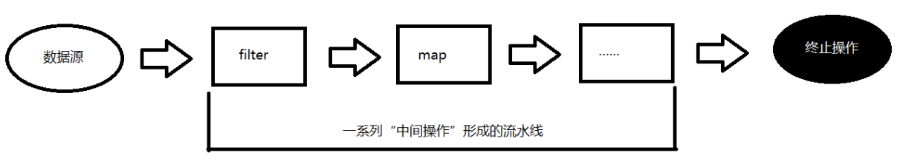
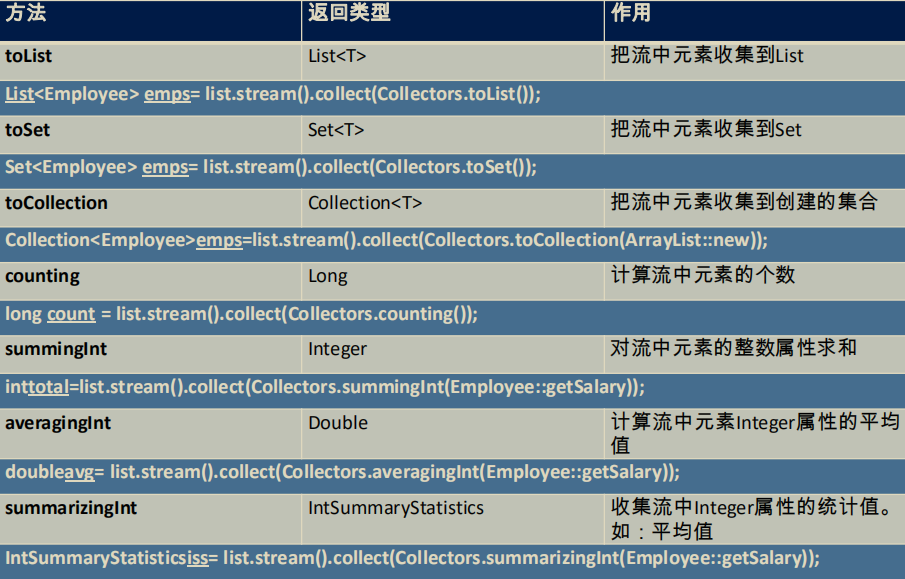
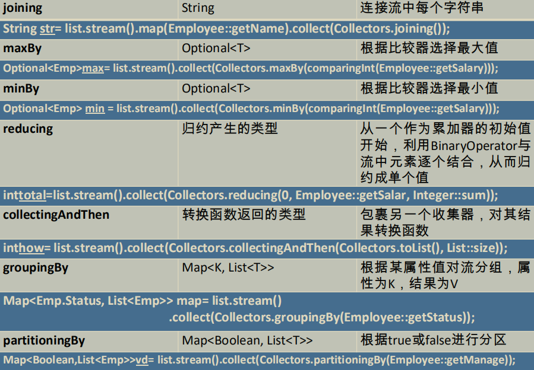
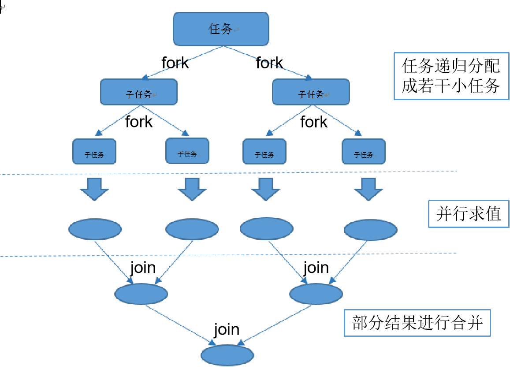

# [Java8新特性](https://www.bilibili.com/video/BV1h54y1z7L4)

[TOC]

------

## [Lambda表达式](https://www.bilibili.com/video/BV1h54y1z7L4?p=3)

### 一、基本语法

1、Java8中引入了一个新的操作符 "`->`"，该操作符称为箭头操作符或者 Lambda 操作符

2、箭头操作符将 Lambda 表达式拆分成两部分：

	* 左侧：Lambda 表达式的参数列表
	* 右侧：Lambda 表达式中所需执行的功能，即 Lambda 体

3、语法格式一：无参数，无返回值

```Java
() -> System.out.println("Hello Lambda!");
```

4、语法格式二：有一个参数，无返回值

```Java
x -> System.out.println(x);  // 只有一个参数，小括号可以不写
(x) -> System.out.println(x);
```

5、语法格式三：有两个以上参数，有返回值，并且 Lambda 体中有多条语句

```Java
Comparator<Integer> com = (x, y) -> {
	...;
    return Integer.comper(x, y);
};
```

6、语法格式四：若 Lambda 表达式体中只有一条语句，return 和 { } 都可以不写

```Java
Comparator<Integer> com = (x, y) -> Integer.comper(x, y);
```

7、语法格式五：Lambda 表达式的参数列表的数据类型可以省略不写，因为JVM编译器通过上下文推断出，数据类型，即"类型推断"

```Java
Comparator<Integer> com = (Integer x, Integer y) -> return Integer.comper(x, y);
```

8、总结

左右遇一括号省，左侧推断类型省

### 二、Lambda 表达式需要"函数式接口"支持

函数式接口：接口中只有一个抽象方法的接口，称为函数式接口。可以使用注解 @FunctionalInterface 修饰可以检查是否是函数式接口

### 三、[案例习题](https://www.bilibili.com/video/BV1h54y1z7L4?p=4)

###### 例1：

①  声明函数式接口，接口中声明抽象方法，public String getValue(String str);

```java
@FunctionalInterface
public interface MyStr {
    public String getValue(String str);
}
```

②  声明类 LambdaDome，类中编写方法使用接口作为参数，将一个字符串转换成大写，并作为方法的返回值。

```Java
public class LambdaDome {
    // 省略简洁写法
    @Test
    public void testDome3(){
        String str = operation("ccc", (x) -> x.toUpperCase());
        System.out.println(str);
    }
    // 正常不省略写法
    @Test
    public void testDome2(){
        String str = operation("bbb", (x) -> {
            return x.toUpperCase();
        });
        System.out.println(str);
    }
    // 匿名内部类实现
    @Test
    public void testDome1(){
        String str = operation("aaa", new MyStr() {
            @Override
            public String getValue(String str) {
                return str.toUpperCase();
            }
        });
        System.out.println(str);
    }
    public String operation(String str, MyStr myStr){
        return myStr.getValue(str);
    }
}
```

```
运行结果
testDome3：
CCC
testDome2：
BBB
testDome1：
AAA
```

③  再将一个字符串的第2个和第4个索引位置进行截取子串

```Java
@Test
public void testDome4 (){
    String str = operation("安徽职业技术学院", (x) -> x.substring(0, 1) + x.substring(2, 3));
   System.out.println(str);
}
```

```
运行结果：
安职
```

###### 例2：

①  声明一个带两个泛型的函数式接口，泛型类型为<T, R> T为参数，R为返回值

②  接口中声明对应抽象方法

```Java
@FunctionalInterface
public interface MyMap<T, R> {
    public R getValue(T l1, T l2);
}
```

③  在 LambdaDome 类中声明方法，使用接口作为参数，计算两个 long 型参数的和

④再计算两个 long 型参数的乘积

```Java
@Test
public void testDome5(){
    operation(100L, 200L, (x, y) -> x+y);
    operation(666L, 888L, (x, y) -> x*y);
}
public void operation(Long l1, Long l2, MyMap<Long, Long> myMap){
	System.out.println(myMap.getValue(l1, l2));
}
```

```
运行结果：
300
1554
```

## [Java8 内置函数式接口](https://www.bilibili.com/video/BV1h54y1z7L4?p=5)

##### 1、四大核心

###### 	①  接口说明

|          函数式接口          | 参数类型 | 返回类型 |                             用途                             |
| :--------------------------: | :------: | :------: | :----------------------------------------------------------: |
|  Consumer<T><br>消费型接口   |    T     |   void   |   对类型为T的对象应用操作，<br>包含方法：void accept(T t);   |
|  Supplier<T><br>供给型接口   |    无    |    T     |           回类型为T的对象，<br>包含方法：T get();            |
| Function<T, R><br>函数型接口 |    T     |    R     | 对类型为T的对象应用操作，并返回结果。<br>结果是R类型的对象。包含方法：R apply(T t); |
|  Predicate<T><br>断言型接口  |    T     | boolean  | 确定类型为T的对象是否满足某约束，<br>并返回boolean 值。包含方法boolean test(T t); |

###### 	②  代码实现

```Java
// Consumer<T> 消费型接口: 做操作之后无返回值
@Test
public void testDemo1 (){
    happy(1000, (x) -> System.out.println(x));
}
public void happy (double money, Consumer<Double> consumer){
    consumer.accept(money);
}
```

```Java
// Supplier<T> 供给型接口
@Test
public void testDemo2 (){
    List<Integer> numList = getNumList(10, () -> (int)(Math.random() * 100));
    for(Integer num : numList){
        System.out.println(num);
    }
}
// 产生指定个数的整数，并放入集合中
public List<Integer> getNumList(int number, Supplier<Integer> supplier){
    List<Integer> list = new ArrayList<>();
    for (int i = 0; i < number; i++){
        Integer num = supplier.get();
        list.add(num);
    }
    return list;
}
```

```Java
// Function<T, R> 函数型接口
@Test
public void testDome3 (){
    String string = strHandler("安徽职业技术学院", (str) -> str.substring(4, 6));
    System.out.println(string);
}
// 用于处理字符串
public String strHandler(String str, Function<String, String> fun){
    return fun.apply(str);
}
```

```Java
// Predicate<T> 断言型接口
@Test
public void testDome4(){
    List<String> string = Arrays.asList("anhui", "zhiye", "jishu", "xueyuan");
//        List<String> strings = new ArrayList<>();
//        strings.add("anhui");
//        strings.add("zhiye");
//        strings.add("jishu");
//        strings.add("xueyuan");
    List<String> str = filterString(string, (x) -> x.length() < 8);
    System.out.println(str);
}
// 将满足条件的字符串，放入集合中
public List<String> filterString(List<String> list, Predicate<String> predicate){
    List<String> listStr = new ArrayList<>();
    for (String str : list){
        if (predicate.test(str)){
            listStr.add(str);
        }
    }
    return listStr;
}
```

##### 2、其他内置函数式接口

|                          函数式接口                          |       参数类型        |       返回类型        |                             用途                             |
| :----------------------------------------------------------: | :-------------------: | :-------------------: | :----------------------------------------------------------: |
|                     BiFunction<T, U, R>                      |         T, U          |           R           | 对类型为 T, U 参数应用操作，<br>返回 R 类型的结果。<br>包含方法为R apply(T t, U u); |
|             UnaryOperator<T><br>(Function子接口)             |           T           |           T           | 对类型为T的对象进行一元运算，<br>并返回T类型的结果。包含方法为T apply(T t); |
|           BinaryOperator<T><br>(BiFunction 子接口)           |         T, T          |           T           | 对类型为T的对象进行二元运算，<br>并返回T类型的结果。<br>包含方法为T apply(T t1, T t2); |
|                       BiConsumer<T, U>                       |         T, U          |         void          | 对类型为T，U参数应用操作<br>包含方法为void accept(T t,, U u); |
| ToIntFunction<T><br>ToLongFunction<T><br>ToDoubleFunction<T> |           T           | int<br>long<br>double |              分别计算int、long、double值的函数               |
|    IntFunction<R><br>LongFunction<R><br>DoubleFunction<R>    | int<br>long<br>double |           R           |            参数分别为int、long、double类型的函数             |

## [方法引用与构造器引用](https://www.bilibili.com/video/BV1h54y1z7L4?p=6)

当要传递给Lambda体的操作，已经有实现的方法了，可以使用方法引用！（实现抽象方法的参数列表，必须与方法引用方法的参数列表保持一致！）方法引用：使用操作符 “::” 将方法名和对象或类的名字分隔开来。如下三种主要使用情况：

##### 1、对象::实例方法

```Java
// 对象::实例方法名
@Test
public void testDome1 (){
    PrintStream ps = System.out;
    Consumer<String> con1 = (x) -> ps.print(x);
    con1.accept("安徽");
    Consumer<String> con2 = ps::print;
    con2.accept("职业技术");
    Consumer<String> con = System.out::print;
    con.accept("学院");
}
@Test
public void testDome2 (){
    Book book = new Book();
    book.setTitle("野草");
    book.setAuthor("鲁迅");
    Supplier<String> strSup1 = () -> book.getTitle();
    Supplier<String> strSup2 = book::getAuthor;
    System.out.println(strSup1.get());
    System.out.println(strSup2.get());
}
```

```
运行结果:
安徽职业技术学院

野草
鲁迅
```

##### 2、类::静态方法

```Java
// 类::静态方法名
@Test
public void testDome3 (){
    /**
      * compare(o1, o2)
      * 如果返回 1  说明 o1 > o2  如 2, 1
      * 如果返回 0  说明 o1 = o2  如 cc, cc
      * 如果返回 -1 说明 o1 < o2  如 6, 7
      */
    Comparator<Integer> com = (x, y) -> Integer.compare(x, y);
    System.out.println(com.compare(2, 2));
    Comparator<Integer> comstr = Integer::compareTo;
    System.out.println(comstr.compare(2, 3));
}
```

```
运行结果：
0
-1
```

##### 3、类::实例方法

```Java
// 类::实例方法名
@Test
public void testDome4 (){
    BiPredicate<String, String> bp = (x, y) -> x.equals(y);
    BiPredicate<String, String> bp1 = String::equals;
    System.out.println(bp1.test("安徽","安徽"));
    System.out.println(bp1.test("安徽","安职"));
}
```

```
运行结果：
true
false
```

> 注意：
>
> ​		①  Lambda 体中调用方法的参数列表与返回值类型，要与函数式接口中抽象方法的函数列表和返回值类型保持一致！
>
> ​		②  若Lambda 参数列表中的第一参数是实例方法的调用者，而第二个参数是实例方法的参数时，可以使用 ClassName ：：methodName

##### 4、构造器引用		ClassName::new

```Java
// 构造器引用
@Test
public void testDome6 (){
    Supplier<Book> sb = () -> new Book();
    System.out.println(sb.get());
    // 默认调用Book中无参构造器
    Supplier<Book> sb1 = Book::new;
    System.out.println(sb1.get());
}
```

```
运行结果：
Book{id='null', title='null', version='null', author='null', status='null', price='null', house='null'}
Book{id='null', title='null', version='null', author='null', status='null', price='null', house='null'}
```

```Java
@Test
public void testDome7 (){
    // 调用Book中一个参数构造器
    Function<String, Book> fb1 = (x) -> new Book(x);
    System.out.println(fb1.apply("高等数学"));
    // 调用Book中两个参数构造器
    BiFunction<String, String, Book> fb2 = Book::new;
    System.out.println(fb2.apply("高等数学", "同济"));
}
```

```
运行结果：
Book{id='null', title='高等数学', version='null', author='null', status='null', price='null', house='null'}
Book{id='null', title='高等数学', version='null', author='同济', status='null', price='null', house='null'}
```

> 注意：需要调用的构造参数列表要与函数式接口中抽象方法的参数列表保持一致！

##### 5、数组引用		Type[]::new

```Java
// 数组引用
@Test
public void testDome8 (){
    Function<Integer, String[]> fun = (x) -> new String[x];
    System.out.println(fun.apply(10).length);
    Function<Integer, String[]> fun1 = String[]::new;
    System.out.println(fun1.apply(20).length);
}
```

```
运行结果：
10
20
```

------

## 强大的Stream API

Java8 中有两个最为重要的改变。第一个是 Lambda 表达式；另外一个则是 Stream API (java.util.stream.*)。

Stream 是 Java8 中处理集合的关键抽象概念，它可以指定你希望对集合进行的操作，可以执行非常复杂的查找、过滤和映射数据等操作。使用 Stream API 对集合数据进行操作，就类似于使用 SQL 执行的数据库查询。也可以使用 Stream API 来并行执行操作。简而言之，Stream API 提供了一种高效且易于使用的处理数据的方式。

### [什么是 Stream](https://www.bilibili.com/video/BV1h54y1z7L4?p=7)

##### 流（Stream）到底是什么呢？

是数据渠道，用于操作数据源（集合。数组等）所生成的元素序列。“集合讲的是数据，流讲的是计算！”

> 注意：
>
> ​	①  Stream 自己不会存储元素
>
> ​	②  Stream 不会改变源对象。相反，他们会返回一个持有结果的新的 Stream
>
> ​	③  Stream 操作是延迟执行的。这意味着他们会等到需要的时候才执行

### Stream 的操作三个步骤

- 创建 Stream

一个数据源（如：集合、数组），获取一个流

- 中间操作

一个中间作链，对数据源的数据进行处理

- 终止操作（终端操作）

一个终止操作，执行中间操作链，并产生结果



##### （1）[创建 Stream](https://www.bilibili.com/video/BV1h54y1z7L4?p=7)

> Java8 中的 Collection 接口被扩展，提供了两个获取流的方法：

```Java
default Stream<E> stream()：返回一个顺序流
default Stream<E> parallelStream()：返回一个并行流
```

###### ①  由数组创建流

> Java8 中的 Arrays 的静态方法 stream() 可以获取数组流：

```Java
static <T> Stream<T> stream(T[] array): 返回一个流

// 重载形式，能够处理对应基本类型的数组:
public static IntStream stream(int[] array)
public static LongStream stream(long[] array)
public static DoubleStream stream(double[] array)
```

###### ②  由值创建流

> 可以使用静态方法 Stream.of() ，通过显示值创建一个流。它可以接受任意数量的参数

```Java
public static<T> Stream<T> of(T... values) : 返回一个流
```

###### ③  由函数创建流：创建无限流

> 可以使用静态方法 Stream.iterate() 和 Stream.generate()，创建无限流

* 迭代

```Java
public static<T> Stream<T> iterate(final T seed, final UnaryOperator<T> f)
```

* 生成

```Java
public static<T> Stream<T> generate(Supplier<T> s)
```

`代码实现`

```Java
// 创建 Stream
@Test
public void testDome (){
    // 1、可以通过 Collection 系列集合提供的 stream() 或 parallelStream()
    ArrayList<String> list = new ArrayList<>();
    Stream<String> stream1 = list.stream();

    // 2、通过 Arrays 中的静态方法 stream() 获取数组流
    Book[] book = new Book[5];
    Stream<Book> stream2 = Arrays.stream(book);
    // 3、通过 Stream 类中的静态方法 of()
    Stream<String> stream3 = Stream.of("aa", "bb", "cc");
    // 4、创建无限流
    // 迭代
    Stream<Integer> stream4 = Stream.iterate(0, (x) -> x + 2);
    stream4.limit(10).forEach(System.out::println);
    // 生成
    Stream.generate(() -> Math.random())
          .limit(10)
          .forEach(System.out::println);
}
```

```
运行结果：
0
2
4
6
8
10
12
14
16
18
0.9501040551739603
0.7408078140801402
0.2057072094120922
0.29388746417299705
0.44774906428750116
0.3045064627234656
0.9654549092153003
0.14706245910943472
0.920540309847089
0.6112334959710662
```

##### （2）Stream 的中间操作

> 多个中间操作可以连接起来形成一个流水线，除非流水线上触发终止操作，否则中间操作不会执行任何的处理！而在终止操作时一次性全部处理 ，称为“惰性求值”。

###### [**筛选与切片**](https://www.bilibili.com/video/BV1h54y1z7L4?p=8)

|        方法         |                             描述                             |
| :-----------------: | :----------------------------------------------------------: |
| filter(Predicate p) |           接受 Lambda ，从流中排除（过滤）某些元素           |
|     distinct()      | 筛选。通过流所生成元素的 hashCode() 和 equals() 去除重复元素 |
| limit(long maxSize) |                截断流，使其元素不超过给定数量                |
|    skip(long n)     | 跳过元素，返回一个扔掉了前 n 个元素的流。<br>若流中元素不足 n 个，则返回一个空流。与limit(n) 互补 |

`代码实现`

```Java
List<Book> bookList = Arrays.asList(
        new Book("《野草》", "鲁迅", 25.5),
        new Book("《彷徨》", "鲁迅", 35.7),
        new Book("《朝花夕拾》", "鲁迅", 30.5),
        new Book("《呐喊》", "鲁迅", 25.5),
        new Book("《朝花夕拾》", "鲁迅", 30.5),
        new Book("《三国演义》", "罗贯中", 35.6),
        new Book("《水浒传》", "施耐庵", 45.9),
        new Book("《西游记》", "吴承恩", 45.3)
);
```

```Java
/**
 * filter: 接收 Lambda，从流中排除某些元素
 */
// 内部迭代：迭代操作由 Stream API 完成
@Test
public void testDome1 (){
    // 中间操作: 不会执行任何操作
    Stream<Book> stream = bookList.stream()
                            .filter((x) -> {
                                System.out.println("中间操作");
                                return x.getAuthor() == "鲁迅";
                            });
    // 终止操作: 一次性执行全部内容，即“惰性求值”
    stream.forEach(System.out::println);
}
// 外部迭代：由用户自己完成
@Test
public void testDome2 (){
    Iterator<Book> iteratorBook = bookList.iterator();
    while (iteratorBook.hasNext()){
        System.out.println(iteratorBook.next());
    }
}
```

```
testDome1运行结果：
中间操作
Book{id='null', title='《野草》', version='null', author='鲁迅', status='null', price='25.5', house='null'}
中间操作
Book{id='null', title='《彷徨》', version='null', author='鲁迅', status='null', price='35.7', house='null'}
中间操作
Book{id='null', title='《朝花夕拾》', version='null', author='鲁迅', status='null', price='30.5', house='null'}
中间操作
Book{id='null', title='《呐喊》', version='null', author='鲁迅', status='null', price='30.5', house='null'}
中间操作
Book{id='null', title='《朝花夕拾》', version='null', author='鲁迅', status='null', price='30.5', house='null'}
中间操作
中间操作
中间操作

testDome2运行结果：
ook{id='null', title='《野草》', version='null', author='鲁迅', status='null', price='25.5', house='null'}
Book{id='null', title='《彷徨》', version='null', author='鲁迅', status='null', price='35.7', house='null'}
Book{id='null', title='《朝花夕拾》', version='null', author='鲁迅', status='null', price='30.5', house='null'}
Book{id='null', title='《呐喊》', version='null', author='鲁迅', status='null', price='25.5', house='null'}
Book{id='null', title='《朝花夕拾》', version='null', author='鲁迅', status='null', price='30.5', house='null'}
Book{id='null', title='《三国演义》', version='null', author='罗贯中', status='null', price='35.6', house='null'}
Book{id='null', title='《水浒传》', version='null', author='施耐庵', status='null', price='45.9', house='null'}
Book{id='null', title='《西游记》', version='null', author='吴承恩', status='null', price='45.3', house='null'}
```

```Java
/**
 * filter: 接收 Lambda，从流中排除某些元素
 * limit: 截断流，使其元素不超过给定数量
 */
@Test
public void testDome (){
    bookList.stream().filter((x) -> {
                     System.out.println("短路");
                     return x.getAuthor() == "鲁迅";
                })
                     .limit(2)
                     .forEach(System.out::println);
}
```

```
运行结果：
短路
Book{id='null', title='《野草》', version='null', author='鲁迅', status='null', price='25.5', house='null'}
短路
Book{id='null', title='《彷徨》', version='null', author='鲁迅', status='null', price='35.7', house='null'}
```

```Java
/**
 * filter: 接收 Lambda，从流中排除某些元素
 * limit: 截断流，使其元素不超过给定数量
 * skip(n): 跳过元素，返回一个扔掉了前 n 个元素的流。若流中元素不足 n 个，则返回一个空流。与limit(n) 互补
 */
@Test
public void testDome (){
    bookList.stream().filter((x) -> {
                     System.out.println("skip");
                     return x.getAuthor() == "鲁迅";
                })
                     .skip(2)
                     .forEach(System.out::println);
}
```

```
运行结果：
skip
skip
skip
Book{id='null', title='《朝花夕拾》', version='null', author='鲁迅', status='null', price='30.5', house='null'}
skip
Book{id='null', title='《呐喊》', version='null', author='鲁迅', status='null', price='25.5', house='null'}
skip
Book{id='null', title='《朝花夕拾》', version='null', author='鲁迅', status='null', price='30.5', house='null'}
skip
skip
skip
```

```Java
/**
 * filter: 接收 Lambda，从流中排除某些元素
 * limit: 截断流，使其元素不超过给定数量
 * skip(n): 跳出元素，返回一个扔掉了前 n 个元素的流。若流中元素不足 n 个，则返回一个空流。与limit(n) 互补
 * distinct: 筛选，通过流所生成元素的 hasCode() 和 equals() 去除重复元素
 */
@Test
public void testDome (){
    bookList.stream().filter((x) -> {
                     System.out.println("skip");
                     return x.getAuthor() == "鲁迅";
                })
                     .skip(2)
                     .distinct()
                     .forEach(System.out::println);
}
```

```
运行结果：
skip
skip
skip
Book{id='null', title='《朝花夕拾》', version='null', author='鲁迅', status='null', price='30.5', house='null'}
skip
Book{id='null', title='《呐喊》', version='null', author='鲁迅', status='null', price='30.5', house='null'}
skip
skip
skip
skip
```

###### [**映射**](https://www.bilibili.com/video/BV1h54y1z7L4?p=9)

|              方法               |                             描述                             |
| :-----------------------------: | :----------------------------------------------------------: |
|         map(Function f)         | 接收一个函数作为参数，该函数会被应用到每个元素上，<br>并将其映射成一个新的元素 |
| mapToDouble(ToDoubleFunction f) | 接收一个函数作为参数，该函数会被应用到每个元素上，<br>产生一个新发 DoubleStream |
|    mapToInt(ToIntFunction f)    | 接收一个函数作为参数，该函数会被应用到每个元素上，<br>产生一个新发 IntStream |
|   mapToLong(ToIntFunction f)    | 接收一个函数作为参数，该函数会被应用到每个元素上，<br>产生一个新发 LongStream |
|       flatMap(Function f)       | 接收一个函数作为参数，将流中的每个值都换成另一流，<br>然后把所有流连接成一个流 |

```Java
List<Book> bookList = Arrays.asList(
        new Book("《野草》", "鲁迅", 25.5),
        new Book("《彷徨》", "鲁迅", 35.7),
        new Book("《朝花夕拾》", "鲁迅", 30.5),
        new Book("《呐喊》", "鲁迅", 25.5),
        new Book("《朝花夕拾》", "鲁迅", 30.5),
        new Book("《三国演义》", "罗贯中", 35.6),
        new Book("《水浒传》", "施耐庵", 45.9),
        new Book("《西游记》", "吴承恩", 45.3)
);
```

```Java
/**
 * 映射
 * map：接受 Lambda，将元素转换成其他形式或提取信息。
 *      接受一个函数作为参数，该函数会被应用到每个元素上，并将其映射成一个新发元素。
 * flatMap：接受一个函数作为参数，将流中的每个值都换成另一个流，然后把所有流连接成一个流
 */
@Test
public void testDome (){
    List<String> list = Arrays.asList("aaa", "bbb", "ccc", "ddd", "eee");
    System.out.println("------map-----");
    list.stream()
        .map((str) -> str.toUpperCase())
        .forEach(System.out::println);
    System.out.println("------map-book-----");
    bookList.stream()
            .map(Book::getTitle)
            .forEach(System.out::println);
    System.out.println("------map-----");
    Stream<Stream<Character>> stream = list.stream()
            .map(StreamDome1::filterCharacter); // {{a,a,a}, {b,b,b}, {c,c,c}, {d,d,d}}
    stream.forEach((sm) -> {
        sm.forEach(System.out::println);
    });
    System.out.println("------flatMap-----");
    Stream<Character> sm = list.stream()
        .flatMap(StreamDome1::filterCharacter); // {a,a,a,b,b,b,c,c,c,d,d,d}
    sm.forEach(System.out::println);
}
public static Stream<Character> filterCharacter(String string){
    List<Character> list = new ArrayList<>();
    for (Character ch : string.toCharArray()){
        list.add(ch);
    }
    return list.stream();
}
```

```
运行结果：
------map-----
AAA
BBB
CCC
DDD
EEE
------map-book-----
《野草》
《彷徨》
《朝花夕拾》
《呐喊》
《朝花夕拾》
《三国演义》
《水浒传》
《西游记》
------map-----
a
a
a
b
b
b
c
c
c
d
d
d
e
e
e
------flatMap-----
a
a
a
b
b
b
c
c
c
d
d
d
e
e
e
```

###### [**排序**](https://www.bilibili.com/video/BV1h54y1z7L4?p=10)

|          方法           |                描述                |
| :---------------------: | :--------------------------------: |
|        sorted()         |  产生一个新流，其中按自然顺序排序  |
| sorted(Comparatot comp) | 产生一个新流，其中按比较器顺序排序 |

```Java
/**
 * 排序
 * sorted(): 自然排序(Comparabke)
 * sorted(Comparator com): 定制排序(Comparator)
 */
@Test
public void testDome8 (){
    List<String> list = Arrays.asList("ccc", "aaa", "bbb", "ddd", "eee");
    System.out.println("------sorted()-----");
    list.stream().sorted().forEach(System.out::println);
    System.out.println("------sorted(Comparator com)-----");
    bookList.stream().sorted((book1, book2) -> {
        if (book1.getAuthor().equals(book2.getAuthor())){
            return book1.getPrice().compareTo(book2.getPrice());
        } else {
            return book1.getAuthor().compareTo(book2.getAuthor());
        }
    }).forEach(System.out::println);
}
```

```
------sorted()-----
aaa
bbb
ccc
ddd
eee
------sorted(Comparator com)-----
Book{id='null', title='《西游记》', version='null', author='吴承恩', status='null', price='45.3', house='null'}
Book{id='null', title='《水浒传》', version='null', author='施耐庵', status='null', price='45.9', house='null'}
Book{id='null', title='《三国演义》', version='null', author='罗贯中', status='null', price='35.6', house='null'}
Book{id='null', title='《野草》', version='null', author='鲁迅', status='null', price='25.5', house='null'}
Book{id='null', title='《呐喊》', version='null', author='鲁迅', status='null', price='25.5', house='null'}
Book{id='null', title='《朝花夕拾》', version='null', author='鲁迅', status='null', price='30.5', house='null'}
Book{id='null', title='《朝花夕拾》', version='null', author='鲁迅', status='null', price='30.5', house='null'}
Book{id='null', title='《彷徨》', version='null', author='鲁迅', status='null', price='35.7', house='null'}
```

##### （3）Stream 的终止操作

> 终止操作会从流的流水线生成结果。其结果可以是任何不是流的值，例如：List、Integer，甚至是 void

###### [**查找与匹配**](https://www.bilibili.com/video/BV1h54y1z7L4?p=11)

|          方法          |                             描述                             |
| :--------------------: | :----------------------------------------------------------: |
|  allMatch(Predicte p)  |                     检查是否匹配所有元素                     |
| anyMatch(Predicate p)  |                   检查是否至少匹配一个元素                   |
| noneMatch(Predicate p) |                   检查是否满意匹配所有元素                   |
|      findFirst()       |                        返回第一个元素                        |
|       findAny()        |                    返回当前流中的任意元素                    |
|        count()         |                       返回流中元素总数                       |
|   max(Comparator c)    |                        返回流中最大值                        |
|   min(Comparator c)    |                        返回六中最小值                        |
| forEach(Comparator c)  | 内部迭代（使用 Collection 接口需要用户迭代，<br>称为外部迭代。相反，Stream API <br >使用内部迭代——它帮你把迭代做了） |

```Java
List<Book> bookList = Arrays.asList(
        new Book("《野草》", "鲁迅", Status.FREE, 25.5),
        new Book("《彷徨》", "鲁迅", Status.BUSY, 35.7),
        new Book("《朝花夕拾》", "鲁迅", Status.FREE, 30.5),
        new Book("《呐喊》", "鲁迅", Status.VOCATION, 25.5),
        new Book("《朝花夕拾》", "鲁迅", Status.BUSY, 30.5),
        new Book("《三国演义》", "罗贯中", Status.FREE, 35.6),
        new Book("《水浒传》", "施耐庵", Status.VOCATION, 45.9),
        new Book("《西游记》", "吴承恩", Status.FREE, 45.3)
);
```

```Java
/**
 * 查找
 * allMatch: 检查是否匹配所有元素
 * anyMatch: 检查是否至少匹配一个元素
 * noneMatch: 检查是否满意匹配所有元素
 * findFirst: 返回第一个元素
 * findAny: 返回当前流中的任意元素
 */
@Test
public void testDome (){
    boolean b1 = bookList.stream().allMatch((x) -> x.getStatus().equals(Status.BUSY));
    System.out.println("allMatch -> " + b1);
    boolean b2 = bookList.stream().anyMatch((x) -> x.getStatus().equals(Status.BUSY));
    System.out.println("anyMatch -> " + b2);
    boolean b3 = bookList.stream().noneMatch((x) -> x.getStatus().equals(Status.BUSY));
    System.out.println("noneMatch -> " + b3);
    Optional<Book> ob1 = bookList.stream()
            .sorted((book1, book2) -> -Double.compare(Double.parseDouble(book1.getPrice()), Double.parseDouble(book2.getPrice())))
            .findFirst();
    System.out.println("findFirst -> " + ob1.get());
    Optional<Book> ob2 = bookList.parallelStream()
            .filter((x) -> x.getAuthor() == "鲁迅")
            .findAny();
    System.out.println("findAny -> " + ob2.get());
}
```

```
运行结果：
allMatch -> false
anyMatch -> true
noneMatch -> false
findFirst -> Book{id='null', title='《水浒传》', version='null', author='施耐庵', status='VOCATION', price='45.9', house='null'}
findAny -> Book{id='null', title='《朝花夕拾》', version='null', author='鲁迅', status='BUSY', price='30.5', house='null'}
```

```Java
/**
 * 匹配
 * count: 返回流中元素的总个数
 * max: 返回流中最大值
 * min: 返回流中最小值
 */
@Test
public void testDome10 (){
    long count = bookList.stream().count();
    System.out.println("count -> " + count);
    Optional<Book> max = bookList.stream()
            .max((book1, book2) -> Double.compare(book1.getPrice(),book2.getPrice()));
    System.out.println("max -> " + max.get());
    Optional<Double> min = bookList.stream()
            .map(Book::getPrice)
            .min(Double::compare);
    System.out.println("min -> " + min.get());
}
```

```
运行结果：
count -> 8
max -> Book{id='null', title='《水浒传》', version='null', author='施耐庵', status='VOCATION', price='45.9', house='null'}
min -> 25.5
```

###### [**归约**](https://www.bilibili.com/video/BV1h54y1z7L4?p=12)

|               方法               |                           描述                           |
| :------------------------------: | :------------------------------------------------------: |
| reduce(T iden, BinaryOperator b) |      可以将流中元素反复结合起来，得到一个值。返回 T      |
|     reduce(BinaryOperator b)     | 可以将流中元素反复结合起来，得到一个值。返回 Optional<T> |

> map 和 reduce 的连接通常称为 map-reduce 模式，因 Goole 用它来进行网路搜索而出名

```Java
/**
 * 归约
 * reduceL(T identity, BinaryOperator) / reduce(BinaryOperator): 可以将流中元素反复结合起来，得到一个值
 */
@Test
public void testDome11 (){
    List<Integer> list = Arrays.asList(0, 1, 2, 3, 4, 5, 6, 7, 8, 9);
    Integer sum1 = list.stream().reduce(0, (x, y) -> x + y);
    System.out.println("总和 -> " + sum1);
    Optional<Double> sum2 = bookList.stream()
        .map(Book::getPrice)
        .reduce(Double::sum);
    long count = bookList.stream().count();
    System.out.println("平均价格 -> " + sum2.get() / count);
}
```

```
运行结果：
总和 -> 45
平均价格 -> 34.3125
```

###### **收集**

|         方法         |                             描述                             |
| :------------------: | :----------------------------------------------------------: |
| collect(Collector c) | 将流转换为其他形式。接受一个 Collector 接口的实现，<br>用于给 Stream 中元素做汇总的方法 |

> Collector 接口中方法的实现决定了如何对流执行收集操作（如收集到 List、Set、Map）。但是 Collectors 实用类提供了很多静态方法，可以方便地创建常见收集器实例，具体方法与实例如下表：





```Java
/**
 * 收集
 * collect: 将流转换为其他形式。接受一个Collector接口的实现，用于给 Stream 中元素做汇总的方法
 */
@Test
public void testDome (){
    System.out.println("--------List--------");
    // List<String>
    bookList.stream()
            .map(Book::getTitle)
            .collect(Collectors.toList())
            .forEach(System.out::println);
    System.out.println("--------Set--------");
    // Set<String>
    bookList.stream()
            .map(Book::getTitle)
            .collect(Collectors.toSet())
            .forEach(System.out::println);
    System.out.println("--------Collection--------");
    // HashSet<String>
    bookList.stream()
            .map(Book::getTitle)
            .collect(Collectors.toCollection(HashSet::new))
            .forEach(System.out::println);
    System.out.println("----------------");
    Long clong = bookList.stream()
            .collect(Collectors.counting());
    System.out.println("总数 -> " + clong);
    Double avg = bookList.stream()
            .collect(Collectors.averagingDouble(Book::getPrice));
    System.out.println("价格平均值 ->" + avg);
    Double sum = bookList.stream()
            .collect(Collectors.summingDouble(Book::getPrice));
    System.out.println("价格总和 -> " + sum);
    Optional<Book> max = bookList.stream()
            .collect(Collectors.maxBy((book1, book2) -> Double.compare(book1.getPrice(), book2.getPrice())));
    System.out.println("价格最高的书 -> " + max.get());
    Optional<Double> min = bookList.stream()
            .map(Book::getPrice)
            .collect(Collectors.minBy(Double::compare));
    System.out.println("价格最低的书 -> " + min.get());
    DoubleSummaryStatistics collect = bookList.stream()
            .collect(Collectors.summarizingDouble(Book::getPrice));
    System.out.println("集合 -> " + collect);
    System.out.println("--------分组--------");
    // Map<Status, List<Book>>
     bookList.stream()
            .collect(Collectors.groupingBy(Book::getStatus))
            .forEach((key, value) -> System.out.println(key + " -> " + value));
    System.out.println("--------多级分组--------");
    // Map<Status, Map<String, List<Book>>>
     bookList.stream()
            .collect(Collectors.groupingBy(Book::getStatus, Collectors.groupingBy(Book::getAuthor)))
            .forEach((key, value) -> System.out.println(key + " -> " + value));
    System.out.println("--------分区--------");
    // Map<Boolean, List<Book>>
    bookList.stream()
             .collect(Collectors.partitioningBy((x) -> x.getPrice() > 30))
             .forEach((key, value) -> System.out.println(key + " -> " + value));
    System.out.println("--------连接字符串--------");
    String join = bookList.stream()
            .map(Book::getTitle)
            .collect(Collectors.joining(",", ">>", "<<"));
    System.out.println("书名: " + join);
}
```

```
运行结果：
--------List--------
《野草》
《彷徨》
《朝花夕拾》
《呐喊》
《朝花夕拾》
《三国演义》
《水浒传》
《西游记》
--------Set--------
《三国演义》
《彷徨》
《呐喊》
《西游记》
《朝花夕拾》
《水浒传》
《野草》
--------Collection--------
《三国演义》
《彷徨》
《呐喊》
《西游记》
《朝花夕拾》
《水浒传》
《野草》
----------------
总数 -> 8
价格平均值 ->34.3125
价格总和 -> 274.5
价格最高的书 -> Book{id='null', title='《水浒传》', version='null', author='施耐庵', status='VOCATION', price='45.9', house='null'}
价格最低的书 -> 25.5
集合 -> DoubleSummaryStatistics{count=8, sum=274.500000, min=25.500000, average=34.312500, max=45.900000}
--------分组--------
VOCATION -> [Book{id='null', title='《呐喊》', version='null', author='鲁迅', status='VOCATION', price='25.5', house='null'}, Book{id='null', title='《水浒传》', version='null', author='施耐庵', status='VOCATION', price='45.9', house='null'}]
BUSY -> [Book{id='null', title='《彷徨》', version='null', author='鲁迅', status='BUSY', price='35.7', house='null'}, Book{id='null', title='《朝花夕拾》', version='null', author='鲁迅', status='BUSY', price='30.5', house='null'}]
FREE -> [Book{id='null', title='《野草》', version='null', author='鲁迅', status='FREE', price='25.5', house='null'}, Book{id='null', title='《朝花夕拾》', version='null', author='鲁迅', status='FREE', price='30.5', house='null'}, Book{id='null', title='《三国演义》', version='null', author='罗贯中', status='FREE', price='35.6', house='null'}, Book{id='null', title='《西游记》', version='null', author='吴承恩', status='FREE', price='45.3', house='null'}]
--------多级分组--------
VOCATION -> {鲁迅=[Book{id='null', title='《呐喊》', version='null', author='鲁迅', status='VOCATION', price='25.5', house='null'}], 施耐庵=[Book{id='null', title='《水浒传》', version='null', author='施耐庵', status='VOCATION', price='45.9', house='null'}]}
BUSY -> {鲁迅=[Book{id='null', title='《彷徨》', version='null', author='鲁迅', status='BUSY', price='35.7', house='null'}, Book{id='null', title='《朝花夕拾》', version='null', author='鲁迅', status='BUSY', price='30.5', house='null'}]}
FREE -> {吴承恩=[Book{id='null', title='《西游记》', version='null', author='吴承恩', status='FREE', price='45.3', house='null'}], 鲁迅=[Book{id='null', title='《野草》', version='null', author='鲁迅', status='FREE', price='25.5', house='null'}, Book{id='null', title='《朝花夕拾》', version='null', author='鲁迅', status='FREE', price='30.5', house='null'}], 罗贯中=[Book{id='null', title='《三国演义》', version='null', author='罗贯中', status='FREE', price='35.6', house='null'}]}
--------分区--------
false -> [Book{id='null', title='《野草》', version='null', author='鲁迅', status='FREE', price='25.5', house='null'}, Book{id='null', title='《呐喊》', version='null', author='鲁迅', status='VOCATION', price='25.5', house='null'}]
true -> [Book{id='null', title='《彷徨》', version='null', author='鲁迅', status='BUSY', price='35.7', house='null'}, Book{id='null', title='《朝花夕拾》', version='null', author='鲁迅', status='FREE', price='30.5', house='null'}, Book{id='null', title='《朝花夕拾》', version='null', author='鲁迅', status='BUSY', price='30.5', house='null'}, Book{id='null', title='《三国演义》', version='null', author='罗贯中', status='FREE', price='35.6', house='null'}, Book{id='null', title='《水浒传》', version='null', author='施耐庵', status='VOCATION', price='45.9', house='null'}, Book{id='null', title='《西游记》', version='null', author='吴承恩', status='FREE', price='45.3', house='null'}]
--------连接字符串--------
书名: >>《野草》,《彷徨》,《朝花夕拾》,《呐喊》,《朝花夕拾》,《三国演义》,《水浒传》,《西游记》<<
```

### [案例习题](https://www.bilibili.com/video/BV1h54y1z7L4?p=13)

##### 例1

> 给定一个数字列表，如何返回一个由每个数的平方构成的列表呢？
>
> 给定 [ 1, 2, 3, 4, 5 ]，应该返回 [ 1, 4, 9, 16, 25 ]

```Java
/**
 * 给定一个数字列表，如何返回一个由每个数的平方构成的列表呢？
 * 给定 [ 1, 2, 3, 4, 5 ]，应该返回 [ 1, 4, 9, 16, 25 ]
 */
@Test
public void testDome (){
    Integer[] nums = new Integer[]{ 1, 2, 3, 4, 5};
    Arrays.stream(nums)
        .map((x) -> (x * x))
        .forEach(System.out::println);
//      .forEach((x)-> System.out.println(x));
}
```

```
运行结果：
1
4
9
16
25
```

##### 例2

> 怎样用 map 和 reduce 方法数一数流中有多少个 Book 呢？

```Java
List<Book> bookList = Arrays.asList(
    new Book("《野草》", "鲁迅", Book.Status.FREE, 25.5),
    new Book("《彷徨》", "鲁迅", Book.Status.BUSY, 35.7),
    new Book("《朝花夕拾》", "鲁迅", Book.Status.FREE, 30.5),
    new Book("《呐喊》", "鲁迅", Book.Status.VOCATION, 25.5),
    new Book("《朝花夕拾》", "鲁迅", Book.Status.BUSY, 30.5),
    new Book("《三国演义》", "罗贯中", Book.Status.FREE, 35.6),
    new Book("《水浒传》", "施耐庵", Book.Status.VOCATION, 45.9),
    new Book("《西游记》", "吴承恩", Book.Status.FREE, 45.3)
);
/**
 * 怎样用 map 和 reduce 方法数一数流中有多少个 Book 呢？
 */
@Test
public void testDome (){
    Optional<Integer> count = bookList.stream()
            .map((book) -> 1)
            .reduce(Integer::sum);
    System.out.println(count.get());
}
```

```
运行结果：
8
```

##### 例3

```Java
//交易员类
public class Trader {
	private String name;
	private String city;
	public Trader() {}
	public Trader(String name, String city) {
		this.name = name;
		this.city = city;
	}
	public String getName() {
		return name;
	}
	public void setName(String name) {
		this.name = name;
	}
	public String getCity() {
		return city;
	}
	public void setCity(String city) {
		this.city = city;
	}
	@Override
	public String toString() {
		return "Trader [name=" + name + ", city=" + city + "]";
	}
}
```

```Java
//交易类
public class Transaction {
	private Trader trader;
	private int year;
	private int value;
	public Transaction() {}
	public Transaction(Trader trader, int year, int value) {
		this.trader = trader;
		this.year = year;
		this.value = value;
	}
	public Trader getTrader() {
		return trader;
	}
	public void setTrader(Trader trader) {
		this.trader = trader;
	}
	public int getYear() {
		return year;
	}
	public void setYear(int year) {
		this.year = year;
	}
	public int getValue() {
		return value;
	}
	public void setValue(int value) {
		this.value = value;
	}
	@Override
	public String toString() {
		return "Transaction [trader=" + trader + ", year=" + year + ", value=" + value + "]";
	}
}
```

```Java
import java.util.ArrayList;
import java.util.Arrays;
import java.util.List;
import java.util.Optional;
import java.util.stream.Stream;

import org.junit.Before;
import org.junit.Test;

public class TestTransaction {
	
	List<Transaction> transactions = null;
	@Before
	public void before(){
		Trader raoul = new Trader("Raoul", "Cambridge");
		Trader mario = new Trader("Mario", "Milan");
		Trader alan = new Trader("Alan", "Cambridge");
		Trader brian = new Trader("Brian", "Cambridge");
		transactions = Arrays.asList(
				new Transaction(brian, 2011, 300),
				new Transaction(raoul, 2012, 1000),
				new Transaction(raoul, 2011, 400),
				new Transaction(mario, 2012, 710),
				new Transaction(mario, 2012, 700),
				new Transaction(alan, 2012, 950)
		);
	}
	
	//1. 找出2011年发生的所有交易， 并按交易额排序（从低到高）
	@Test
	public void test1(){
		transactions.stream()
					.filter((t) -> t.getYear() == 2011)
					.sorted((t1, t2) -> Integer.compare(t1.getValue(), t2.getValue()))
					.forEach(System.out::println);
	}
运行结果：
    Transaction [trader=Trader [name=Brian, city=Cambridge], year=2011, value=300]
	Transaction [trader=Trader [name=Raoul, city=Cambridge], year=2011, value=400]
    
	//2. 交易员都在哪些不同的城市工作过？
	@Test
	public void test2(){
		transactions.stream()
					.map((t) -> t.getTrader().getCity())
					.distinct()  // 去重
					.forEach(System.out::println);
	}
运行结果：
    Cambridge
	Milan
	
	//3. 查找所有来自剑桥的交易员，并按姓名排序
	@Test
	public void test3(){
		transactions.stream()
					.filter((t) -> t.getTrader().getCity().equals("Cambridge"))
					.map(Transaction::getTrader)
					.sorted((t1, t2) -> t1.getName().compareTo(t2.getName()))
					.distinct()
					.forEach(System.out::println);
	}
运行结果：
    Trader [name=Alan, city=Cambridge]
	Trader [name=Brian, city=Cambridge]
	Trader [name=Raoul, city=Cambridge]
	
	//4. 返回所有交易员的姓名字符串，按字母顺序排序
	@Test
	public void test4(){
		transactions.stream()
					.map((t) -> t.getTrader().getName())
					.sorted()
					.forEach(System.out::println);
		System.out.println("-----------------------------------");
		String str = transactions.stream()
					.map((t) -> t.getTrader().getName())
					.sorted()
					.reduce("", String::concat);
		
		System.out.println(str);
		System.out.println("------------------------------------");
		transactions.stream()
					.map((t) -> t.getTrader().getName())
					.flatMap(TestTransaction::filterCharacter)
					.sorted((s1, s2) -> s1.compareToIgnoreCase(s2))
					.forEach(System.out::print);
	}
运行结果：
    Alan
    Brian
    Mario
    Mario
    Raoul
    Raoul
    -----------------------------------
    AlanBrianMarioMarioRaoulRaoul
    ------------------------------------
    aaaaaAaBiiilllMMnnoooorRRrruu
    
	public static Stream<String> filterCharacter(String str){
		List<String> list = new ArrayList<>();
		
		for (Character ch : str.toCharArray()) {
			list.add(ch.toString());
		}
		
		return list.stream();
	}
	
	//5. 有没有交易员是在米兰工作的？
	@Test
	public void test5(){
		boolean bl = transactions.stream()
					.anyMatch((t) -> t.getTrader().getCity().equals("Milan"));
		
		System.out.println(bl);
	}
运行结果：
    true
	
	//6. 打印生活在剑桥的交易员的所有交易额
	@Test
	public void test6(){
		Optional<Integer> sum = transactions.stream()
					.filter((e) -> e.getTrader().getCity().equals("Cambridge"))
					.map(Transaction::getValue)
					.reduce(Integer::sum);
		
		System.out.println(sum.get());
	}
运行结果：
    2650
	
	//7. 所有交易中，最高的交易额是多少
	@Test
	public void test7(){
		Optional<Integer> max = transactions.stream()
					.map((t) -> t.getValue())
					.max(Integer::compare);
		
		System.out.println(max.get());
	}
运行结果：
    1000
	
	//8. 找到交易额最小的交易
	@Test
	public void test8(){
		Optional<Transaction> op = transactions.stream()
					.min((t1, t2) -> Integer.compare(t1.getValue(), t2.getValue()));
		
		System.out.println(op.get());
	}
运行结果：
    Transaction [trader=Trader [name=Brian, city=Cambridge], year=2011, value=300]
}
```

### [并行流与串行流](https://www.bilibili.com/video/BV1h54y1z7L4?p=14)

>  并行流就是把一个内容分成多个数据块，并用不同的线程分别处理每个数据块的流

> Java8 中将并行进行了优化，我们可以很容易的对数据进行并行操作。Stream API 可以声明性地通过 parallel() 与sequential() 在并行流与顺序流之间进行切换

##### 了解 Fork / Join 框架

> Fork/Join 框架：就是必要的情况下，将一个大任务，进行拆分（fork）成若干个小任务（拆到不可再拆时），再将一个个的小任务运算的结果进行 join 汇总



##### Fork/Join 框架与传统线程池的区别

> 采用 “工作窃取”模式（work-stealing）：
> 		当执行新的任务时它可以将其拆分分成更小的任务执行，并将小任务加到线程队列中，然后再从一个随机线程的队列中偷一个并把它放在自己的队列中。
>
> 相对于一般的线程池实现,fork/join框架的优势体现在对其中包含的任务的处理方式上.在一般的线程池中,如果一个线程正在执行的任务由于某些原因无法继续运行,那么该线程会处于等待状态.而在fork/join框架实现中,如果某个子问题由于等待另外一个子问题的完成而无法继续运行.那么处理该子问题的线程会主动寻找其他尚未运行的子问题来执行.这种方式减少了线程的等待时间,提高了性能。

##### Optional 容器类：用于尽量避免空指针异常

> * Optional.of(T t) : 创建一个 Optional 实例
>
>  * 	Optional.empty() : 创建一个空的 Optional 实例
>  * 	Optional.ofNullable(T t):若 t 不为 null,创建 Optional 实例,否则创建空实例
>  * 	isPresent() : 判断是否包含值
>  * 	orElse(T t) :  如果调用对象包含值，返回该值，否则返回t
>  * 	orElseGet(Supplier s) :如果调用对象包含值，返回该值，否则返回 s 获取的值
>  * 	map(Function f): 如果有值对其处理，并返回处理后的Optional，否则返回 Optional.empty()
>  * 	flatMap(Function mapper):与 map 类似，要求返回值必须是Optional


## [新时间日期 API](https://www.bilibili.com/video/BV1h54y1z7L4?p=17)

#### 使用LocalDate、LocalTime、LocalDateTime

> LocalDate、LocalTime、LocalDateTime 的类的实例是不可变的对象，分别表示使用 ISO-8601 日历系统的日期、时间、日期和时间。它们提供了简单的日期或时间，并不包含当前的时间信息。也不包含与时区相关的信息
>
> **注：ISO-8601日历系统是国级标准化组织制定的现代公民的日期和时间的表示法**

|                             方法                             |                             描述                             |                             示例                             |
| :----------------------------------------------------------: | :----------------------------------------------------------: | :----------------------------------------------------------: |
|                          **now()**                           |                静态方法，根据当前时间创建对象                | LocalDate localDate = LocalDate.new()<br>LocalTime localTime = LocalTime.new()<br>LocalDateTime localDateTime = LocalDateTime.new() |
|                           **of()**                           |             静态方法，根据指定日期/时间 创建对象             | LocalDate localDate = LocalDate.of(2016, 10, 26)<br/>LocalTime localTime = LocalTime.of(02, 22, 56)<br/>LocalDateTime localDateTime = LocalDateTime.of(2016, 10, 26, 12, 10, 55) |
|  **plusDays**, **plusWeeks**, **plusMonths**, **plusYears**  |      向当前 LocalDate 对象添加几天、几周、几个月、几年       |                                                              |
| **minusDays**, **minusWeeks**, **minusMonths**, **minusYears** |      从当前 LocalDate 对象减去几天、几周、几个月、几年       |                                                              |
|                     **plus**, **minus**                      |              添加或减少一个 Duration 或 Period               |                                                              |
| **withDayOfMonth**, **withDayOfYear**, **withMonth**, **withYear** | 将月份天数、年份天数、月份、年份 修 改 为 指 定 的 值 并 返 回 新 的LocalDate 对象 |                                                              |
|                      **getDayOfMonth**                       |                      获得月份天数(1-31)                      |                                                              |
|                       **getDayOfYear**                       |                     获得年份天数(1-366)                      |                                                              |
|                       **getDayOfWeek**                       |             获得星期几(返回一个 DayOfWeek枚举值)             |                                                              |
|                         **getMonth**                         |               获得月份, 返回一个 Month 枚举值                |                                                              |
|                      **getMonthValue**                       |                        获得月份(1-12)                        |                                                              |
|                         **getYear**                          |                           获得年份                           |                                                              |
|                          **until**                           | 获得两个日期之间的 Period 对象，或者指定 ChronoUnits 的数字  |                                                              |
|                  **isBefore**, **isAfter**                   |                      比较两个 LocalDate                      |                                                              |
|                        **isLeapYear**                        |                        判断是否是闰年                        |                                                              |

#### Instant 时间戳

> 用于“时间戳”的运算。它是以 Unix 元年（传统的设定为 UTC 时区 1970年1月1日午夜时分）开始所经历的描述进行运算

#### Duration 和 Period

> Duration：用于计算两个“时间”间隔
>
> Period：用于计算两个“日期”间隔

#### 日期的操纵

> TemporalAdjuster : 时间校正器。有时我们可能需要获取例如：将日期调整到“下个周日”等操作
>
> TemporalAdjusters : 该类通过静态方法提供了大量的常用 TemporalAdjuster 的实现

```Java
例如获取下个周日：
LocalDate nextSunday = LocalDate.now().with(
    TemporalAdjusters.next(DayOfWeek.SUNDAY)
);
```

#### 解析与格式化

>java.time.format.DateTimeFormatter 类：该类提供了三种格式化方法:
>
>* 预定义的标准格式
>
>* 语言环境相关的格式
>
>* 自定义的格式

#### 时区的处理

> Java8 中加入了对时区的支持，带时区的时间为分别为：ZonedDate、ZonedTime、ZonedDateTime
>
> 其中每个时区都对应着 ID，地区ID都为 “{区域}/{城市}”的格式
>
> 例如 ：Asia/Shanghai 等
> 			 ZoneId：该类中包含了所有的时区信息
> 			 getAvailableZoneIds() : 可以获取所有时区时区信息
> 			 of(id) : 用指定的时区信息获取 ZoneId 对象

###### 与传统日期处理的转换

|      |      |      |
| :--- | ---- | ---- |
|      |      |      |
|      |      |      |
|      |      |      |
|      |      |      |
|      |      |      |
|      |      |      |
|      |      |      |
|      |      |      |


## [接口中的默认方法与静态方法](https://www.bilibili.com/video/BV1h54y1z7L4?p=16)


## 其他新特性

### [Optional类](https://www.bilibili.com/video/BV1h54y1z7L4?p=15)


