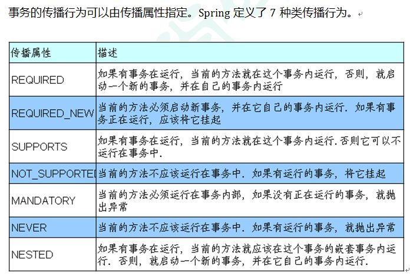

# [Spring5 框架](https://www.bilibili.com/video/BV19r4y1F7d3)

[TOC]

------

## [课程内容介绍](https://www.bilibili.com/video/BV19r4y1F7d3?p=1)

##### 1、Spring 框架概述

##### 2、IOC （控制翻转）

- IOC 底层原理
- IOC 接口（BeanFactory）
- IOC 操作 Bean 管理（基于 xml）
- IOC 操作 Bean 管理（基于注解）

##### 3、Aop（面向切面编程）

##### 4、JdbcTemplate

##### 5、事务管理

##### 6、Spring5 新特性

------

## [Spring5 框架概述](https://www.bilibili.com/video/BV19r4y1F7d3?p=2)

### [Spring5 框架概述](https://www.bilibili.com/video/BV19r4y1F7d3?p=2)

##### 1、Spring是轻量级的开源的JavaEE框架

##### 2、Spring可以解决企业应用开发的复杂性

##### 3、Spring有两个核心部分: IOC 和 Aop

- IOC:控制反转，把创建对象过程交给 Spring 进行管理
- Aop:面向切面，不修改源代码进行功能增强

##### 4、Spring 特点

- 方便解耦，简化开发
- Aop 编程支持
- 方便程序测试
- 方便和其他框架进行整合
- 方便进行事务操作降低API开发难度

##### 5、现在课程中，选取Spring版本5.x

### [Spring5入门案例](https://www.bilibili.com/video/BV19r4y1F7d3?p=3) 

##### 1、下载Spring5

- 使用Spring最新稳定版本5.2.6

  

- 下载地址：https://repo.spring.io/release/org/springframework/spring/

  

  

##### 2、打开idea工具，创建普通Java工程


##### 3、导入Spring5相关jar包


##### 4、创建普通类，在这个类创建普通方法

```Java
public class User {
    public void add() {
        System.out.println("add......");
    }
}
```

##### 5、创建 Spring 配置文件，在配置文件配置创建的对象

- Spring 配置文件使用xml格式


```xml
<?xml version="1.0" encoding="UTF-8"?>
<beans xmlns="http://www.springframework.org/schema/beans"
       xmlns:xsi="http://www.w3.org/2001/XMLSchema-instance"
       xsi:schemaLocation="http://www.springframework.org/schema/beans
http://www.springframework.org/schema/beans/spring-beans.xsd">
    <!--配置User对象创建-->
    <bean id="user" class="ltd.worldiwiu.dao.User"></bean>
</beans>
```

##### 6、进行测试代码编写

```Java
@Test 
public void testAdd() { 
    // 1、加载spring配置文件 
    ApplicationContext context = new ClassPathXmlApplicationContext("beans.xml"); 
    // 2、获取配置创建的对象 
    User user = context.getBean("user", User.class); 
    System.out.println(user); 
    user.add(); 
}

// 运行结果：ltd.worldiwiu.dao.User@4abdb505
```

------

## [IOC（控制反转）](https://www.bilibili.com/video/BV19r4y1F7d3?p=4)

### IOC（概念和原理）

##### 1、什么是IOC

- 控制反转，把对象创建和对象之间的调用过程，交给 Spring 进行管理

- 使用 IOC 目：为了耦合度降低

- 做入门案例就是 IOC 实现

##### 2、IOC底层原理 

- xml 解析、工厂模式、反射

##### 3、画图讲解IOC底层原理


### IOC（BeanFactory 接口）

##### 1、IOC思想基于IOC容器完成，IOC容器底层就是对象工厂

##### 2、Spring 提供 IOC 容器实现两种方式：（两个接口）

- BeanFactory：IOC容器基本实现，是Spring内部的使用接口，不提供开发人员进行使用 

  **加载配置文件时候不会创建对象，在获取对象（使用）才去创建对象** 

- ApplicationContext：BeanFactory接口的子接口，提供更多更强大的功能，一般由开发人员进行使用

  **加载配置文件时候就会把在配置文件对象进行创建**

##### 3、ApplicationContext 接口有实现类


### IOC 操作 Bean 管理（概念） 

##### 1、什么是Bean管理

- Bean管理指的是两个操作 

- Spring创建对象 
- Spirng注入属性 

##### 2、Bean管理操作有两种方式 

- 基于xml配置文件方式实现 
- 基于注解方式实现

### IOC 操作 Bean 管理（基于 xml 方式）

##### 1、基于 xml 方式创建对象

- 在 spring 配置文件中，使用 bean 标签，标签里面添加对应属性，就可以实现对象创建

- 在 bean 标签有很多属性，介绍常用的属性

  - id 属性：唯一标识


  - class 属性：类全路径（包类路径）

- 创建对象时候，默认也是执行无参数构造方法完成对象创建

##### 2、基于 xml 方式注入属性

- DI：依赖注入，就是注入属性

##### 3、第一种注入方式：使用 set 方法进行注入 

**个人感觉：'set方法' 比 '有参构造' 权限高; 它们不能同时出现, 也不能只出现一部分！**

###### 	①  创建类，定义属性和对应的 set 方法

```Java
/**
 * 演示使用set方法进行注入属性
 * 默认调用无参构造方法
 */
public class Book {
    // 创建属性
    private String bname; 
    private String bauthor;
    // 无参构造
    public Book(){}
    // 创建属性对应的set方法
    public void setBname(String bname) {
        this.bname = bname;
    }
    public void setBauthor(String bauthor) {
        this.bauthor = bauthor;
    }
    public void show(){
        System.out.println(bname + " => " + bauthor);
    }
}
```

###### 	②  在 spring 配置文件配置对象创建，配置属性注入

```xml
<!--set方法注入属性-->
<bean id="book" class="ltd.worldiwiu.dao.Book">
    <!--使用property完成属性注入
        name：类里面属性名称
        value：向属性注入的值
    -->
    <property name="bname" value="朝花夕拾"></property>
    <property name="bauthor" value="鲁迅"></property>
</bean>
```

###### 	③  测试方法

```Java
@Test
public void testBook() {
    // 1. 加载spring配置文件
    ApplicationContext context = new ClassPathXmlApplicationContext("beans.xml");
//                new FileSystemXmlApplicationContext("E:\\Technological Learning\\JavaWeb Frame\\Spring\\spring_test_01\\src\\main\\resources\\beans.xml");
    // 2. 获取配置创建的对象
    Book book = context.getBean("book", Book.class);
    System.out.println(book);
    book.show();
}
```

###### 	④  运行结果

```
ltd.worldiwiu.dao.Book@24aed80c
朝花夕拾 => 鲁迅
```

##### 4、第二种注入方式：使用有参数构造进行注入

###### 	①  创建类，定义属性，创建属性对应有参数构造方法

```Java
/**
 * 使用有参数构造注入
 */
public class Orders {
    //属性
    private String bname;
    private String bauthor;
    //有参数构造
    public Book(String bname, String bauthor){
        this.bname = bname;
        this.bauthor = bauthor;
    }
    public void show(){
        System.out.println(bname + " => " + bauthor);
    }
}
```

###### 	②  在 spring 配置文件中进行配置 

```xml
<bean id="book" class="ltd.worldiwiu.dao.Book">
    <!-- 使用 constructor-arg 完成属性注入
        name: 类里面属性名称
        value: 向属性注入的值
     -->
    <!-- 有参构造进行注入 -->
    <constructor-arg name="bname" value="仿徨"></constructor-arg>
    <constructor-arg name="bauthor" value="鲁迅"></constructor-arg>
</bean>
```

###### 	③  测试方法

```Java
@Test
public void testBook() {
    // 1. 加载spring配置文件
    ApplicationContext context = new ClassPathXmlApplicationContext("beans.xml");
//                new FileSystemXmlApplicationContext("E:\\Technological Learning\\JavaWeb Frame\\Spring\\spring_test_01\\src\\main\\resources\\beans.xml");
    // 2. 获取配置创建的对象
    Book book = context.getBean("book", Book.class);
    System.out.println(book);
    book.show();
}
```

###### 	④  运行结果

```
ltd.worldiwiu.dao.Book@305b7c14
仿徨 => 鲁迅
```

##### 5、p 名称空间注入（了解）

- 使用 p 名称空间注入，可以简化基于 xml 配置方式
  - 第一步 添加 p 名称空间在配置文件中
  - 第二步 进行属性注入，在 bean 标签里面进行操作

###### 	①  在 spring 配置文件中进行配置

```xml
<?xml version="1.0" encoding="UTF-8"?>
<beans xmlns="http://www.springframework.org/schema/beans"
       xmlns:xsi="http://www.w3.org/2001/XMLSchema-instance"
       xmlns:p="http://www.springframework.org/schema/p"
       xsi:schemaLocation="http://www.springframework.org/schema/beans http://www.springframework.org/schema/beans/spring-beans.xsd
>
	<!-- p名称空间注入，默认调用的是无参构造 [相当于set注入] -->
    <bean id="book" class="ltd.worldiwiu.dao.Book" p:bname="野草" p:bauthor="鲁迅"></bean>
</beans>
```

###### 	②  运行结果

```
ltd.worldiwiu.dao.Book@b2c9a9c
野草 => 鲁迅
```

### IOC 操作 Bean 管理（xml 注入其他类型属性）

##### 1、字面量

###### 	①  null 值

```xml
<!--null值-->
<property name="address">
  <null/>
</property>
```

```
运行结果：
null
```

###### 	②  属性值包含特殊符号

```xml
<!--属性值包含特殊符号
    1 把<>进行转义 &lt; &gt;
    2 把带特殊符号内容写到CDATA
-->
<property name="address">
    <value><![CDATA[<<南京>>]]></value>
</property>
```

```
运行结果：
<<南京>>
```

##### 2、注入属性-外部 bean

###### 	①  创建两个类 service 类和 dao 类

```Java
public interface BookDao {
    public void update();
}
public class BookDaoImpl implements BookDao {
    @Override
    public void update() {
        System.out.println("BookDaoImpl 更新方法");
    }
}
```

###### 	②  在 service 调用 dao 里面的方法

```Java
import ltd.worldiwiu.dao.BookDao;
public class BookService {
    // 创建BookDao类型属性，生成set方法
    private BookDao bookDao;
    public void setBookDao(BookDao bookDao) {
        this.bookDao = bookDao;
    }
    public void add(){
        System.out.println("service add...");
        bookDao.update();
    }
}
```

###### 	③  在 spring 配置文件中进行配置

```xml
<!-- 外部注入 -->
<!-- service和dao对象创建 -->
<bean id="bookService" class="ltd.worldiwiu.service.BookService">
    <!-- 注入BookDao对象
		name属性：类(Bookservice)里面属性名称
		ref属性：创建BookDao对象bean标签id值
	-->
    <property name="bookDao" ref="userDaoImpl"></property>
</bean>
<!-- 外部注入 -> 创建BookDao对象 -->
<bean id="userDaoImpl" class="ltd.worldiwiu.dao.BookDaoImpl"></bean>
```

###### 	④  测试方法

```Java
@Test
public void testBookService() {
    // 1. 加载spring配置文件
    ApplicationContext context = new ClassPathXmlApplicationContext("beans.xml");
    // 2. 获取配置创建的对象
    BookService bookService = context.getBean("bookService", BookService.class);
    System.out.println(bookService);
    bookService.add();
}
```

###### 	⑤  运行结果

```
ltd.worldiwiu.service.BookService@305b7c14
service add...
BookDaoImpl 更新方法
```

##### 3、注入属性-内部 bean

- 一对多关系：部门和员工

  一个部门有多个员工，一个员工属于一个部

  部门是一，员工是多

- 在实体类之间表示一对多关系，员工表示所属部门，使用对象类型属性进行表示

###### 	①  创建部门 类( Dept ) 和员工类( Emp ) 

```Java
// 部门类
public class Dept {
    private String dname;
    public void setDname(String dname) {
        this.dname = dname;
    }
    @Override
    public String toString() {
        return "Dept{" +
                "dname='" + dname + '\'' +
                '}';
    }
}
// 员工类
public class Emp {
    private String ename;
    private String gender;
    public void setEname(String ename) {
        this.ename = ename;
    }
    public void setGender(String gender) {
        this.gender = gender;
    }
    public void add() {
        System.out.println(ename + "=>" + gender + "=>" + dept);
    }
}
```

###### 	②  在 spring 配置文件中进行配置

```xml
<!-- 内部bean -->
<bean id="emp1" class="ltd.worldiwiu.dao.Emp">
    <!-- 设置两个普通属性 -->
    <property name="ename" value="Star丶Java"></property>
    <property name="gender" value="男"></property>
    <!-- 设置对象类型属性 -->
    <property name="dept">
        <bean id="dept1" class="ltd.worldiwiu.dao.Dept">
            <property name="dname" value="安保部"></property>
        </bean>
    </property>
</bean>
```

###### 	③  测试方法

```Java
@Test
public void testEmp() {
    // 1. 加载spring配置文件
    ApplicationContext context = new ClassPathXmlApplicationContext("beans.xml");
    // 2. 获取配置创建的对象
    Emp emp = context.getBean("emp1", Emp.class);
    System.out.println(emp);
    emp.add();
}
```

###### 	④  运行结果

```
ltd.worldiwiu.dao.Emp@24aed80c
Star丶Java=>男=>Dept{dname='安保部'}
```

##### 4、注入属性-级联赋值

###### 	①  第一种写法

```xml
<!-- 级联赋值 -->
<bean id="emp2" class="ltd.worldiwiu.dao.Emp">
    <!-- 设置两个普通属性 -->
    <property name="ename" value="Star丶Java"></property>
    <property name="gender" value="男"></property>
    <!-- 级联赋值 -->
    <property name="dept" ref="dept2"></property>
</bean>
<bean id="dept2" class="ltd.worldiwiu.dao.Dept">
    <property name="dname" value="财务部"></property>
</bean>
```

```Java
// 测试方法
@Test
public void testEmp() {
    // 1. 加载spring配置文件
    ApplicationContext context = new ClassPathXmlApplicationContext("beans.xml");
    // 2. 获取配置创建的对象
    Emp emp = context.getBean("emp2", Emp.class);
    System.out.println(emp);
    emp.add();
}
```

```xml
运行结果：
ltd.worldiwiu.dao.Emp@24aed80c
Star丶Java=>男=>Dept{dname='财务部'}
```

###### 	②  第二种写法

```Java
// 在 Emp 类中添加 Dept 对象
// 员工属于某一个部门，使用对象形式表示
private Dept dept;
// 生成dept的get方法
public Dept getDept() {
    return dept;
}
public void setDept(Dept dept) {
    this.dept = dept;
}
```

```xml
<!--级联赋值-->
<bean id="emp3" class="ltd.worldiwiu.dao.Emp">
    <!-- 设置两个普通属性 -->
    <property name="ename" value="Star丶Java"></property>
    <property name="gender" value="男"></property>
    <!-- 级联赋值 -->
    <property name="dept" ref="dept3"></property>  <!-- 为了连接下面的类地址 -->
    <property name="dept.dname" value="技术部"></property>
</bean>
<bean id="dept3" class="ltd.worldiwiu.dao.Dept"></bean>
```

```Java
// 测试方法
@Test
public void testEmp() {
    // 1. 加载spring配置文件
    ApplicationContext context = new ClassPathXmlApplicationContext("beans.xml");
    // 2. 获取配置创建的对象
    Emp emp = context.getBean("emp3", Emp.class);
    System.out.println(emp);
    emp.add();
}
```

```
运行结果：
ltd.worldiwiu.dao.Emp@24aed80c
Star丶Java=>男=>Dept{dname='技术部'}
```

### IOC 操作 Bean 管理（xml 注入集合属性）

##### 1、注入数组类型属性

##### 2、注入 List 集合类型属性

##### 3、注入 Map 集合类型属性

##### 4、注入 Set集合类型属性

###### 	①  创建类，定义数组、list、map、set 类型属性，生成对应 set 方法

```Java
import java.util.Arrays;
import java.util.List;
import java.util.Map;
import java.util.Set;

public class Stu {
    // 1. 数组类型的对象
    private String[] courses;
    // 2. list类型的对象
    private List<String> lists;
    // 3. map类型的对象
    private Map<String,String> maps;
    // 4. set类型的对象
    private Set<String> sets;
    
    public void setCourses(String[] courses) {
        this.courses = courses;
    }
    public void setLists(List<String> lists) {
        this.lists = lists;
    }
    public void setMaps(Map<String, String> maps) {
        this.maps = maps;
    }
    public void setSets(Set<String> sets) {
        this.sets = sets;
    }
    public void show(){
        System.out.println(Arrays.toString(courses));
        System.out.println(lists);
        System.out.println(maps);
        System.out.println(sets);
    }
}
```

###### 	②  在 spring 配置文件进行配置

```xml
<!-- xml 注入集合属性 -->
<bean id="stu" class="ltd.worldiwiu.dao.Stu">
    <!-- array类型属性注入 -->
    <property name="courses">
        <array>
            <value>Java</value>
            <value>Python</value>
        </array>
    </property>
    <!-- list类型属性注入 -->
    <property name="lists">
        <list>
            <value>张三</value>
            <value>小三</value>
        </list>
    </property>
    <!-- map类型属性注入 -->
    <property name="maps">
        <map>
            <entry key="Java" value="java"></entry>
            <entry key="Python" value="python"></entry>
        </map>
    </property>
    <!-- set类型属性注入 -->
    <property name="sets">
        <set>
            <value>MySQL</value>
            <value>Redis</value>
        </set>
    </property>
</bean>
```

###### 	③  测试方法

```Java
@Test
public void testStu() {
    // 1. 加载spring配置文件
    ApplicationContext context = new ClassPathXmlApplicationContext("beans.xml");
    // 2. 获取配置创建的对象
    Stu stu = context.getBean("stu", Stu.class);
    stu.show();
}
```

###### 	④  运行结果

```
[Java, Python]
[张三, 小三]
{Java=java, Python=python}
[MySQL, Redis]
```

##### 5、在集合里面设置对象类型值

###### 	①  在 Stu 类中添加信息

```Java
// 学生所学的多门课程
private List<Course> courseList;
public void setCourseList(List<Course> courseList) {
    this.courseList = courseList;
}

public void show(){
    System.out.println(courseList);
}
```

###### 	②  新建课程类

```Java
// 课程类
public class Course {
    private String cname;   // 课程名
    public void setCname(String cname) {
        this.cname = cname;
    }
    @Override
    public String toString() {
        return "Course{" +
                "cname='" + cname + '\'' +
                '}';
    }
}
```

###### 	③  在 spring 配置文件进行配置

```xml
<!-- xml 注入多个集合对象 -->
<bean id="stu" class="ltd.worldiwiu.dao.Stu">
    <!-- 注入list集合创建多个Course对象 -->
    <property name="courseList">
        <list>
            <ref bean="course1"></ref>
            <ref bean="course2"></ref>
            <ref bean="course3"></ref>
        </list>
    </property>
</bean>
<!--创建多个Course对象 -->
<bean id="course1" class="ltd.worldiwiu.dao.Course">
    <property name="cname" value="Struts框架"></property>
</bean>
<bean id="course2" class="ltd.worldiwiu.dao.Course">
    <property name="cname" value="Hibernate框架"></property>
</bean>
<bean id="course3" class="ltd.worldiwiu.dao.Course">
    <property name="cname" value="Spring框架"></property>
</bean>
```

###### 	④  测试方法

```Java
@Test
public void testStu() {
    // 1. 加载 spring 配置文件
    ApplicationContext context = new ClassPathXmlApplicationContext("beans.xml");
    // 2. 获取配置创建的对象
    Stu stu = context.getBean("stu", Stu.class);
    stu.show();
}
```

​	⑤  运行结果

```
[Course{cname='Struts框架'}, Course{cname='Hibernate框架'}, Course{cname='Spring框架'}]
```

##### 6、把集合注入部分提取出来

###### 	①  在 Stu 类中添加信息

```Java
// list 类型的对象
private List<String> list;
public void setList(List<String> list) {
    this.list = list;
}
public void show(){
    System.out.println(list);
}
```

###### 	②  在 spring 配置文件中引入名称空间 util

```xml
<?xml version="1.0" encoding="UTF-8"?> 
<beans xmlns="http://www.springframework.org/schema/beans" 
       xmlns:xsi="http://www.w3.org/2001/XMLSchema-instance" 
       xmlns:p="http://www.springframework.org/schema/p" 
       xmlns:util="http://www.springframework.org/schema/util" 
       xsi:schemaLocation="http://www.springframework.org/schema/beans 
http://www.springframework.org/schema/beans/spring-beans.xsd 
                           http://www.springframework.org/schema/util 
http://www.springframework.org/schema/util/spring-util.xsd">
```

###### 	③  使用 util 标签完成 list 集合注入提取

```xml
<bean id="stu" class="ltd.worldiwiu.dao.Stu">
    <!-- 提取 list 集合类型属性注入使用 -->
	<property name="list" ref="courseList"></property>
</bean>
<!-- 提取 list 集合类型属性注入 -->
<util:list id="courseList">
    <value>MyBatis框架</value>
    <value>Spring5框架</value>
    <value>SpringMVC框架</value>
</util:list>
```

###### 	④  测试方法

```Java
@Test
public void testStu() {
    // 1. 加载spring配置文件
    ApplicationContext context = new ClassPathXmlApplicationContext("beans.xml");
    // 2. 获取配置创建的对象
    Stu stu = context.getBean("stu", Stu.class);
    stu.show();
}
```

###### 	⑤  运行结果

```
[MyBatis框架, Spring5框架, SpringMVC框架]
```

### IOC 操作 Bean 管理（FactoryBean）

##### 1、Spring 有两种类型 bean，一种普通 bean，另外一种工厂 bean（FactoryBean） 

###### （1）普通 bean：在配置文件中定义 bean 类型就是返回类型 

###### （2）工厂 bean：在配置文件定义 bean 类型可以和返回类型不一样 

​	①  创建类，让这个类作为工厂 bean，实现接口 FactoryBean

​	②  实现接口里面的方法，在实现的方法中定义返回的 bean 类型

##### 2、演示代码

###### 	①  Stu 类

```Java
private String[] courses;
public void setCourses(String[] courses) {
    this.courses = courses;
}
public void show(){
    System.out.println(Arrays.toString(courses));
}
@Override
public String toString() {
    return "Stu{" +
            "courses=" + Arrays.toString(courses) +
            '}';
}
```

###### 	②  Factory 类实现 FactoryBean 接口

```Java
import org.springframework.beans.factory.FactoryBean;

public class Factory implements FactoryBean<Stu> {
    /**
     * 回由 FactoryBean 创建的 bean 实例,如果 isSingleton() 返回 true ,则该实例会放到 Spring 容器中单实例缓存池中
     * @return
     * @throws Exception
     */
    @Override
    public Stu getObject() throws Exception {
        Stu stu = new Stu();
        String array[] = {"Java1", "Python1"};
        stu.setCourses(array);
        return stu;
    }
    /**
     * 返回 FactoryBean 创建的 bean 类型
     * @return
     */
    @Override
    public Class<Stu> getObjectType() {
        return Stu.class;
    }
    /**
     * 返回由 FactoryBean 创建的 bean 实例的作用域是 singleton 还是 prototype
     * @return
     */
    @Override
    public boolean isSingleton() {
        return false;
    }
}
```

###### 	③  在 spring 配置文件进行配置

```xml
<!-- 工厂Bean -->
<bean id="myBean" class="ltd.worldiwiu.dao.Factory"></bean>
```

###### 	④  测试方法

```Java
@Test
public void testFactory() throws Exception {
    ApplicationContext context = new ClassPathXmlApplicationContext("beans.xml");
    Stu stu = context.getBean("myBean", Stu.class);
    System.out.println(stu);
}
```

###### 	⑤  运行结果

```
ltd.worldiwiu.dao.Stu@24aed80c
```

### IOC 操作 Bean 管理（bean 作用域） 

##### 1、在 Spring 里面，设置创建 bean 实例是单实例还是多实例

##### 2、在 Spring 里面，默认情况下，bean 是单实例对象

```Java
@Test
public void test3() {
    ApplicationContext context = new ClassPathXmlApplicationContext("beans.xml");
    Book book1 = context.getBean("book", Book.class);
    Book book2 = context.getBean("book", Book.class);
    System.out.println(book1);
    System.out.println(book2; 
}
```

```
运行显示：
ltd.worldiwiu.dao Book@5d11346a
ltd.worldiwiu.dao Book@5d11346a
```

##### 3、如何设置单实例还是多实例

###### ①  在 spring 配置文件 bean 标签里面有属性（scope）用于设置单实例还是多实例

###### ②  scope 属性值

- singleton：表示是单实例对象（默认值），容器只创建一个对象
- prototype：表示是多实例对象，容器创建多个对象，但容器不会去逐个销毁，默认是单例对象
- request：web项目中spring创建一个bean对象，将对象存到request域中
- session：web项目中将对象存到session域中

##### 4、演示代码

###### 	①  在 spring 配置文件中进行配置

```xml
<bean id="book" class="com.atguigu.spring5.factorybean.Book" scope="prototype">
    <property name="list" ref="bookList"></property>
</bean>
```

###### 	②  运行结果

```
ltd.worldiwiu.dao Book@5d11346a
ltd.worldiwiu.dao Book@7a36aefa
```

##### 5、singleton 和 prototype 区别

①  singleton 单实例，prototype 多实例

②  设置 scope 值是 singleton 时候，加载 spring 配置文件时候就会创建单实例对象

​      设置 scope 值是 prototype 时候，不是在加载 spring 配置文件时候创建对象，在调用getBean方法时候创建多实例对象

### IOC 操作 Bean 管理（bean 生命周期）

##### 1、生命周期

- 从对象创建到对象销毁的过程

##### 2、bean 生命周期

​	①  通过构造器创建 bean 实例（无参数构造）

​	②  为 bean 的属性设置值和对其他 bean 引用（调用 set 方法）

​	③  调用 bean 的初始化的方法（需要进行配置初始化的方法）

​	④  bean 可以使用了（对象获取到了）

​	⑤  当容器关闭时候，调用 bean 的销毁的方法（需要进行配置销毁的方法）

##### 3、演示 bean 生命周期

###### 	①  新建 Orders 类

```Java
public class Orders {
	// 无参数构造
	public Orders() {
	System.out.println("第一步 执行无参数构造创建 bean 实例");
	}
	private String oname;
	public void setOname(String oname) {
		this.oname = oname;
		System.out.println("第二步 调用 set 方法设置属性值");
	}
	// 创建执行的初始化的方法
	public void initMethod() {
		System.out.println("第三步 执行初始化的方法");
	}
	// 创建执行的销毁的方法
	public void destroyMethod() {
		System.out.println("第五步 执行销毁的方法");
	}
}
```

###### 	②  在 spring 配置文件中进行配置

```xml
<bean id="orders" class="com.atguigu.spring5.bean.Orders" initmethod="initMethod" destroy-method="destroyMethod">
	<property name="oname" value="手机"></property>
</bean>
```

###### 	③  测试方法

```Java
@Test
public void testBean3() {
	// ApplicationContext context = new ClassPathXmlApplicationContext("beans.xml");
 	ClassPathXmlApplicationContext context = new ClassPathXmlApplicationContext("bean4.xml");
	Orders orders = context.getBean("orders", Orders.class);
	System.out.println("第四步 获取创建 bean 实例对象");
    System.out.println(orders);
	//手动让 bean 实例销毁
	context.close();
}
```

###### 	④  运行结果

```
第一步 执行无参数构造创建 bean 实例
第二步 调用 set 方法设置属性值
第三步 执行初始化的方法
第四步 获取创建 bean 实例对象
com.atguigu.spring5.bean.Orders@192d3247
第五步 执行销毁的方法
```

##### 4、bean 的后置处理器，bean 生命周期有七步

​	①  通过构造器创建 bean 实例（无参构造）

​	②  为 bean 的属性设置值和对其他 bean 引用（调用 set 方法）

​	③  **把 bean 实例传递 bean 后置处理器的方法 postProcessBeforeInitialization**

​	④  调用 bean 的初始化的方法（需要进行配置初始化的方法）

​	⑤  **把 bean 实例传递 bean 后置处理器的方法 postProcessAfterInitialization**

​	⑥  bean 可以使用了（对象获取到了）

​	⑦  当容器关闭时候，调用 bean 的销毁的方法（需要进行配置销毁的方法）

##### 5、演示添加后置处理器效果

###### 	①  创建后置处理器（添加类 MyBeanPost，实现接口 BeanPostProcessor）

```Java
public class MyBeanPost implements BeanPostProcessor {
	@Override
	public Object postProcessBeforeInitialization(Object bean, String beanName) throws BeansException {
		System.out.println("在初始化之前执行的方法");
		return bean;
	}
	@Override
	public Object postProcessAfterInitialization(Object bean, String beanName) throws BeansException {
		System.out.println("在初始化之后执行的方法");
		return bean;
	}
}
```

###### 	②  在 spring 配置文件中进行配置

```xml
<!--配置后置处理器-->
<bean id="myBeanPost" class="ltd.worldiwiu.dao.MyBeanPost"></bean>
```

###### 	③  测试方法

```Java
@Test
public void testBean3() {
	ApplicationContext context = new ClassPathXmlApplicationContext("beans.xml");
 	// ClassPathXmlApplicationContext context = new ClassPathXmlApplicationContext("beans.xml");
	Orders orders = context.getBean("orders", Orders.class);
	System.out.println("第四步 获取创建 bean 实例对象");
    System.out.println(orders);
	// 手动让 bean 实例销毁
	((ClassPathXmlApplicationContext)context).close();
}
```

###### 	④  运行结果

```
运行结果：
第一步 执行无参数构造创建 bean 实例
第二步 调用 set 方法设置属性值
在初始化之前执行的方法
第三步 执行初始化的方法
在初始化之后执行的方法
第四步 获取创建 bean 实例对象
com.atguigu.spring5.bean.Orders@192d3247
第五步 执行销毁的方法
```

### IOC 操作 Bean 管理（xml 自动装配）

##### 1、什么是自动装配

- 根据指定装配规则（属性名称或者属性类型），spring 自动将匹配的属性值进行注入

##### 2、演示自动装配过程

###### 	①  创建 Dept 类

```Java
public class Dept {
    private String dname;
    public void setDname(String dname) {
        this.dname = dname;
    }
    @Override
    public String toString() {
        return "Dept{" +
                "dname='" + dname + '\'' +
                '}';
    }
}
```

###### 	②  创建 Emp 类

```Java
public class Emp {
    private String ename;
    private String gender;
    private Dept dept;
    public void setEname(String ename) {
        this.ename = ename;
    }
    public void setGender(String gender) {
        this.gender = gender;
    }
    public void setDept(Dept dept) {
        this.dept = dept;
    }
    public Dept getDept() {
        return dept;
    }
    @Override
    public String toString() {
        return "Emp{" +
                "ename='" + ename + '\'' +
                ", gender='" + gender + '\'' +
                ", dept=" + dept +
                '}';
    }
}
```

###### 	③  在 spring 配置文件中进行配置

- ​	根据属性名称自动注入

```xml
<!-- 自动装配
    autowire(自动装配):
        byName: 根据属性名称注入, 注入值 bean 的 id 值和类属性名称一样
        byType: 根据属性类型注入
 -->
<bean id="emp_z" class="ltd.worldiwiu.dao.Emp" autowire="byName">
<!-- <property name="dept" ref="dept_z"></property> -->
</bean>
<bean id="dept_z" class="ltd.worldiwiu.dao.Dept"></bean>
```

- ​	根据属性类型自动注入

```xml
<!-- 自动装配
    autowire(自动装配):
        byName: 根据属性名称注入, 注入值 bean 的 id 值和类属性名称一样
        byType: 根据属性类型注入
 -->
<bean id="emp_z" class="ltd.worldiwiu.dao.Emp" autowire="byType">
<!-- <property name="dept" ref="dept_z"></property> -->
</bean>
<bean id="dept_z" class="ltd.worldiwiu.dao.Dept"></bean>
```

###### 	④  测试方法

```Java
@Test
public void testEmp_z() {
    // 1. 加载spring配置文件
    ApplicationContext context =
    new ClassPathXmlApplicationContext("beans.xml");
    // 2. 获取配置创建的对象
    Emp emp = context.getBean("emp_z", Emp.class);
    System.out.println(emp);
}
```

###### 	⑤  运行结果

```
Emp{ename='null', gender='null', dept=Dept{dname='null'}}
```

### IOC 操作 Bean 管理(外部属性文件)

##### 1、直接配置数据库信息

（1）配置德鲁伊连接池信息

（2）引入德鲁伊连接池依赖 jar 包 [ druid-1.1.9.jar ]

```xml
<!--meven 项目里的 pom.xml 中添加包属性-->
<dependency>
	<groupId>com.alibaba</groupId>
	<artifactId>druid</artifactId>
	<version>1.1.20</version>
</dependency>
```

```xml
<!-- 直接配置连接池 -->
<bean id="dataSource" class="com.alibaba.druid.pool.DruidDataSource">
    <property name="driverClassName" value="com.mysql.jdbc.Driver"></property>
    <property name="url" value="jdbc:mysql://localhost:3306/test"></property>
    <property name="username" value="root"></property>
    <property name="password" value="root"></property>
</bean>
```

##### 2、引入外部属性文件配置数据库连接池

###### （1）创建外部属性文件，properties 格式文件，写数据库连接信息

```properties
prop.driverClass=com.mysql.jdbc.Driver
prop.url=jdbc:mysql://localhost:3306/test
prop.userName=root
prop.password=0000
```

###### （2）把外部 properties 属性文件引入到 spring 配置文件中

​	①  引入 context 名称空间

```xml
<beans xmlns="http://www.springframework.org/schema/beans" 
       xmlns:xsi="http://www.w3.org/2001/XMLSchema-instance" 
       xmlns:p="http://www.springframework.org/schema/p" 
       xmlns:util="http://www.springframework.org/schema/util" 
       xmlns:context="http://www.springframework.org/schema/context" 
       xsi:schemaLocation="http://www.springframework.org/schema/beans http://www.springframework.org/schema/beans/spring-beans.xsd
                        http://www.springframework.org/schema/util http://www.springframework.org/schema/util/spring-util.xsd
                        http://www.springframework.org/schema/context http://www.springframework.org/schema/context/spring-context.xsd">
</beans>
```

​	②  在 spring 配置文件使用标签引入外部属性文件

```xml
<!-- 引入外部属性文件 -->
<context:property-placeholder location="classpath:jdbc.properties"/>
<!-- 配置连接池 -->
<bean id="dataSource" class="com.alibaba.druid.pool.DruidDataSource">
    <property name="driverClassName" value="${prop.driverClass}"></property>
    <property name="url" value="${prop.url}"></property>
    <property name="username" value="${prop.userName}"></property>
    <property name="password" value="${prop.password}"></property>
</bean>
```

### IOC 操作 Bean 管理(基于注解方式)

##### 1、什么是注解

（1）注解是代码特殊标记，格式：@注解名称(属性名称=属性值, 属性名称=属性值...)

（2）使用注解，注解作用在类上面，方法上面，属性上面

（3）使用注解目的：简化 xml 配置

##### 2、Spring 针对 Bean管理中创建对象提供注解

（1）@Component [ 所有层均可用 ]

（2）@Service [ Service层、业务逻辑层 ]

（3）@Controller [ Web层 ]0

（4）@Reposotory [ DAO层 / 持久层 ]

**上面四个注解工能是一样的，都可以来创建 bean 实例**

##### 3、基于注解方式实现对象创建

###### （1）引入依赖 => [ spring.-aop-5.2.6.RELEASE.jar ]

###### （2）开启组件扫描

```xml
<!-- 开启组件扫描
	如果扫描多个包，包名之间可以用逗号隔开
	扫描包上层目录
 -->
<context:component-scan base-package="ltd.worldiwiu"></context:component-scan>
```

###### （3）创建类，在类上面添加创建对象注解

```Java
import org.springframework.stereotype.Component;

// 在注解里面 value 属性值可以省略不写，
// 默认值是类名称，首字母小写
// UserService -> userService
@Component(value = "userService")  // <bean id="userService" class=".."/>
@Component  // 这样写也行
public class UserService {
    public void add(){
        System.out.println("service add...");
    }
}
```

```Java
// 测试方法
@Test
public void testBookService() {
    // 1. 加载spring配置文件
    ApplicationContext context =
            new ClassPathXmlApplicationContext("beans.xml");
    // 2. 获取配置创建的对象
    BookService bookService = context.getBean("bookService", BookService.class);
    System.out.println(bookService);
    bookService.add();
}
```

```
运行结果：
ltd.worldiwiu.service.BookService@4f2b503c
service add...
```

##### 4、开启组件扫描细节配置

```xml
<!-- 示例1
     如果扫描多个包，包名之间用逗号隔开
     扫描包的上层目录
     base-package: 需要扫描的包
     use-default-filters: true > 扫描全部组件
						  false > 只扫描部分组件
 -->
<context:component-scan base-package="ltd.worldiwiu" use-default-filters="false">
    <!--
		include-filter: 设置扫描指定内容类的包
        exclude-filter: 设置不扫描指定内容类的包
        type: annotation > 按照注解进行扫描, 标注了指定注解的组件不要扫描
              assignable > 指定排除某个具体的类, 按照类排除
        expression: 注解的全类名
     -->
    <context:include-filter type="annotation" expression="org.springframework.stereotype.Controller"/>
</context:component-scan>
```

##### 5、基于注解方式实现属性注入

**xml 文件中只添加扫描即可**

```XML
<!-- 开启组件扫描
		如果扫描多个包，包名之间用逗号隔开
		扫描包的上层目录
 -->
<context:component-scan base-package="ltd.worldiwiu"></context:component-scan>
```

###### （1）@Autowired: 根据属性类型进行自动装配

​	①  把 service 和 dao 对象创建，在 service 和 dao 类添加创建对象注解

​	②  在 service 注入 dao 对象，在 service 类添加 dao 类型属性，在属性上面使用注解

**演示代码**

```Java
// BookDao 接口
public interface BookDao {
    public void update();
}
```

```Java
// 实现 BookDao 接口
import org.springframework.stereotype.Repository;

@Repository
public class BookDaoImpl implements BookDao {
    @Override
    public void update() {
        System.out.println("BookDao > BookDaoImpl...");
    }
}
```

```Java
// BookService 类
import ltd.worldiwiu.dao.BookDao;
import org.springframework.beans.factory.annotation.Autowired;
import org.springframework.stereotype.Service;

@Service
public class BookService {

    // 定义 dao 类型属性
    // 不需要添加 set 方法
    // 添加注入属性注解
    @Autowired  // 根据属性类型进行自动装配
    private BookDao bookDao;
    
    public void add(){
        System.out.println("service > add...");
        bookDao.update();
    }
}
```

```xml
<!-- 开启组件扫描
		如果扫描多个包，包名之间用逗号隔开
		扫描包的上层目录
 -->
<context:component-scan base-package="ltd.worldiwiu"></context:component-scan>
```

```Java
// 测试方法
@Test
public void testBookService() {
    // 1. 加载spring配置文件
    ApplicationContext context = new ClassPathXmlApplicationContext("beans.xml");
    // 2. 获取配置创建的对象
    BookService bookService = context.getBean("bookService", BookService.class);
    System.out.println(bookService);
    bookService.add();
}
```

```
运行结果：
ltd.worldiwiu.service.BookService@36916eb0
service > add...
BookDao > BookDaoImpl...
```

###### （2）@Qualifier: 根据名称进行注入

这个 @Qualifier 注解的使用，和上面 @Autowired 一起使用

**演示代码**

```Java
// 添加 @Repository 注解的名称
// 实现 BookDao 接口
import org.springframework.stereotype.Repository;

@Repository(value = "bookDaoImpl_")
public class BookDaoImpl implements BookDao {
    @Override
    public void update() {
        System.out.println("BookDao > BookDaoImpl...");
    }
}
```

```Java
// 添加 @Qualifier 注解
// BookService 类
import ltd.worldiwiu.dao.BookDao;
import org.springframework.beans.factory.annotation.Autowired;
import org.springframework.beans.factory.annotation.Qualifier;
import org.springframework.stereotype.Service;

@Service
public class BookService {

    // 定义 dao 类型属性
    // 不需要添加 set 方法
    // 添加注入属性注解
    @Autowired  // 根据属性类型进行自动装配
    @Qualifier(value = "bookDaoImpl_")  // 根据名称进行注入
    private BookDao bookDao;
    
    public void add(){
        System.out.println("service > add...");
        bookDao.update();
    }
}
```

```
运行结果：
ltd.worldiwiu.service.BookService@12aba8be
service > add...
BookDao > BookDaoImpl...
```

###### （3）@Resource: 可以根据类型注入，可以根据名称注入

**演示代码**

```Java
import ltd.worldiwiu.dao.BookDao;
import org.springframework.stereotype.Service;

import javax.annotation.Resource;

@Service
public class BookService {

    // @Resource  // 直接写的话，就直接根据类型进行注入
    // 根据名称注入，跟 BookDaoImpl 类的注解 【@Repository(value = "bookDaoImpl_")】的名称一样
    @Resource(name = "bookDaoImpl_")
    private BookDao bookDao;

    public void setBookDao(BookDao bookDao) {
        this.bookDao = bookDao;
    }

    public void add(){
        System.out.println("service > add...");
        bookDao.update();
    }
}
```

```
运行结果：
ltd.worldiwiu.service.BookService@53ce1329
service > add...
BookDao > BookDaoImpl...
```

###### （4）@Value: 注入普通类型属性

```Java
import ltd.worldiwiu.dao.BookDao;
import org.springframework.stereotype.Service;
import org.springframework.beans.factory.annotation.Value;

import javax.annotation.Resource;

@Service
public class BookService {

    // @Resource  // 直接写的话，就直接根据类型进行注入
    // 根据名称注入，跟 BookDaoImpl 类的注解 【@Repository(value = "bookDaoImpl_")】的名称一样
    @Resource(name = "bookDaoImpl_")
    private BookDao bookDao;
    @Value("abc")
    private String name;

    public void setBookDao(BookDao bookDao) {
        this.bookDao = bookDao;
    }

    public void add(){
        System.out.println("service > add...");
        System.out.println("name => " + name);
        bookDao.update();
    }
}
```

```
运行结果：
ltd.worldiwiu.service.BookService@437da279
service > add...
name => abc
BookDao > BookDaoImpl...
```

##### 6、完成注解开发

###### （1）创建配置类，替代 xml 配置文件

```Java
import org.springframework.context.annotation.ComponentScan;
import org.springframework.context.annotation.Configuration;

@Configuration  // 作为配置类，替代 xml 配置文件
// 替换 xml文件中 > context:component-scan base-package="ltd.worldiwiu"></context:component-scan>
@ComponentScan(basePackages = {"ltd.worldiwiu"})
public class SpringConfig {}
```

###### （2）编写测试类

```Java
@Test
public void testBookService() {
    // 1. 加载spring配置文件
    ApplicationContext context = new AnnotationConfigApplicationContext(SpringConfig.class);
    // 2. 获取配置创建的对象
    BookService bookService = context.getBean("bookService", BookService.class);
    System.out.println(bookService);
    bookService.add();
}
```

###### （3）运行结果

```
ltd.worldiwiu.service.BookService@306e95ec
service > add...
name => abc
BookDao > BookDaoImpl...
```

------

## AOP（[面向切面编程](https://baike.baidu.com/item/面向切面编程/6016335)）

### [AOP（基本概念）](https://www.bilibili.com/video/BV19r4y1F7d3?p=25)

##### 什么是AOP

（1）面向切面编程（方面），利用 AOP 可以对业务逻辑的各个部分进行隔离，从而使得业务逻辑各部分之间的耦合度降低，提高程序的可重用性，同时提高了开发的效率

（2）通俗描述：不通过修改源代码方式，在主干功能里面添加新功能

（3）使用登录例子说明 AOP


### AOP（底层原理）

##### AOP底层使用动态代理

###### （1）有接口情况

- 创建接口实现类代理对象，增强类的方法


###### （2）没有接口情况

- 创建子类的代理对象，增强类的方法


### AOP（JDK 动态代理）

##### 1、使用 JDK 动态代理，使用 Proxy

  ☆  调用 newProxyInstance 方法

static Object	newProxyInstance(ClassLoader loder, 类<?>[] interface, InvocationHandler h)

返回指定接口的代理类的实例，该接口将方法调用分派给指定的调用处理程序。

​	①  ClassLoader loder: 类加载器

​	②  类<?>[] interface: 增强方法所在的类，这个类实现的接口，支持多个接口

​	③  InvocationHandler h: 实现这个接口 InvocationHandler ，创建代理对象，写增强的部分

##### 2、编写 JDK 动态代理代码

###### （1）创建接口，定义方法

```Java
public interface BookDao {
    public int add(int a, int b);
    public String update(String id);
}
```

###### （2）创建接口实现类，实现方法

```Java
public class BookDaoImpl implements BookDao {

    @Override
    public int add(int a, int b) {
        return a + b;
    }

    @Override
    public String update(String id) {
        System.out.println("BookDao > BookDaoImpl...");
        return id;
    }
}
```

###### （3）使用 Proxy 类创建接口代理对象

```Java
import java.lang.reflect.InvocationHandler;
import java.lang.reflect.Method;
import java.lang.reflect.Proxy;
import java.util.Arrays;

public class BookProxy {
    public static void main(String[] args) {
        // 创建接口实现类代理对象
        Class[] interfaces = {BookDao.class};
        /*
        Proxy.newProxyInstance(BookProxy.class.getClassLoader(), interfaces, new InvocationHandler() {
            @Override
            public Object invoke(Object proxy, Method method, Object[] args) throws Throwable {
                return null;
            }
        });
        */
        BookDaoImpl bookDaoImpl = new BookDaoImpl();
        BookDao bookDao = (BookDao) Proxy.newProxyInstance(BookProxy.class.getClassLoader(), interfaces, new BookDaoProxy(bookDaoImpl));
        int result = bookDao.add(8,9);
        String res = bookDao.update("2018");
        System.out.println("add > " + result + "\tupdate > " + res);
    }
}

// 创建代理对象类
class BookDaoProxy implements InvocationHandler{

    // 把需要代理对象传递过来
    // 有参构造传递
    private Object object;
    public BookDaoProxy(Object object){
        this.object = object;
    }

    // 增强的逻辑
    @Override
    public Object invoke(Object proxy, Method method, Object[] args) throws Throwable {
        // 方法之前
        System.out.println("方法之前执行..." + method.getName() + "传递的参数: " + Arrays.toString(args));

        // 被增强的方法执行
        Object result = method.invoke(object, args);

        // 方法之后
        System.out.println("方法之后执行..." + object);

        return result;
    }
}
```

###### （4）运行结果

```
方法之前执行...add传递的参数: [8, 9]
BookDaoImpl > add...
方法之后执行...ltd.worldiwiu.dao.BookDaoImpl@2f92e0f4
方法之前执行...update传递的参数: [2018]
BookDaoImpl > update...
方法之后执行...ltd.worldiwiu.dao.BookDaoImpl@2f92e0f4
add > 17	update > 2018
```

### AOP（术语）

##### 1、连接点

**类里面哪些方法可以被增强，这些称为连接点**

##### 2、切入点

**实际被真正增强的方法称为切入点**

##### 3、通知（增强）

（1）实际增强的逻辑部分称为通知（增强）

（2）通知有多种类型

​	①  前置通知：在切入点前面执行

​	②  后置通知：在切入点后面执行

​	③  环绕通知：在切入点前、后都执行

​	④  异常通知：在切入点异常时执行

​	⑤  最终通知：在最后执行（相当于 **finally** ）

##### 4、切面 [ 是动作操作 ]

**把通知应用到切入点过程**

### AOP操作（准备工作）

##### 1、Spring 框架一般都是基于 AspectJ 实现 AOP 操作

**AspectJ 不是 Spring 组成部分，独立 AOP 框架，一般把 AspectJ 和 Spring框架一起使用，进行 AOP 操作**

##### 2、基于 AspectJ 实现 AOP 操作

（1）基于 xml 配置文件实现

（2）基于注解方式实现（使用）

##### 3、在项目**工程里面引入** **AOP** 相关依赖


```xml
<!-- meven 工程中需要在 pom.xml 文件中加入即可以 -->
<dependency>
    <groupId>org.aspectj</groupId>
    <artifactId>aspectjweaver</artifactId>
    <version>1.6.8</version>
</dependency>
```

##### 4、切入点表达式

###### （1）切入点表达式作用：***知道对哪个类里面的哪个方法进行增强***

###### （2）语法结构：execution([权限修饰符] [返回类型] [类全路径] [方法名称] ([参数列表]))

​	①  对 ltd.worldiwiu.dao.BookDao 类里面的 add 进行增强

​			execution(* ltd.worldiwiu.dao.BookDao.add(..))

​	②  对 ltd.worldiwiu.dao.BookDao 类里面的所有的方法进行增强

​			execution(* ltd.worldiwiu.dao.BookDao.*(..))

​	③  对 ltd.worldiwiu.dao 包里面的所有类，类里面 所有方法进行增强

​			execution(* ltd.worldiwiu.dao.☆.☆(..))

### AOP 操作（AspectJ 注解）

##### 1、创建类，在类里面定义方法 

```Java
// 被增强的类
public class User {
    public void add(){
        System.out.println("User > add...");
    }
}
```

##### 2、创建增强类（编写增强逻辑）

- 在增强类里面，创建方法，让不同方法代表不同通知类型.

```Java
// 被增强的类
public class User {
    public void add(){
        System.out.println("User > add...");
    }
}
```

```Java
// 被增强的类
public class UserProxy {

    // 前置通知
    public void before (){
        System.out.println("UserProxy > before");
    }
}
```

##### 3、进行通知的配置

（1）在 Spring 配置文件中，开启 注解扫描

```xml
<?xml version="1.0" encoding="UTF-8"?>
<beans xmlns="http://www.springframework.org/schema/beans"
       xmlns:xsi="http://www.w3.org/2001/XMLSchema-instance"
       xmlns:context="http://www.springframework.org/schema/context"
       xmlns:aop="http://www.springframework.org/schema/aop"
       xsi:schemaLocation="http://www.springframework.org/schema/beans http://www.springframework.org/schema/beans/spring-beans.xsd
                           http://www.springframework.org/schema/context http://www.springframework.org/schema/context/spring-context.xsd
                           http://www.springframework.org/schema/aop http://www.springframework.org/schema/aop/spring-aop.xsd">
    
    <!-- 开启注解扫描 -->
    <context:component-scan base-package="ltd.worldiwiu.aop"></context:component-scan>

</beans>
```

（2）使用注解创建 User 和 UserProxy 对象

```Java
import org.springframework.stereotype.Component;

// 被增强的类
@Component
public class User {
    public void add(){
        System.out.println("User > add...");
    }
}
```

```Java
import org.springframework.stereotype.Component;

// 被增强的类
@Component
public class UserProxy {

    // 前置通知
    public void before (){
        System.out.println("UserProxy > before");
    }
    
}
```

（3）在增强类上面添加注解 @Aspect

```Java
import org.aspectj.lang.annotation.Aspect;
import org.springframework.stereotype.Component;

// 被增强的类
@Component
@Aspect  // 生成代理对象
public class UserProxy {

    // 前置通知
    public void before (){
        System.out.println("UserProxy > before");
    }

}
```

（4）在 Spring 配置文件中开启生成代理对象

```xml
<!-- 开启Aspect生成代理对象 -->
<aop:aspectj-autoproxy></aop:aspectj-autoproxy>
```

##### 4、配置不同类型的通知

- 在增强类的里面，在作为通知方法上面添加通知类型注解，使用切入点表达式配置

```Java
import org.aspectj.lang.ProceedingJoinPoint;
import org.aspectj.lang.annotation.*;
import org.springframework.stereotype.Component;

// 被增强的类
@Component
@Aspect
public class UserProxy {

    // 前置通知
    // @Before 注解表示前置通知
    @Before("execution(* ltd.worldiwiu.aop.User.add(..))")
    public void before (){
        System.out.println("UserProxy > before");
    }

    // 最终通知
    // @After 注解表示最终通知
    @After("execution(* ltd.worldiwiu.aop.User.add(..))")
    public void after (){
        System.out.println("UserProxy > after");
    }

    // 后置通知（返回通知）
    // @AfterReturning 注解表示返回值之后执行
    @AfterReturning("execution(* ltd.worldiwiu.aop.User.add(..))")
    public void afterReturning (){
        System.out.println("UserProxy > afterReturning");
    }

    // 异常通知
    // @AfterThrowing 注解表示异常通知
    @AfterThrowing("execution(* ltd.worldiwiu.aop.User.add(..))")
    public void afterThrowing (){
        System.out.println("UserProxy > afterThrowing");
    }

    // 环绕通知
    // @Around 注解表示环绕通知
    @Around("execution(* ltd.worldiwiu.aop.User.add(..))")
    public void around (ProceedingJoinPoint proceedingJoinPoint) throws Throwable{
        System.out.println("UserProxy > aroundBefore");

        // 被增强的方法执行
        proceedingJoinPoint.proceed();

        System.out.println("UserProxy > aroundAfter");
    }

}
```

```
运行结果：
UserProxy > aroundBefore
UserProxy > before
User > add...
UserProxy > aroundAfter
UserProxy > after
UserProxy > afterReturning
```

##### 5、相同 的切入点抽取

```Java
// 相同切入点抽取
@Pointcut("execution(* ltd.worldiwiu.aop.User.add(..))")
public void pointcut (){}

// 前置通知
// @Before 注解表示前置通知
@Before("pointcut()")
public void before (){
    System.out.println("UserProxy > before");
}
```

##### 6、有多个增强多同一个方法进行增强，设置增强优先级

- 有多个增强多同一个方法进行增强

```Java
import org.aspectj.lang.annotation.Aspect;
import org.aspectj.lang.annotation.Before;
import org.springframework.stereotype.Component;

@Component
@Aspect
public class User2Proxy {
    @Before("execution(* ltd.worldiwiu.aop.User.add(..))")
    public void before (){
        System.out.println("User2Proxy > before");
    }
}
```

```Java
import org.aspectj.lang.annotation.Aspect;
import org.aspectj.lang.annotation.Before;
import org.springframework.stereotype.Component;

@Component
@Aspect
public class User3Proxy {
    @Before("execution(* ltd.worldiwiu.aop.User.add(..))")
    public void before (){
        System.out.println("User3Proxy > before");
    }
}
```

```
运行结果：
User2Proxy > before
User3Proxy > before
UserProxy > aroundBefore
UserProxy > before
User > add...
UserProxy > aroundAfter
UserProxy > after
UserProxy > afterReturning
```

- 在增强类上面添加注解 @Order(数字类型值)，数字型值越小优先级越高

```Java
import org.aspectj.lang.annotation.Aspect;
import org.aspectj.lang.annotation.Before;
import org.springframework.core.annotation.Order;
import org.springframework.stereotype.Component;

@Component
@Aspect
@Order(2)
public class UserProxy {
    // 相同切入点抽取
    @Pointcut("execution(* ltd.worldiwiu.aop.User.add(..))")
    public void pointcut (){}

    // 前置通知
    // @Before 注解表示前置通知
    @Before("pointcut())")
    public void before (){
        System.out.println("UserProxy > before");
    }
    
    ......
	
}
```

```Java
import org.aspectj.lang.annotation.Aspect;
import org.aspectj.lang.annotation.Before;
import org.springframework.core.annotation.Order;
import org.springframework.stereotype.Component;

@Component
@Aspect
@Order(3)
public class User2Proxy {
    
    // 相同切入点抽取
    @Pointcut("execution(* ltd.worldiwiu.aop.User.add(..))")
    public void pointcut (){}

    // 前置通知
    // @Before 注解表示前置通知
    @Before("pointcut())")
    public void before (){
        System.out.println("User2Proxy > before");
    }
    
    ......
	
}
```

```Java
// 被增强的类
@Component
@Aspect
@Order(1)
public class User3Proxy {

    // 相同切入点抽取
    @Pointcut("execution(* ltd.worldiwiu.aop.User.add(..))")
    public void pointcut (){}

    // 前置通知
    // @Before 注解表示前置通知
    @Before("pointcut())")
    public void before (){
        System.out.println("User3Proxy > before");
    }
    
    ......
    
}
```

```
运行结果：
User3Proxy > aroundBefore
User3Proxy > before
UserProxy > aroundBefore
UserProxy > before
User2Proxy > aroundBefore
User2Proxy > before
User > add...	
User2Proxy > aroundAfter
User2Proxy > after
User2Proxy > afterReturning
UserProxy > aroundAfter
UserProxy > after
UserProxy > afterReturning
User3Proxy > aroundAfter
User3Proxy > after
User3Proxy > afterReturning
```

##### 7、完全使用注解开发

- 创建配置类，不需要创建 xml 配置文件

```Java
import org.springframework.context.annotation.ComponentScan;
import org.springframework.context.annotation.Configuration;
import org.springframework.context.annotation.EnableAspectJAutoProxy;

@Configuration
@ComponentScan(basePackages = {"ltd.worldiwiu"})
@EnableAspectJAutoProxy(proxyTargetClass = true)
public class UserConfig {}
```

### AOP 操作（AspectJ 配置文件）

##### 1、创建两个类，增强类和被增强类，创建方法

##### 2、在 spring 配置文件中创建两个类对象

```xml
<!-- 创建对象 -->
<bean id="user" class="ltd.worldiwiu.aop.User"></bean>
<bean id="userProxy" class="ltd.worldiwiu.aop.UserProxy"></bean>
```

##### 3、在 spring 配置文件中配置切入点

```xml
<!-- 创建对象 -->
<bean id="user" class="ltd.worldiwiu.aop.User"></bean>
<bean id="userProxy" class="ltd.worldiwiu.aop.UserProxy"></bean>
<!-- 配置aop增强 -->
<aop:config>
    <!-- 切入点 -->
    <aop:pointcut id="p" expression="execution(* ltd.worldiwiu.aop.User.add(..))"/>
    <!-- 配置切面 -->
    <aop:aspect ref="userProxy">
        <!-- 增强作用在具体的方法上 -->
        <aop:before method="before" pointcut-ref="p"/>
    </aop:aspect>
</aop:config>
```

------

## JdbcTemplate

### [JdbcTemplate（概念和准备）](https://www.bilibili.com/video/BV19r4y1F7d3?p=33)

##### 1、什么的 JdbcTemplate

- Spring 框架对 JDBC 进行封装，使用 JdbcTemplate 方便实现对数据库操作

##### 2、准备工作

（1）引入相关 jar 包


（2）在 spring 配置文件配置数据库连接池

```properties
prop.driverClass=com.mysql.jdbc.Driver
prop.url=jdbc:mysql://localhost:3306/test
prop.userName=root
prop.password=0000
```

```XML
<!-- 引入外部属性文件 -->
<context:property-placeholder location="classpath:jdbc.properties"/>
<!-- 配置连接池 -->
<bean id="dataSource" class="com.alibaba.druid.pool.DruidDataSource">
    <property name="driverClassName" value="${prop.driverClass}"></property>
    <property name="url" value="${prop.url}"></property>
    <property name="username" value="${prop.userName}"></property>
    <property name="password" value="${prop.password}"></property>
</bean>
```

（3）配置 JdbcTemplate 对象，注入 DataSource

```xml
<!-- JdbcTemplate对象 -->
<bean id="jdbcTemplate" class="org.springframework.jdbc.core.JdbcTemplate">
    <!-- 注入 dataSource -->
    <property name="dataSource" ref="dataSource"></property>
</bean>
```

（4）创建 service 类，创建 dao 类，在 dao 注入 jdbcTemplate 对象

- xml 配置文件

```xml
<!-- 组件扫描 -->
<context:component-scan base-package="ltd.worldiwiu"></context:component-scan> 
```

- Service

```Java
import ltd.worldiwiu.template.dao.BookDao;
import org.springframework.beans.factory.annotation.Autowired;
import org.springframework.stereotype.Service;

@Service
public class BookService {
	
    // 定义 dao 类型属性
    // 不需要添加 set 方法
    // 添加注入属性注解
    @Autowired // 根据类型进行注入
    private BookDao bookDao;
   
}
```

- Dao

```Java
// BookDao 接口
public interface BookDao {
}

// BookDaoImpl 类
import org.springframework.beans.factory.annotation.Autowired;
import org.springframework.jdbc.core.JdbcTemplate;
import org.springframework.stereotype.Repository;

@Repository
public class BookDaoImpl implements BookDao {

    // 注入 JdbcTemplate
    @Autowired
    private JdbcTemplate jdbcTemplate;
    
}
```

### JdbcTemplate 操作数据库

##### 1、对应数据库创建实体类

```Java
public class Book {

    // 表里的属性
    private String id;
    private String title;
    private String version;
    private String author;
    private String status;
    private String price;
    private String house;

    public String getId() {
        return id;
    }
    public String getTitle() {
        return title;
    }
    public String getVersion() {
        return version;
    }
    public String getAuthor() {
        return author;
    }
    public String getStatus() {
        return status;
    }
    public String getPrice() {
        return price;
    }
    public String getHouse() {
        return house;
    }
    public void setId(String id) {
        this.id = id;
    }
    public void setTitle(String title) {
        this.title = title;
    }
    public void setVersion(String version) {
        this.version = version;
    }
    public void setAuthor(String author) {
        this.author = author;
    }
    public void setStatus(String status) {
        this.status = status;
    }
    public void setPrice(String price) {
        this.price = price;
    }
    public void setHouse(String house) {
        this.house = house;
    }
}
```

##### 2、JdbcTemplate 操作数据库（添加）

- 编写 service 和 dao

###### （1）在 dao 进行数据库添加操作

###### （2）调用 JdbcTemplate 对象里面 update 方法实现添加操作

```Java
import ltd.worldiwiu.template.entity.Book;
import org.springframework.beans.factory.annotation.Autowired;
import org.springframework.jdbc.core.JdbcTemplate;
import org.springframework.stereotype.Repository;

@Repository
public class BookDaoImpl implements BookDao {

    // 注入 JdbcTemplate
    @Autowired
    private JdbcTemplate jdbcTemplate;

    // 添加的方法
    @Override
    public void add(Book book) {
        // 创建sql语句
        String sql = "insert into user values(?, ?, ?, ?, ?)";
        // 调用方法实现
        Object[] args = {book.getId(), book.getTitle(), book.getAuthor(), book.getStatus(), book.getHouse()};
        int update = jdbcTemplate.update(sql, args);
        System.out.println("影响" + update + "行数");
    }
}
```

###### （3）测试类

```Java
import ltd.worldiwiu.template.entity.Book;
import ltd.worldiwiu.template.service.BookService;
import org.junit.jupiter.api.Test;
import org.springframework.context.ApplicationContext;
import org.springframework.context.support.ClassPathXmlApplicationContext;


public class TestBook {
    @Test
    public void testJdbcTemplate (){
        ApplicationContext context = new ClassPathXmlApplicationContext("bean-jdbc.xml");
        BookService bookService = context.getBean("bookService", BookService.class);

        Book book = new Book();
        book.setId("ISBN 987-7-04-039661-4");
        book.setTitle("《工程数学·线性代数（同济）》");
        book.setVersion("VI");
        book.setAuthor("同济大学数学系");
        book.setStatus("在库");
        book.setPrice("22.20");
        book.setHouse("高等教育出版社");
        bookService.addBook(book);
    }
}
```

##### 3、JdbcTemplate 操作数据库（修改）

```Java
// 修改方法
@Override
public void editBook(Book book, String str) {
    // 创建sql语句
    String sql = "update book set id=?, title=?, version=?, author=?, status=?, price=?, house=? where id=? or title=?";
    // 调用方法实现
    Object[] args = {book.getId(), book.getTitle(), book.getVersion(), book.getAuthor(), book.getStatus(), book.getPrice(), book.getHouse(), str, str};
    int update = jdbcTemplate.update(sql, args);
    System.out.println("影响" + update + "行数");
}
```

##### 4、JdbcTemplate 操作数据库（删除）

```Java
// 删除方法
@Override
public void deleteBook(String str) {
    // 创建sql语句
    String sql = "delete from book where id=? or title=?";
    // 调用方法实现
    Object[] args = {str, str};
    int update = jdbcTemplate.update(sql, args);
    System.out.println("影响" + update + "行数");
}
```

##### 5、JdbcTemplate 操作数据库（查询表记录数）

```Java
// 查询表记录数方法
@Override
public int selectCountBook() {
    // 创建sql语句
    String sql = "select count(*) from book";
    // 调用方法实现
    /**
	 * queryForObject(String sql, Class<T> requiredType)
     * 第一个参数：sql 语句
     * 第二个参数：返回类型 Class
     */
    Integer count = jdbcTemplate.queryForObject(sql, Integer.class);
    return count;
}
```

##### 6、JdbcTemplate 操作数据库（查询某条记录）

```Java
// 查询返回对象
@Override
public Book findBookInfo(String str) {
    // 创建sql语句
    String sql = "select * from book where id=? or title=?";
    // 调用方法实现
    /**
     * queryForObject(String sql, RowMapper<T> rowMapper, Object... args)
     * 第一个参数：sql 语句
     * 第二个参数：RowMapper为接口，返回不同类型数据，使用这个接口里面实现类完成数据封装
     * 第三个参数：sql语句值
     */
    Object[] args = {str, str};
    Book book = jdbcTemplate.queryForObject(sql, new BeanPropertyRowMapper<Book>(Book.class), args);
    return book;
}
```

##### 7、JdbcTemplate 操作数据库（查询返回集合 / 批量查询）

```Java
// 查询返回集合
@Override
public List<Book> findAllBook() {
    // 创建sql语句
    String sql = "select * from book";
    // 调用方法实现
    /**
     * query(String sql, RowMapper<T> rowMapper, Object... args)
     * 第一个参数：sql 语句
     * 第二个参数：RowMapper为接口，返回不同类型数据，使用这个接口里面实现类完成数据封装
     * 第三个参数：sql语句值
     */
    List<Book> bookList = jdbcTemplate.query(sql, new BeanPropertyRowMapper<Book>(Book.class));
    return bookList;
}
```

##### 8、JdbcTemplate 操作数据库（批量添加）

```Java
// 批量添加
@Override
public void batchAddBook(List<Object[]> batchArgs) {
    // 创建sql语句
    String sql = "insert into book values(?, ?, ?, ?, ?, ?, ?)";
    // 调用方法实现
    /**
     * batchUpdate(String sql, List<Object[]> batchArgs)
     * 第一个参数：sql 语句
     * 第二个参数：List集合，添加多条记录数据
     */
    int[] batcharg = jdbcTemplate.batchUpdate(sql, batchArgs);
    System.out.println(Arrays.toString(batcharg));
}
```

```Java
// 批量添加测试语句
List<Object[]> batchArgs = new ArrayList<>();
Object[] arg1 = {"ISBN 987-7-04-039661-5", "《工程数学·线性代数（同济）5》", "VI", "同济大学数学系", "在库", "22.20", "高等教育出版社"};
Object[] arg2 = {"ISBN 987-7-04-039661-6", "《工程数学·线性代数（同济）6》", "VI", "同济大学数学系", "在库", "22.20", "高等教育出版社"};
Object[] arg3 = {"ISBN 987-7-04-039661-7", "《工程数学·线性代数（同济）7》", "VI", "同济大学数学系", "在库", "22.20", "高等教育出版社"};
batchArgs.add(arg1);
batchArgs.add(arg2);
batchArgs.add(arg3);
// 批量添加
bookService.batchAddBook(batchArgs);
```

##### 9、JdbcTemplate 操作数据库（批量修改）

```Java
// 批量删除
@Override
public void batchDeleteBook(List<Object[]> batchArgs) {
    // 创建sql语句
    String sql = "delete from book where id=? or title=?";
    // 调用方法实现
    /**
    * batchUpdate(String sql, List<Object[]> batchArgs)
    * 第一个参数：sql 语句
    * 第二个参数：List集合，添加多条记录数据
    */
    int[] batcharg = jdbcTemplate.batchUpdate(sql, batchArgs);
    System.out.println(Arrays.toString(batcharg));
}
```

```Java
// 批量修改测试语句
List<Object[]> batchArgs = new ArrayList<>();
Object[] arg1 = {"ISBN 987-7-04-039661-51", "《工程数学·线性代数（同济）51》", "VI", "同济大学数学系", "在库", "22.20", "高等教育出版社", "《工程数学·线性代数（同济）5》", "《工程数学·线性代数（同济）5》"};
Object[] arg2 = {"ISBN 987-7-04-039661-61", "《工程数学·线性代数（同济）61》", "VI", "同济大学数学系", "在库", "22.20", "高等教育出版社", "ISBN 987-7-04-039661-6", "ISBN 987-7-04-039661-6"};
Object[] arg3 = {"ISBN 987-7-04-039661-71", "《工程数学·线性代数（同济）17》", "VI", "同济大学数学系", "在库", "22.20", "高等教育出版社", "《工程数学·线性代数（同济）7》", "《工程数学·线性代数（同济）7》"};
batchArgs.add(arg1);
batchArgs.add(arg2);
batchArgs.add(arg3);
// 批量修改
bookService.batchEditBook(batchArgs);
```

##### 10、JdbcTemplate 操作数据库（批量删除）

```Java
// 批量删除
@Override
public void batchDeleteBook(List<Object[]> batchArgs) {
    // 创建sql语句
    String sql = "delete from book where id=? or title=?";
    // 调用方法实现
    /**
    * batchUpdate(String sql, List<Object[]> batchArgs)
    * 第一个参数：sql 语句
    * 第二个参数：List集合，添加多条记录数据
    */
    int[] batcharg = jdbcTemplate.batchUpdate(sql, batchArgs);
    System.out.println(Arrays.toString(batcharg));
}
```

```Java
// 批量删除测试语句
List<Object[]> batchArgs = new ArrayList<>();
Object[] arg1 = {"ISBN 987-7-04-039661-51", "《工程数学·线性代数（同济）51》"};
Object[] arg2 = {"《工程数学·线性代数（同济）61》", "《工程数学·线性代数（同济）61》"};
Object[] arg3 = {"ISBN 987-7-04-039661-71", "《工程数学·线性代数（同济）17》"};
batchArgs.add(arg1);
batchArgs.add(arg2);
batchArgs.add(arg3);
// 批量删除
bookService.batchDeleteBook(batchArgs);
```

------

## 事务操作

### [事务概念](https://www.bilibili.com/video/BV19r4y1F7d3?p=40)

##### 1、什么是事务

（1）事务是数据库操作最基本单元，逻辑上一组操作，要么都成功，如果有一个失败所有操作都失败

（2）典型场景：银行转账

-  lucy 转账 100 元 给 mary

- lucy 少 100，mary 多 100

##### 2、事务四个特性（ACID）

（1）原子性		（2）一致性		（3）隔离性		（4）持久性

### 事务操作（搭建事务操作环境）


##### 1、创建数据库表，添加记录


##### 2、创建 service，搭建 dao，完成对象创建和注入关系

```Java
import ltd.worldiwiu.template.dao.UserDao;
import org.springframework.beans.factory.annotation.Autowired;
import org.springframework.stereotype.Service;

@Service
public class UserService {

    @Autowired
    private UserDao userDao;

}
```

```Java
import org.springframework.beans.factory.annotation.Autowired;
import org.springframework.jdbc.core.JdbcTemplate;
import org.springframework.stereotype.Repository;

@Repository
public class UserDaoImpl implements UserDao {

    @Autowired
    private JdbcTemplate jdbcTemplate;
    
}
```

##### 3、在 dao 创建两个方法：多钱和少钱的方法，在 service 创建方法（转账的方法）

###### 	①  UserDaoImpl 类

```Java
import ltd.worldiwiu.template.entity.User;
import org.apache.commons.codec.digest.DigestUtils;
import org.springframework.beans.factory.annotation.Autowired;
import org.springframework.jdbc.core.BeanPropertyRowMapper;
import org.springframework.jdbc.core.JdbcTemplate;
import org.springframework.stereotype.Repository;

@Repository
public class UserDaoImpl implements UserDao {

    @Autowired
    private JdbcTemplate jdbcTemplate;

    // 多钱
    @Override
    public void addMoney(double money, String s_user, String z_user) {
        // 创建sql语句
        String sql = "update user set money = money + ? where username = ?";
        // 调用方法实现
        Object[] args = {money, s_user};
        int update = jdbcTemplate.update(sql, args);
        System.out.println(z_user + "向你转账" + money + "元！");
    }

    // 少钱
    @Override
    public void reduceMoney(double money, String user, String pwd) {
        String pwd_md5 = null;
        try {
            // MD5 加密
            pwd_md5 = DigestUtils.md5Hex(pwd.getBytes("UTF-8"));
        }catch (Exception e){
            System.err.println("密码加密失败" + e);
        }
        String pwdselsql = "select password from user where username = ?";
        Object[] pwdselargs = {user};
        // 支付方用户
        User pwdselud = jdbcTemplate.queryForObject(pwdselsql, new BeanPropertyRowMapper<User>(User.class), pwdselargs);
//        System.out.println("pwdselud > " + pwdselud.getPassword());
//        System.out.println("pwd_md5 > " + pwd_md5);

        if(pwdselud.getPassword().equalsIgnoreCase(pwd_md5)){
            // 创建sql语句
            String sql = "update user set money = money - ? where username = ?";
            // 调用方法实现
            Object[] args = {money, user};
            int update = jdbcTemplate.update(sql, args);
            System.out.println("成功转账" + money + "元！");
        } else {
            System.err.println("密码错误！");
        }

    }
}
```

###### 	②  UserService 类

```Java
import ltd.worldiwiu.template.dao.UserDao;
import org.springframework.beans.factory.annotation.Autowired;
import org.springframework.stereotype.Service;

@Service
public class UserService {

    @Autowired
    private UserDao userDao;

    public void transfer (double money, String z_user, String s_user, String pwd){
        if(money > 0){
            try {
                userDao.reduceMoney(money, z_user, pwd);
                userDao.addMoney(money, s_user, z_user);
                System.err.println("转账成功！");
            } catch (Exception e) {
                e.printStackTrace();
                System.err.println("转账失败！");
            }
        } else {
            System.err.println("转账失败！");
        }
    }

}
```

###### 	③  TestUser 类

```Java
import ltd.worldiwiu.template.service.UserService;
import org.junit.jupiter.api.Test;
import org.springframework.context.ApplicationContext;
import org.springframework.context.support.ClassPathXmlApplicationContext;

public class TestUser {

    @Test
    public void texTransfer (){
        ApplicationContext context =
                new ClassPathXmlApplicationContext("bean-jdbc.xml");
        UserService userService = context.getBean("userService", UserService.class);
        userService.transfer(999.9, "猪八戒", "唐僧", "123456");
    }

}
```

######	④  运行结果

```
成功转账999.9元！
猪八戒向你转账999.9元！
转账成功！
```

##### 4、上面代码，如果正常执行没有问题的，但是如果代码执行过程中出现异常，有问题


##### 5、MD5 加密测试

```Java
import org.apache.commons.codec.digest.DigestUtils;
public class TestMD5 {
    public static void md5(String str){
        try {
            String md5 = DigestUtils.md5Hex(str.getBytes("UTF-8"));
            System.out.println(md5);
        }catch (Exception e){
            System.err.println("密码加密失败" + e);
        }
    }
    public static void main(String[] args) {
        md5("123456");
    }
}

运行结果： MD5 32位
e10adc3949ba59abbe56e057f20f883e
```

### 事务操作（Spring 事务管理介绍）

1、事务添加到 JavaEE 三层结构里面 Service 层（业务逻辑层）

2、在 Spring 进行事务管理操作

- 有两种方式：编程式事务管理和声明式事务管理（使用）

3、声明式事务管理

（1）基于注解方式（使用）

（2）基于 xml 配置文件方式

4、在 Spring 进行声明式事务管理，底层使用 AOP 原理

5、Spring 事务管理 API

提供一个接口，代表事务管理器，这个接口针对不同的框架提供不同的实现类


### 事务操作（注解声明式事务管理）

##### 1、在 Spring 配置文件配置事务管理器

```xml
<!-- 创建事务管理器 -->
<bean id="transactionManager" class="org.springframework.jdbc.datasource.DataSourceTransactionManager">
    <!-- 注入数据源 -->
    <property name="dataSource" ref="dataSource"></property>
</bean>
```

##### 2、在 Spring 配置文件，开启事务注解

###### （1）在 Spring 配置文件引入名称空间 tx

```xml
<beans xmlns="http://www.springframework.org/schema/beans"
       xmlns:xsi="http://www.w3.org/2001/XMLSchema-instance"
       xmlns:context="http://www.springframework.org/schema/context"
       xmlns:aop="http://www.springframework.org/schema/aop"
       xmlns:tx="http://www.springframework.org/schema/tx"
       xsi:schemaLocation="http://www.springframework.org/schema/beans http://www.springframework.org/schema/beans/spring-beans.xsd
                           http://www.springframework.org/schema/context http://www.springframework.org/schema/context/spring-context.xsd
                           http://www.springframework.org/schema/aop http://www.springframework.org/schema/aop/spring-aop.xsd
                           http://www.springframework.org/schema/tx http://www.springframework.org/schema/tx/spring-tx.xsd">
```

###### （2）开启事务注解

```xml
<!-- 开启事务注解 -->
<tx:annotation-driven transaction-manager="transactionManager"></tx:annotation-driven>
```

##### 3、在 Service 类上面（或者 service 类里面方法上面）添加事务注解

（1）@Transactional，这个注解添加到类上面，也可以添加方法上面

（2）如果在类上面，这个类里面所有的方法都添加事务

（3）如家在方法上面，为这个方法添加事务

```Java
@Service
@Transactional
public class UserService {
	...
}
```

### 事务操作（声明式事务管理参数配置）

##### 1、在 service 类上面添加注解 @Transactional，在这个注解可以配置事务相关参数


##### 2、propagation：事务传播行为

###### （1）多事务方法直接进行调用，这个过程中事务 是如何进行管理的




```Java
@Service
@Transactional(propagation = Propagation.REQUIRED)
public class UserService {
	...
}
```

##### 3、ioslation：事务隔离级别

（1）事务有特性成为隔离性，多事务操作之间不会产生影响。不考虑隔离性产生很多问题

（2）有三个读问题：脏读、不可重复读、虚（幻）读

（3）脏读：一个未提交事务读取到另一个未提交事务的数据


（4）不可重复读：一个未提交事务读取到另一提交事务修改数据


（5）虚读：一个未提交事务读取到另一提交事务添加数据

（6）解决：通过设置事务隔离级别，解决读问题


```Java
@Service
@Transactional(propagation = Propagation.REQUIRED, isolation = Isolation.REPEATABLE_READ)
public class UserService {
	...
}
```

##### 4、timeout：超时时间

（1）事务需要在一点时间内进行提交，如果不提交进行回滚

（2）默认值是-1，设置时间以秒单位进行计算

##### 5、readOnly：是否只读

（1）读：查询操作；写：添加修改删除操作

（2）readOnly 默认值 false，表示可以查询，可以添加修改删除操作

（3）设置 readOnly 值是 true，只能查询

##### 6、rollbackFor：回滚

设置出现哪些异常进行事务回滚

##### 7、noRollbackFor：不回滚

设置出现哪些异常不进行事务回滚

### 事务操作（XML 事务管理）

- 在 Spring 配置文件中进行配置


​	①  配置事务管理器

​	②  配置通知

​	③  配置切入点和切面

```xml
<!-- 创建事务管理器 -->
<bean id="transactionManager" class="org.springframework.jdbc.datasource.DataSourceTransactionManager">
	<!--注入数据源 -->
	<property name="dataSource" ref="dataSource"></property>
</bean>
<!-- 配置通知 -->
<tx:advice id="txadvice">
	<!-- 配置事务参数 -->
	<tx:attributes>
		<!-- 指定哪种规则的方法上面添加事务 -->
		<tx:method name="accountMoney" propagation="REQUIRED" />
		<!--<tx:method name="account*"/>-->
	</tx:attributes>
</tx:advice>
<!-- 配置切入点和切面 -->
<aop:config>
	<!-- 配置切入点 -->
	<aop:pointcut id="pt" expression="execution(* com.atguigu.spring5.service.UserService.*(..))" />
	<!-- 配置切面 -->
	<aop:advisor advice-ref="txadvice" pointcut-ref="pt"/>
</aop:config>
```

### 事务操作（完全注解声明式事务管理）

##### 1、创建配置类，使用配置类替代 xml 配置文件

```Java
import com.alibaba.druid.pool.DruidDataSource;
import org.springframework.context.annotation.Bean;
import org.springframework.context.annotation.ComponentScan;
import org.springframework.context.annotation.Configuration;
import org.springframework.context.annotation.PropertySource;
import org.springframework.jdbc.core.JdbcTemplate;
import org.springframework.jdbc.datasource.DataSourceTransactionManager;
import org.springframework.transaction.annotation.EnableTransactionManagement;

import javax.sql.DataSource;

@Configuration  // 作为配置类，替代 xml 配置文件
@ComponentScan(basePackages = {"ltd.worldiwiu.template"})  // 替换 xml文件中 > <context:component-scan base-package="ltd.worldiwiu.template"></context:component-scan>
// @PropertySource("classpath:jdbc.properties")// 路径不对  // 替换 xml文件中 > <context:property-placeholder location="classpath:jdbc.properties"/>
@EnableTransactionManagement  // 开启事务 替换 xml文件中 > <tx:annotation-driven transaction-manager="transactionManager"></tx:annotation-driven>
public class SpringConfig {

    // 创建数据库连接池
    @Bean
    public DruidDataSource getDruidDataSource(){
        DruidDataSource dataSource = new DruidDataSource();
        dataSource.setDriverClassName("com.mysql.jdbc.Driver");
        dataSource.setUrl("jdbc:mysql://localhost:3306/test");
        dataSource.setUsername("root");
        dataSource.setPassword("0000");
//        dataSource.setDriverClassName("prop.driverClass");
//        dataSource.setUrl("prop.url");
//        dataSource.setUsername("prop.userName");
//        dataSource.setPassword("prop.password");
        return dataSource;
    }
    // 创建JdbcTemplate对象
    @Bean
    public JdbcTemplate getJdbcTemplate(DataSource dataSource){
        // 到IOC容器中根据类型找到DataSource
        JdbcTemplate jdbcTemplate = new JdbcTemplate();
        // 注入DataSource对象
        jdbcTemplate.setDataSource(dataSource);
        return jdbcTemplate;
    }
    // 创建事务管理器
    @Bean
    public DataSourceTransactionManager getDataSourceTransactionManager(DataSource dataSource){
        DataSourceTransactionManager dataSourceTransactionManager = new DataSourceTransactionManager();
        dataSourceTransactionManager.setDataSource(dataSource);
        return dataSourceTransactionManager;
    }

}
```

##### 2、测试方法

```Java
@Test
public void textTransfer (){
    ApplicationContext context = new AnnotationConfigApplicationContext(SpringConfig.class);
    UserService userService = context.getBean("userService", UserService.class);
    userService.transfer(888.88, "唐僧", "猪八戒","123456");
}
```

##### 3、运行结果

```
成功转账888.88元！
唐僧向你转账888.88元！
转账成功！
```

------

## Spring5 框架新功能

### [Spring5 框架新功能](https://www.bilibili.com/video/BV19r4y1F7d3?p=50)

##### 1、整个 Spring5 框架的代码基于 Java8，运行时兼容 JDK9，许多不建议使用的类和方法在代码库中删除

##### 2、Spring 5.0 框架自带了通用的日志封装

###### （1）Spring5 已经移除 Log4jConfigListener，官方建议使用 Log4j2

###### （2）Spring5 框架整合 Log4j

​	①  pom.xml 进行配置

```xml
<!-- log4j 依赖 -->
<dependency>
    <groupId>log4j</groupId>
    <artifactId>log4j</artifactId>
    <version>1.2.16</version>
</dependency>
```

​	②  创建 log4j2.xml 配置文件

```xml
<?xml version="1.0" encoding="UTF-8"?>
        <!--日志级别以及优先级排序: OFF > FATAL > ERROR > WARN > INFO > DEBUG > TRACE >
        ALL -->
        <!--Configuration 后面的 status 用于设置 log4j2 自身内部的信息输出，可以不设置，
        当设置成 trace 时，可以看到 log4j2 内部各种详细输出--> <configuration status="INFO">
<!--先定义所有的 appender-->
<appenders>
    <!--输出日志信息到控制台-->
    <console name="Console" target="SYSTEM_OUT">
        <!--控制日志输出的格式-->
        <PatternLayout pattern="%d{yyyy-MM-dd HH:mm:ss.SSS} [%t] %-5level %logger{36} - %msg%n"/>
    </console>
</appenders>
<!--然后定义 logger，只有定义 logger 并引入的 appender，appender 才会生效-->
<!--root：用于指定项目的根日志，如果没有单独指定 Logger，则会使用 root 作为
默认的日志输出-->
<loggers>
    <root level="info">
        <appender-ref ref="Console"/>
    </root>
</loggers>
</configuration>
```

###### （3）Spring5 框架整合 Log4j2

​	①  引入 jar 包


​	②  pom.xml 进行配置

```xml
<!-- log4j2 依赖 -->
<dependency>
    <groupId>org.apache.logging.log4j</groupId>
    <artifactId>log4j-core</artifactId>
    <version>2.6.2</version>
</dependency>
<dependency>
    <groupId>org.apache.logging.log4j</groupId>
    <artifactId>log4j-api</artifactId>
    <version>2.6.2</version>
</dependency>
```

​	③  创建 log4j2.xml 配置文件

```xml
<?xml version="1.0" encoding="UTF-8"?>

<!-- status : 指定log4j本身的打印日志的级别.ALL< Trace < DEBUG < INFO < WARN < ERROR 
    < FATAL < OFF。 monitorInterval : 用于指定log4j自动重新配置的监测间隔时间，单位是s,最小是5s. -->
<Configuration status="WARN" monitorInterval="30">
    <Properties>
        <!-- 配置日志文件输出目录 ${sys:user.home} -->
        <Property name="LOG_HOME">D:/logs</Property>
        <property name="ERROR_LOG_FILE_NAME">D:/logs</property> 
        <property name="WARN_LOG_FILE_NAME">D:/logs</property>

        <property name="PATTERN">%d{yyyy-MM-dd HH:mm:ss.SSS} [%t-%L] %-5level %logger{36} - %msg%n</property>
    </Properties>

    <Appenders>
        <!--这个输出控制台的配置 -->
        <Console name="Console" target="SYSTEM_OUT">
            <!-- 控制台只输出level及以上级别的信息(onMatch),其他的直接拒绝(onMismatch) -->
            <ThresholdFilter level="trace" onMatch="ACCEPT"
                onMismatch="DENY" />
            <!-- 输出日志的格式 -->
            <!-- 
                %d{yyyy-MM-dd HH:mm:ss, SSS} : 日志生产时间 
                %p : 日志输出格式 
                %c : logger的名称 
                %m : 日志内容，即 logger.info("message") 
                %n : 换行符 
                %C : Java类名 
                %L : 日志输出所在行数 
                %M : 日志输出所在方法名 
                hostName : 本地机器名 
                hostAddress : 本地ip地址 -->
            <PatternLayout 
                pattern="${PATTERN}" />
        </Console>

        <!--文件会打印出所有信息，这个log每次运行程序会自动清空，由append属性决定，这个也挺有用的，适合临时测试用 -->
        <!--append为TRUE表示消息增加到指定文件中，false表示消息覆盖指定的文件内容，默认值是true -->
        <File name="log" fileName="logs/test.log" append="false">
            <PatternLayout 
                pattern="%d{yyyy-MM-dd HH:mm:ss.SSS} [%t] %-5level %logger{36} - %msg%n"/>
        </File>
        <!-- 这个会打印出所有的info及以下级别的信息，每次大小超过size，
        则这size大小的日志会自动存入按年份-月份建立的文件夹下面并进行压缩，作为存档 -->
        <RollingFile name="RollingFileInfo" fileName="${LOG_HOME}/info.log"
            filePattern="${LOG_HOME}/$${date:yyyy-MM}/info-%d{yyyy-MM-dd}-%i.log">
            <!--控制台只输出level及以上级别的信息（onMatch），其他的直接拒绝（onMismatch） -->
            <ThresholdFilter level="info" onMatch="ACCEPT"
                onMismatch="DENY" />
            <PatternLayout pattern="%d{yyyy-MM-dd HH:mm:ss.SSS} [%t] %-5level %logger{36} - %msg%n" />
            <Policies>
                <!-- 基于时间的滚动策略，interval属性用来指定多久滚动一次，默认是1 hour。 modulate=true用来调整时间：比如现在是早上3am，interval是4，那么第一次滚动是在4am，接着是8am，12am...而不是7am. -->
                <!-- 关键点在于 filePattern后的日期格式，以及TimeBasedTriggeringPolicy的interval，
                日期格式精确到哪一位，interval也精确到哪一个单位 -->
                <!-- log4j2的按天分日志文件 : info-%d{yyyy-MM-dd}-%i.log-->
                <TimeBasedTriggeringPolicy interval="1" modulate="true" />
                <!-- SizeBasedTriggeringPolicy:Policies子节点， 基于指定文件大小的滚动策略，size属性用来定义每个日志文件的大小. -->
                <!-- <SizeBasedTriggeringPolicy size="2 kB" />  -->
            </Policies>
        </RollingFile>

        <RollingFile name="RollingFileWarn" fileName="${WARN_LOG_FILE_NAME}/warn.log"
            filePattern="${WARN_LOG_FILE_NAME}/$${date:yyyy-MM}/warn-%d{yyyy-MM-dd}-%i.log">
            <ThresholdFilter level="warn" onMatch="ACCEPT"
                onMismatch="DENY" />
            <PatternLayout pattern="%d{yyyy-MM-dd HH:mm:ss.SSS} [%t] %-5level %logger{36} - %msg%n" />
            <Policies>
                <TimeBasedTriggeringPolicy />
                <SizeBasedTriggeringPolicy size="2 kB" />
            </Policies>
            <!-- DefaultRolloverStrategy属性如不设置，则默认为最多同一文件夹下7个文件，这里设置了20 -->
            <DefaultRolloverStrategy max="20" />
        </RollingFile>

        <RollingFile name="RollingFileError" fileName="${ERROR_LOG_FILE_NAME}/error.log"
            filePattern="${ERROR_LOG_FILE_NAME}/$${date:yyyy-MM}/error-%d{yyyy-MM-dd-HH-mm}-%i.log">
            <ThresholdFilter level="error" onMatch="ACCEPT"
                onMismatch="DENY" />
            <PatternLayout pattern="%d{yyyy-MM-dd HH:mm:ss.SSS} [%t] %-5level %logger{36} - %msg%n" />
            <Policies>
                <!-- log4j2的按分钟 分日志文件 : warn-%d{yyyy-MM-dd-HH-mm}-%i.log-->
                <TimeBasedTriggeringPolicy interval="1" modulate="true" />
                <!-- <SizeBasedTriggeringPolicy size="10 MB" /> -->
            </Policies>
        </RollingFile>

    </Appenders>

    <!--然后定义logger，只有定义了logger并引入的appender，appender才会生效-->
    <Loggers>
        <!--过滤掉spring和mybatis的一些无用的DEBUG信息-->
        <logger name="org.springframework" level="INFO"></logger>
        <logger name="org.mybatis" level="INFO"></logger>

        <!-- 第三方日志系统 -->
        <logger name="org.springframework.core" level="info" />
        <logger name="org.springframework.beans" level="info" />
        <logger name="org.springframework.context" level="info" />
        <logger name="org.springframework.web" level="info" />
        <logger name="org.jboss.netty" level="warn" />
        <logger name="org.apache.http" level="warn" />


        <!-- 配置日志的根节点 -->
        <root level="all">
            <appender-ref ref="Console"/>
            <appender-ref ref="RollingFileInfo"/>
            <appender-ref ref="RollingFileWarn"/>
            <appender-ref ref="RollingFileError"/>
        </root>

    </Loggers>

</Configuration>
```

```Java
private static final Logger logger=LogManager.getLogger(AmSignSrvController.class);
```


##### 3、Spring5 框架核心容器支持 @Nullable 注解

（1）@Nullable 注解可以使用在方法上面，属性上面，参数上面，表示方法返回可以为空，属性值可以为空，参数值可以为空

（2）注解用在方法上面，方法返回值可以为空

```Java
@Nullable
String getId();
```

（3）注解使用在方法参数里面，方法参数可以为空


（4）注解使用在属性上面，属性值可以为空

```Java
@Nullable
private String bookName；
```

##### 4、Spring5 核心容器支持函数式风格 GenericApplicationContext

```Java
@Test
public void testGenericApplicationContext() {
    //1 创建 GenericApplicationContext 对象
    GenericApplicationContext context = new GenericApplicationContext();
    //2 调用 context 的方法对象注册
    context.refresh();
    context.registerBean("user1", User.class, () -> new User());
    //3 获取在 spring 注册的对象
    // User user = (User)context.getBean("com.atguigu.spring5.test.User");
    User user = (User)context.getBean("user1");
    System.out.println(user);
}
```

##### 5、Spring5 支持整合 JUnit5

###### （1）整合 JUnit4

​	①  引入 Spring 相关针对测试依赖

```xml
<dependency>
    <groupId>junit</groupId>
    <artifactId>junit</artifactId>
    <version>4.12</version>
    <scope>compile</scope>
</dependency>
<dependency>
    <groupId>org.springframework</groupId>
    <artifactId>spring-test</artifactId>
    <version>5.0.2.RELEASE</version>
</dependency>
```

​	②  创建测试类，使用注解方法完成

```Java
import ltd.worldiwiu.template.config.Spring5Config;
import ltd.worldiwiu.template.service.UserService;
import org.junit.Test;
import org.junit.runner.RunWith;
import org.springframework.beans.factory.annotation.Autowired;
import org.springframework.test.annotation.ProfileValueSourceConfiguration;
import org.springframework.test.context.ContextConfiguration;
import org.springframework.test.context.junit4.SpringJUnit4ClassRunner;

@RunWith(SpringJUnit4ClassRunner.class) //  单元测试版本
/**
 * 1. 加载spring配置文件
 *  ApplicationContext context = new AnnotationConfigApplicationContext(SpringConfig.class);
 *  ApplicationContext context = new ClassPathXmlApplicationContext("bean-jdbc.xml");
 */
//@ProfileValueSourceConfiguration(Spring5Config.class)  // 不知道还需要在哪配置
@ContextConfiguration("classpath:bean-jdbc.xml")  //  加载配置文件

public class JTest4 {

    /**
     * 2. 获取配置创建的对象
     * UserService userService = context.getBean("userService", UserService.class);
     */
    @Autowired
    private UserService userService;

    @Test
    public void testJunit4 (){
        userService.transfer(666.66, "猪八戒", "孙悟空","123456");
    }
    
}
```

###### （2）Spring5 整合 JUnit5

​	①  引入 JUnit5 的jar包

```
org.junit.jupiter:junit-jupiter:5.7.0
```

​	②  创建测试类，使用注解完成

```Java
import ltd.worldiwiu.template.service.UserService;
import org.junit.jupiter.api.Test;
import org.junit.jupiter.api.extension.ExtendWith;
import org.springframework.beans.factory.annotation.Autowired;
import org.springframework.test.context.ContextConfiguration;
import org.springframework.test.context.junit.jupiter.SpringExtension;

@ExtendWith(SpringExtension.class) //  单元测试版本
/**
 * 1. 加载spring配置文件
 *  ApplicationContext context = new AnnotationConfigApplicationContext(SpringConfig.class);
 *  ApplicationContext context = new ClassPathXmlApplicationContext("bean-jdbc.xml");
 */
@ContextConfiguration("classpath:bean-jdbc.xml")  //  加载配置文件

public class JTest5 {

    /**
     * 2. 获取配置创建的对象
     * UserService userService = context.getBean("userService", UserService.class);
     */
    @Autowired
    private UserService userService;

    @Test
    public void testJunit4 (){
        userService.transfer(666.66, "猪八戒", "孙悟空","123456");
    }
}
```


###### （3）使用一个复合注解替代上面两个注解完成整合


### Spring5 框架心功能（Webflux）

##### 1、SpringWebflux 介绍

###### （1）是 Spring5 添加新的模块，用于 web 开发的，功能和 SpringMVC 类似的，Webflux 使用当前一种比较流程响应式编程出现的框架。


###### （2）使用传统 web 框架，比如 SpringMVC，这些基于 Servlet 容器，Webflux 是一种异步非阻塞的框架，异步非阻塞的框架在 Servlet3.1 以后才支持，核心是基于 Reactor 的相关 API 实现的。

###### （3）解释什么是异步非阻塞

* 异步和同步

* 非阻塞和阻塞

* 上面都是针对对象不一样


- **异步和同步针对调用者**，调用者发送请求，如果等着对方回应之后才去做其他事情就是同步，如果发送请求之后不等着对方回应就去做其他事情就是异步

- **阻塞和非阻塞针对被调用者**，被调用者受到请求之后，做完请求任务之后才给出反馈就是阻塞，受到请求之后马上给出反馈然后再去做事情就是非阻塞

###### （4）Webflux 特点：

​	①  非阻塞式：在有限资源下，提高系统吞吐量和伸缩性，以 Reactor 为基础实现响应式编程
​	②  函数式编程：Spring5 框架基于 java8，Webflux 使用 Java8 函数式编程方式实现路由请求

###### （5）比较 SpringMVC


​	①  两个框架都可以使用注解方式，都运行在 Tomet 等容器中

​	②  SpringMVC 采用命令式编程，Webflux 采用异步响应式编程

##### 2、响应式编程（Java 实现）

###### （1）什么是响应式编程

响应式编程是一种面向数据流和变化传播的编程范式。这意味着可以在编程语言中很方便地表达静态或动态的数据流，而相关的计算模型会自动将变化的值通过数据流进行传播。

电子表格程序就是响应式编程的一个例子。单元格可以包含字面值或类似"=B1+C1"的公式，而包含公式的单元格的值会依据其他单元格的值的变化而变化。

###### （2）Java8 及其之前版本

* 提供的**观察者模式**两个类 Observer 和 Observable

```Java
public class ObserverDemo extends Observable {
	public static void main(String[] args) {
		ObserverDemo observer = new ObserverDemo();
 		//添加观察者
		observer.addObserver((o,arg)->{
			System.out.println("发生变化");
		});
		observer.addObserver((o,arg)->{
			System.out.println("手动被观察者通知，准备改变");
		});
 		observer.setChanged(); //数据变化
 		observer.notifyObservers(); //通知
	}
}
```

##### 3、响应式编程（Reactor 实现）

###### （1）响应式编程操作中，Reactor 是满足 Reactive 规范框架

###### （2）Reactor 有两个核心类，Mono 和 Flux，这两个类实现接口 Publisher，提供丰富操作符。Flux 对象实现发布者，返回 N 个元素；Mono 实现发布者，返回 0 或者 1 个元素

###### （3）Flux 和 Mono 都是数据流的发布者，使用 Flux 和 Mono 都可以发出三种数据信号：**元素值**，**错误信号**，**完成信号**。

错误信号和完成信号都代表终止信号，终止信号用于告诉订阅者数据流结束了，错误信号终止数据流同时把错误信息传递给订阅者


###### （4）代码演示 Flux 和 Mono

​	①  引入依赖

```xml
<dependency>
	<groupId>io.projectreactor</groupId>
	<artifactId>reactor-core</artifactId>
	<version>3.1.5.RELEASE</version>
</dependency>
```

​	②  编程代码

```Java
public static void main(String[] args) {
	//just 方法直接声明
	Flux.just(1,2,3,4);
	Mono.just(1);
	
    //其他的方法
	Integer[] array = {1,2,3,4};
	Flux.fromArray(array);

	List<Integer> list = Arrays.asList(array);
	Flux.fromIterable(list);
	Stream<Integer> stream = list.stream();
	Flux.fromStream(stream);
}
```

###### （5）三种信号特点

* 错误信号和完成信号都是终止信号，不能共存的
* 如果没有发送任何元素值，而是直接发送错误或者完成信号，表示是空数据流
* 如果没有错误信号，没有完成信号，表示是无限数据流

###### （6）调用 just 或者其他方法只是声明数据流，数据流并没有发出，只有进行订阅之后才会触发数据流，不订阅什么都不会发生的

```Java
// just方法直接声明
Flux.just(1, 2, 3, 4).subscribe(System.out::print);
Mono.just(1).subscribe(System.ouy::print);
```

###### （7）操作符

**对数据流进行一道道操作，成为操作符，比如工厂流水线**

​	①  map 元素映射为新元素


​	②  flatMap 元素映射为流

- 把每个元素转换流，把转换之后多个流合并成大的流


##### 4、SpringWebflux 执行流程和核心 API

SpringWebflux 基于 Reactor，默认使用容器是 Netty，Netty 是高性能的 NIO 框架，异步非阻
塞的框架

###### （1）Netty

* BIO


* NIO


###### （2）SpringWebflux 执行过程和 SpringMVC 相似的

* 接口 WebHandler 有一个方法


- SpringWebflux 核心控制器 DispatchHandler，实现接口 WebHandler


- WebHandler 接口下方法的作用：

DispatchHandler: 核心的控制器

WebHandlerDecorator: 装饰器，用装饰模式来做一些扩展功能

ResourvceWebHandler: 用于处理一些静态资源

RouterFunctionWebHandler in RouterFunctions: 做的是一些路由相关的处理

###### （3）SpringWebflux 里面 DispatcherHandler，负责请求的处理

* HandlerMapping：请求查询到处理的方法
* HandlerAdapter：真正负责请求处理
* HandlerResultHandler：响应结果处理

###### （4）SpringWebflux 实现函数式编程，两个接口：RouterFunction（路由处理）和 HandlerFunction（处理函数）

##### 5、SpringWebflux（基于注解编程模型）

SpringWebflux 实现方式有两种：注解编程模型和函数式编程模型
使用注解编程模型方式，和之前 SpringMVC 使用相似的，只需要把相关依赖配置到项目中，
SpringBoot 自动配置相关运行容器，默认情况下使用 Netty 服务器

###### 	①  创建 SpringBoot 工程，引入 Webflux 依赖

```xml
<dependency>
    <groupId>org.springframework.boot</groupId>
    <artifactId>spring-boot-starter-webflux</artifactId>
</dependency>
```

###### 	②  配置启动端口号

```properties
// application.properties
server.prot=8081
```

###### 	③  创建包和相关类

- 实体类


```Java
public class User{
    private String name;
    private String gender;
    private String age;
    public User(String name, String gender, Integer age){
        this.name = name;
        this.gender = gender;
        this.age = age;
    }
    ...(生成set/get方法)
}
```

- 创建接口定义操作的方法


```Java
// 用户操作接口
public interface UserService {
	// 根据 id 查询用户
	Mono<User> getUserById(int id);
	// 查询所有用户
	Flux<User> getAllUser();
	// 添加用户
	Mono<Void> saveUserInfo(Mono<User> user);
}
```

- 接口实现类


```Java
public class UserServiceImpl implements UserService {
    // 创建 map 集合存储数据
    private final Map<Integer,User> users = new HashMap<>();
    public UserServiceImpl() {
        this.users.put(1,new User("lucy","nan",20));
        this.users.put(2,new User("mary","nv",30));
        this.users.put(3,new User("jack","nv",50));
    }
    // 根据 id 查询
    @Override
    public Mono<User> getUserById(int id) {
        return Mono.justOrEmpty(this.users.get(id));
    }
    // 查询多个用户
    @Override
    public Flux<User> getAllUser() {
    	return Flux.fromIterable(this.users.values());
    }
    // 添加用户
    @Override
    public Mono<Void> saveUserInfo(Mono<User> userMono) {
        return userMono.doOnNext(person -> {
            // 向 map 集合里面放值
            int id = users.size()+1;
            users.put(id,person);
        }).thenEmpty(Mono.empty());
    }
}
```

- 创建 controller


```Java
@RestController
public class UserController {
    // 注入 service
    @Autowired
    private UserService userService;
    // id 查询
    @GetMapping("/user/{id}")
    public Mono<User> geetUserId(@PathVariable int id) {
    	return userService.getUserById(id);
    }
    // 查询所有
    @GetMapping("/user")
    public Flux<User> getUsers() {
    	return userService.getAllUser();
    }
    // 添加
    @PostMapping("/saveuser")
    public Mono<Void> saveUser(@RequestBody User user) {
        Mono<User> userMono = Mono.just(user);
        return userService.saveUserInfo(userMono);
    }
}
```

- 说明


SpringMVC 方式实现，同步阻塞的方式，基于 SpringMVC + Servlet + Tomcat
SpringWebflux 方式实现，异步非阻塞 方式，基于 SpringWebflux + Reactor + Netty

##### 6、SpringWebflux（基于函数式编程模型）

###### （1）在使用函数式编程模型操作时候，需要自己初始化服务器

（2）基于函数式编程模型时候，有两个核心接口：RouterFunction（实现路由功能，请求转发
给对应的 handler）和 HandlerFunction（处理请求生成响应的函数）。核心任务定义两个函数
式接口的实现并且启动需要的服务器。
（3）SpringWebflux 请 求 和 响 应 不 再 是 ServletRequest 和 ServletResponse ，而是 ServerRequest 和 ServerResponse
	①  把注解编程模型工程复制一份 ，保留 entity 和 service 内容

###### 	②  创建 Handler（具体实现方法）

```Java
public class UserHandler {
    private final UserService userService;
    public UserHandler(UserService userService) {
    	this.userService = userService;
    }
    // 根据 id 查询
    public Mono<ServerResponse> getUserById(ServerRequest request) {
        // 获取 id 值
        int userId = Integer.valueOf(request.pathVariable("id"));
        // 空值处理
        Mono<ServerResponse> notFound = ServerResponse.notFound().build();
        // 调用 service 方法得到数据
        Mono<User> userMono = this.userService.getUserById(userId);
        // 把 userMono 进行转换返回
        // 使用 Reactor 操作符 flatMap
		return userMono.flatMap(person -> ServerResponse.ok().contentType(MediaType.APPLICATION_JSON).body(fromObject(person))).switchIfEmpty(notFound);
    }
    // 查询所有
	public Mono<ServerResponse> getAllUsers() {
        // 调用 service 得到结果
        Flux<User> users = this.userService.getAllUser();
        return ServerResponse.ok().contentType(MediaType.APPLICATION_JSON).body(users,User.class);
    }
    // 添加
	public Mono<ServerResponse> saveUser(ServerRequest request) {
        // 得到 user 对象
		Mono<User> userMono = request.bodyToMono(User.class);
		return ServerResponse.ok().build(this.userService.saveUserInfo(userMono));
    }
}
```

###### 	③  初始化服务器，编写 Router

- 创建路由的方法


```Java
// 创建 Router 路由
public RouterFunction<ServerResponse> routingFunction() {
	// 创建 hanler 对象
	UserService userService = new UserServiceImpl();
	UserHandler handler = new UserHandler(userService);
	// 设置路由
	return RouterFunctions.route(GET("/users/{id}").and(accept(APPLICATION_JSON)),handler::getUserById).andRoute(GET("/users").and(accept(APPLICATION_JSON)),handler::getAllUsers);
}
```

- 创建服务器完成适配


```Java
// 创建服务器完成适配
public void createReactorServer() {
	// 路由和 handler 适配
	RouterFunction<ServerResponse> route = routingFunction();
	HttpHandler httpHandler = toHttpHandler(route);
	ReactorHttpHandlerAdapter adapter = new ReactorHttpHandlerAdapter(httpHandler);
	// 创建服务器
	HttpServer httpServer = HttpServer.create();
	httpServer.handle(adapter).bindNow();
}
```

- 最终调用


```Java
public static void main(String[] args) throws Exception{
	Server server = new Server();
	server.createReactorServer();
	System.out.println("enter to exit");
	System.in.read();
}
```

###### （4）使用 WebClient 调用

```Java
public class Client {
    public static void main(String[] args) {
        // 调用服务器地址
        WebClient webClient = WebClient.create("http://127.0.0.1:5794");
        // 根据 id 查询
        String id = "1";
        User userresult = webClient.get().uri("/users/{id}", id).accept(MediaType.APPLICATION_JSON).retrieve().bodyToMono(User.class).block();
        System.out.println(userresult.getName());
        // 查询所有
        Flux<User> results = webClient.get().uri("/users").accept(MediaType.APPLICATION_JSON).retrieve().bodyToFlux(User.class);
        results.map(stu -> stu.getName()).buffer().doOnNext(System.out::println).blockFirst();
    }
}
```

------

## [课程总结](https://www.bilibili.com/video/BV19r4y1F7d3?p=62)

#### 1、Spring 框架概述

（1）轻量级开源 JavaEE 框架，为了解决企业复杂性，两个核心组成：IOC 和 AOP
（2）Spring5.2.6 版本

#### 2、IOC 容器

（1）IOC 底层原理（工厂、反射等）
（2）IOC 接口（BeanFactory） （3）IOC 操作 Bean 管理（基于 xml） （4）IOC 操作 Bean 管理（基于注解）

#### 3、Aop

（1）AOP 底层原理：动态代理，有接口（JDK 动态代理），没有接口（CGLIB 动态代理）
（2）术语：切入点、增强（通知）、切面
（3）基于 AspectJ 实现 AOP 操作

#### 4、JdbcTemplate

（1）使用 JdbcTemplate 实现数据库 curd 操作
（2）使用 JdbcTemplate 实现数据库批量操作

#### 5、事务管理

（1）事务概念
（2）重要概念（传播行为和隔离级别）
（3）基于注解实现声明式事务管理
（4）完全注解方式实现声明式事务管理

#### 6、Spring5 新功能

（1）整合日志框架
（2）@Nullable 注解
（3）函数式注册对象
（4）整合 JUnit5 单元测试框架
（5）SpringWebflux 使用

