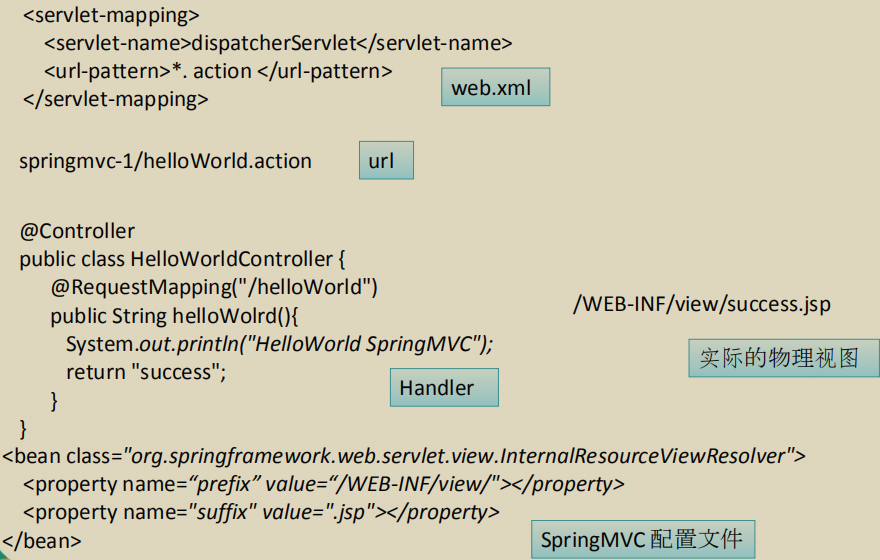

# Spring MVC

## SpringMVC概述

- Spring为展现层提供的基于 MVC 设计理念的优秀对对对 Web 框架，是目前最主流的 MVC 框架之一
- Spring3.0 后全面超越 Struts2，成为最优秀的 MVC 框架
- SpringMVC 通过一套MVC注解，让 POJO 成为处理请求的控制器，而无须实现任何接口
- 支持 REST 风格的 URL 请求
- 采用了松散耦合可插拔组件结构，比其他 MVC 框架更具扩展性和灵活性

### 运行步骤：

- ###### 加入 jar 包( spring-aop-4.0.0.RELEASE.jar )

    > - commons-logging-1.1.3.jar
    > - spring-aop-4.0.0.RELEASE.jar
    > - spring-beans-4.0.0.RELEASE.jar
    > - spring-context-4.0.0.RELEASE.jar
    > - spring-core-4.0.0.RELEASE.jar
    > - spring-expression-4.0.0.RELEASE.jar
    > - spring-web-4.0.0.RELEASE.jar
    > - spring-webmvc-4.0.0.RELEASE.jar

- ###### 在 web.xml 中配置 DispatcherServlet

    > 配置 DispatcherServlet ：DispatcherServlet 默认加载 /WEB-INF/<servletName-servlet>.xml 的 Spring 配置文件, 启动 WEB 层 的 Spring 容器。可以通过 contextConfigLocation 初始化参数自定
    > 义配置文件的位置和名称

    ```xml 
    /* web.xml */
    <?xml version="1.0" encoding="UTF-8"?>
    <web-app xmlns:xsi="http://www.w3.org/2001/XMLSchema-instance"
             xmlns="http://java.sun.com/xml/ns/javaee"
             xsi:schemaLocation="http://java.sun.com/xml/ns/javaee http://java.sun.com/xml/ns/javaee/web-app_2_5.xsd"
             id="WebApp_ID" version="2.5">
        <!-- 配置 DispatcherServlet -->
        <servlet-mapping>
            <servlet-name>springDispatcherServlet</servlet-name>
            <url-pattern>/</url-pattern>
        </servlet-mapping>
        <servlet>
            <servlet-name>springDispatcherServlet</servlet-name>
            <servlet-class>org.springframework.web.servlet.DispatcherServlet</servlet-class>
            <!-- 配置 DispatcherServlet 的一个初始化参数：配置 SpringMVC 的配置文件的位置和名称 -->
            <!--
                实际上也可以不通过 contextConfigLocation 来配置 SpringMVC 的配置文件，而使用默认的.
                默认的配置文件为：/WEB-INF/<servlet-name>-servlet.xml
                <init-param>...</init-param>则省略
            -->
            <init-param>
                <param-name>contextConfigLocation</param-name>
                <param-value>classpath:springmvc.xml</param-value>
            </init-param>
            <load-on-startup>1</load-on-startup>
        </servlet>
    </web-app>
    ```

- ###### 加入 SpringMVC 的配置文件

    ```xml
    /* springmvc.xml */
    <?xml version="1.0" encoding="UTF-8"?>
    <beans xmlns="http://www.springframework.org/schema/beans"
        xmlns:xsi="http://www.w3.org/2001/XMLSchema-instance"
        xmlns:context="http://www.springframework.org/schema/context"
        xsi:schemaLocation="http://www.springframework.org/schema/beans http://www.springframework.org/schema/beans/spring-beans.xsd
                            http://www.springframework.org/schema/context http://www.springframework.org/schema/context/spring-context.xsd">
        <!-- 配置自定扫描的包 -->
        <context:component-scan base-package="ltd.worldiwiu.springmvc.handlers"></context:component-scan>
        <!-- 配置视图解析器: 如何把 handler 方法返回值解析为实际的物理视图 -->
        <bean class="org.springframework.web.servlet.view.InternalResourceViewResolver">
            <property name="prefix" value="/WEB-INF/views/"></property>
            <property name="suffix" value=".jsp"></property>
        </bean>
    </beans>
    ```

- ###### 编写处理请求的处理器，并标识为处理器

    ```Java
    /* HelloWorld.java */
    package ltd.worldiwiu.springmvc.handlers;
    import org.springframework.stereotype.Controller;
    import org.springframework.web.bind.annotation.RequestMapping;
    @Controller
    public class HelloWorld {
        /**
         * 1.使用 @RequestMapping 注解来映射请求的 URL
         * 2.返回值会通过视图解析器为实际的物理视图，对于 InternalResourceViewResolver 视图解析器，会做如下的解析：
         ☆  通过 prefix + returnVal + 后缀 这样的方式得到实际的物理视图，然会做转发啊操作
         * @return
         */
        @RequestMapping("/helloworld")
        public String hello(){
            System.out.println("hello world!");
            return "success";
        }
    }
    ```

    ```Jsp
    /* index.jsp */
    <a href="/helloworld">Hello World!</a>
    ```

    ```Jsp
    /* success.jsp */
    <%@ page language="java" contentType="text/html; charset=UTF-8" pageEncoding="UTF-8" %>
    <!DOCTYPE html PUBLIC "-//W3C//DTD HTML 4.01 Transitional//EN" "http://www.w3.org/TR/html4/loose.dtd">
    <html>
    <head>
        <meta http-equiv="Content-Type" content="text/html; charset=UTF-8">
        <title>Success</title>
    </head>
    <body>
        Success Page！
    </body>
    </html>
    ```

- ###### 编写视图

    

##  使用@RequestMapping 映射请求

> - SpringMVC 使用 @RequestMapping 注解为控制器指定可以处理哪些 URL 请求
>
> - 在控制器的类定义及方法定义处都可标注
>
>     @RequestMapping
>
>     - 类定义处：提供初步的请求映射信息。相对于 WEB 应用的根目录
>     - 方法处：提供进一步的细分映射信息。相对于类定义处的 URL。若类定义处未标注 @RequestMapping，则方法处标记的 URL 相对于 WEB 应用的根目录
>     
> - DispatcherServlet 截获请求后，就通过控制器上
>
>     @RequestMapping 提供的映射信息确定请求所对应的处理方法

### 使用 @RequestMapping 映射请求示例

```Java
/* SpringMVCTest.java */
package ltd.worldiwiu.springmvc.handlers;
import org.springframework.stereotype.Controller;
import org.springframework.web.bind.annotation.RequestMapping;

@Controller
/**
  * 类定义处标记
  * @RequestMapping 限定了处理器类可以处理所有 URL 为 /springmvc 的请求，它相对于 WEB 容器部署的根路径
  */
@RequestMapping("/springmvc")
public class SpringMVCTest {
    private static final String SUCCESS = "success";
    /**
      * 方法定义处标记
      * 处理器类可以定义多个处理方法，处理来自 /springmvc 下的请求
      */
    @RequestMapping("/testRequestMapping")
    public String hello() {
        System.out.println("Spring MVC Test！");
        return SUCCESS;
    }
}
```

```Jsp
/* index.jsp */
<a href="/springmvc/testRequestMapping">Spring MVC Test</a>
```

### 映射请求参数、请求方法或请求头

> - @RequestMapping 除了可以使用请求 URL 映射请求外，还可以使用请求方法、请求参数及请求映射请求
> - @RequestMapping 的 value [ 请求 URL ]、method [ 请求方法 ]、params [ 请求参数 ] 及 heads [ 请求头 ]的映射条件，他们之间是与的关系，联合使用多个条件可让请求映射更加精确化。
> - params 和 headers 支持简单的表达式：
>     - param1: 表示请求必须包含名为 param1 的请求参数
>     - !param1: 表示请求不能包含名为 param1 的请求参数
>     - param1 != value1: 表示请求包含名为 param1 的请求参数，但其值不能为 value1
>     - {"param1 = value1", "parame2"}: 请求必须包含名 param1 和 param2 的两个请求参数，且 param1 参数的值必须为 value1

###### 示例一

```Java
/* SpringMVCTest.java */
package ltd.worldiwiu.springmvc.handlers;
import org.springframework.stereotype.Controller;
import org.springframework.web.bind.annotation.RequestMapping;
import org.springframework.web.bind.annotation.RequestMethod;

@Controller
/**
 * 类定义处标记
 * @RequestMapping 限定了处理器类可以处理所有 URL 为 /springmvc 的请求，它相对于 WEB 容器部署的根路径
 */
@RequestMapping("/springmvc")
public class SpringMVCTest {
    private static final String SUCCESS = "success";
    /**
     * 使用 method 属性来指定请求方式
     */
    @RequestMapping(value = "/testMethod", method = RequestMethod.POST)
    public String testMethod(){
        System.out.println("Test Method！");
        return SUCCESS;
    }
}
```

```Jsp
/* index.jsp */
<form action="/springmvc/testMethod" method="post">
    <input type="submit" value="submit" />
</form>
```

###### 示例二

```Java
/* SpringMVCTest.java */
package ltd.worldiwiu.springmvc.handlers;
import org.springframework.stereotype.Controller;
import org.springframework.web.bind.annotation.RequestMapping;
import org.springframework.web.bind.annotation.RequestMethod;

@Controller
/**
 * 类定义处标记
 * @RequestMapping 限定了处理器类可以处理所有 URL 为 /springmvc 的请求，它相对于 WEB 容器部署的根路径
 */
@RequestMapping("/springmvc")
public class SpringMVCTest {
    private static final String SUCCESS = "success";
    /**
     * 了解：可以使用 params 和 headers 来更加精确的映射请求
     *       params 和 headers 支持简单的表达式
     */
    @RequestMapping(value = "testParamsAndHeaders", params = {"name","age=10"}, headers = {"Accept-Language=zh-CN;q=0.8"})
    public String testParamsAndHeaders(){
        System.out.println("SpringMVCTest.testParamsAndHeaders");
        return SUCCESS;
    }
}
```

```JSP
/* index.jsp */
<a href="/springmvc/testParamsAndHeaders?name=wx&age=10">TestParamsAndHeaders</a><br>
```

### 使用 @RequestMapping 映射请求

>Ant 风格资源地址支持3种匹配符
>
>​	？：匹配文件名中的一个字符
>
>​	*：匹配文件名中的任意字符
>
>​	**：匹配多层路径
>
>@RequestMapping 还支持 Ant 风格的 URL：
>
>​	- /user/*/createUser：匹配
>
>​		/user/aaa/createUser、/user/bbb/createUser 等 URL
>
>​	- /user/**/createUser：匹配
>
>​		/user/createUser、/user/aaa/bbb/createUser 等 URL
>
>​	- /user/createUser??：匹配
>
>​		/user/createUseraa、/user/createUserbb 等 URL

###### 示例

```Java
/* SpringMVCTest.java */
package ltd.worldiwiu.springmvc.handlers;
import org.springframework.stereotype.Controller;
import org.springframework.web.bind.annotation.RequestMapping;
import org.springframework.web.bind.annotation.RequestMethod;

@Controller
/**
 * 类定义处标记
 * @RequestMapping 限定了处理器类可以处理所有 URL 为 /springmvc 的请求，它相对于 WEB 容器部署的根路径
 */
@RequestMapping("/springmvc")
public class SpringMVCTest {
    private static final String SUCCESS = "success";
    
//    @RequestMapping("/testAntPath/*/abc")
//    @RequestMapping("/testAntPath/**/abc")
    @RequestMapping("/testAntPath/abc??")
    public String testAntPath(){
        System.out.println("SpringMVCTest.testAntPath");
        return SUCCESS;
    }
}
```

```JSP 
/* index.jsp */
<a href="/springmvc/testAntPath/123/abc">Test AntPath</a><br>
改变：
<a href="/springmvc/testAntPath/12345/abc">Test AntPath</a><br>
<a href="/springmvc/testAntPath/123/123/abc">Test AntPath</a><br>
<a href="/springmvc/testAntPath/abcde">Test AntPath</a><br>
```

### @PathVariable 映射 URL 绑定的占位符

> - 带占位符的 URL 是 Spring 3.0 新增的功能，该功能在 SpringMVC 向 REST 目标挺进发展过程中具有里程碑的意义
> - 通过 @PathVariable 可以将 URL 中占位符参数绑定到控制器处理方法的形参中：URL 中的 { xxx } 占位符可以通过 @PathVariable("xxx") 绑定到操作方法的形参中

```Java
/* SpringMVCTest.java */
package ltd.worldiwiu.springmvc.handlers;
import org.springframework.stereotype.Controller;
import org.springframework.web.bind.annotation.RequestMapping;
import org.springframework.web.bind.annotation.RequestMethod;

@Controller
/**
 * 类定义处标记
 * @RequestMapping 限定了处理器类可以处理所有 URL 为 /springmvc 的请求，它相对于 WEB 容器部署的根路径
 */
@RequestMapping("/springmvc")
public class SpringMVCTest {
    private static final String SUCCESS = "success";
    /**
     * @PathVariable 可以来映射 URL 中的占位符到目标方法的参数中
     * @param id
     * @return
     */
    @RequestMapping("/testPathVariable/{id}")
    public String testPathVariable(@PathVariable("id") Integer id){
        System.out.println("SpringMVCTest.testPathVariable" + id);
        return SUCCESS;
    }
}
```

